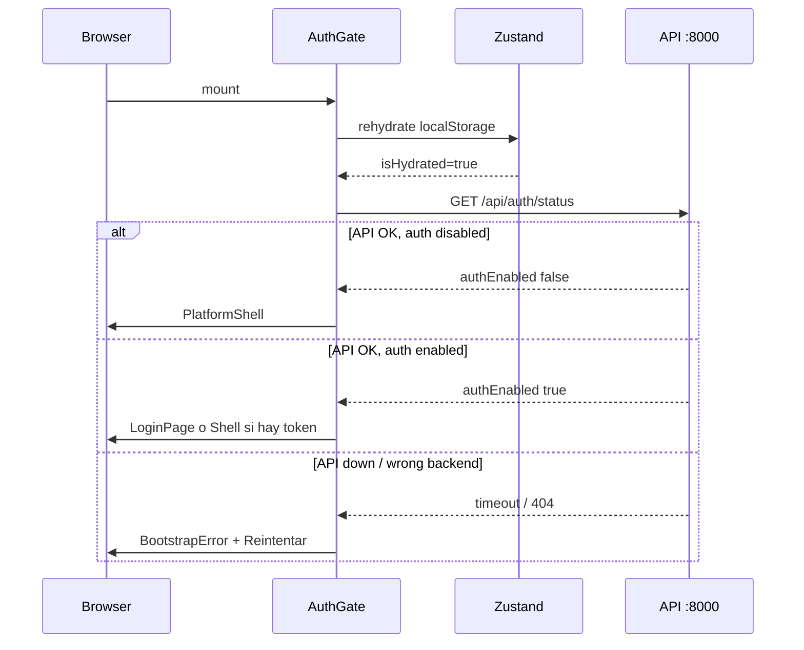

# Plataforma UI — estado de implementación

Complemento operativo de [ADR-004](./adr/004-prorealtime-ui-platform.md).

**Premisa:** lo configurable de layout/chrome vive en `localStorage` (por dispositivo/navegador) — [UI_PREFS_LOCALSTORAGE.md](./UI_PREFS_LOCALSTORAGE.md). El contenido del espacio de trabajo va al servidor.

## Fases ADR-004 vs código

| Fase ADR | Descripción | Estado |
|----------|-------------|--------|
| 0 | Auth contraseña (`APP_PASSWORD`) | ✅ Implementado |
| 1 | Application shell (menú, toolbar, status) | ✅ v1 |
| 2 | Espacios de trabajo JSON | ✅ Servidor (`/api/workspaces`) + backup local |
| 3 | Propiedades gráfico (inspector Estilos) | ✅ v2 (inspector lateral) |
| 4 | Listas personalizables | ✅ v1 (columnas + CSV; sin API backend) |
| 5 | Docking avanzado | ✅ v1 (listas + propiedades redimensionables) |
| 6 | Panel derecho contextual | ✅ v1 |

## Flujo de arranque frontend



## Archivos clave

### Auth

```
apps/web/src/stores/auth-store.ts      # Token, checkAuthRequired, timeout 8s
apps/web/src/features/auth/auth-gate.tsx
apps/web/src/features/auth/login-page.tsx
apps/web/src/lib/api.ts                # Authorization Bearer header
```

### Layout

```
apps/web/src/components/layout/platform-shell.tsx   # Shell global + diálogos
apps/web/src/components/layout/trading-layout.tsx   # Paneles acoplables
apps/web/src/components/layout/app-top-bar.tsx   # Barra superior única
apps/web/src/components/layout/platform-shell.tsx
apps/web/src/components/layout/trading-layout.tsx
apps/web/src/lib/routes.ts
apps/web/src/features/trading/lists-tab/list-carousel.tsx
apps/web/src/app.tsx                                # AuthGate → PlatformShell → Routes
```

> **Retirado jun 2026:** layout dock antiguo archivado en `archive/legacy-ui/`.

### Workspace

```
apps/web/src/stores/workspace-store.ts   # chart + list en WorkspaceDocument
packages/shared/src/chart-defaults.ts    # tipos y defaults compartidos
```

Persistencia: documento en servidor (`PUT /api/workspaces/:id`) con backup local (`bolsa-workspace-meta` → `chartPersistBackup`). Detalle en [WORKSPACE_PERSISTENCE.md](./WORKSPACE_PERSISTENCE.md). Export manual: descarga `.bolsa-workspace.json`.

### Gráficos (UI-5)

```
apps/web/src/features/charts/chart-workspace-page.tsx
apps/web/src/features/charts/chart-toolbar-global-bar.tsx    # barra workspace (indicadores, C/V, BD…)
apps/web/src/features/charts/chart-toolbar-chart-bar.tsx     # barra por tab (Escala, Estilo, Valor, Cursor, atajos)
apps/web/src/features/charts/chart-series-type-zone.tsx      # zona Estilo (tipo de barra + favoritos)
apps/web/src/features/charts/chart-series-style-panel.tsx    # inspector Config → Estilo de barra
apps/web/src/features/charts/chart-main-series.ts            # motor serie principal (tipos fase 1–4)
apps/web/src/features/charts/chart-advanced-series.ts        # Renko, Kagi, P&F, ruptura de línea
apps/web/src/features/charts/chart-global-bar-settings-dialog.tsx
apps/web/src/features/charts/chart-data-bar-settings-dialog.tsx
apps/web/src/features/charts/chart-toolbar-settings-fields.tsx
apps/web/src/features/charts/chart-inspector-panel.tsx       # inspector lateral
apps/web/src/features/charts/chart-canvas-styles-panel.tsx
apps/web/src/features/charts/ohlcv-chart.tsx
apps/web/src/features/instruments/instrument-sync-dialog.tsx
apps/web/src/features/instruments/use-instrument-sync.ts
apps/web/src/stores/ui-store.ts                       # instrumentSyncTarget, diálogos
apps/web/src/index.css                                # @container chart-workspace (ver CHART_RESPONSIVE.md)
```

**Barras del gráfico (dos niveles):**

| Nivel | Contenido |
|-------|-----------|
| Global | Catálogo/plantillas de indicadores, C/V, estado BD, inspector, ⚙ global |
| Por tab | Escala temporal, zona Estilo, zona Valor, enlace TradingView, zona Cursor, atajos al inspector, ⚙ barra de datos |

**Responsive:** documentación completa en [CHART_RESPONSIVE.md](./CHART_RESPONSIVE.md).

Menú **⋯ Más → Estilos del gráfico…** abre el inspector en la pestaña Estilos (rejilla, cursor, colores, indicadores legacy).

Modelo de configuración por superficie: [CONFIGURATION_MODEL.md](./CONFIGURATION_MODEL.md).

### Listas (UI-4)

```
apps/web/src/features/trading/lists-tab/lists-tab.tsx
apps/web/src/features/trading/lists-tab/list-carousel.tsx
apps/web/src/features/trading/lists-tab/list-carousel-settings-dialog.tsx
apps/web/src/components/layout/list-properties-dialog.tsx
apps/web/src/lib/list-utils.ts                        # CSV export
```

Menú **⋯ Herramientas de lista** en el carrusel: columnas, carrusel, nueva/editar/renombrar/eliminar lista, exportar CSV.

### Layout acoplable (UI-6)

```
apps/web/src/components/layout/trading-layout.tsx
apps/web/src/stores/trading-layout-store.ts
```

- Zonas **Listas | Gráficos | Operaciones**: maximizar, cerrar, redimensionar
- Estado en `trading-layout-store` (localStorage por dispositivo)
- Icono restablecer en la barra (Trading) o Config → General → Interfaz vuelve al layout por defecto

Implementación propia con `pointer` events (sin depender de `react-resizable-panels` en runtime).

### Panel propiedades (derecha)

Menú **Listas** / **Ver** y toolbar usan el mismo `trading-layout-store` (listas, gráficos, operaciones).

## Barra superior / espacios (v1 actual)

Izquierda: marca · **← →** (historial SPA) · separador · nav (Overview…) · paneles Trading (solo en `/trading`).  
Derecha: chip espacio · Ayuda · Config · sesión.  
Orden derecha: **chip del espacio** · Ayuda · Config · **sesión** (cerrar). Sin menú ⋯.

Gestor (chip): nuevo / duplicar / renombrar / exportar JSON / guardar actual / autoguardado. Persistencia — [WORKSPACE_PERSISTENCE.md](./WORKSPACE_PERSISTENCE.md).  
Config (⚙): solo pestañas con UI (sin placeholders vacíos); Interfaz → restablecer paneles Trading (local a este PC).  
Layout chrome (anchos paneles / columnas): `localStorage` por dispositivo — ver [WORKSPACE_PERSISTENCE.md](./WORKSPACE_PERSISTENCE.md).

### Listas (Trading)

- Toggle watchlist / operaciones + restablecer: grupo propio tras la nav (solo en Trading); ← → van al inicio antes de Overview.
- Exportar CSV: desde la pestaña Listas (hub)

## Integración API

Todas las llamadas pasan por `api.ts` con base `VITE_API_URL` (default `http://localhost:8000`).

El panel de listas usa `api.getInstruments()` (TanStack Query en componente).

## Auth backend (FastAPI)

```
apps/api-python/src/bolsa_api/
  auth/tokens.py
  middleware/auth.py
  api/v1/routes/auth.py
```

Config: `packages/py/infrastructure/.../config.py` → `APP_PASSWORD`, `APP_AUTH_SECRET`.

## API Listas (`/api/lists`)

Backend Python — tablas `instrument_lists` + `instrument_list_items` (Prisma).

| Método | Ruta | Descripción |
|--------|------|-------------|
| GET | `/api/lists` | Lista resúmenes (auto-seed IBEX 35 si vacío) |
| GET | `/api/lists/:id` | Detalle con `instrumentIds` |
| GET | `/api/lists/:id/quotes` | Instrumentos con meta (precio, sync) |
| POST | `/api/lists` | Crear lista custom |
| PATCH | `/api/lists/:id` | Renombrar / cambiar instrumentos |
| DELETE | `/api/lists/:id` | Eliminar lista (bloqueado si `source: catalog`) |

Panel listas usa `GET /api/lists/:id/quotes`. Workspace guarda `list.apiListId`.

## Gestión de listas (UI)

```
apps/web/src/components/layout/list-manager-dialog.tsx
```

- Menú **Listas → Gestionar listas…** o icono ⚙ en cabecera del panel
- Selector rápido de lista activa en el panel (si hay más de una)
- **Nueva lista**: nombre + multi-select de instrumentos (`GET /api/instruments`)
- **Editar** solo listas `source: custom` (renombrar, instrumentos, eliminar)
- IBEX 35 (`catalog`) no editable ni eliminable (también protegido en API)
- Al eliminar la lista activa → vuelve a IBEX 35
- **Propiedades de lista** (diálogo aparte) solo afecta columnas visibles locales

## Pestañas centrales (multi-gráfico)

```
apps/web/src/components/layout/chart-tab-bar.tsx
apps/web/src/features/charts/chart-workspace-page.tsx   # ruta /workspace
```

- Cada pestaña: `{ id, instrumentId, label, chart }` en `workspace.charts`
- Clic en fila del panel listas → abre o **activa** pestaña (una por `instrumentId`) + navega a Trading
- **⋯ → Usar gráfico activo como plantilla…** ancla config para gráficos nuevos (no clona el mismo valor)
- Configuración de gráfico **por pestaña** (ya no global única)
- Migración automática desde workspace antiguo con `chart` singular · dedupe de duplicados legacy al cargar

## Alertas de precio (v2)

Extiende v1 con fuente de precio configurable:

- `daily_close` — último cierre diario Yahoo (evaluación cada 20 s)
- `xtb_last` — último precio XTB vía bridge (evaluación cada 10 s)

Selector **Fuente de precio** en `/alerts`. Aviso si XTB no está disponible al crear.

## Alertas — historial y post-cierre (v3)

- Pestañas **Activas** / **Historial** / **Todas** en `/alerts`
- **Reactivar** alertas disparadas (`POST /api/alerts/{id}/reactivate`)
- Evaluación programada en la API: tras **17:35** (Europe/Madrid), días laborables, alertas `daily_close` (sin necesidad de tener la web abierta)

## Alertas de precio (v1)

```
apps/web/src/features/alerts/alerts-page.tsx
apps/web/src/features/alerts/alerts-monitor.tsx
apps/web/src/features/alerts/alert-toasts.tsx
apps/api-python/.../routes/alerts.py
packages/database/prisma/schema.prisma  # PriceAlert
```

- Ruta `/alerts` — crear, listar y eliminar alertas por instrumento
- Condición `above` / `below` vs precio objetivo (último cierre diario)
- Monitor en segundo plano (`AlertsMonitor`) evalúa cada 20 s si hay alertas activas
- Toasts en esquina inferior derecha al dispararse
- Ficha instrumento → botón **Alerta** preselecciona el símbolo
- Menú **Ver → Alertas** y icono en barra de herramientas

## Entorno gráfico XTB (v1)

Layout principal estilo terminal de trading:

```
apps/web/src/components/layout/trading-layout.tsx
apps/web/src/features/trading/lists-tab/
apps/web/src/features/trading/charts-zone.tsx
apps/web/src/features/trading/operations-panel.tsx
apps/web/src/features/trading/trading-status-bar.tsx
```

- **Zonas acoplables** (Listas | Gráficos | Operaciones): maximizar, cerrar, redimensionar
- **Scrollbars** finos (`scroll-area` en `index.css`) acordes al tema oscuro
- **Responsive del gráfico**: ver **[CHART_RESPONSIVE.md](./CHART_RESPONSIVE.md)** — container queries (`chart-workspace-shell`), barras en 2 filas, inspector dock/flotante, scroll en zonas Escala/Valor/Cursor
- **Listas**: búsqueda local + Yahoo, **carrusel horizontal** con listas del sistema (**Cartera**, **Órdenes pendientes**) + IBEX/personalizadas; acordeón OHLC/spread
- **Gráficos**: sub-pestañas inferiores por instrumento abierto (**máx. una pestaña por `instrumentId`**); al reabrir desde otra lista se activa la existente. Si no hay OHLCV se abre diálogo **Sincronizar Yahoo**.
- **⋯ Más → Usar gráfico activo como plantilla…** ancla config para gráficos nuevos (ya no clona pestaña del mismo valor).
- **Operaciones**: posiciones reales de cartera; órdenes stop/limitadas con evaluación automática cada 15 s
- **Órdenes de mercado**: ejecutan `POST /api/portfolio/trade` desde el diálogo de operación
- **FX online**: `GET /api/market/fx?from=USD&to=EUR` (Yahoo) en diálogo de operación si divisa ≠ EUR
- **Órdenes pendientes**: persisten en `localStorage`; monitor ejecuta al alcanzar precio límite
- **Barra de estado**: patrimonio, efectivo, beneficio, etc. (configurable)
- Ruta principal `/` = workspace de trading

## Evolución planificada (ADR-005, jun 2026)

Decisiones acordadas — ver [ADR-005](./adr/005-unified-shell-and-data-quality.md):

| Prioridad | Entrega |
|-----------|---------|
| **P1** | Barra superior única; eliminar MenuBar; `/trading` vs páginas full-page; **Overview** (`/overview`) |
| **P2** | `data-status` por instrumento; auto-sync al abrir gráfico; badge frescura; detalle en **(i)** |
| **P3** | Workspaces en servidor (varios layouts, dibujos, dock) | ✅ v1 |
| **P4** | Gráfico propio pro: timeframes, paneles indicadores, toolbar contextual |
| **P5+** | Calendarios globales, intradía, líneas de trading sobre precio |

Gráficos: **lightweight-charts** (core) + enlace externo TradingView sin widget de pago. Watchlist fija colapsable. Operaciones: panel inferior + modal; líneas sobre precio en fase posterior.

## Próximos pasos UI (mantenimiento v1)

1. Notificaciones push / email al disparar alertas en el servidor
2. Edición de alerta activa (precio objetivo / condición)

## Dibujo chartista (v2)

Herramientas adicionales sobre v1:

- **Fibonacci**: dos clics (extremo → extremo); niveles 0–100 %
- **Abanico Gann**: dos clics (origen → línea 1×1); rayos clásicos
- **Canal**: tres clics (inicio/fin línea base → punto del canal paralelo)
- **Edición de vértices**: con Puntero o Cruz — clic seleccionar, doble clic editor, anclajes arrastrables
- **Barra vertical** (11 categorías, bloques por familia, favoritos, memoria de estilo): ver **[CHART_DRAWING_TAXONOMY.md](./CHART_DRAWING_TAXONOMY.md)** — **cerrada jul 2026**
- **Indicadores** (paneles inferiores, sync temporal con precio): ver **[CHART_INDICATORS.md](./CHART_INDICATORS.md)**

## Dibujo chartista (v1)

```
apps/web/src/features/charts/chart-drawing-sidebar.tsx
apps/web/src/features/charts/chart-drawings-layer.tsx
packages/shared/src/chart-drawings.ts
packages/shared/src/chart-drawing-taxonomy.ts
```

- Barra vertical en `/workspace` junto a cada gráfico
- **Línea**: dos clics (inicio → fin)
- **Rectángulo**: arrastrar
- **Seleccionar**: clic en dibujo; `Supr` / `Borrar` elimina
- Dibujos persisten en `workspace.charts[].drawings` (por pestaña)
- Menú **Gráficos → Dibujo: …** cambia herramienta activa

## Testing manual

1. `pnpm dev` — esperar log uvicorn "Application startup complete"
2. http://localhost:5173 — debe cargar shell (no quedarse en Cargando)
3. Panel listas → clic en fila → abre pestaña en `/workspace`
4. **Listas → Gestionar listas** → crear lista custom y cambiar lista activa
5. Con `APP_PASSWORD=test` en `.env` raíz → reiniciar API → login
6. Parar API → pantalla error con botón Reintentar
