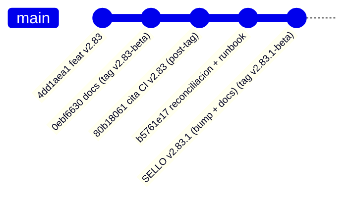

# Arranque del auditor — `v2.83.1-beta` / `AUTO-MATERIAL-11` (RE-SELLO): objeto autocontenido

> **Objeto auditado:** tag anotado **`v2.83.1-beta`** · **Versión:** `2.08.1-beta` (**bump** `2.08.0-beta → 2.08.1-beta`) ·
> **Base (diff):** `v2.83-beta` (`2.08.0-beta`) · **AsOf:** 2026-09-27 · **Alembic head:** `046_fill_reference_mid`
> (**SIN migración**) · **Freeze:** `auto_simulation_worker.py` **intacto** · **Reparto:** `auto18-v1` / `auto15-v1`
> (`ALLOCATION = none`).

## 0. Qué es este objeto (y por qué existe un `v2.83.1`)

`v2.83.1-beta` es un **re-sello DOCS-ONLY** de `v2.83-beta`: **no añade ni cambia una línea de código de
producto**. El diff `v2.83-beta..v2.83.1-beta` es **solo** `package.json` + `docs/engineering/*`.

**Motivo (patrón `OBS-3`/`OBS-4`).** El workflow `Release tag CI` **solo corre al empujar** el tag, así que
la cita de su resultado **no puede existir dentro** de ese mismo tag: en `v2.83-beta` el fichero
`evidencia-ci-tag-v2.83-2026-09-27.txt` quedó como **placeholder** («PENDIENTE DE TAG») y la cita real se
escribió en el commit **post-tag** `80b18061` (en `main`). Un auditor que clone **solo** el tag ve el
placeholder y puede concluir, por error, «CI no acreditado».

**Este tag cierra ese problema para la fase auditada**: `v2.83.1-beta` contiene, **dentro del snapshot**,
el instrumento de `v2.83` **y** la cita real de su CI.

`v2.83-beta` → `0ebf6630` (placeholder dentro) · cita acreditada de `v2.83` → `36329460515` (**dentro** de `v2.83.1-beta`).

## 1. Cita del CI (lo primero que hay que comprobar)

### 1.1 CI del tag `v2.83-beta` — ACREDITADO, y **visible desde el tag** `v2.83.1-beta`

| Campo | Valor |
|---|---|
| Workflow | `Release tag CI` |
| Run | [`36329460515`](https://github.com/jvelasca/Bolsa_V1/actions/runs/36329460515) |
| Tag / object | `v2.83-beta` (tag anotado `8cfe7f6f`) → commit `0ebf6630` |
| `event` / branch | `push` / `v2.83-beta` |
| **Conclusion** | **SUCCESS** (primera pasada, `attempt 1`) |
| Duración | 15:24:56Z → 15:34:11Z (9m15s) |
| Jobs | **10 `success` + `certify` `success`**; `playwright (integrated E2E, opt-in)` `skipped` por diseño |
| Job `python` del tag | `3020 passed / 37 skipped` (= `3004 + 16`); `ruff All checks passed`; `Contracts: 4 kept, 0 broken`; `mypy 0 issues (507 files)` |
| `Python CI` (mismo commit y tag) | `36329460471` — `quality` `3009 passed / 40 skipped` (= `2993 + 16`) + los cuatro jobs PG verdes |
| Predicción pre-tag | `3020/37` y `3009/40` declarados **antes** del sello ⇒ **se cumplieron exactos** (skips `37 = 37`, `40 = 40`) |

### 1.2 CI del tag `v2.83.1-beta` (este objeto) — ACREDITADO

| Campo | Valor |
|---|---|
| Workflow | `Release tag CI` |
| Run | [`36333090789`](https://github.com/jvelasca/Bolsa_V1/actions/runs/36333090789) |
| Tag / object | `v2.83.1-beta` (tag anotado `e939bbf0`) → commit `42c97bab` |
| **Conclusion** | **SUCCESS** (primera pasada, `attempt 1`; 8m9s; 16:23:54Z → 16:32:03Z) |
| Jobs | **10 `success` + `certify` `success`**; `playwright (integrated E2E, opt-in)` `skipped` por diseño |
| Job `python` del tag | `3020 passed / 37 skipped` · `ruff All checks passed!` · `Contracts: 4 kept, 0 broken` · `mypy 0 issues (507 files)` |
| `Python CI` (mismo commit y tag) | `36333090773` — `quality` `3009 passed / 40 skipped` + cuatro jobs PG verdes |
| Predicción pre-tag | `3020/37` y `3009/40` declarados **antes** del sello (código idéntico a `v2.83`) ⇒ **se cumplieron exactos** |

**Su cita vive post-tag** (ningún tag puede contener su propio resultado de CI): `evidencia-ci-tag-v2.83.1-2026-09-27.txt`.
**No** se hereda de `v2.83`: se **cita el run** `36333090789`. En `main` (fast-forward `b5761e17..42c97bab`)
corrieron `Gitleaks` `36333079527`, `Frontend CI` `36333079508` y `Optimize lab` `36333079545` (en `main`
**no** se disparan `Python CI`/`Fase 2 scientific`: triggers por rutas, diff = `package.json` + docs).

## 2. Qué tiene que comprobar el auditor (por este orden)

1. **Naturaleza del objeto.** `package.json` = `2.08.1-beta`; tag `v2.83.1-beta` **anotado** apuntando al
   commit del sello; árbol **intacto** antes y después de cualquier sonda (`git status --porcelain` vacío).
2. **Diff acotado (`v2.83-beta..v2.83.1-beta`).** Debe mostrar **solo** `package.json` (`2.08.0-beta →
   2.08.1-beta`) y `docs/engineering/*` (`CHANGELOG.md`, arranque del auditor, relevo, evidencia del CI,
   `PROJECT_STATE`, índice y deuda P3). **Ningún** fichero de motor, gobernador, `TOP_N`, umbrales,
   allocation, pesos A/B ni migración; tampoco ningún fichero del instrumento (`operability_audit.py`,
   `v2_83_window_audit.py`, `test_operability_audit.py`).
3. **Semántica del instrumento** (idéntica a `v2.83`; el núcleo a intentar romper):
   - `window_totals`: suma **solo** días medidos, publica `coverage[*].partial`, **no** suma huecos como `0`.
   - `window_rates`: `rate=None` sin días medidos o con denominador `0` (**nunca** `0.0`); cada tasa lleva
     `numerator`/`denominator`/`coveredDays`/`source`.
   - `render_window_audit`: determinista (sin reloj), `n/d` para `None`.
   - `enrich_rows_with_evidence`: rellena **solo** huecos declarados y **no** sobrescribe lo medido.
4. **Read-only de verdad.** `v2_83_window_audit.py` con `--render`/`--json` sin `--out` **no** crea
   ficheros; **nunca** toca el journal durable, `evidence_runs/` ni `evidence_validations/`; `exit 0` con
   ≥1 día y `exit 2` sin material legible.
5. **Compuertas reproducidas** (medidas, no heredadas): `ruff` → `All checks passed!` ·
   `lint-imports` → `Contracts: 4 kept, 0 broken` · `mypy` → `0 issues` (**507** fuentes) ·
   `alembic heads` → `046_fill_reference_mid` · `test_operability_audit.py` → **16 passed** ·
   `packages/py/application/tests` → **2087 passed**.
6. **Matriz adversarial**: **230/230** intacta (no se añaden mutaciones: no cambia lógica).
7. **Registro en CI**: `test_operability_audit.py` **explícito** en el job `quality` de `python-ci.yml` y
   en el job `python` de `release-tag-ci.yml`.

## 3. Puntos de entrada por orden

- **Audit-pack de la fase**: [`audit-pack-v2-83-auto-material-11-window-readonly-audit-2026-09-27.md`](./audit-pack-v2-83-auto-material-11-window-readonly-audit-2026-09-27.md)
  (matriz afirmación→código→test; aplica **tal cual** porque el código no cambia).
- **Plan de la fase**: [`plan-v2-83-auto-material-11-window-readonly-audit-2026-09-27.md`](./plan-v2-83-auto-material-11-window-readonly-audit-2026-09-27.md).
- **Evidencia local de la fase**: [`evidencia-auditoria-v2.83-2026-09-27.txt`](./evidencia-auditoria-v2.83-2026-09-27.txt).
- **Cita del CI de `v2.83`**: [`evidencia-ci-tag-v2.83-2026-09-27.txt`](./evidencia-ci-tag-v2.83-2026-09-27.txt)
  (**ya con la cita real**, dentro de este tag).
- **Relevo / estado**: [`traspaso-relevo-post-v2-83-1-auto-material-11-reseal-2026-09-27.md`](./traspaso-relevo-post-v2-83-1-auto-material-11-reseal-2026-09-27.md).

## 4. Qué NO se puede reproducir sin material real

La **ventana ≥4 días** (`P3-2`/`P3-3`) **no** se certifica con fixtures: `operability_runs/` está
gitignoreado y la tabla/`TOTAL`/tasas se re-derivan con fixtures deterministas. El auditor debe
**declarar** esa limitación, **no** leerla como cierre. `H-4` (LOW) sigue **ABIERTO** (esta fase lo hace
**visible** en `warnings: reason_contract`, **no** lo cierra).

## 5. Verificación pre-D1 declarada (no forzada)

| Brecha del runbook §2 | Resultado 2026-09-27 |
| --- | --- |
| Preflight de régimen | **exit 2** · `{range:8, trend_down:9, trend_up:3}` ⇒ `BEAR_TREND` ⇒ **LONG VETADAS** |
| Barras del loader | **20/20** servidas ⇒ el scheduler responde hoy |
| `pairActive=true` (B **ACTIVE** + `EdgeReport`) | **NO VERIFICABLE**: `PAPER_D_ACCOUNT_ID` **comentado** en `.env` ⇒ sin cuenta fija |
| Cuenta fija desde D2 | **NO VERIFICABLE** (misma causa) |
| Glob `operability_runs/forward-market-*.json` | aún **no** existe bundle real; el patrón del runbook excluye fixtures |

Instrucciones operativas exactas (§2.1 cuenta fija, §2.2 pin de cuenta/versión, §3.1 PowerShell, §3.2
checklist D1..D4) en el [runbook de la ventana](./runbook-ventana-forward-v2.78-2026-09-27.md).

## 6. Límites del re-sello (honestidad)

- **No** cambia el motor ni el instrumento: **no** convierte `v2.83` en otra cosa, solo lo **re-entrega**
  en un snapshot que ya contiene la cita de su CI.
- **No** cierra `P3-2`/`P3-3`/`H-4`/`P3-5`/`OBS-5`: eso exige **datos PAPER reales**, no documentación.
- El CI de **este** tag sigue viviendo post-tag (límite estructural del workflow, declarado en §1.2).
