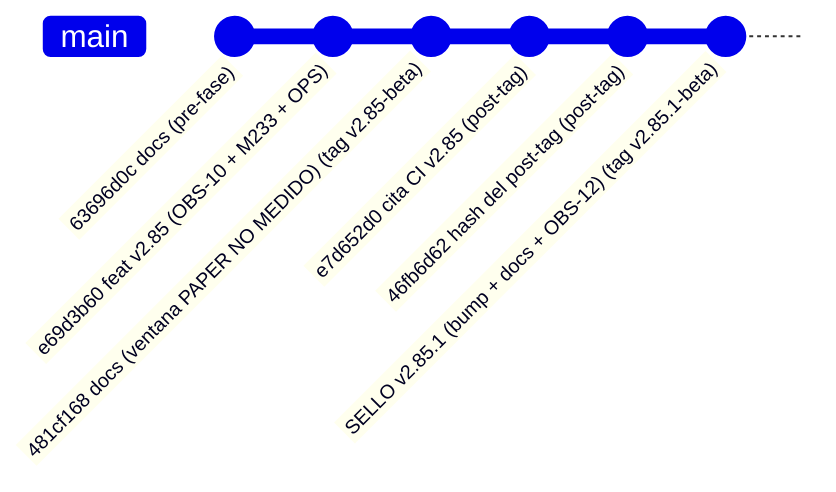

# Arranque del auditor — `v2.85.1-beta` / `AUTO-MATERIAL-13` (RE-SELLO): objeto autocontenido

> **Objeto auditado:** tag anotado **`v2.85.1-beta`** · **Versión:** `2.10.1-beta` (**bump** `2.10.0-beta → 2.10.1-beta`) ·
> **Base (diff):** `v2.85-beta` (`2.10.0-beta`, commit `481cf168`) · **AsOf:** 2026-09-28 · **Alembic head:**
> `046_fill_reference_mid` (**SIN migración**) · **Reparto:** `auto18-v1` / `auto15-v1` (`ALLOCATION = none`).
> **Freeze de `main`:** `apps` `ddcf636f39054e29cf9013e0273da2b773c1fd76` / `packages`
> `ba90ccf233bce9bada4e41cf81eb0b69312fd0d1` — **movido por `v2.85` a propósito** (cierra `OBS-10` en
> `packages/`); ver §6.

## 0. Qué es este objeto (y por qué existe un `v2.85.1`)

`v2.85.1-beta` es un **re-sello DOCS-ONLY** de `v2.85-beta`: **no añade ni cambia una línea de código de
producto**. El diff `v2.85-beta..v2.85.1-beta` es **solo** `package.json` + `docs/engineering/*` (+ `CHANGELOG.md`).

**Motivo 1 (`OBS-3`/`OBS-4`: autocontención).** El workflow `Release tag CI` **solo corre al empujar** el tag,
así que la cita de su resultado **no puede existir dentro** de ese mismo tag. A diferencia de `v2.83`/`v2.84`
(que dejaron un **placeholder** dentro), `v2.85-beta` **no** creó ninguno: sus docs sellados dicen
literalmente **`(pendiente)`** y la cita se escribió en los commits **POST-TAG** `e7d652d0` y `46fb6d62`. Un
auditor que clone **solo** el tag ve `(pendiente)` y puede concluir, por error, «CI no acreditado».
**Este tag cierra ese problema para la fase auditada**: `v2.85.1-beta` contiene, **dentro del snapshot**, el
instrumento de `v2.85` **y** la cita real de su CI.

**Motivo 2 (`OBS-12`, LOW, higiene documental: defecto REAL del objeto sellado).** `v2.85-beta` contenía **dos
sets documentales paralelos** de la misma fase:
- **docs-only previo** — `traspaso-relevo-post-v2-85-auto-material-13-comportamiento-2026-09-28.md` y
  `arranque-agente-v2-85-auto-material-13-comportamiento-2026-09-28.md`: dicen **«SIN bump y SIN tag»** y citan
  `HEAD` `d7a4924d` (son **anteriores** a la ejecución).
- **fase ejecutada (vigente)** — los `…-auto-material-13-obs10-comportamiento-2026-09-28.md`.

Y `PROJECT_STATE.md` llamaba **«Relevo vivo»** al set **docs-only**: un auditor que siguiera el punto de
entrada aterrizaba en un documento que **negaba la existencia del tag**. **Ya corregido** en este re-sello:
cabecera **[SUPERSEDED]** en los dos documentos del set docs-only (conservados, **no** borrados), puntero
«Relevo vivo» apuntando al relevo real y **declaración explícita** de la duplicidad (aquí, en el `audit-pack`
y en el propio tag). Es un defecto **documental**, no una deuda de datos.

`v2.85-beta` → `481cf168` (`(pendiente)` dentro) · cita acreditada de `v2.85` → `36392052899` (**dentro** de `v2.85.1-beta`).

## 1. Cita del CI (lo primero que hay que comprobar)

### 1.1 CI del tag `v2.85-beta` — ACREDITADO, y **visible desde el tag** `v2.85.1-beta`

| Campo | Valor |
|---|---|
| Workflow | `Release tag CI` |
| Run | [`36392052899`](https://github.com/jvelasca/Bolsa_V1/actions/runs/36392052899) |
| Tag / object | `v2.85-beta` (tag anotado `0582799bcacfc457cc04763cc4e5861857aea9ae`) → commit `481cf168` |
| `event` / branch | `push` / `v2.85-beta` |
| **Conclusion** | **SUCCESS** (primera pasada, `attempt 1`) |
| Duración | 07:30:53Z → 07:39:58Z (~9m05s) |
| Jobs | **10 `success` + `certify` `success`**; `playwright (integrated E2E, opt-in)` `skipped` por diseño |
| Job `python` del tag | `3023 passed / 37 skipped` (= `3022 + 1`); `ruff All checks passed`; `Contracts: 4 kept, 0 broken`; `mypy 0 issues (507 files)` |
| `Python CI` (mismo commit y tag) | `36392052944` — `quality` `3012 passed / 40 skipped` (= `3011 + 1`) + los cuatro jobs PG verdes |
| Otros runs del tag | `Frontend CI` `36392052955` · `Optimize lab` `36392052947` · `Fase 2 scientific` `36392052975` → **success** |
| Predicción pre-tag | `3023/37` y `3012/40` declarados **antes** del sello ⇒ **se cumplieron exactos** (skips `37 = 37`, `40 = 40`) |

### 1.2 CI del tag `v2.85.1-beta` (este objeto) — ACREDITADO (cita POST-TAG)

| Campo | Valor |
|---|---|
| Workflow | `Release tag CI` |
| Run | [`36395524355`](https://github.com/jvelasca/Bolsa_V1/actions/runs/36395524355) |
| Tag / object | `v2.85.1-beta` (tag anotado `07004b8a548f32fc5546c9f9df1d861e4bf8401d`) → commit `3ce8b85e` |
| `event` / ref | `push` / `v2.85.1-beta` |
| **Conclusion** | **SUCCESS** (primera pasada, `attempt 1`; ~8m19s; 08:07:52Z → 08:16:11Z) |
| Jobs | **10 `success` + `certify` `success`**; `playwright (integrated E2E, opt-in)` `skipped` por diseño |
| Job `python` del tag | `3023 passed / 37 skipped` · `ruff All checks passed!` · `Contracts: 4 kept, 0 broken` · `mypy 0 issues (507 files)` |
| `Python CI` (mismo commit y ref del tag) | `36395524224` — `quality` `3012 passed / 40 skipped` + los cuatro jobs PG verdes (A14/A12/A13 + `auto-v2-durable-pg`) |
| Otros runs del ref del tag | `Frontend CI` `36395524092` · `Optimize lab` `36395524203` · `Fase 2 scientific` `36395524309` → **success** |
| En `main` (push `46fb6d62..3ce8b85e`) | `Gitleaks` `36395521662` · `Frontend CI` `36395521415` · `Optimize lab` `36395521510` → **success** |
| Predicción pre-tag | `3023/37` y `3012/40` declarados **antes** del sello (código idéntico a `v2.85`) ⇒ **se cumplieron exactos** (skips `37 = 37`, `40 = 40`) |

**Declarado:** en `main` **no** corrieron `Python CI` ni `Fase 2 scientific` (trigger filtrado por rutas: el
diff es `package.json` + `docs/engineering` + `CHANGELOG.md`, **sin** ficheros Python) ⇒ igual que el
re-sello `v2.83.1`; es comportamiento **por diseño**, no un fallo. La verificación de `quality` la aporta el
run del ref del tag. **Su cita vive post-tag** (ningún tag puede contener su propio resultado de CI):
[`evidencia-ci-tag-v2.85.1-2026-09-28.txt`](./evidencia-ci-tag-v2.85.1-2026-09-28.txt) — la instancia
**dentro** del tag dice que el run «no puede estar ahí», y esa es la declaración, no un fallo.

## 2. Qué tiene que comprobar el auditor (por este orden)

1. **Naturaleza del objeto.** `package.json` = `2.10.1-beta`; tag `v2.85.1-beta` **anotado** apuntando al
   commit del sello; árbol **intacto** antes y después de cualquier sonda (`git status --porcelain` vacío).
2. **Alcance del re-sello (`v2.85-beta..v2.85.1-beta`).** Debe mostrar **solo** `package.json`
   (`2.10.0-beta → 2.10.1-beta`) y `docs/engineering/*` (+ `CHANGELOG.md`). **Ningún** fichero de
   `packages/` ni `apps/`. **Si aparece cualquier cambio fuera de ese alcance, este re-sello es FALSO: decláralo.**
3. **El instrumento NO cambia entre `v2.85` y `v2.85.1`.** `operability_audit.py`,
   `test_operability_audit.py`, `v2_44_mutation_audit.py` y `ops_seed_window_pair.py` deben estar
   **byte-idénticos** entre los dos tags (`git diff v2.85-beta v2.85.1-beta -- packages apps` → **vacío**).
4. **La corrección documental está de verdad aplicada** (`OBS-12`): los dos ficheros del set docs-only llevan
   cabecera **[SUPERSEDED]**; `PROJECT_STATE.md` «Relevo vivo» apunta al relevo **`…-obs10-comportamiento-…`**;
   y la duplicidad está **declarada** (no oculta) en este arranque, en el `audit-pack` y en la evidencia del CI.
5. **Semántica del instrumento de `v2.85`** (el núcleo a intentar romper; código **idéntico** al de la fase):
   - `window_totals`: suma **solo** días medidos, publica `coverage[*].partial`, **no** suma huecos como `0`.
   - **`OBS-10` (lo que esta fase cierra):** el bloque **`stateCounts`** itera **`measured_rows`** (antes
     iteraba `rows`), de modo que una fila con `measured=False` **y `state` poblado** **no** entra en el censo.
     Intenta **refutarlo**: fabrica una fila `measured=False` con `state` poblado y comprueba que **no** cuenta.
   - `window_rates`: `rate=None` sin días medidos o con denominador `0` (**nunca** `0.0`); cada tasa lleva
     `numerator`/`denominator`/`coveredDays`/`source`.
   - **`unresolvedRate`**: está **etiquetado** como **INDICADOR** (`1.0` en cuanto hay un día medido en
     `unresolved`, `None` si no lo hay), **no** como tasa de propuestas. **La clave NO se renombra y la
     aritmética NO cambia** (matiz: `unresolved_pairs = [(1,1), …]`). La pregunta de fondo es la observación
     **`OBS-11` (LOW, ABIERTA)**.
   - `render_window_audit`: determinista (sin reloj), `n/d` para `None`.
   - `enrich_rows_with_evidence`: rellena **solo** huecos declarados y **nunca** sobrescribe lo medido (`OBS-6`).
6. **Read-only de verdad.** `v2_83_window_audit.py` con `--render`/`--json` sin `--out` **no** crea
   ficheros; **nunca** toca el journal durable, `evidence_runs/` ni `evidence_validations/`; `exit 0` con
   ≥1 día y `exit 2` sin material legible.
7. **Anexo OPS (`ops_seed_window_pair.py`, DECLARADO, no gate-certificado).** Sin `--account-id` **y** sin
   `--allow-create` debe imprimir `# uso incorrecto: …` en `stderr` y salir con **código 1** **antes** de tocar
   PostgreSQL (**no** acuña cuenta en silencio). No tiene test unitario por diseño y **no** está en el alcance
   de `mypy` (`apps/api-python/src`).
8. **Compuertas reproducidas** (medidas, no heredadas): `ruff` → `All checks passed!` ·
   `lint-imports` → `Contracts: 4 kept, 0 broken` · `mypy` → `0 issues` (**507** fuentes) ·
   `alembic heads` → `046_fill_reference_mid` · `test_operability_audit.py` → **19 passed** ·
   `packages/py/application/tests` → **2085 passed / 5 skipped** (**2090** recogidos).
9. **Matriz adversarial**: **233/233** (la nueva **`M233`** muerde **exactamente** el test de `OBS-10`), con
   restauración **byte a byte** y árbol limpio. Crudo en
   [`evidencia-matriz-mutaciones-v2.85-233-2026-09-28.txt`](./evidencia-matriz-mutaciones-v2.85-233-2026-09-28.txt).
10. **Registro en CI**: `test_operability_audit.py` **explícito** en el job `quality` de `python-ci.yml` y en
    el job `python` de `release-tag-ci.yml` (el salto `3022 → 3023` y `3011 → 3012` lo demuestra).

## 3. Puntos de entrada por orden

- **Evidencia del CI (dentro de este tag)**: [`evidencia-ci-tag-v2.85.1-2026-09-28.txt`](./evidencia-ci-tag-v2.85.1-2026-09-28.txt)
  — acredita el CI de `v2.85` y declara el de este tag.
- **Audit-pack de la fase**: [`audit-pack-v2-85-auto-material-13-obs10-comportamiento-2026-09-28.md`](./audit-pack-v2-85-auto-material-13-obs10-comportamiento-2026-09-28.md)
  (matriz afirmación→código→test; aplica **tal cual** porque el código no cambia).
- **Plan de la fase**: [`plan-v2-85-auto-material-13-statecounts-y-auditoria-comportamiento-2026-09-28.md`](./plan-v2-85-auto-material-13-statecounts-y-auditoria-comportamiento-2026-09-28.md).
- **Protocolo de comportamiento** (los 10 escalones, `n/d` ≠ `0`): [`protocolo-auditoria-comportamiento-auto-2026-09-28.md`](./protocolo-auditoria-comportamiento-auto-2026-09-28.md).
- **Cierre de la ventana PAPER**: [`ventana-paper-cierre-no-medido-2026-09-28.md`](./ventana-paper-cierre-no-medido-2026-09-28.md).
- **Relevo / estado**: [`traspaso-relevo-post-v2-85-1-auto-material-13-reseal-2026-09-28.md`](./traspaso-relevo-post-v2-85-1-auto-material-13-reseal-2026-09-28.md) ·
  [`PROJECT_STATE.md`](./PROJECT_STATE.md) · [deuda P3](./deuda-p3-post-auditoria-v2.70-2026-09-26.md).
- **El set docs-only [SUPERSEDED]** (histórico, **no** vigente):
  [`traspaso-relevo-post-v2-85-auto-material-13-comportamiento-2026-09-28.md`](./traspaso-relevo-post-v2-85-auto-material-13-comportamiento-2026-09-28.md) ·
  [`arranque-agente-v2-85-auto-material-13-comportamiento-2026-09-28.md`](./arranque-agente-v2-85-auto-material-13-comportamiento-2026-09-28.md).

## 4. Qué NO se puede reproducir sin material real

La **ventana ≥4 días** (`P3-2`/`P3-3`) **no** se certifica con fixtures: `operability_runs/` está gitignoreado
y la tabla/`TOTAL`/tasas se re-derivan con fixtures deterministas. El auditor debe **declarar** esa
limitación, **no** leerla como cierre. `OBS-11` (LOW), `H-4` (LOW), `OBS-9`, `P3-5` y `OBS-5` siguen
**ABIERTOS**; **`OBS-10` está CERRADA** (código + test + mutación).

## 5. La ventana PAPER D1..D4 — `NO MEDIDO` (declarado, no fabricado)

| Paso | Resultado 2026-09-28 |
| --- | --- |
| Preflight de régimen (read-only) | **exit 2** · `{range:8, trend_down:9, trend_up:3}` ⇒ `BEAR_TREND` ⇒ **LONG VETADAS** (`regime_invalid`) |
| Forward D1 (detached, PID 16508) | `cycles=0/0`, `verdict=BLOCKED`; parado por el operador; **no** escribió su `--out` (el runner escribe solo al final) |
| `v2_80_market_window.py --days 4` | **exit 2** — «no hay ningún día de operabilidad que leer en la ventana» |
| `paper_material_readiness.py --level evidence` | **exit 2** — `PRODUCER READY? NO` · `EVIDENCE READY? NO` · `durable fills 0` · `closed cycles 0` · `reservations 0` |
| `v2_83_window_audit.py` | **NO EJECUTABLE** por falta de `--window` (el capturador salió `2` y no produjo serie) |

**Causa medida (no supuesta):** el censo de días de `v2_80_market_window.py:210` se construye **solo** con
material durable (`fills ∪ cycles ∪ journal`) y el `--forward` **no crea días: solo enriquece** los que ya
existen ⇒ sin fills no hay filas y `D2..D4` **no** cambiarían nada. **No** se bajó `min cycles`/`min R`/
`folds`/`min_episodes` ni se forzaron entradas.

## 6. Límites del re-sello (honestidad)

- **No** cambia el motor ni el instrumento: **no** convierte `v2.85` en otra cosa, solo lo **re-entrega** en un
  snapshot que ya contiene la cita de su CI **y** la corrección documental.
- **El freeze de `main` SÍ cambió** (`apps` `980c7b6e…` → `ddcf636f…`, `packages` `ffe36fd2…` → `ba90ccf2…`)
  **por `v2.85`**, no por este re-sello: `v2.85` toca `packages/` (cierra `OBS-10`). La regla de freeze
  prohibía moverlo **mientras la ventana PAPER estaba viva**, y la ventana se cerró como `NO MEDIDO`
  **antes** del merge. El diff de **este** re-sello **no** mueve el freeze (`git diff v2.85-beta v2.85.1-beta
  -- packages apps` debe ser **vacío**).
- **No** cierra `P3-2`/`P3-3`/`H-4`/`OBS-11`/`P3-5`/`OBS-5`: eso exige **datos PAPER reales** o un barrido,
  no documentación. **Sí** cierra `OBS-10` (código + test + mutación) y **`OBS-12`** (defecto documental).
- El CI de **este** tag sigue viviendo post-tag (límite estructural del workflow, declarado en §1.2).
