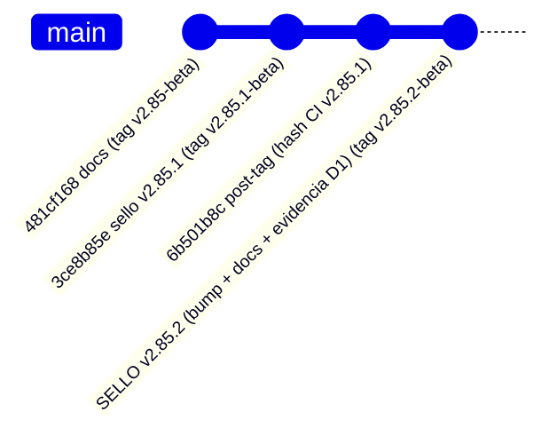

# Arranque del auditor — `v2.85.2-beta` / `AUTO-MATERIAL-13` (RE-SELLO): cierre de la ventana D1 + evidencia cruda

> **Objeto auditado:** tag anotado **`v2.85.2-beta`** · **Versión:** `2.10.2-beta` (**bump**
> `2.10.1-beta → 2.10.2-beta`) · **Base (diff):** `v2.85.1-beta` (`2.10.1-beta`, commit `3ce8b85e`) ·
> **AsOf:** 2026-09-28 · **Alembic head:** `046_fill_reference_mid` (**SIN migración**) · **Reparto:**
> `auto18-v1` / `auto15-v1` (`ALLOCATION = none`).
> **Freeze:** `apps` `ddcf636f39054e29cf9013e0273da2b773c1fd76` / `packages`
> `ba90ccf233bce9bada4e41cf81eb0b69312fd0d1` — **este objeto NO lo mueve**.

## 0. Qué es este objeto (y por qué existe un `v2.85.2`)

`v2.85.2-beta` es un **re-sello DOCS-ONLY** de `v2.85.1-beta`: **no añade ni cambia una línea de código de
producto**. El diff `v2.85.1-beta..v2.85.2-beta` es **solo** `package.json` + `docs/engineering/*` (+
`CHANGELOG.md` + `.prettierignore`); `git diff v2.85.1-beta v2.85.2-beta -- packages apps` debe estar **vacío**.

**Motivo (medido, no cosmético).** El propietario fue a auditar **desde GitHub** el resultado operativo y
encontró que la **evidencia del día D1 no viajaba**: `operability_runs/` (`.gitignore:102`) y `logs/`
(`.gitignore:12`) están gitignoreados, así que un clon fresco del tag **no** contenía ni el `--out` del
forward, ni su cronología, ni la fila de `v2_77`. Este re-sello:
**(a)** incluye la **evidencia cruda D1** dentro del tag ([`evidence/v2.85.2/`](./evidence/v2.85.2/README.md),
copiada **verbatim** con SHA-256);
**(b)** documenta el **cierre `NO MEDIDO`** con la causa medida
([`ventana-paper-d1-cierre-no-medido-v2.85.2-2026-09-28.md`](./ventana-paper-d1-cierre-no-medido-v2.85.2-2026-09-28.md));
**(c)** declara **por qué la corrida tardó ~7h38m** (cadencia 60 s × 400 ticks + suspensión del equipo);
**(d)** registra la observación **`OBS-13`** (LOW) medida al recomputar la evidencia (§4).

## 1. Cita del CI (lo primero que hay que comprobar)

### 1.1 CI del tag `v2.85.1-beta` — ACREDITADO, y **visible desde este tag**

| Campo | Valor |
|---|---|
| Workflow | `Release tag CI` |
| Run | [`36395524355`](https://github.com/jvelasca/Bolsa_V1/actions/runs/36395524355) |
| Tag / object | `v2.85.1-beta` (tag anotado `07004b8a548f32fc5546c9f9df1d861e4bf8401d`) → commit `3ce8b85e` |
| **Conclusion** | **SUCCESS** (primera pasada, `attempt 1`; ~8m19s) |
| Job `python` del tag | `3023 passed / 37 skipped` · `ruff All checks passed!` · `Contracts: 4 kept, 0 broken` · `mypy 0 issues (507 files)` |
| `Python CI` (mismo commit/ref) | `36395524224` — `quality` `3012 passed / 40 skipped` + los 4 jobs PG verdes |
| Otros runs del ref | `Frontend CI` `36395524092` · `Optimize lab` `36395524203` · `Fase 2 scientific` `36395524309` → **success** |
| Commit que acredita la cita | `57631636fbf462a01028fc991f9b165fcb422e14` (POST-TAG) |

### 1.2 CI del tag `v2.85.2-beta` (este objeto) — se acredita **POST-TAG**

Límite estructural (`OBS-3`/`OBS-4`): `Release tag CI` **solo corre al empujar** el tag ⇒ su resultado no
puede preexistir dentro del propio tag. La instancia **dentro** del tag declara esto y la cita real se
escribe en un commit **POST-TAG**. **Predicción pre-tag** (el código es byte-idéntico a `v2.85.1`): job
`python` del tag **`3023 passed / 37 skipped`** y `quality` **`3012 passed / 40 skipped`**.
Ver [`evidencia-ci-tag-v2.85.2-2026-09-28.txt`](./evidencia-ci-tag-v2.85.2-2026-09-28.txt).

## 2. Qué tiene que comprobar el auditor (por este orden)

1. **Naturaleza del objeto.** `package.json` = `2.10.2-beta`; tag `v2.85.2-beta` **anotado**; árbol
   **intacto** (`git status --porcelain` vacío) antes y después de cualquier sonda.
2. **Alcance del re-sello (`v2.85.1-beta..v2.85.2-beta`).** Debe mostrar **solo** `package.json`
   (`2.10.1-beta → 2.10.2-beta`), `docs/engineering/*` (+ `CHANGELOG.md` + `.prettierignore`). **Ningún** fichero de
   `packages/` ni `apps/`. **Si aparece cualquier cambio fuera de ese alcance, este re-sello es FALSO: decláralo.**
3. **El instrumento NO cambia.** `operability_audit.py`, `operability_window.py`,
   `market_operability.py`, `v2_76_forward_market_material.py`, `v2_80_market_window.py`,
   `v2_83_window_audit.py`, `test_operability_audit.py` y `v2_44_mutation_audit.py` deben estar
   **byte-idénticos** entre los dos tags (`git diff v2.85.1-beta v2.85.2-beta -- packages apps` → **vacío**).
4. **La evidencia cruda está dentro del tag y cuadra.** Recomponer la tabla de §5 desde
   [`evidence/v2.85.2/forward-market-20260928.json`](./evidence/v2.85.2/forward-market-20260928.json) y
   verificar los SHA-256 del [README](./evidence/v2.85.2/README.md). Recomputar el funnel con `v2_77` (función
   pura) y **refutar** si puedes las cifras del cierre.
5. **`OBS-13` (LOW) es REAL y está declarada, no oculta.** En la evidencia: `vetoes=8000` pero
   `vetoCounted=4000` (`regime_invalid:2000` + `top_n_excluded:2000`) y `contractViolation=false`. **Causa
   medida:** el censo lee el journal del **worker primario** (versión A, `watchA`, 10 símbolos/tick) y **la
   versión B no aporta**. Intenta refutarlo (por ejemplo, forzando un par donde B también tenga símbolos
   `range`) y, si no lo refutas, **confírmalo como observación abierta**.
6. **Read-only del instrumento.** `v2_83_window_audit.py` con `--render`/`--json` **sin** `--out` no crea
   ficheros; **nunca** toca journal durable, `evidence_runs/` ni `evidence_validations/`.
7. **Compuertas reproducidas** (medidas, no heredadas): `ruff` → `All checks passed!` · `lint-imports` →
   `Contracts: 4 kept, 0 broken` · `mypy` → `0 issues` (**507** fuentes) · `alembic heads` →
   `046_fill_reference_mid` · `test_operability_audit.py` → **19 passed**.
8. **El freeze no se mueve con este objeto** (§0): `git diff v2.85.1-beta v2.85.2-beta -- packages apps`
   **vacío** es la prueba.

## 3. Puntos de entrada por orden

- **Evidencia cruda D1 (dentro de este tag):** [`evidence/v2.85.2/`](./evidence/v2.85.2/README.md)
  (`forward-market-20260928.json`, `forward-20260928.out.log`, `forward-20260928.err.log`, fila `v2_77`).
- **Cierre de la ventana D1 (`NO MEDIDO`) + tiempos + `OBS-13`:**
  [`ventana-paper-d1-cierre-no-medido-v2.85.2-2026-09-28.md`](./ventana-paper-d1-cierre-no-medido-v2.85.2-2026-09-28.md).
- **Evidencia del CI:** [`evidencia-ci-tag-v2.85.2-2026-09-28.txt`](./evidencia-ci-tag-v2.85.2-2026-09-28.txt).
- **Instrumento de la fase (idéntico):**
  [`audit-pack-v2-85-auto-material-13-obs10-comportamiento-2026-09-28.md`](./audit-pack-v2-85-auto-material-13-obs10-comportamiento-2026-09-28.md) ·
  [`protocolo-auditoria-comportamiento-auto-2026-09-28.md`](./protocolo-auditoria-comportamiento-auto-2026-09-28.md).
- **Relevo / estado:** [`traspaso-relevo-post-v2-85-2-auto-material-13-no-medido-2026-09-28.md`](./traspaso-relevo-post-v2-85-2-auto-material-13-no-medido-2026-09-28.md) ·
  [`PROJECT_STATE.md`](./PROJECT_STATE.md) · [deuda P3](./deuda-p3-post-auditoria-v2.70-2026-09-26.md).

## 4. Qué NO se puede reproducir sin material real

La **ventana ≥4 días** (`P3-2`/`P3-3`) **no** se certifica con fixtures: la evidencia del tag es **un día
(D1)** y `v2_80`/`v2_83` exigen la ventana **durable** (`fills ∪ cycles ∪ journal`), vacía para esta cuenta.
El auditor debe **declarar** esa limitación, **no** leerla como cierre. `OBS-11` (LOW), `H-4` (LOW),
`OBS-9`, `P3-5`, `OBS-5` y la nueva **`OBS-13`** (LOW) siguen **ABIERTOS**; `OBS-10` está **CERRADA**.

## 5. La ventana PAPER D1..D4 — `NO MEDIDO` (declarado, no fabricado)

| Paso | Resultado 2026-09-28 |
| --- | --- |
| Preflight de régimen (read-only) | **exit 2** · `{range:8, trend_down:9, trend_up:3}` ⇒ `BEAR_TREND` ⇒ **LONG VETADAS** (`regime_invalid`) |
| Forward D1 (`v2_76`, 400 ticks) | `stopReason=completed` · `decided=8000` · `vetoes=8000` (`vetoCounted=4000`) · `fills=0` · `cycles=0` · `state=vetoed` |
| `v2_80_market_window.py --days 4` | **exit 2** — «no hay ningún día de operabilidad que leer en la ventana» |
| `paper_material_readiness.py --level evidence` | **exit 2** — `durable fills 0` · `closed cycles 0` · `reservations 0` |
| `v2_83_window_audit.py` | **NO EJECUTABLE** (sin `--window`: el capturador `v2_80` salió `2`) |

**Causa medida:** el censo de días de `v2_80` se construye **solo** con material durable y el `--forward`
**no crea días: solo enriquece** ⇒ sin fills, D2..D4 no cambiarían nada. **No** se bajaron `min cycles`/
`min R`/`folds`/`min_episodes` ni se forzaron entradas.

## 6. Límites del re-sello (honestidad)

- **No** cambia el motor ni el instrumento: **re-entrega** `v2.85.1` con la **evidencia cruda D1** y su
  **cierre documentado** dentro del tag.
- **No** cierra `P3-2`/`P3-3`/`H-4`/`OBS-11`/`P3-5`/`OBS-5`/`OBS-13`: eso exige **datos PAPER reales** o un
  cambio de código. **Sí** deja **acreditado** el cierre `NO MEDIDO` y su causa.
- El CI de **este** tag sigue viviendo post-tag (límite estructural del workflow, §1.2).
