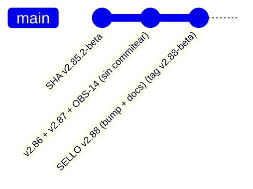

# Arranque del auditor — `v2.88-beta` / `AUTO-MATERIAL-16`: sello conjunto (`v2.86` + `v2.87` + cierre de `OBS-14`) + `OBS-15`

> **[OBJETO VIGENTE — RE-SELLO `v2.88.1-beta`, 2026-09-29.]** El tag `v2.88-beta` quedó **público y
> ROJO** en `Release tag CI` (`lifecycle-pg`, fail-**OPEN** del cierre de turno). Audita el tag anotado
> **`v2.88.1-beta`** (**Versión `2.11.1-beta`**, mismo commit base **`3483b6b5`**), que añade la guarda
> `attribute_fills=False` en el cierre de turno y la alineación de la costura del replay, con dos tests
> y las mutaciones `M247`/`M248` que la fijan. Delta y prueba de causalidad:
> [obs-14-correccion-fail-open-v2.88.1-2026-09-29.md](./obs-14-correccion-fail-open-v2.88.1-2026-09-29.md);
> evidencia cruda (incluye el rojo original, conservado):
> [evidence/v2.88.1/README.md](./evidence/v2.88.1/README.md). El resto de este arranque se conserva
> **verbatim**.

> **Objeto auditado:** tag anotado **`v2.88-beta`** (lo crea el propietario) · **Versión:** `2.11.0-beta`
> (**bump** `2.10.2-beta → 2.11.0-beta`) · **Base (diff):** `v2.85.2-beta`, commit base **`3483b6b5`** ·
> **AsOf:** 2026-09-29 · **Alembic head:** `046_fill_reference_mid` (**SIN migración**).
> **Sello conjunto:** el tag sella **tres** incrementos ya implementados y **sin commitear**: `v2.86`
> (`AUTO-MATERIAL-14`) + `v2.87` (`AUTO-MATERIAL-15`) + el cierre de `OBS-14` (`AUTO-MATERIAL-16`).
> **Remote:** `github.com/jvelasca/Bolsa_V1.git`.

## 0. Qué es este objeto (y por qué existe un `v2.88`)

`v2.88-beta` es un **sello conjunto**: su diff respecto de **`v2.85.2-beta`** incluye, por primera vez en
el árbol, **el código de `v2.86`/`v2.87`** (que se autoró pero **nunca se commiteó**) **más** el **cierre
de motor de `OBS-14`**. El **único cambio de motor** de la fase es **+7 / -0**, **un solo hunk** (líneas
4937-4943) en `real_turn`: añade `await self._v2_reconcile_reservations(startup=False)` justo después de
`report = await self.auto_turn()` y antes de `if auto_store is not None:`.

**Por qué el cierre vive en `real_turn` y no en `auto_turn` (medido en código):** AUTO es **solo**
`{paper, simulated}` y **sin bridge LIVE** (docstring del módulo, `auto_simulation_worker.py:5` y `:13`),
así que la orden o **liquida dentro del tick** (`submit_simulated_order`) o **no se materializa nunca** ⇒
una reserva viva al cerrar el turno cuya orden **no está en vuelo** *está muerta*. Va en `real_turn` (camino
durable de producción) y **no** en `auto_turn` (camino hermético, usado por decenas de tests y por el
instrumento de replay) para **no perturbarlos**. `startup=False` ⇒ etiqueta
**`RESERVATION_RELEASED_BY_CANCEL`**, no `..._BY_RESTART`.

**Dos defectos extra corregidos en la misma entrega:**

- **Versión inexistente:** 6 documentos afirmaban `2.11.0-beta`, que **nunca existió** (`package.json`,
  `CHANGELOG.md` y toda la historia de git dicen `2.10.2-beta`). **7 ocurrencias** corregidas.
- **7 errores `I001`** que habrían hecho fallar el job `quality` de CI (los ficheros de `v2.86`/`v2.87`
  nunca se commitearon y nunca se lintaron con la config de raíz).

## 1. Cita del CI (lo primero que hay que comprobar)

### 1.1 CI del tag `v2.88-beta` (este objeto) — **PENDIENTE**, se acredita **POST-TAG**

Límite estructural (`OBS-3`/`OBS-4`): `Release tag CI` **solo corre al empujar** el tag ⇒ su resultado no
puede preexistir dentro del propio tag. La instancia **dentro** del tag declara esto y la cita real se
escribe en un commit **POST-TAG**. **No** se cita aquí ningún `run`: **`(pendiente)`** hasta que exista el
tag. El auditor **no** debe leer su ausencia como fallo.

### 1.2 Predicción pre-tag (declarada, no medida)

El resultado del job `python` del tag **y** del job `quality` en `main` de este sello: **NO MEDIDO** en el
paquete de la fase. La predicción estructural (código Python **nuevo**: módulo de replay, CLI, tests,
mutaciones) es que **sí** correrán `Release tag CI` y `Python CI`, a diferencia de los re-sellos docs-only
de `v2.85.1`/`v2.85.2`. **NO** se inventa ningún conteo: los números se citarán **POST-TAG**.

## 2. Qué tiene que comprobar el auditor (por este orden)

1. **Naturaleza del objeto.** `package.json` = `2.11.0-beta`; tag `v2.88-beta` **anotado**; árbol
   **intacto** (`git status --porcelain` vacío) antes y después de cualquier sonda.
2. **Alembic head `046_fill_reference_mid`** (**SIN migración**).
3. **El cierre de motor es acotado.** `git diff --numstat -- apps/api-python/src/bolsa_api/background/auto_simulation_worker.py`
   = **`7  0`**; **un solo hunk** (4937-4943) en `real_turn`; **ningún** cambio en `auto_turn`, en el
   interior de `_v2_reconcile_reservations`, en la regla de retirada ni en umbrales.
4. **La etiqueta es `RESERVATION_RELEASED_BY_CANCEL`**: `startup=False` (la reserva murió por no
   materializarse, no por reinicio).
5. **El control reproduce el goteo previo.** `test_control_without_tick_close_reproduces_the_drip`; y el
   capital capturado y no aplicado se **conserva** (`test_closing_reconcile_keeps_captured_unapplied_capital_in_flight`).
6. **El arreglo del hallazgo de Bugbot.** `_print_census` consume el **`dict`**; los renderers de `v2.86`
   y `v2.87` **coinciden** con el mismo payload (`test_both_renderers_agree_on_the_same_payload`).
7. **El comando EXACTO de CI** `uv run ruff check packages/py apps/api-python --config pyproject.toml` →
   `All checks passed!`; comprueba que **no** se confunde con `ruff` **por fichero sin `--config`** (que
   descubre la config anidada `apps/api-python/pyproject.toml` y da otro resultado).
8. **La matriz de mutaciones** marca **246** (eran **239** en `v2.85.2`); `M245` y `M246` muerden **3/3**,
   árbol restaurado **byte a byte**.
9. **`OBS-15` (MEDIUM, alcance motor) es REAL y está declarada, no oculta** (§4).
10. **Los dos defectos extra corregidos:** ningún documento dice ya `2.11.0-beta` fuera del sello.
11. **Compuertas reproducidas:** guardarraíles **142 passed** (10 suites); `test_auto_v2_durable_cycle.py`
    **11**; `test_replay_oos.py` **18**; `test_replay_oos_durable_cycle.py` **29**; `test_replay_oos_cli_renderers.py` **3**.
12. **Read-only del instrumento de `v2.86`/`v2.87`:** la cuarentena es **en memoria**; el único sumidero de
    escritura es `Path(args.out).write_text(...)` con la ruta que teclea el operador; las lecturas de BD son
    read-only y parametrizadas.

## 3. Puntos de entrada por orden

- **Informe/relevo del cierre (motor + defectos):** [`obs-14-cierre-por-turno-v2.88-2026-09-29.md`](./obs-14-cierre-por-turno-v2.88-2026-09-29.md).
- **Evidencia cruda del cierre:** [`evidence/v2.88/README.md`](./evidence/v2.88/README.md)
  (diff del motor, nombres de tests, `M245`/`M246`, tabla de defectos, **NO MEDIDO**).
- **Instrumento sellado (`v2.86`):** [`replay-oos-viabilidad-auto-v2.86-2026-09-29.md`](./replay-oos-viabilidad-auto-v2.86-2026-09-29.md) ·
  [`evidence/v2.86/README.md`](./evidence/v2.86/README.md).
- **Instrumento sellado (`v2.87`):** [`replay-oos-ciclo-durable-v2.87-2026-09-29.md`](./replay-oos-ciclo-durable-v2.87-2026-09-29.md) ·
  [`evidence/v2.87/README.md`](./evidence/v2.87/README.md).
- **Deuda:** [`deuda-p3-post-auditoria-v2.70-2026-09-26.md`](./deuda-p3-post-auditoria-v2.70-2026-09-26.md)
  (sección `OBS-14` **CERRADA**; sección `OBS-15` **ABIERTA**).
- **Estado:** [`PROJECT_STATE.md`](./PROJECT_STATE.md) · [`engineering-index-2026-08-03.md`](./engineering-index-2026-08-03.md).

## 4. `OBS-15` — el techo de 1000 filas `APPLIED` puede parar el motor (MEDIUM, alcance motor) — ABIERTA

**Medido en código.** `read_applied_fill_facts` lee `list_applied(account_id, limit=DEFAULT_APPLIED_LIMIT=1000)`;
`PostgresExecutionEventStore.list_applied` ordena `applied_at ASC` y aplica `LIMIT` ⇒ **no** está acotado
a una jornada, pese al comentario de `applied_fills` («fills aplicados de una jornada AUTO»).
`truncated = len(events) >= limit` ⇒ `MEASUREMENT_UNKNOWN`.

**Efecto.** En `_v2_reconcile_reservations`, una lectura `UNKNOWN` implica que (a) la regla 1 no puede
casar ningún fill (`facts=()`), (b) la regla 2 **nunca** libera (no es `measurable`) y (c)
`_v2_reservations_measurement` queda `UNKNOWN` ⇒ el libro pendiente es `UNKNOWN` ⇒ el motor **veta
aperturas**. Con `>=1000` filas `APPLIED` acumuladas, la reconciliación de reservas **no puede** ser
COMPLETE y el motor deja de abrir.

**Declarado:** es **preexistente** (la reconciliación de arranque lee idénticamente) y **NO** lo introdujo
la fase de `OBS-14`; es fail-closed y **declarado** en el journal (no es corrupción silenciosa), pero es
una **parada dura alcanzable por operación normal**. El **radio de impacto** incluye la reconstrucción de
**posición** (`read_position_ledger` y las posiciones canónicas usan el mismo límite por defecto).

**Disparador:** `>=1000` filas con `status='APPLIED'` para la cuenta (derivado del código). La **madurez
de la cuenta real está NO MEDIDA** (una sonda read-only fue **bloqueada por la revisión automática**); el
auditor **no** debe estimarla.

**Nota:** la ventana de retención de **900** de `v2.87` es una mitigación **interna al instrumento**
(`_RetentionExecutionEventStore`, solo replay); **no** existe en producción.

**Criterio de cierre:** hacer que la lectura de fills de la reconciliación de reservas sea COMPLETA **para
su propósito**, acotándola a la ventana viva (p. ej. `since = min(created_at)` de las reservas vivas, ya
que la regla 1 solo casa fills con `applied_at >= created_at`), y/o acotar honestamente la lectura de
posición. Exige tocar `applied_fills` + protocolo del store + InMemory + Postgres + tests + mutaciones.

## 5. Qué NO se puede reproducir sin material real

La **ventana ≥4 días** (`P3-2`/`P3-3`) **no** se certifica con fixtures. Este sello **no** mide ventana: la
evidencia de operación sigue siendo la de `v2.86`/`v2.87` (reloj **simulado**, cuarentena en memoria), y la
ventana PAPER real exige **días de pared con material durable**. El auditor debe **declarar** esa limitación,
**no** leerla como cierre. `P3-2`/`P3-3`/`OBS-15`/`OBS-13`/`OBS-11`/`H-4`/`OBS-9`/`P3-5`/`OBS-5` siguen
**ABIERTOS**; **`OBS-14` CERRADA**.

### 5.1 La ventana PAPER — `NO MEDIDO` (declarado, no fabricado)

| Paso | Resultado 2026-09-29 |
| --- | --- |
| Ventana PAPER real D1..D4 | **NO MEDIDA** (sin corrida de ventana en esta fase) |
| Sustitución por el replay OOS | **NO. Nunca** (reloj simulado; no acredita cubos de calendario) |
| `P3-2`/`P3-3` | **ABIERTAS** |

## 6. Límites del sello (honestidad)

- **No** cierra `P3-2`/`P3-3` ni sustituye una ventana PAPER real: el sello **no** mide ventana.
- **Sí** cierra **`OBS-14`** (código + tests + mutación) y **abre** **`OBS-15`** (MEDIUM, alcance motor).
- **`mypy` / `lint-imports` de esta fase: NO MEDIDO** (no citados en el paquete de verificación del sello).
- **No** se cita ningún `run` de CI: **`(pendiente)`** hasta que el propietario cree el tag (la cita del CI
  es **POST-TAG** por construcción, patrón `OBS-3`/`OBS-4`).
- Los defectos documentales de la fase (**versión inexistente**; **7 `I001`**) están **corregidos** y se
  declaran; ninguno es deuda de datos.
