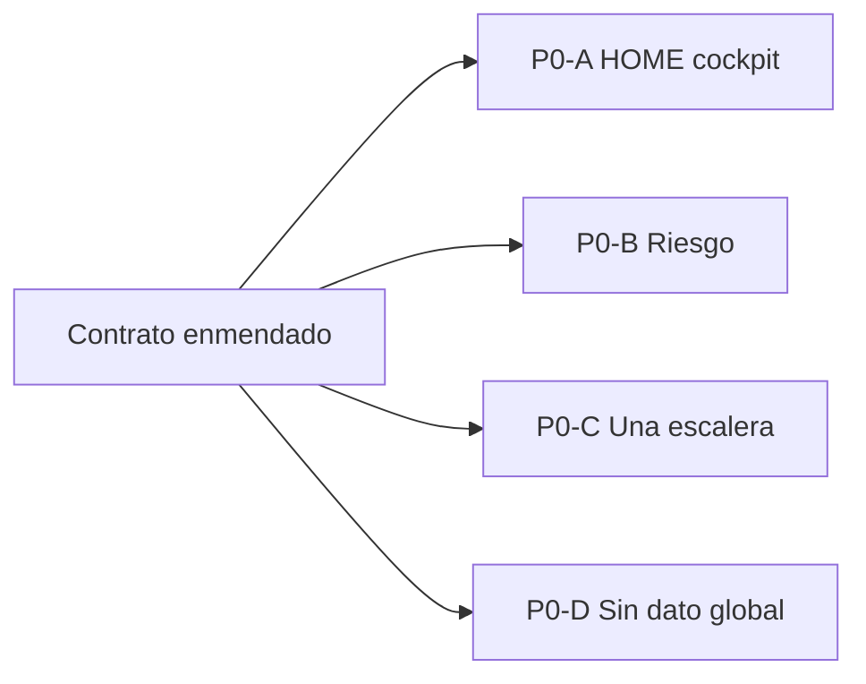

# Arranque UI 6.0 — slice P0 (brief de ejecución, sin implementar)

> **AsOf:** 2026-10-08 · **Estado:** **PREPARACIÓN** (no implementa código).
> **Padres:** [Mapa de problemas UI 5.0](./auditoria-ui-5-0-mapa-problemas-2026-10-08.md) · [plan único UI 6.0](./plan-ui-6-0-2026-10-08.md) · [UI Contract 5.0](./spec-ui-contract-5-0-2026-10-08.md) · [ADR-045](../adr/045-ui-contract-5-0.md).
> **Base:** tag `v2.88.89-beta` (`b9557c21`), `Δ motor = 0`.

---

## 0. Precondición (bloqueante)

Antes de tocar código, el contrato ya está enmendado (realizado en este estudio):

- `RT-01`…`RT-04` en [`spec-ui-contract-5-0-2026-10-08.md`](./spec-ui-contract-5-0-2026-10-08.md) §Bloque D y `ADR-045` §1.4.
- `UI5-14` con el **vocabulario Opción B** (`Sin dato todavía` / `No aplica` / `No disponible`; `—` solo nivel 3).
- `ADR-040` §12: `Cartera` rotulada, `AdminRail` administrativa/técnica.

---

## 1. Orden de ejecución del P0

Los cuatro slices son **independientes** (superficies disjuntas) y pueden ejecutarse en cualquier orden; se recomienda cerrar **D antes que P1** porque el vocabulario lo consumen los demás.

---

## 2. Brief por slice

### P0-A · HOME de AUTO = cockpit real

- **Regla:** `UI5-04`, `RT-03`.
- **Objetivo:** un único chip `SIMULADO`; un único lugar para estado y reloj; hueco declarado una sola vez; `Ver todas las operaciones` fuera de Oportunidades.
- **Ficheros:** [`auto-home-page.tsx`](../../apps/web/src/features/auto/auto-home-page.tsx) · [`auto-reality-strip.tsx`](../../apps/web/src/features/auto/auto-reality-strip.tsx) · [`auto-account-figures.ts`](../../apps/web/src/features/auto/auto-account-figures.ts) · [`auto-basic-home.ts`](../../apps/web/src/features/auto/auto-basic-home.ts) · [`auto-home-page.test.tsx`](../../apps/web/src/features/auto/auto-home-page.test.tsx).
- **Tests falsables:**
  1. `SIMULACIÓN — DINERO VIRTUAL` aparece **una** vez en `/auto`.
  2. `auto-home-all-operations-link` no cuelga de `auto-home-opportunities`.
  3. El número de nodos con el texto «Sin dato todavía» en primer nivel es `≤ 1` cuando faltan varias mediciones.
  4. Estado y reloj no se repiten entre `auto-home-state` y `/auto/sistema`.

### P0-B · Riesgo human-first

- **Regla:** `UI5-18`, `RT-03`, §9.
- **Objetivo:** un veredicto + una frase + un mensaje de hueco; sin `NO MEDIDO` ni `"todavía no están disponibles"`.
- **Ficheros:** [`auto-riesgo-page.tsx`](../../apps/web/src/features/auto/auto-riesgo-page.tsx) · [`auto-risk-summary.ts`](../../apps/web/src/features/auto/auto-risk-summary.ts) · [`auto-copy.ts`](../../apps/web/src/features/auto/auto-copy.ts) · [`auto-riesgo-page.test.tsx`](../../apps/web/src/features/auto/auto-riesgo-page.test.tsx).
- **Tests falsables:**
  1. El `h1` de Riesgo no contiene `NO MEDIDO`.
  2. Con integridad `null`, el primer nivel declara el hueco **una** vez (no veredicto + 3 campos).
  3. No aparece el literal `"todavía no están disponibles"`.

### P0-C · Una sola escalera

- **Regla:** `UI5-09`, `UI5-20`.
- **Objetivo:** eliminar los peldaños ingleses de Confirm; usar la escalera universal; `sin dato`→`Sin dato todavía`; `Proponer Recommendation`→español.
- **Ficheros:** [`live-virtual-order-gateway.tsx`](../../apps/web/src/features/confirm/live-virtual-order-gateway.tsx) · [`live-virtual-ladder.ts`](../../apps/web/src/features/confirm/live-virtual-ladder.ts) · [`supervised-f3-panel.tsx`](../../apps/web/src/features/settings/supervised-f3-panel.tsx) · [`auto-operation-ladder.ts`](../../apps/web/src/features/auto/auto-operation-ladder.ts).
- **Tests falsables:**
  1. El DOM de Confirm no contiene `proposed|signed|submitted|filled*|rejected|not_wired|sin dato`.
  2. Los peldaños visibles usan el vocabulario `UI5-09`.
  3. Un ciclo `closed` no alcanza `position_closed` sin evidencia intermedia.

### P0-D · `Sin dato todavía` global

- **Regla:** `UI5-14` (Opción B).
- **Objetivo:** helper compartido de hueco; sustituir `—` en nivel 1; unificar `NO MEDIDO`/`Sin datos`/`No disponible`.
- **Ficheros (lote 1):** [`operations-panel.tsx`](../../apps/web/src/features/trading/operations-panel.tsx) · [`mesa-position-row.tsx`](../../apps/web/src/features/mesa/mesa-position-row.tsx) · [`chart-utils.ts`](../../apps/web/src/lib/chart-utils.ts) · [`trading-status-bar.tsx`](../../apps/web/src/features/trading/trading-status-bar.tsx) · [`research-page.tsx`](../../apps/web/src/features/research/research-page.tsx) · [`history-page.tsx`](../../apps/web/src/features/history/history-page.tsx) · **nuevo** `apps/web/src/components/absent-data.ts`.
- **Tests falsables:**
  1. Los ficheros de nivel 1 del lote no contienen el literal `"—"`.
  2. El helper es la única fuente de rótulos de hueco (`Sin dato todavía` / `No aplica` / `No disponible`).

---

## 3. Criterio de cierre del P0

- `pnpm --filter @bolsa/web typecheck` · `lint` · `test` **verdes**.
- `axe` re-certificado en las rutas tocadas (`/auto`, `/auto/riesgo`, `/confirm`, `/mesa`, `/research`): 0 `critical`/`serious`.
- `Δ motor = 0`: sin cambios en `packages/py/**` (motor), worker, umbrales, Alembic ni `contract:gen`.
- Tabla §5 de la spec marcada (`UI5-04`, `UI5-14`, `UI5-18`, `UI5-09`, `UI5-20`, `RT-01`…`RT-04`).
- Un `CHANGELOG.md` + expediente `evidence/<tag>/README.md` por el sello que recoja el P0.

---

## 4. Riesgos y deuda declarada

- **`PortfolioDecision` durable** sigue abierto: el bloque Decisión mantiene «Sin dato todavía» hasta que exista traza; el TOP3 no lo rellena.
- **Materialización SIM** sin traza de apply: la escalera no la inventa.
- **`RT-04`** implica unificar tres idioms de disclosure existentes (`Detalle técnico`, `Detalles avanzados`, `Ajustes avanzados`); hacerlo por pantalla y no de golpe.
- **`AdminRail`** y **Cartera** son P1: no bloquean el P0 pero se documentan aquí para no perderlos.
- **No** crear tag hasta cerrar los slices; el bump se decide después.
