# Auditoría — costura productiva de la evidencia de estrategia (TOP3) en `v2.88.83-beta`

**Producto:** `V2.88.83-beta` · **Commit auditado:** `6def2747e45f9c3e8e22523d82cfbf9747ff519b` · **AsOf:** 2026-10-07.
**Ámbito:** demostrar si `StrategyEvidenceSource` alimenta realmente al AUTO productivo (hot path), o si solo existe en tests.

## Veredicto

**La solución `StrategyEvidenceSource` SÍ está cableada en el composition root productivo.** La premisa de la auditoría previa («no aparece cableada en el composition root de producción») es **falsa**. La evidencia LAB del campeón ACTIVE llega hasta `plan_v2_tick(..., evidence=...)`, que es donde se construye el `OpportunityScore` que rankea la decisión del tick.

Matiz importante que la auditoría previa confundía con falta de cableado: el motor **degrada a «scoring histórico»** (`edge` + `liquidity`) cuando **no hay campeón ACTIVE** para un instrumento, no porque la fuente falte. Es una decisión de *dato/estado* (fail-closed), no de *wiring*.

## Traza verificada (referencias de línea sobre el commit auditado)

| Paso | Artefacto | Ubicación |
| --- | --- | --- |
| Entrypoint de proceso | `_event_loop_starters()` registra y arranca `start_auto_sim_worker` | [scheduler_worker.py](../../apps/api-python/src/bolsa_api/workers/scheduler_worker.py#L78) |
| Composición por sesión/tick | `evidence_source=self._evidence_source or _compose_evidence_source(session)` | [auto_simulation_worker.py](../../apps/api-python/src/bolsa_api/background/auto_simulation_worker.py#L7517) |
| Construcción de la fuente real | `_compose_evidence_source` → `StrategyEvidenceSource(reader=_read)` sobre `PostgresStrategyLifecycleStore` | [auto_simulation_worker.py](../../apps/api-python/src/bolsa_api/background/auto_simulation_worker.py#L7089-L7124) |
| Enlace al worker | `real_turn(evidence_source=...)` → `self._v2_evidence_source = ...` | [auto_simulation_worker.py](../../apps/api-python/src/bolsa_api/background/auto_simulation_worker.py#L6449-L6451) |
| Precarga por tick | `await self._v2_refresh_evidence(packages, regime)` | [auto_simulation_worker.py](../../apps/api-python/src/bolsa_api/background/auto_simulation_worker.py#L4202) |
| Lookup síncrono en el hot path | `plan_v2_tick(..., evidence=self._v2_evidence_lookup(packages))` | [auto_simulation_worker.py](../../apps/api-python/src/bolsa_api/background/auto_simulation_worker.py#L4232) |
| Inyección en el score | `_score_from_signal(..., components=_components_of(s))` → 7 componentes del `OpportunityScore` | [auto_v2_entry.py](../../packages/py/application/src/bolsa_application/auto_v2_entry.py#L1206-L1213) |

```mermaid
flowchart LR
  scheduler[_event_loop_starters] --> start[start_auto_sim_worker]
  start --> runtime[AutoSimRuntime.run_tick]
  runtime --> compose["_compose_evidence_source(session)"]
  compose --> src[StrategyEvidenceSource]
  src --> realturn["real_turn(evidence_source=...)"]
  realturn --> refresh["_v2_refresh_evidence(packages)"]
  refresh --> lookup["_v2_evidence_lookup(packages)"]
  lookup --> plan["plan_v2_tick(evidence=...)"]
  plan --> score[OpportunityScore: 7 componentes]
```

### Por qué una búsqueda de `StrategyEvidenceSource` puede no encontrarla

El identificador aparece en `auto_simulation_worker.py` de dos formas que una búsqueda ingenua de GitHub puede pasar por alto: el import diferido dentro de `_compose_evidence_source` y el `return StrategyEvidenceSource(reader=_read)`. No aparece en un `AutoSimulationWorker(evidence_source=StrategyEvidenceSource(...))` explícito porque la composición se hace por sesión con `or`, igual que `edge`/`regime`/`atr`/`price`.

## Invariantes confirmados en el adaptador

`opportunity_evidence_adapter` calcula, por activo, los 7 componentes del `OpportunityScore`:

- `edge` ← `robust_score`, con fallback a `oos_score`, `is_score`, `evaluation.score`; normalizado y `<= 0 ⇒ 0`.
- `robustness` ← media de (`wfe`, `dsr`, `1 - pbo`) presentes.
- `regime_fit` ← match del régimen persistido (o gate direccional fail-closed).
- `momentum` / `liquidity` / `risk_reward` / `execution_quality` ← aportados por el llamante.

**Dato ausente = 0** (nunca convierte UNKNOWN en evidencia positiva); un fallo de lectura deja el mapa vacío ⇒ scoring histórico. Alineado con la filosofía fail-closed.

## Hallazgos (fuera del wiring; no bloquean este veredicto)

1. **El TOP3 de ACTIVOS cross-asset persistido no tiene llamante productivo.**
   `OpportunityBoard` → `select_top3_assets` → `PostgresTop3OpportunitySink` (migración `052_top3_opportunities`) solo aparecen en tests y en módulos de aplicación sin consumidor en `apps/api-python/src`. Consecuencia: `GET /api/v1/top3-opportunities/latest` devuelve `runId=""`/`items=[]` porque **nadie escribe la tabla 052**. La API y la persistencia están implementadas y testeadas, pero no se invocan desde el runtime real.

2. **Degradación silenciosa a scoring histórico.**
   La evidencia solo entra si el instrumento tiene un campeón ACTIVE (`store.get_active`). Sin ACTIVE, `_v2_evidence_lookup` devuelve `None` y el tick decide con `edge` + `liquidity` sin declararlo. Es fail-closed, pero no se materializa como «hueco» explícito en la respuesta del tick.

## Prueba de regresión añadida

`apps/api-python/tests/test_auto_v88_83_evidence_composition_pg.py` (PG real):

- **Bloque A** — `_compose_evidence_source(session)` sobre un campeón ACTIVE sembrado: verifica `robustness = media(wfe, dsr, 1-pbo)`, `regime_fit = 1.0` con régimen coincidente, `edge = robust_score / EDGE_SCALE`, y `components_for(otro) is None` (fail-closed sin campeón).
- **Bloque B** — sobre `AutoSimRuntime.run_tick()` (ruta de producción, `evidence_source=None`): espía `_compose_evidence_source` y `plan_v2_tick`; exige que el compositor se invoque y que el `evidence` recibido por `plan_v2_tick` **no sea `None`** y contenga el instrumento con sus componentes. Si se elimina `evidence_source=...` de `run_tick`, el test se pone rojo.

Gobierno de honestidad: sin PostgreSQL real hace `pytest.skip`; con `AUTO_SCHEDULER_PG_REQUIRED=1` un skip es fallo duro.

## Cierre de los hallazgos — `v2.88.84-beta` (2026-10-07)

Los dos hallazgos de arriba dejaron de estar abiertos en el sello `V2.88.84-beta` (mismo día), **sin tocar el motor** (`Δ motor = 0`, contrato HTTP sin cambio, sin migración nueva):

1. **Productor del TOP3 cableado.** `AutoSimRuntime.run_tick` compone `build_top3_opportunity_sink(session)` por sesión/tick y el worker (`_v2_persist_top3`) escribe la tabla `top3_opportunities` desde el ranking real del tick (`plan.ranked`), una foto por barra. `GET /api/v1/top3-opportunities/latest` deja de devolver `runId=""` en la ruta real.
2. **Degradación explícita.** Un activo puntuado sin campeón ACTIVE lleva el motivo `scoring_historico_sin_campeon` en su slot del TOP3 y se declara en el log; deja de ser silenciosa.

Regresión: [`test_auto_v88_84_top3_producer_pg.py`](../../apps/api-python/tests/test_auto_v88_84_top3_producer_pg.py) (Bloques A/B; falsable por mutación de la línea `top3_opportunity_sink=`) + `packages/py/application/tests/test_top3_opportunities.py`. Evidencia del sello: [`evidence/v2.88.84/README.md`](./evidence/v2.88.84/README.md).
