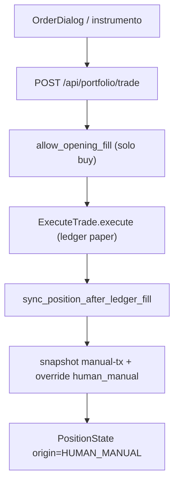
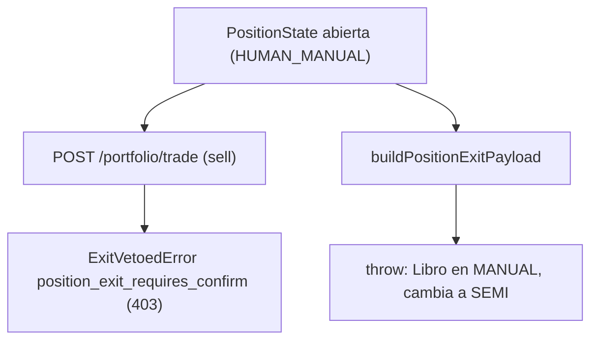

# Auditoría profunda — modo **MANUAL** del libro DEMO

> **AsOf:** 2026-10-07 · **Estado:** **AUDITORÍA EN SOLO LECTURA** (no es código, no es un sello de release).
> **Base auditada:** `main` en `3aa0241e` (sello [`v2.88.84-beta`](./evidence/v2.88.84/README.md), `origin/main`).
> **Padres:** [brief de modos DEMO](./demo-operating-modes-brief-2026-08-03.md) · [estudio operativa auto y gráfico](./estudio-operativa-auto-y-grafico-2026-08-28.md) · [ADR-034](./../adr/034-operational-integrity-continuity.md) · [ADR-035](./../adr/035-operational-reliability.md) · [spec de operación para usuario básico](./spec-auto-operacion-usuario-basico-2026-10-06.md).
> **Compañera:** [spec de la UI AUTO definitiva](./spec-auto-ui-definitiva-2026-10-07.md) (mismo ciclo de trabajo, áreas distintas).
> **Naturaleza:** auditoría de producto y flujo operativo. **`Δ AUTO decision/execution motor = 0`**. No toca motor, umbrales, contrato HTTP ni Alembic.

Esta auditoría cierra el tramo que quedaba pendiente tras la serie de auditorías de AUTO: el **modo MANUAL** del libro DEMO, que hasta ahora sólo estaba descrito de forma incidental (brief de 2026-08-03 y tabla de modos de 2026-08-28) y nunca se había recorrido contra el código real.

---

## 0. Pregunta

¿Puede un usuario en modo MANUAL abrir **y cerrar** una operación de principio a fin sin salir del flujo previsto, sin confundir intención con hecho, sin que la app le oculte un bloqueo, y sabiendo siempre que opera dinero simulado?

La respuesta corta es **parcialmente**: la **apertura** es completa y honesta; el **cierre** de una posición abierta en MANUAL **no tiene camino dentro de la app** (hallazgo H1).

---

## 1. Qué es MANUAL realmente

MANUAL **no es un motor ni un canal de ejecución**: es un **interruptor de producto** a nivel de cuenta que decide quién puede alimentar la cola de Confirm (SEMI). En el código es un estado del libro DEMO:

- [apps/web/src/features/trading/demo-book-prefs.ts](../../apps/web/src/features/trading/demo-book-prefs.ts) define `DemoBookMode = "manual" | "semi" | "auto"` y las compuertas:

```ts
// demo-book-prefs.ts
export function demoBookAllowsEnqueueConfirm(mode: DemoBookMode): boolean {
  return mode === "semi";
}
export function demoBookAllowsExecute(mode: DemoBookMode): boolean {
  return mode === "semi";
}
export function demoBookRequiresHumanConfirm(mode: DemoBookMode): boolean {
  return mode === "semi";
}
export function demoBookRequiresEstudioMembership(mode: DemoBookMode): boolean {
  return mode === "semi" || mode === "auto";
}
```

- El control de modo vive en [apps/web/src/features/trading/demo-book-mode-panel.tsx](../../apps/web/src/features/trading/demo-book-mode-panel.tsx) (pista `MODE_HINT.manual = "Tú operas desde el gráfico; sin cola de propuestas"`), se monta desde Config de cuenta ([apps/web/src/features/accounts/account-detail-panel.tsx](../../apps/web/src/features/accounts/account-detail-panel.tsx)) y se muestra como badge `OPERATIVA: Manual` en [apps/web/src/features/trading/trading-status-bar.tsx](../../apps/web/src/features/trading/trading-status-bar.tsx) (enlace a Config).
- La postura derivada está en [apps/web/src/features/trading/resolve-paper-auto-posture.ts](../../apps/web/src/features/trading/resolve-paper-auto-posture.ts) y [packages/shared/src/cognitive/paper-auto-posture.ts](../../packages/shared/src/cognitive/paper-auto-posture.ts): en MANUAL `requiresHumanConfirm = false` y `autoActive = false`.

**Consecuencia clave:** MANUAL sólo **suprime** el canal SEMI. **No** gobierna la vía HTTP directa de compra/venta, que es mode-agnóstica (§4.1). Esto es coherente con el brief («MANUAL = vigilancia + aviso; sin fill DEMO salvo orden humana explícita») pero tiene un efecto colateral no deseado en el cierre (§5).

---

## 2. Línea base

- El árbol de **código** está limpio; `main` = `origin/main` = `3aa0241e` (`v2.88.84-beta`).
- No hay deriva local de código: esta auditoría se hace sobre el árbol del sello. El único cambio es la incorporación de este documento (y su [spec compañera](./spec-auto-ui-definitiva-2026-10-07.md)), que no toca código.
- No se re-mide DÍA-D ni se re-ejecuta CI: los hechos citados provienen del código y de los tests existentes.

---

## 3. Superficies de entrada

| Superficie | Fichero | Rol |
| --- | --- | --- |
| Diálogo de orden | [apps/web/src/features/trading/order-dialog.tsx](../../apps/web/src/features/trading/order-dialog.tsx) | Compra/venta manual (mercado o pendiente) vía `api.executeTrade` |
| Detalle de instrumento | [apps/web/src/features/instruments/instrument-detail-page.tsx](../../apps/web/src/features/instruments/instrument-detail-page.tsx) | Botones `Comprar`/`Vender` → mismo `api.executeTrade` |
| Panel DECISIÓN / cockpit | [apps/web/src/features/trading/trading-operativa-panel.tsx](../../apps/web/src/features/trading/trading-operativa-panel.tsx), [apps/web/src/features/trading/operativa-cockpit-card.tsx](../../apps/web/src/features/trading/operativa-cockpit-card.tsx) | En MANUAL, CTAs de proponer/encolar Confirm deshabilitados |
| Mesa / Hoy | [apps/web/src/features/mesa/](../../apps/web/src/features/mesa/) | Lectura (candidatas, posiciones, libro); «Prepare» abre Confirm (SEMI) |
| Confirm | [apps/web/src/features/confirm/](../../apps/web/src/features/confirm/) | **Firma humana SEMI**; MANUAL no puede encolar aquí |
| Salida de posición | [apps/web/src/features/operations/propose-position-exit.ts](../../apps/web/src/features/operations/propose-position-exit.ts), [apps/web/src/features/trading/position-exit-drawer-actions.tsx](../../apps/web/src/features/trading/position-exit-drawer-actions.tsx) | Construye el ticket de desriesgo (sólo SEMI) |

Rutas relevantes: [apps/web/src/app.tsx](../../apps/web/src/app.tsx) (`/mesa`, `/trading`, `/confirm`, `/accounts`, `/auto*`) y [apps/web/src/lib/routes.ts](../../apps/web/src/lib/routes.ts).

---

## 4. Cadena end-to-end de una operación MANUAL

### 4.1 Apertura (compra)



| Peldaño | Traza | Fichero | Medido / hueco |
| --- | --- | --- | --- |
| Intención del usuario | Diálogo de orden | `order-dialog.tsx` (`tradeMutation` → `api.executeTrade`) | Sin compuerta de modo (mode-agnóstico) |
| Endpoint | `POST /portfolio/trade` | [apps/api-python/src/bolsa_api/api/v1/routes/portfolio.py](../../apps/api-python/src/bolsa_api/api/v1/routes/portfolio.py) | Sí |
| Risk gate (apertura) | `allow_opening_fill` → `check_opening` | [packages/py/application/src/bolsa_application/opening_permission.py](../../packages/py/application/src/bolsa_application/opening_permission.py) | Sí (fail-closed: cesta, frescura DS-05, mandato DS-03, recon, kill-switch) |
| Ejecución | `ExecuteTrade.execute` | [packages/py/application/src/bolsa_application/accounts/trade.py](../../packages/py/application/src/bolsa_application/accounts/trade.py) | Sí (ledger interno; sin broker real) |
| Materialización / sync | `sync_position_after_ledger_fill` | [packages/py/application/src/bolsa_application/post_fill_position_sync.py](../../packages/py/application/src/bolsa_application/post_fill_position_sync.py) | Sí: `trade_plan_snapshot=None` ⇒ `build_human_manual_trade_plan_snapshot` (`decisionId = "manual-{tx}"`) y `override_reason = "human_manual"` |
| Posición | `PositionState` `origin = HUMAN_MANUAL` | `post_fill_position_sync.py` (`HUMAN_MANUAL_OVERRIDE = "human_manual"`) | Sí |

Nota de honestidad: la vía HTTP **no** pasa por `risk_signature`/`exit_permission` (esos viven en el canal SEMI Confirm). El `venue` sólo alimenta el veto de apertura (recon LIVE); no enruta a broker real (§7).

### 4.2 Cierre (venta) — aquí está el problema



- **Venta HTTP cercada.** En [packages/py/application/src/bolsa_application/execute_gated_portfolio_trade.py](../../packages/py/application/src/bolsa_application/execute_gated_portfolio_trade.py), una venta con `PositionState` abierta se rechaza:

```python
elif side == "sell" and self._position_from_exit is not None:
    # V1.32 — Position abierta ⇒ Confirm SEMI (ExitPermission), no HTTP.
    row = await self._position_from_exit.get_open(account_id or "", instrument_id)
    if row is not None:
        raise ExitVetoedError("position_exit_requires_confirm")
```

  Que la ruta traduce a `403` en `portfolio.py` (`except ExitVetoedError ... HTTPException(status_code=403)`).

- **Encolar Confirm es imposible en MANUAL.** [apps/web/src/features/operations/propose-position-exit.ts](../../apps/web/src/features/operations/propose-position-exit.ts) lanza antes de construir el ticket:

```ts
if (!demoBookAllowsEnqueueConfirm(book.mode)) {
  throw new Error(
    "Libro en MANUAL: cambia a SEMI en Operativa → Configuración para encolar Confirm.",
  );
}
```

  Y [apps/web/src/features/trading/position-exit-drawer-actions.tsx](../../apps/web/src/features/trading/position-exit-drawer-actions.tsx) captura ese error en `enqueueExit` y lo pinta como `setError(...)`, sin ofrecer una salida alternativa.

Es decir: la **apertura** manual crea una posición que **después** queda cercada para la venta HTTP, y el único camino de cierre (Confirm SEMI) está deshabilitado en MANUAL. El usuario queda con un error en pantalla y **sin acción posible dentro de la app**.

---

## 5. Hallazgos

| # | Severidad | Hallazgo | Evidencia | Veredicto |
| --- | --- | --- | --- | --- |
| **H1** | **P1 funcional** | **La posición abierta en MANUAL no se puede cerrar desde la app.** Venta HTTP cercada (`position_exit_requires_confirm`) + Confirm no encolable en MANUAL (`buildPositionExitPayload` lanza). | `execute_gated_portfolio_trade.py` (fence sell), `portfolio.py` (403), `propose-position-exit.ts` (throw), `position-exit-drawer-actions.tsx` (`setError`) | **Gap real.** No es un fallo de motor (el motor hace lo correcto), es un **hueco de producto**: la ruta de cierre manual no está definida. |
| **H2** | P2 | **La vía de compra/venta manual no consulta el modo del libro.** `order-dialog.tsx` e `instrument-detail-page.tsx` no leen `demo-book-prefs`; la compuerta de modo sólo se aplica al canal Confirm. | `order-dialog.tsx` (`api.executeTrade`), `demo-book-prefs.ts` | Coherente con «MANUAL = HTTP trade», pero deja el modo sin efecto sobre la ejecución directa. Documentar como decisión, no como bug. |
| **H3** | P2 | **El bloqueo se comunica como error genérico.** En MANUAL, el CTA de salida y el intento de venta producen un `Error`/`403` sin copy de recuperación explícita («estás en MANUAL; pasa a SEMI para desriesgo»). | `position-exit-drawer-actions.tsx`, `order-dialog.tsx` (`onError`) | Mejora de UX honesta; hoy el usuario deduce la causa. |
| **H4** | OK | **MANUAL no alcanza broker real.** Toda la ejecución manual escribe en el ledger paper/DEMO. | `accounts/trade.py` (sólo portfolio/ledger), `execute_gated_portfolio_trade.py` (`_resolve_broker_venue` sólo alimenta el veto) | Correcto. |
| **H5** | OK | **Apertura manual con identidad honesta.** `origin = HUMAN_MANUAL`, `override_reason = human_manual`, snapshot `manual-{tx}` (no se inventa un plan IA). | `post_fill_position_sync.py` | Correcto y bien trazado. |
| **H6** | OK | **MANUAL exento de membresía Estudio** (puede operar sin meter el valor en el universo). | `demo-book-prefs.ts` (`demoBookRequiresEstudioMembership`) | Correcto y documentado. |

### 5.1 Hipótesis confirmada

La hipótesis de trabajo —«en MANUAL se puede abrir pero no cerrar»— se **confirma**. No existe, en el árbol auditado, ninguna ruta (UI o endpoint) que permita cerrar una posición abierta permaneciendo en modo MANUAL.

---

## 6. Cobertura de tests

**Cubierto**

- Compuertas de modo: `apps/web/src/features/trading/demo-book-prefs.test.ts`, `semi-demo-operativa.test.ts`, `demo-book-mode-panel.test.tsx`.
- MANUAL bloquea proponer/encolar: `propose-instrument-supervised.test.ts`, `propose-position-exit.test.ts`, `chart-stop-drag-commit.test.ts`, `operativa-cockpit-card.test.tsx`.
- Vía HTTP manual y materialización: `packages/py/application/tests/test_execute_gated_portfolio_trade.py` (incluye la cerca de venta), `test_post_fill_position_sync.py`, `test_persist_position_from_fill.py` (`human_manual`), `apps/api-python/tests/integration/test_portfolio_trade_opening_gate.py`, tests de idempotencia.

**No cubierto (gaps)**

- El **dead-end de salida** (H1): hay test del *fence* de backend, pero **ningún test de UI/integración** que afirme que en MANUAL no se puede cerrar, ni copy de recuperación.
- `OrderDialog`, `TradeConfirmPanel` y la ruta de compra/venta manual: **sin tests**.
- Ningún E2E recorre el flujo MANUAL (los E2E existentes son SEMI/AUTO mock).

---

## 7. Separación real vs simulación

MANUAL es **siempre** dinero simulado:

- `ExecuteTrade.execute` escribe únicamente en `portfolio_repo.execute_trade` + `ledger_repo.append_*`; **no** hay `IBrokerAdapter.submit` en este camino (la sumisión a broker vive en el canal SEMI Confirm).
- `_resolve_broker_venue` en `execute_gated_portfolio_trade.py` se usa **sólo** para alimentar el veto de recon LIVE en `allow_opening_fill`; no enruta la orden.
- `PAPER_D_EXECUTE` (camino AUTO) no interviene en MANUAL.

Único efecto adyacente a LIVE: con `venue = live`, la compuerta de apertura falla cerrado si la reconciliación LIVE no está sana. No hay, en ningún caso, ejecución real desde MANUAL.

---

## 8. Afirmaciones prohibidas (verificadas como ausentes)

1. «MANUAL ejecuta contra XTB / broker real» — **no ocurre** (ledger paper).
2. «MANUAL puede cerrar una posición abierta» — **no ocurre** hoy (H1).
3. «El modo MANUAL gobierna la compra/venta HTTP» — **no ocurre** (H2; sólo gobierna el canal Confirm).
4. «La compra manual ignoró el risk gate» — **no ocurre** (las compras pasan por `allow_opening_fill`).

---

## 9. Falsabilidad de esta auditoría

| # | Afirmación | Cómo se rompe |
| --- | --- | --- |
| 1 | En MANUAL, una venta HTTP con `PositionState` abierta devuelve `403 position_exit_requires_confirm`. | Que `execute_gated_portfolio_trade.py` deje de lanzar `ExitVetoedError` para `side == "sell"` con posición abierta. |
| 2 | En MANUAL, `buildPositionExitPayload` lanza en vez de encolar. | Que `demoBookAllowsEnqueueConfirm("manual")` devuelva `true`. |
| 3 | La compra/venta manual no consulta el modo del libro. | Que `order-dialog.tsx` o `instrument-detail-page.tsx` importen y apliquen `demo-book-prefs`. |
| 4 | MANUAL no alcanza broker real. | Que la vía HTTP manual llame a un adaptador de broker. |
| 5 | La apertura manual sella `origin = HUMAN_MANUAL`. | Que `sync_position_after_ledger_fill` deje `trade_plan_snapshot=None` sin sintetizar snapshot `manual-{tx}`. |

---

## 10. Conclusión y recomendaciones (no implementadas)

MANUAL está **bien definido en su semántica** (interruptor de producto, no motor), **bien trazado en la apertura** (identidad `HUMAN_MANUAL`, sin broker real) y **honesto en su money banner**. El hallazgo **H1** es el único de severidad alta: la asimetría abrir-sí / cerrar-no deja al usuario sin salida dentro de la app.

Opciones de diseño a decidir por producto (esta auditoría **no** las implementa):

1. **Permitir el cierre manual HTTP** con la misma identidad `HUMAN_MANUAL` (relajar el fence sólo para posiciones cuyo `origin` sea manual, manteniendo el fence para las de SEMI/AUTO).
2. **Habilitar Confirm para desriesgo en MANUAL** (permitir encolar únicamente tickets de salida/reduce, no de apertura).
3. **Declarar el límite explícitamente** si se decide no habilitar ninguna de las anteriores: copy de recuperación que diga que en MANUAL la posición se cierra pasando a SEMI, sin presentarlo como error.

Cualquiera de las tres exige su propio slice (con tests de UI/backend y, si toca el fence, revisión de `Δ motor`) y **no** se cierra en esta auditoría.

Complementos de menor severidad: copy de recuperación para H3 y cobertura de tests del diálogo de orden manual.

---

## 11. Addendum post-auditoría (slices posteriores)

> Este apartado se añade **después** de la auditoría; no reescribe el cuerpo original. Registra el estado de cierre de H1/H3 tras los slices que la siguieron.

- **`v2.88.85-beta` — H1 backend + H3 (copy).** Se implementó la opción 1 para el **backend**: `row_is_human_manual` autoriza la venta HTTP de una posición nacida por el canal manual (`origin = HUMAN_MANUAL`, snapshot `manual-{tx}`), manteniendo el fence para SEMI/AUTO. En cliente se mejoró el copy de recuperación (H3) para dirigir a **Vender**. Evidencia: [`evidence/v2.88.85`](./evidence/v2.88.85/README.md).
- **Cierre H1 UX (posterior a `v2.88.85-beta`).** La superficie de posición ([`position-exit-drawer-actions.tsx`](../../apps/web/src/features/trading/position-exit-drawer-actions.tsx)) ya no se limita a decir «usa Vender»: con el libro en MANUAL y una posición `HUMAN_MANUAL`, **Reducir/Salir abren el flujo Vender canónico** (`OrderDialog`, [`open-sell-position-order.ts`](../../apps/web/src/features/trading/open-sell-position-order.ts)) con la cantidad de desriesgo. No mueve el motor ni el contrato HTTP (`Δ motor = 0`).

Con esto, **H1 queda cerrado en backend y en la UX de la superficie de posición** (el resto de superficies de salida, p. ej. `MesaPositionNextActionButton`, se tratan aparte). MANUAL sigue siendo un interruptor de producto y nunca alcanza broker real (§7).

Esto **no** sella una nueva versión por sí solo: el bump/tag/CI de este slice de UX es un paso de release aparte. La auditoría del motor AUTO/SEMI permanece como estaba.
