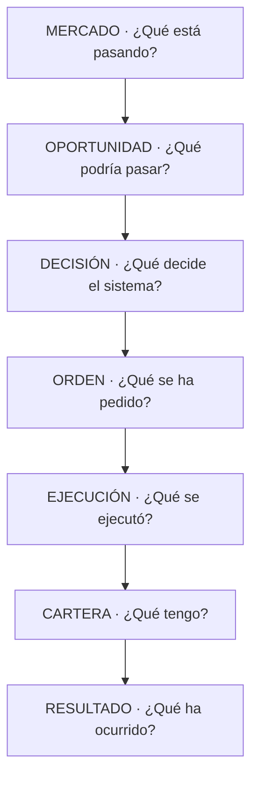

# Mapa de problemas UI 5.0 — toda la aplicación sobre `v2.88.89-beta`

> **AsOf:** 2026-10-08 · **Estado:** **AUDITORÍA EN SOLO LECTURA** (no es código, no es un sello).
> **Base:** tag `v2.88.89-beta` (commit `b9557c21`), `Δ motor = 0`, contrato HTTP sin cambio, head Alembic `052_top3_opportunities`.
> **Padres:** [UI Contract 5.0](./spec-ui-contract-5-0-2026-10-08.md) · [ADR-045](../adr/045-ui-contract-5-0.md) · [auditoría UI global v2.88.87](./auditoria-ui-global-v2.88.87-2026-10-08.md) · [spec AUTO UI definitiva](./spec-auto-ui-definitiva-2026-10-07.md) · [ADR-040](../adr/040-user-information-architecture.md) · [ADR-044](../adr/044-auto-workspace-information-architecture.md) · [domain-language](../domain-language.md).
> **Naturaleza:** UI / producto / semántica. **No** se audita motor, backend ni contrato HTTP. **No** se toca código en este slice.
> **Sucesor:** [plan único UI 6.0](./plan-ui-6-0-2026-10-08.md).

---

## 0. Pregunta

`v2.88.88-beta` y `v2.88.89-beta` implementaron la estructura de UI Contract 5.0 (HOME cockpit, escalera, insignia de modo, `AdminRail` en tres grupos, TOP3). Con AUTO ya coherente **por dentro**, la pregunta es otra:

> ¿Qué información **NO** debe enseñarse al usuario básico, y dónde el contrato ya congelado **no está aplicado** fuera de AUTO?

La hipótesis de trabajo, confirmada por esta auditoría, es doble:

1. **El problema ya no es falta de información; es exceso de información correcta.** Quedan **fugas de deduplicación** y **pantallas que explican cómo está construido el sistema** en vez de su resultado.
2. **El contrato está aplicado en AUTO y en casi ningún otro sitio.** `Sin dato todavía` existe, pero solo dentro de `features/auto`; el resto de la app sigue usando `—`, `NO MEDIDO`, `Sin datos` o `0`.

---

## 1. Método, base y estado real

### 1.1 Superficies auditadas

| Grupo | Superficies | Rutas |
| --- | --- | --- |
| Barra administrativa | `AdminRail` | (global) |
| Chrome global | `AppTopBar`, `TradingStatusBar`, command palette | (global) |
| L1 de producto | Hoy · Mercado · Cartera · Asesor · Laboratorio | `/mesa`, `/trading`, `/mesa?view=posiciones`+`/history`, `/research`, `/backtests` |
| Espacio AUTO | Resumen · Operar · Actividad · Cartera · Riesgo · Análisis · Sistema | `/auto`, `/auto/operar`, `/auto/actividad`, `/auto/cartera`, `/auto/riesgo`, `/auto/analisis`, `/auto/sistema` |
| Detalle | Ficha universal · Monitor experto · Operación | `/auto/operar/operacion/:cycleId`, `/auto-monitor` |
| Firma | Confirmar (LIVE-VIRTUAL) | `/confirm` |
| Diagnóstico | Consola avanzada | `/operational-console` |

Fuente de labels/rutas: [`daily-nav.ts`](../../apps/web/src/features/confirm/daily-nav.ts) (L1), [`auto-nav.ts`](../../apps/web/src/features/auto/auto-nav.ts) (AUTO). Sub-navegación montada por [`auto-workspace-layout.tsx`](../../apps/web/src/components/layout/auto-workspace-layout.tsx); grafo en [`app.tsx`](../../apps/web/src/app.tsx).

### 1.2 Cuatro capas de auditoría

1. **UI global** (chrome + cinco puertas).
2. **AUTO** (las siete secciones y qué ve un básico).
3. **Modelo mental de la operativa** (Mercado → … → Resultado; AUTO/MANUAL/SEMI; SIMULADO/LIVE).
4. **Problemas todavía abiertos** (duplicidades, sobra/falta, ambigüedad, acción-vs-navegación, jerga, inconsistencias de modo).

### 1.3 Correcciones a la línea base (dónde el borrador previo ya no aplica)

| Afirmación previa | Estado real verificado |
| --- | --- |
| «La HOME todavía tiene las seis preguntas» | **Falso.** Se retiraron; el test [`auto-home-page.test.tsx`](../../apps/web/src/features/auto/auto-home-page.test.tsx) verifica que los seis textos **no** aparecen. Solo sobrevive el **lenguaje residual** (`auto-home-page.tsx:163`, `auto-nav.ts:74`). |
| «Riesgo mantiene las cuatro cajas Sin dato todavía» | **Parcialmente falso.** Las cuatro filas se colapsaron (spec `DONE`); persiste el **veredicto + 3 campos** que aún pueden repetir el hueco, más un segundo literal distinto (`"todavía no están disponibles"`). |
| «`AdminRail` mezcla sin agrupar» | **Falso.** Ya tiene tres grupos (`Producto`/`Administración`/`Diagnóstico`). El residuo es que `Producto` incluye `Overview` y hay una acción-stub que parece navegación. |
| «`Sin dato todavía` es el estándar» | **Solo dentro de AUTO.** Fuera de AUTO, `—` sigue siendo el estado de-facto (~100 ficheros). |

**Conclusión de base:** el contrato no falta; **falta aplicarlo al resto de la app** y **cerrar fugas semánticas** (doble activo, segunda escalera, modo/canal).

---

## 2. Capa 1 — UI global (chrome y cinco puertas)

### 2.1 `AppTopBar` — [`app-top-bar.tsx`](../../apps/web/src/components/layout/app-top-bar.tsx)

- **Propósito:** cabecera global única: historial SPA, cinco puertas L1, toggles del panel de Mercado y clúster derecho (palette, alertas, universo, cuenta, workspace, ayuda, config, sesión).
- **Fugas a primer nivel:** selector de layout nombrado, tres toggles de paneles, reset, «abrir en otra pestaña», pista `⌘K` (`:521-616`).
- **Duplicidades:** `Configuración` aparece **dos veces** (`:357` en menú de sesión y `:682`) y `Notificaciones` **dos veces** (`:353`, `:374`); `Alertas` como campana y como ítem de Mercado.
- **Estado ambiguo (P0 de jerarquía):** en `/mesa?view=posiciones` **`Hoy` y `Cartera` se pintan activas a la vez**. `isHoyRoute = pathname.startsWith("/mesa")` (`:322`) alimenta `isActive || isHoyRoute` (`:442`), mientras `isCarteraRoute` (`:324-327`) también es cierta → `active={isCarteraRoute}` (`:478`).
- **Nav que parece acción:** `Hoy` lleva badge rojo de «pendientes de firma» — un contador de tareas sobre navegación.

### 2.2 `AdminRail` — [`admin-rail.tsx`](../../apps/web/src/components/layout/admin-rail.tsx)

- **Propósito:** rail administrativa/técnica colapsable.
- **Estructura:** `PRODUCTO: Overview` · `ADMINISTRACIÓN: Cuentas, Perfiles, Estadísticas, Fiscal, AUTO` · `DIAGNÓSTICO: Consola avanzada`.
- **Residuo:** `Estadísticas · pronto` es un botón con aspecto de navegación que dispara `window.alert` (`:249-259`); `Consola avanzada` vive siempre visible. Decisión del estudio: la rail queda **solo administrativa/técnica**, sin duplicar las cinco puertas.

### 2.3 `TradingStatusBar` — [`trading-status-bar.tsx`](../../apps/web/src/features/trading/trading-status-bar.tsx)

- Endpoint crudo, abreviaturas `Pat./Disp./Ops./P&L/Pos.` y `PAPER_D_EXECUTE` en tooltip (`:52-59`, `:138-140`, `:171`). El selector de cuenta reaparece aquí (≥4 sitios en total).

### 2.4 Command palette — [`command-registry.ts`](../../apps/web/src/features/command-palette/command-registry.ts)

- Mezcla en un mismo listado navegación, configuración, densidad, tema y layout (`:142-209`); todo es un único `PlatformCommand.run`, así que **navegación, toggles y modales son indistinguibles**.

### 2.5 Las cinco puertas L1

| Puerta | Pregunta | Problema | Evidencia |
| --- | --- | --- | --- |
| **Hoy** `/mesa` | ¿Qué hago? | 5 roles en una ruta; jerga `Ranking ≠ BUY` en primer nivel; `Consola` duplicada | [`mesa-hoy-page.tsx`](../../apps/web/src/features/mesa/mesa-hoy-page.tsx) · [`daily-desk-inbox.tsx`](../../apps/web/src/features/mesa/daily-desk-inbox.tsx) |
| **Mercado** `/trading` | ¿Qué ocurre? | Sin `h1` visible; `DECISIÓN` y toolbar avanzada en primer nivel; acción junto a info | [`chart-workspace-page.tsx`](../../apps/web/src/features/charts/chart-workspace-page.tsx) · [`platform-shell.tsx`](../../apps/web/src/components/layout/platform-shell.tsx) |
| **Cartera** | ¿Qué tengo? | **No es ruta**: vista de `/mesa`; `Libro`/`Cartera`/`Historial`/`Posiciones` nombran lo mismo | [`daily-nav.ts`](../../apps/web/src/features/confirm/daily-nav.ts) · [`mesa-positions-summary.tsx`](../../apps/web/src/features/mesa/mesa-positions-summary.tsx) |
| **Asesor** `/research` | ¿Por qué? | Jerga estadística en primer nivel (`Total trials`, `K`, `Sharpe`, `preset`, `proposedBy`, JSON `Params`); nav ≠ tabs | [`research-page.tsx`](../../apps/web/src/features/research/research-page.tsx) |
| **Laboratorio** `/backtests` | ¿Qué aprendemos? | `Laboratorio` ≠ `h1 Backtesting`; `DÍA-D`/`Lista AUTO`/`CORE-R`/`WFE`/`PBO`/`DSR` | [`backtests-page.tsx`](../../apps/web/src/features/backtests/backtests-page.tsx) |

---

## 3. Capa 2 — AUTO (qué ve un básico)

Nav visible ya correcta (`UI5-03`): `Resumen · Operar · Cartera · Actividad` + `<details>` «Más información» con `Riesgo · Análisis · Sistema` ([`auto-workspace-layout.tsx`](../../apps/web/src/components/layout/auto-workspace-layout.tsx)).

| Sección | Problema | Sev. | Evidencia |
| --- | --- | --- | --- |
| **Resumen** | `SIMULACIÓN — DINERO VIRTUAL` pintado **dos veces** (reality strip global + chip local); estado/reloj **repetidos con Sistema**; hasta **6 huecos** simultáneos; `Ver todas las operaciones` colgando de **Oportunidades** (mezcla oportunidad ≠ operación) | P0/P1 | [`auto-home-page.tsx`](../../apps/web/src/features/auto/auto-home-page.tsx) · [`auto-reality-strip.tsx`](../../apps/web/src/features/auto/auto-reality-strip.tsx) · [`auto-account-figures.ts`](../../apps/web/src/features/auto/auto-account-figures.ts) |
| **Operar** | Copy promete «elegir una oportunidad / abrir una operación» y la pantalla es read-only | P1 | [`auto-copy.ts`](../../apps/web/src/features/auto/auto-copy.ts) |
| **Actividad** | — | 🟢 | [`auto-actividad-page.tsx`](../../apps/web/src/features/auto/auto-actividad-page.tsx) |
| **Cartera** | Banner de «misma cuenta» correcto; fuga `Historial · ledger y fills` en primer nivel | P1 | [`auto-cartera-page.tsx`](../../apps/web/src/features/auto/auto-cartera-page.tsx) |
| **Riesgo** | Veredicto-first correcto, pero **veredicto + 3 campos** pueden repetir hueco; **`NO MEDIDO`** en el `h1` vs `Sin dato todavía` en el cuerpo; un tercer literal `"todavía no están disponibles"` | P0/P1 | [`auto-riesgo-page.tsx`](../../apps/web/src/features/auto/auto-riesgo-page.tsx) · [`auto-risk-summary.ts`](../../apps/web/src/features/auto/auto-risk-summary.ts) · [`auto-copy.ts`](../../apps/web/src/features/auto/auto-copy.ts) |
| **Análisis** | `ledger científico`/OOS en cuerpo; tabs-pregunta correctas | P2 | [`auto-analisis-page.tsx`](../../apps/web/src/features/auto/auto-analisis-page.tsx) |
| **Sistema** | Correcto en segundo nivel, pero **repite estado y reloj de decisión de la HOME** | P1/P2 | [`auto-sistema-page.tsx`](../../apps/web/src/features/auto/auto-sistema-page.tsx) |

**Básico vs oculto (AUTO):**

- **Primer nivel:** veredicto humano, una frase, oportunidades (resumen), decisión declarada, operación en curso, dinero `SIMULADO`, y «no necesitas hacer nada».
- **Segundo nivel («Más información» / «¿Por qué?»):** `Riesgo`, `Análisis`, `Sistema`, motivos y contexto.
- **Tercer nivel (auditoría):** `runId`, `cycleId`, `heartbeat`, reconciliación, broker/ejecución, `reasons` crudos.

---

## 4. Capa 3 — Modelo mental de la operativa

### 4.1 Cadena canónica



Sobre esta cadena, `AUTO` / `MANUAL` / `SEMI` son **modos de operación**, y `SIMULADO` / `LIVE` son **canales de dinero** — nunca universos distintos.

### 4.2 Distinción irrenunciable

```
Oportunidad ≠ Decisión ≠ Orden ≠ Fill ≠ Posición ≠ Resultado
```

- `NVIDIA #1` significa «primer puesto del ranking», **no** «comprar NVIDIA».
- «Orden enviada» solo con evidencia de envío; «Ejecución completada» solo con fill; «Posición creada» solo con materialización.

### 4.3 Rupturas detectadas

1. **Segunda escalera divergente en Confirm** ([`live-virtual-order-gateway.tsx`](../../apps/web/src/features/confirm/live-virtual-order-gateway.tsx)): peldaños en **inglés crudo** `proposed / signed / submitted / filled* | rejected | not_wired` (`:54`, `:100`) con `submitted ≠ fill real` (`:106`). Rompe `UI5-09`/`UI5-20` **en primer nivel**.
2. **Tercera escalera** en la cabina de operador ([`operator-cabin-ui.tsx`](../../apps/web/src/features/trading/operator-cabin-ui.tsx)): «Salida final» se marca `active` sin evidencia.
3. **Salto sin materialización**: un ciclo `closed` va directo a `position_closed` ([`auto-operation-ladder.ts`](../../apps/web/src/features/auto/auto-operation-ladder.ts)).
4. **Conceptos fundidos**: `simulation` + `position` en un solo valor de la ficha ([`auto-operation-sheet.ts`](../../apps/web/src/features/auto/auto-operation-sheet.ts)); `Decisión` + `Ejecución` bajo la columna `Salida` ([`operations-panel.tsx`](../../apps/web/src/features/trading/operations-panel.tsx)).
5. **Modo/canal inconsistentes**: `AUTO/SIMULADO` (canónico) vs `Auto/Semi/Manual` (title case) vs `Paper/Live` vs `DEMO/DINERO VIRTUAL/PAPER REAL`; `ModeBadge` solo sistemática en `operations-panel`.

---

## 5. Capa 4 — Problemas todavía abiertos (transversal)

### 5.1 Duplicidades

Estado AUTO (HOME + Sistema) · chip SIMULACIÓN (×2) · cuenta (≥4) · `Oportunidades` (Hoy/AUTO/Mercado/Lab) · `Consola` (Hoy + rail + menú) · `Historial`/`ledger` (Cartera + Sistema + nav).

### 5.2 Información que sobra

Toolbar avanzada permanente en el chrome; `—` globales; jerga `Risk Gate`, `Heartbeat`, `fill links`, `runId`, `ledger`, `provenance`, `WFE/PBO/DSR/campeón`.

### 5.3 Información que falta

Copy que explique la relación `Hoy` (universo completo) vs `AUTO` (subconjunto que AUTO usa) de forma única; el resto son huecos **declarados a propósito** (decisión de cartera durable).

### 5.4 Estados ambiguos

`Hoy`+`Cartera` activos a la vez; `Mercado`+campana activos en `/alerts`; `OPERATIVA: Auto` vs `DEMO_BOOK_AUTO_UNAVAILABLE`.

### 5.5 Botones que parecen navegación / navegación que parece acción

- **Botón que parece nav:** `Estadísticas · pronto` (alert), tabs de Análisis/Asesor (botones que cambian URL), `Cerrar` en outcomes (muta datos), `Replay completo (Ayuda)`.
- **Nav que parece acción:** badge rojo sobre `Hoy`; chips de ciclo que reescriben la URL; `Ver tesis` y `Proteger/Salir` con el mismo estilo.
- **Acción junto a info:** `Comprar/Vender` junto a chips de estado en la barra del gráfico.

### 5.6 Conceptos demasiado técnicos en nivel 1

`Risk Gate`, `Heartbeat`, `Reconciliación OI-6 / LR-1`, `fill links`, `runId`, `órdenes UNKNOWN`, `ledger y fills`, `ledger científico`, `provenance`, `Total trials`, `K consumido`, `preset`, `proposedBy`, `campaignId`, JSON `Params`/`Manifest`, `DÍA-D`, `Lista AUTO`, `CORE-R`, `WFE`, `PBO`, `DSR`.

### 5.7 Inconsistencias AUTO / MANUAL / SEMI

Casing (`MANUAL/SEMI/AUTO` vs `Manual/Semi/Auto`); canal omitido en varias superficies; insignia de modo no sistemática fuera de `operations-panel`.

### 5.8 Puntos de interpretación errónea

`ranking → compra` (mitigado en AUTO, no garantizado global); `Cartera = segunda cartera` (mitigado en AUTO Cartera, no en L1); `precio aplicado = posición` (protegido en AUTO, no en Mesa/Confirm).

---

## 6. Mapa de problemas UI 5.0 — pantalla a pantalla

| # | Pantalla | Problema principal | Sev. | Solución conceptual |
| --- | --- | --- | --- | --- |
| 01 | `Hoy` `/mesa` | 5 roles en una ruta; jerga en L1; `Consola` duplicada | P1 | Cockpit de inbox; jerga a «Avanzado» |
| 02 | `Mercado` `/trading` | sin `h1`; toolbar avanzada y `DECISIÓN` en L1; acción junto a info | P1/P2 | Un `h1`; separar acción/info |
| 03 | `Cartera` | no es ruta; `Libro/Cartera/Historial/Posiciones` | P1 | Una única verdad + rotular `SIMULADA` |
| 04 | `Asesor` `/research` | jerga estadística en L1; nav ≠ tabs | P1 | Veredicto «por qué» + detalle plegado |
| 05 | `Laboratorio` `/backtests` | `Laboratorio` ≠ `Backtesting`; stats | P2/P1 | Renombrar coherente; ocultar stats |
| 06 | `AUTO Resumen` | chip ×2; estado duplicado; 6 huecos; enlace mal ubicado | **P0/P1** | Cockpit real; hueco único |
| 07 | `AUTO Operar` | promete acción inexistente | P1 | Corregir copy a read-only |
| 08 | `AUTO Actividad` | — | 🟢 | Mantener |
| 09 | `AUTO Cartera` | `ledger y fills`; acción/nav mezcladas | P1 | Lenguaje humano |
| 10 | `AUTO Riesgo` | 4× hueco; `NO MEDIDO` vs `Sin dato todavía` | **P0/P1** | Veredicto único + un hueco |
| 11 | `AUTO Análisis` | `ledger científico`; OOS | P2 | Nivel 2 |
| 12 | `AUTO Sistema` | repite estado/reloj de HOME | P1/P2 | Solo diagnóstico |
| 13 | `Operación / ficha` | densa; 3 nombres de «detalle técnico» | P2 | Un solo «Detalle técnico» |
| 14 | `Confirmar` | **2ª escalera en inglés**; `sin dato`; `Proponer Recommendation` | **P0** | Usar escalera universal |
| 15 | `Consola avanzada` | `—`, `órdenes UNKNOWN` | P2 | Nivel 3; sin `—` |

---

## 7. Reglas transversales nuevas

Se proponen como enmienda a UI Contract 5.0 (ver [plan UI 6.0](./plan-ui-6-0-2026-10-08.md) §contrato):

- **RT-01 · Densidad.** Si un dato no cambia lo que el usuario debe hacer **ahora**, no ocupa el primer nivel.
- **RT-02 · Explicación.** La aplicación explica el **resultado del sistema**, no cómo está construido el sistema.
- **RT-03 · Dos lecturas.** Si un usuario básico puede interpretar una pantalla de **dos formas distintas**, la pantalla **todavía no está terminada**.
- **RT-04 · Un solo mecanismo de profundidad.** Todo lo avanzado vive detrás de «Más información» / «¿Por qué?» / «Detalle técnico»; no hay disclosures paralelos con etiquetas distintas.

## 8. Términos prohibidos en primer nivel

`OpportunityScore` · `DecisionProvider` · `RiskGate` · `ExecutionEvent` · `SettlementEvent` · `heartbeat` · `reconciliation`/`recon` · `provenance` · `champion` · `WFE` · `PBO` · `DSR` · `ledger` · `fill` · `settlement` · `runId` · `cycleId` · `venue` · `TOP_N` · `PAPER_D_EXECUTE` · `Risk Gate` · `fill links` · `órdenes UNKNOWN`.

## 9. Vocabulario de dato ausente (Opción B)

| Estado | Cuándo | Nivel |
| --- | --- | --- |
| **Sin dato todavía** | no medido aún (el sistema todavía no lo sabe) | 1+ |
| **No aplica** | la operación/objeto no tiene ese campo por naturaleza | 1+ |
| **No disponible** | medido pero no accesible ahora (p. ej. sin sesión) | 1+ |
| `—` | **solo** nivel 3 (auditoría), nunca como comodín | 3 |

Se mantiene `UNKNOWN ≠ 0`: un hueco **se declara**, jamás se colapsa a `0` ni a verde.

## 10. Mapa hallazgo → regla del contrato

| Hallazgo | Regla |
| --- | --- |
| Doble activo `Hoy`+`Cartera` | `UI5-01`, `UI5-20` (nuevo) |
| Home AUTO: chip ×2 y estado repetido | `UI5-04` |
| Huecos repetidos en Resumen y Riesgo | `UI5-14` + RT-03 |
| `Ver todas las operaciones` en Oportunidades | `UI5-05` |
| Copy de Operar promete acción | `UI5-01`, `UI5-17` |
| Segunda escalera en Confirm | `UI5-09`, `UI5-20` |
| Modo/canal inconsistentes | `UI5-10` |
| `—` global | `UI5-14` + §9 (Opción B) |
| Jerga en Asesor/Laboratorio/Cartera | §4 densidad + §8 |
| `AdminRail` administrativa/técnica | `UI5-08` |
| Disclosures con etiquetas distintas | RT-04 |

## 11. Falsabilidad de esta auditoría

| # | Afirmación | Cómo se rompe |
| --- | --- | --- |
| 1 | En `/mesa?view=posiciones` solo una puerta está activa. | Que `AppTopBar` pinte `Hoy` y `Cartera` activas a la vez. |
| 2 | `Sin dato todavía` es el único rótulo del hueco en nivel 1 de toda la app. | Que aparezca `—`/`NO MEDIDO`/`Sin datos` en nivel 1. |
| 3 | Existe una única escalera de operación. | Que una superficie pinte `proposed`/`submitted`/`filled*`. |
| 4 | El modo y el canal son insignia por operación. | Que una fila/ficha omita `AUTO/SEMI/MANUAL` o `SIMULADO/LIVE`. |
| 5 | Cada hecho se pinta una vez en la HOME de AUTO. | Que `SIMULACIÓN — DINERO VIRTUAL` aparezca dos veces en `/auto`. |
| 6 | Este documento no cambia motor ni contrato HTTP. | Que el diff del slice toque worker, umbrales o Alembic. |
