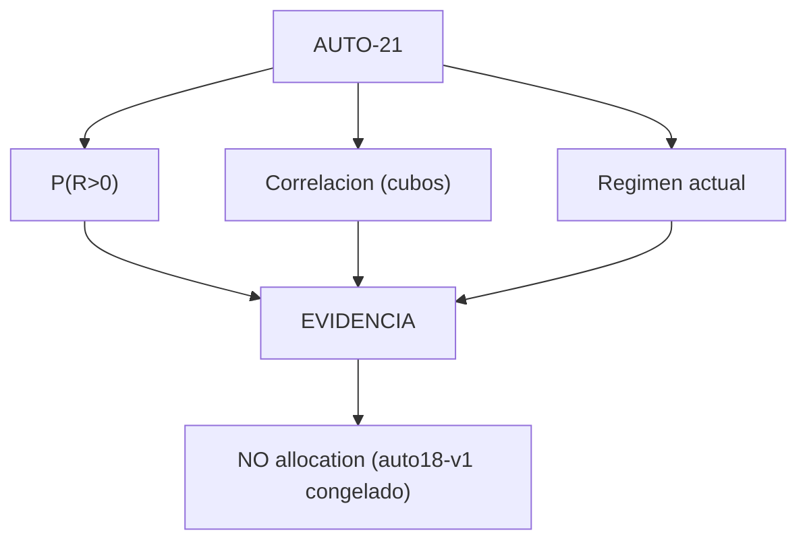

# Auditoría — `v2.68-beta` (`AUTO-21`) · `P(R>0)`, correlación entre estrategias y evidencia del régimen actual

> **AsOf:** 2026-09-25 · **Auditado:** `v2.68-beta` · **Base del diff:** `v2.67-beta`
> **Naturaleza:** fase de **medición/evidencia** (no de producto). **SIN migración**
> (head `046_fill_reference_mid`). **El freeze no se toca.**
> **Redactada por:** el propietario/auditor externo; transcrita al paquete de ingeniería.

## Veredicto

- **V2.68-beta: APROBADA técnicamente.**
- **AUTO-21: bien implementado como capa de MEDICIÓN.**
- **Freeze de ejecución: correctamente intacto.**
- **Límite declarado:** todavía **no hay evidencia de mercado PAPER real suficiente**.

La arquitectura mantiene la decisión fundamental de la línea: `P(R>0)`, correlación y régimen actual
**alimentan la evidencia y NO el reparto** (`auto18-v1` / `auto15-v1` congelados; la correlación no
entra ni en el optimizador ni en las reservas). V2.68 aumenta muchísimo la capacidad de **diagnóstico**
de AUTO, pero **no le concede capacidad adicional de decisión**.



## Observaciones verificadas (1–17, 27)

| # | Tesis verificada | Veredicto |
|---|---|---|
| 1 | `P(R>0)` es la proporción de medias bootstrap **estrictamente `> 0`**, no `mean(R) > 0`; protegida por test y **M183** | 🟢 |
| 2 | **Sin bootstrap no hay `0`**: `probabilityPositive = None` (no se puede calcular) frente a un `0` que significaría "se calculó y ninguna muestra fue positiva" | 🟢 |
| 3 | El sello metodológico avanza (`bootstrap_episodes_v2`, `walk_forward_calibration_v3`): reproducibilidad histórica de la metodología | 🟢 |
| 4 | `probabilityPositiveOos` se calcula sobre los **ciclos OOS realizados**, no como media de las probabilidades de celda (evita el error de ponderación con folds de distinto tamaño) | 🟢 |
| 5 | La pregunta `probability_positive_calibration` exige **ambos** términos; si falta uno ⇒ `INCONCLUSIVE` | 🟢 |
| 6 | La correlación está **aislada**: el diff de `portfolio_optimizer.py` y `portfolio_reservation.py` es **vacío** | 🟢 |
| 7 | Correlación **sin cubos comunes = `None`** (jamás `0`, que implicaría independencia lineal medida); protegida por **M186** | 🟢 |
| 8 | Serie constante ⇒ se declara el hueco (Pearson no está definido de forma útil sin varianza) | 🟢 |
| 9 | `n < min_buckets` ⇒ `None` + nota (3 cubos no fabrican una precisión que no existe) | 🟢 |
| 10 | La evidencia del régimen **separa** "¿cuál es el régimen actual?" de "¿qué evidencia tiene la estrategia en ese régimen?"; una estrategia sin celda no puede fingir `SUPPORTED` | 🟢 |
| 11 | `UNKNOWN` **no fija** el régimen actual: se busca el ciclo más reciente **con régimen declarable** | 🟢 |
| 12 | La evidencia del régimen **reutiliza** el bootstrap de `AUTO-19A` (sin segunda aritmética que pudiera divergir entre la `P(R>0)` global y la de régimen) | 🟢 |
| 13 | El artefacto sigue siendo **aditivo**: sin `correlation`/`currentRegime`/`currentEvidence` es byte-idéntico al de `v2.67` | 🟢 |
| 14 | **TypeScript no recalcula**: una sola fuente matemática (Python calcula → artefacto → TS renderiza) | 🟢 |
| 15 | La matriz de mutaciones cubre las propiedades nuevas: `M182…M187` muerden y la matriz completa da **187/187** con restauración byte a byte | 🟢 |
| 16 | Cifras de calidad: frontend **1327 passed**, analytics **1238 passed**, `ruff` OK, `import-linter` 4/4, `typecheck`/`build`/`contract:check` OK | 🟢 |
| 17 | El **flake** `backtests/core-r-scheduler.test.ts` (timeout 5000 ms bajo la suite completa; aislado pasa; fichero no tocado en la fase) es **deuda de infraestructura/test runner**, no bug funcional de `AUTO-21` | 🟠 |
| 27 | Estado de AUTO tras V2.68: material PG, fingerprint, manifest, PAPER guard, bootstrap, `P(R>0)`, `P(R>0)` OOS, calibración, correlación temporal, current regime, regime evidence, artefacto aditivo, TS read-only, mutaciones y allocation freeze en **🟢**; **PAPER real suficiente / evidencia estadística real / correlación real / evidencia real del régimen** en **🔴**; current-regime gating operativo **🟠**; allocation dinámica y LIVE AUTO **❌** | mixto |

## El bloqueante central (18–20)

El propio audit-pack lo reconoce: **la corrida PAPER real no se ejecuta**; el fixture es **sintético y
declarado** y mide el **instrumento**, no el mercado. Por tanto `P(R>0)`, correlación y régimen actual
están **implementados**, pero todavía no sabemos **qué valores tienen con datos reales**.

Misión de `V2.69`:

```
PostgreSQL PAPER REAL → material → fingerprint → AUTO-19A → AUTO-19B
    → P(R>0) → OOS probability → correlation → current regime → AUTO Evidence Report
    → guardar el resultado
```

Sin recalcular a mano, sin copiar números y **sin modificar parámetros para obtener un resultado
favorable**.

## Qué aporta `V2.69` (21–24)

- **Tres niveles de evidencia** exigidos para la UI y el run: **Nivel 1 – Material** (cycles, measured,
  without R, fills, excluded, versions, fingerprint), **Nivel 2 – Estadística** (mean R, interval,
  `P(R>0)`, `P(R>0)` OOS, WFE, effective N, coverage) y **Nivel 3 – Contexto** (current regime,
  strategy evidence in current regime, cross-strategy correlation). Y **solo después**, `allocation`.
- **Regla visual dura (23):** **nunca** mostrar `Correlation: 0` cuando significa *no medido*; debe
  aparecer `NOT MEASURED` / `INCONCLUSIVE`, igual que en el backend.
- **Correlación ≠ causalidad (24):** `A ↔ B = 0.83` no significa que compartan edge; significa asociación
  lineal elevada bajo el cubo temporal definido. Por eso sigue siendo **evidencia**, no sizing.

## Cuestión estadística a vigilar en la próxima auditoría (25–26)

- **Correlación por cubos temporales:** validar empíricamente con el primer dataset real que no se
  introduce correlación artificial por **distinta frecuencia de operaciones**, **buckets con pocos
  ciclos**, **períodos de inactividad** y **diferencias de exposición temporal**. **No es un bug de
  V2.68**: es una validación empírica pendiente (→ deuda **P3-2**).
- **`P(R>0)` frente al tamaño muestral:** `N = 8, P(R>0) = 0.875` no puede tratarse igual que
  `N = 180, P(R>0) = 0.875`. Por eso `P(R>0)` **no debe convertirse** en confidence ni en allocation
  (→ deuda **P3-3**).

## Hoja de ruta declarada

```
V2.64 ─ Material + manifest
V2.67 ─ Evidence artifact
V2.68 ─ P(R>0) · P(R>0) OOS · Correlación · Régimen actual
            │
            ▼
        V2.69 REAL PAPER
            │
            ▼  evidencia real
       ┌────┴────┐
       ▼         ▼
  insuficiente  suficiente
       │         │
  INCONCLUSIVE   V2.70+ validación → shadow decision → allocation → PAPER AUTO → LIVE
```

## Conclusión

V2.68-beta es una de las versiones técnicamente más importantes de la línea AUTO: las tres piezas de
evidencia que faltaban (`P(R>0)`, dependencia entre estrategias y evidencia condicionada al régimen)
están implementadas de forma **aditiva**, **auditable** y **sin tocar allocation**. El objetivo de
`V2.69` **no** es añadir sofisticación estadística, sino **alimentar** el instrumento con el primer
universo PAPER real suficientemente grande y dejar que **los datos** determinen si la evidencia sale
`SUPPORTED`, `NOT_SUPPORTED` o `INCONCLUSIVE`.

## Deudas declaradas

Ver [`deuda-p3-post-auditoria-v2.68-2026-09-25.md`](./deuda-p3-post-auditoria-v2.68-2026-09-25.md):

- **P3-1** — flake ajeno `apps/web/src/features/backtests/core-r-scheduler.test.ts` bajo carga.
- **P3-2** — validación empírica de la correlación por cubos (frecuencia, cubos pobres, inactividad,
  exposición).
- **P3-3** — `P(R>0)` vs tamaño muestral (no convertir en confidence/allocation).
