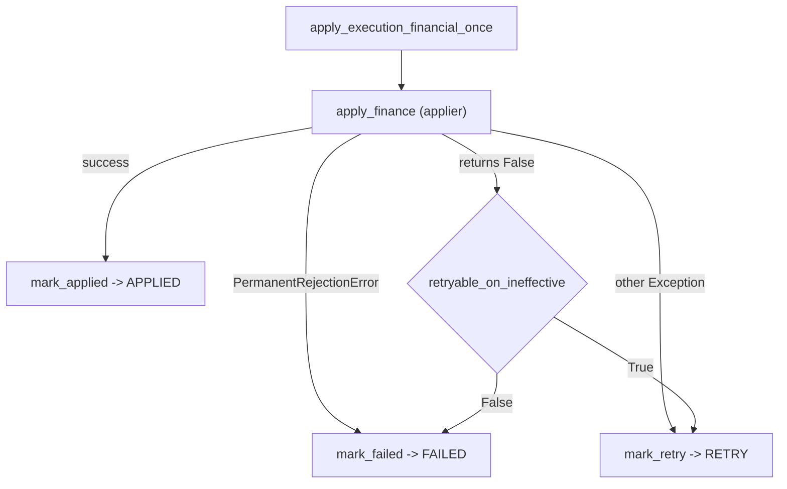

# Evidencia cruda — Cierre de `OBS-21`: clasificación explícita `TRANSIENT` vs `PERMANENT` del terminal del fill AUTO (2026-09-30)

Resumen **verificable** del sello, y **punto de entrada de la auditoría externa**. A diferencia de
`v2.88.10` (**sólo documentación**), este sello **SÍ toca MOTOR**: es la corrección funcional del único
pendiente técnico que quedaba abierto sobre el motor AUTO, la observación `OBS-21` que la instrumentación
de `v2.88.8` dejó a la vista.

> **Por qué existe este tag (el problema que cierra).** El applier del settlement AUTO capturaba
> **cualquier** excepción de `ExecuteTrade` y devolvía `False`; ese `False`, con
> `retryable_on_ineffective=True`, terminaba en `mark_retry` → `RETRY`. Entre las excepciones tragadas
> estaba un rechazo **determinista** del dominio — `No tienes suficientes acciones. En cartera: 0.0`.
> `RETRY` sobre un hecho que no cambia es un **bucle**: reintentar el mismo fill lo vuelve a encontrar
> idéntico. Peor: el camino de **excepción** marcaba `RETRY` **siempre** (el flag sólo gobernaba el retorno
> `False`), así que **no existía ninguna vía** por la que un rechazo permanente acabara en `FAILED`.

## Identidad del sello

| | |
| --- | --- |
| Fase | Cierre de `OBS-21` (clasificación del terminal del fill) |
| Versión de paquete | `2.11.10-beta` → **`2.11.11-beta`** |
| Tag (lo crea el propietario) | **`v2.88.11-beta`** (anotado) |
| Alembic head | **`046_fill_reference_mid`** (**SIN migración**) |
| Contenido del sello | **MOTOR** (dominio + repo + settlement) + tests + mutación + docs |
| Relación con `v2.88.9`/`v2.88.10` | Cambia el **terminal** del fill (clasificación), **no** la aritmética financiera ni la semántica fail-closed |

## 1. Perímetro — medido, no declarado

`git diff --numstat` (sin commitear al escribir esta evidencia):

| Fichero | numstat | Qué aporta |
| --- | --- | --- |
| `packages/py/domain/src/bolsa_domain/errors.py` | `+23/−1` | `PermanentRejectionError(ValueError)` + `__all__` |
| `packages/py/infrastructure/.../portfolio_repository.py` | `+8/−8` | los **6** rechazos deterministas de `execute_trade` pasan al tipo permanente |
| `packages/py/application/src/bolsa_application/simulated_finance.py` | `+13/−0` | el applier **RE-LANZA** el rechazo permanente en vez de tragarlo |
| `packages/py/application/src/bolsa_application/execution_event.py` | `+32/−0` | `apply_execution_financial_once` y `reap_stale_applying` mapean a `mark_failed` |
| `apps/api-python/src/bolsa_api/background/live_order_recovery_worker.py` | `+12/−0` | mismo `re-raise` en el applier del recovery LIVE |
| `packages/py/application/tests/test_execution_event.py` | `+57/−0` | `FAILED` por rechazo permanente + reaper terminal |
| `packages/py/application/tests/test_simulated_finance.py` | `+30/−0` | el applier re-lanza el rechazo permanente |
| `packages/py/infrastructure/tests/test_financial_invariants.py` | `+6/−3` | los rechazos del repo exigen el tipo permanente |
| `apps/api-python/tests/test_simulated_finance_pg.py` | `+91/−0` | de extremo a extremo en PG: venta sin posición → `FAILED` |
| `apps/api-python/scripts/v2_44_mutation_audit.py` | `+32/−0` | `M268`/`M269` |

**Sin migración. Sin umbrales.** `TOP_N`/`REGIME`/`RISK`/`SIGNALS`/A-B y cualquier umbral: intactos. Sin
backdating.

## 2. La corrección: una frontera explícita

`PermanentRejectionError` es **subclase de `ValueError`** a propósito: el mensaje y todo `except ValueError`
de la capa HTTP/use-cases siguen funcionando **sin cambios**; lo único que cambia es que el settlement AUTO
puede leer la causa.



La frontera declarada (fail-safe): quedan en `except Exception` → `RETRY` los fallos de
`lock_account`/ledger/DB (deadlock, timeout, conexión) y **todo lo no clasificado**. Lo permanente es una
lista **explícita** (los seis rechazos deterministas del repositorio de cartera); lo transitorio es el
**resto**.

**Invariante preservado:** JAMÁS se marca `APPLIED` por excepción.

## 3. Terminal por tipo de fallo

| Causa | Tipo | Terminal |
| --- | --- | --- |
| `ExecuteTrade` efectivo | — | `APPLIED` |
| `No tienes suficientes acciones` | `PermanentRejectionError` | **`FAILED`** (`error="apply_permanent_rejection"`) |
| `Efectivo insuficiente` | `PermanentRejectionError` | **`FAILED`** |
| instrumento/cartera no encontrados, `qty<=0`, `price<=0`, key vacía | `PermanentRejectionError` | **`FAILED`** |
| deadlock / timeout / conexión / ledger | `Exception` genérica | `RETRY` (`error="apply_exception"`) |
| `False` sin excepción | — | `RETRY` si `retryable_on_ineffective`, si no `FAILED` |

## 4. Tests de regresión

- `test_execution_event.py::test_durable_apply_permanent_rejection_marks_failed` → `failed`, fila `FAILED`,
  `last_error="apply_permanent_rejection"`; **contraste** con `..._exception_marks_retry_not_applied`
  (`RuntimeError` genérico → `RETRY`).
- `test_execution_event.py::test_reap_permanent_rejection_marks_failed_not_retry` → el reaper no reencola.
- `test_simulated_finance.py::test_applier_propagates_permanent_rejection_instead_of_swallowing` → re-lanza.
- `test_financial_invariants.py` → `pytest.raises(PermanentRejectionError, ...)` en los dos rechazos de cartera.
- `test_simulated_finance_pg.py::test_permanent_rejection_materializes_failed_not_retry` → **PG real**:
  venta sin posición ⇒ todos los outcomes `"failed"` y las filas en `FAILED`.

Suites hermeticas: **`42 passed`** (`test_execution_event.py` + `test_simulated_finance.py`);
`test_financial_invariants.py` **`10 passed`**; `test_simulated_finance_pg.py` **`2 passed`** (PG local).

## 5. Mutación — `M268` y `M269` MUERDEN

```
### M268 (OBS-21, permanente reclasificado como transitorio)
  rojo en: test_durable_apply_permanent_rejection_marks_failed
  restaurado byte a byte: si
### M269 (OBS-21, propagacion MUDA del rechazo permanente)
  rojo en: test_applier_propagates_permanent_rejection_instead_of_swallowing
  restaurado byte a byte: si
  intacto: la sonda no altero el arbol
  medidas: 2/2
```

## 6. Límites de esta evidencia y deudas que NO cierra

- **No** acredita la ventana PAPER longitudinal (`≥4 días` / `≥32 ciclos` / A-B real): sigue pendiente.
- **`OBS-22`** (autocertificación documental del tag) sigue abierta como **patrón de proceso**: la cita de
  la corrida de CI del tag vive **fuera** del tag.
- No cierra `OBS-19`, `OBS-15`, `OBS-16`, `OBS-14.b`, `OBS-13`, `OBS-11`, `H-4`, `OBS-9`, `P3-5`, `OBS-5`
  ni `P3-2`/`P3-3`.

## 7. Cita del CI del tag

**PENDIENTE DE CITAR.** Se anota aquí el `Release tag CI` del tag `v2.88.11-beta` cuando exista (patrón de
cita POST-TAG, `OBS-3`/`OBS-4`/`OBS-22`).
