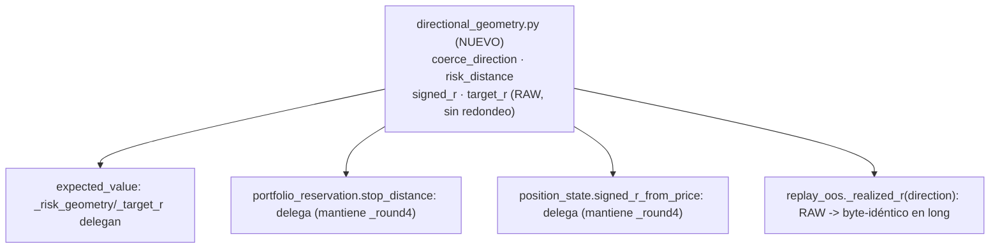

# Evidencia `v2.88.17-beta` — `W4` `GRANULARIDAD-OPERATIVA`: proveedor de precio REAL (**bundle** con el fix direccional del OOS)

> **Clase: evidencia del sello `W4`. ESTADO: `W4` CERRADO en `main` — bump `2.11.17-beta` aplicado; tag y cita POST-TAG pendientes al escribir.**
> **El tag anotado `v2.88.17-beta` y su cita POST-TAG los realiza el SELLO `W4`.**
> **AsOf:** 2026-10-01. **Base:** `v2.88.16.3-beta` (`b3876cdd`).
> **Plan de la fase:** [`plan-w4-precio-real-2026-10-01.md`](../plan-w4-precio-real-2026-10-01.md).
> **Plan del bundle (§2):** fix direccional del scorer OOS + casa única de geometría direccional.

`W4` tiene **dos objetos**: (1) el **proveedor de precio REAL** (objeto propio del plan, con su
diseño y su criterio de éxito en el plan) y (2) —**bundleado en el mismo sello**— el **fix
direccional del scorer OOS** y la convergencia de la geometría direccional en **una sola casa**.
Este dossier recoge la evidencia del **bundle**; la del proveedor de precio vive en el plan `W4`.

---

## 1. Fix direccional del scorer OOS (`_realized_r`) + casa única de geometría direccional

### 1.1 Hallazgo (verificado en el código, no recordado)

* `packages/py/application/src/bolsa_application/replay_oos.py::_realized_r` calculaba el R
  realizado **siempre como largo**: `risk = entry − stop`, `r = (exit − entry) / risk`. El scorer
  clasificaba además la apertura como `buy` y el cierre como `sell` **fijos**: era long-only más
  allá del R.
* La regla direccional estaba **reimplementada** (y en el OOS **mal escrita**) en cuatro sitios:
  `expected_value._risk_geometry`/`_target_r`, `portfolio_reservation.stop_distance` y
  `position_state.signed_r_from_price`. `expected_value` ya había resuelto el mismo defecto por su
  cuenta; el OOS lo redescubrió en largo.
* **Defecto LATENTE, no regresión live:** AUTO es long-only hoy
  (`auto_v2_entry._ENTRY_DIRECTION = "long"`), así que el long-only del OOS **no rompía** ni el
  golden ni el `replay-repro` — pero **descartaba en silencio** cualquier posición corta futura.

### 1.2 Diseño

* **Nuevo módulo único** `packages/py/analytics/src/bolsa_analytics/cognitive/directional_geometry.py`:
  `coerce_direction` (fail-closed: un valor desconocido **no** se asume largo),
  `risk_distance`, `signed_r` y `target_r`, expuestas **en crudo** (sin redondeo). Cada llamante
  conserva su `_round4` ⇒ se centraliza la **regla**, no se mueve ni un decimal de lo sellado.
  Fuera de alcance (declarado): `risk_allocator`, `trade_plan`, `portfolio_decision_engine` y
  `exit_plan` conservan sus copias y convergerán en un incremento posterior.
* **Scorer OOS direccional:** `ReplayFill`, `RoundTrip` y `OpenPosition` ganan `direction: str = "long"`
  (al final, retrocompatible). La apertura es `buy` en largo y `sell` en corto; el cierre es el lado
  opuesto. Una **dirección no reconocible** se declara como hueco (`UNMEASURED_DIRECTION =
  "direccion_no_soportada"`), **nunca** se asume larga. `_realized_r` usa `risk_distance` + `signed_r`.
* **Los `to_dict()` de `RoundTrip`/`OpenPosition`/`ScoreReport` NO cambian**: la dirección viaja
  **en proceso**; serializarla queda como follow-up si un día se re-baselina la referencia.
* **CLIs del replay:** `v2_86`/`v2_87` estampan `direction` al construir `ReplayFill`, tomada de la
  **única fuente** del motor (`auto_v2_entry.AUTO_ENTRY_DIRECTION`, alias público nuevo de
  `_ENTRY_DIRECTION`), no de un literal duplicado.

### 1.3 `Δ = 0` long-only (demostrado)

* Para `direction="long"` y precios positivos, `risk_distance(entry, stop, "long") = entry − stop` y
  `signed_r(..., price=exit) = (exit − entry) / risk`: **la aritmética es la de antes**, sin redondeo
  añadido ⇒ el contenido del artefacto OOS es **byte a byte** el mismo.
* El único cambio de estructura (`to_dict()` intactos + campos con default) **no** altera las claves
  ni los valores serializados.
* Prueba local de la batería (sin PG):
  `packages/py/analytics/tests` + `packages/py/application/tests` ⇒ **`3461 passed`**.
  Suites del bundle: `test_replay_oos.py` (18), `test_replay_oos_durable_cycle.py`, `test_expected_value.py`,
  `test_position_state.py`, `test_portfolio_reservation_ledger.py` y `test_directional_geometry.py`
  (nuevo) ⇒ **`155 passed`**.
* **Autoridad del byte a byte:** el job `replay-repro` del `Release tag CI` (regenera el artefacto
  desde la entrada congelada y hace `assert-artifact` por SHA-256). **Se cita el run, no se hereda**
  (patrón `OBS-3`/`OBS-4`): la cita POST-TAG la añade el sello `W4`.
* **Prueba `Δ = 0` en máquina (mismo runner local, misma BD sembrada):** se regeneró el artefacto
  con el código ANTERIOR (`git stash` de los 7 ficheros de motor) y con el código NUEVO, ambos
  sobre el mismo seed congelado (20 instrumentos / 25 700 barras):
  ambos ficheros salen **byte a byte idénticos** —
  `3 448 185 bytes`, `sha256 = 697526EDDCCFDEAC5F3AC5791FAD82907E6E053BBB43C75CC937CD2E7C298967`
  (CRLF de Windows) en las dos corridas ⇒ `Δ = 0` probado, no inferido.
  Nota OBS: ese hash NO coincide con el sello `1E3ADA…` y **tampoco coincidía antes de este
  cambio** (el artefacto local en Windows ya divergía del sello Linux): es el *drift* de plataforma
  que el propio job mide con su «huella del runner», no una regresión de este fix.

### 1.4 Mutaciones (`M8`/`M10`/`M238` retargetadas + `M288`–`M291` nuevas)

La matriz llega a **`M291`**. Verificado que muerden, con el árbol restaurado **byte a byte**:

| Id | Defecto | Rojo observado |
| --- | --- | --- |
| `M8` | stop corto del lado equivocado aceptado | `test_a_short_with_a_long_stop_is_an_inverted_geometry`, `test_risk_distance_requires_the_stop_on_the_correct_side` |
| `M10` | premio de una corta medido al revés | `test_a_short_target_r_is_measured_towards_a_lower_price`, `test_target_r_measures_the_reward_towards_the_target` |
| `M238` | riesgo no medible publicado como `0.0` | `test_score_replay_declares_gaps_instead_of_inventing_zero` |
| `M288` | el R realizado vuelve a asumir geometría larga | `test_score_replay_measures_a_short_round_trip_with_short_geometry`, `…short_open_position…` |
| `M289` | apertura hardcodeada a `buy` | `…short_round_trip…`, `…short_open_position…` |
| `M290` | dirección desconocida degradada a larga (fail-closed roto) | `test_score_replay_declares_an_unsupported_direction_instead_of_assuming_long` |
| `M291` | stop largo del lado equivocado aceptado (riesgo inventado) | `test_an_inverted_geometry_does_not_turn_risk_into_zero`, `test_risk_distance_*` |

`M8`/`M10` se **retargetearon** a `directional_geometry.py` (la regla se mudó allí) y `M238` al nuevo
`_realized_r`. La corrida filtrada `M8/M10/M238/M288–M291` dio **`27/27 medidas`** (ninguna se quedó sin
fragmento) con el árbol **intacto**.

### 1.5 Peaje `OBS-19` — alta en CI

`packages/py/application/tests/test_replay_oos.py` **no estaba registrado en NINGÚN workflow**
(solo lo estaba `test_replay_oos_durable_cycle.py`): sus **18** tests **nunca corrían en CI**. Se
registra a mano en `python-ci.yml` y `release-tag-ci.yml`. `packages/py/analytics/tests/*` entra por
el pase de directorio del paquete ⇒ sin alta manual para `test_directional_geometry.py`.

### 1.6 Deudas y límites declarados

* La **regla direccional sigue duplicada** en `risk_allocator`, `trade_plan`,
  `portfolio_decision_engine` y `exit_plan` (convergencia diferida, declarada y fuera de alcance).
* `OBS-19` **causa estructural** (listas manuales de pytest) **sigue ABIERTA**: se paga el peaje de
  esta suite, no se cierra la causa.
* La dirección **no se serializa** en el artefacto OOS (preserva `replay-repro`); un día que se
  re-baseline la referencia puede añadirse.

---

## 2. Paso `2b` de `W4` — unificación de las lecturas de precio al tick de BARRA

### 2.1 Hallazgo

El contrato de `PriceScript` (`W3`) fija que el `tick` que recibe el proveedor es el de la **barra**
(estable dentro de ella), para que la referencia de un reintento intra-barra sea la MISMA. Pero la
coherencia quedó **a medias**: el *fill* ya usaba el tick de barra (`_settle`), mientras la
**decisión** (`_v2_signals`), el **mark** de equity (`_v2_snapshot`, `_v2_governor_drawdown_pct`), la
protección (`auto_turn`) y el **coste de oportunidad** leían `self._minute`, que **avanza cada 60 s**.
Con un precio constante era inocuo; con precio real, decisión y *fill* leerían instantes distintos
(§2.b del plan).

### 2.2 Cambio (deliberado y medido, `Δ ≠ 0` por contrato)

Cinco lecturas pasan de `self._minute` al tick de barra (`self._v2_bar_tick()`), uniéndose a la sexta
(`_settle`), que ya lo usaba. **No** se toca la **protección** legacy (`protection_exit_reason(...,
minute=self._minute)`): es el `ProtectionClock` de la v2, deliberadamente en el tick corriente
(incremento `W5`).

### 2.3 `Δ` medido (A/B aislado, no narrado)

| Escenario | Batería `pytest apps/api-python/tests -k auto` |
| --- | --- |
| **Con** el paso `2b` | `1 failed, 475 passed` — el rojo es el **pre-existente** de PG (`test_auto_v70_auto23_evidence_validation`, `assert 17 == 26`) |
| **Sin** `2b` (revertido a `_minute`, aislando las 5 líneas) | `2 failed, 474 passed` — el pre-existente **+ el test nuevo del contrato** |

⇒ **Ninguna otra prueba cambió de expectativa**: el paso `2b` no obligó a re-escribir los tests que
dependían del tick (los scripts que **cuentan llamadas** ignoran el `tick`; `_rising_price` vive dentro
de una sola barra ⇒ constante). Lo único que hacía falta era **fijar el contrato nuevo**, y se hizo.

**`replay-repro` intacto (`Δ = 0`):** `ReplayCursor.price_script` **ignora el `tick`** que le pasa el
worker (`replay_oos.py:247`, «manda el cursor»), así que unificar el tick **no puede** mover el precio
del replay. Verificado regenerando el artefacto con el seed congelado **con** `2b`:
`3 448 185 bytes`, `sha256 = 697526ED…C298967` — **idéntico** al baseline pre-`2b`.

**Golden day intacto:** `test_golden_day_v2_process_pg.py` ⇒ **`1 passed`** (el precio hermético es
`flat_price_script` = `100.0`, constante ⇒ el tick es irrelevante).

### 2.4 Contrato fijado (test + mutación)

* **Test nuevo** en `apps/api-python/tests/test_auto_v2_closed_bars_and_bar_idempotency.py`:
  `test_every_price_read_in_a_bar_shares_the_bar_tick` — un script **registra** el tick que recibe y
  el test exige que **todas** las lecturas de la barra compartan el tick de barra (no el minuto).
* **Mutación nueva `M292`** (revierte una lectura al minuto) ⇒ **muerde** en ese test, árbol restaurado
  **byte a byte**. La matriz llega a **`M292`**.

### 2.5 Límite declarado

El paso `2b` alinea la **frontera temporal** del precio; **no** cambia el proveedor ni el fail-closed
(eso es `2a`, ya sellado). Con `AUTO_ENGINE_SIM_REAL_PRICE` OFF (default) el camino hermético sigue
siendo el mismo, byte a byte.

