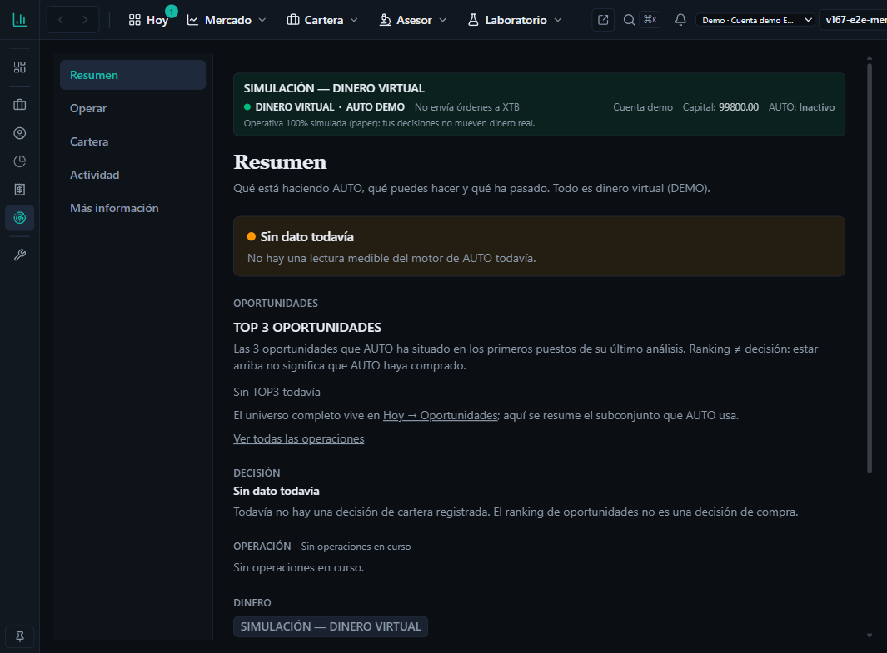
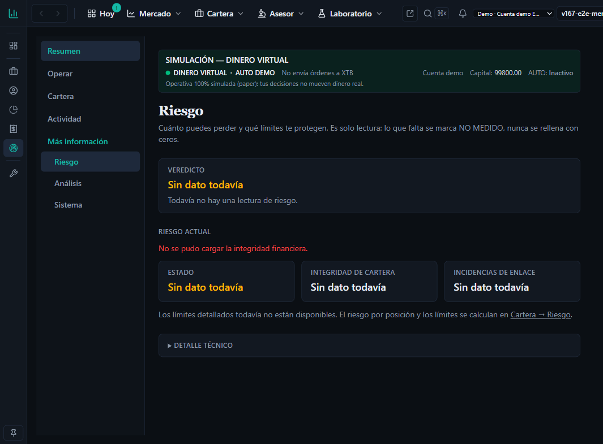

# Evidencia `v2.88.89-beta` — `UI` + `AUTO · TOP3`: **UI REFACTOR 5.1 — HOME user-first + fix del TOP3 cross-asset**

**Producto:** `V2.88.89-beta` · **Package:** `2.11.89-beta` · **AsOf:** 2026-10-08. **Sin migración nueva** (head `052_top3_opportunities`). **`Δ motor = 0`** (nemotécnico: no se toca el motor de decisión/ejecución, ni el worker, ni umbrales, ni Alembic; el fix del TOP3 es **selección pura**). **Contrato HTTP sin cambio.** Los 9 CLIs DÍA-D `v2_89`…`v2_97` sellan `2.11.89-beta` junto al `package.json`.

> **Nota de árbol (honesta).** A diferencia de `v2.88.88`, este sello **sí** mueve `packages/`: el fix vive en `packages/py/application/src/bolsa_application/top3_opportunities.py`. Sigue siendo `Δ motor = 0` porque es la **selección/colapso del TOP3** (observabilidad durable), no el motor de decisión/ejecución. `replay-repro` debe seguir `REPRODUCIDO` para confirmarlo por CI.

**Contrato implementado:** [`spec-ui-contract-5-0-2026-10-08.md`](../../spec-ui-contract-5-0-2026-10-08.md) (`UI5-01`…`UI5-20`, con estado `DONE`/`PENDING` en §5).
**Base:** [`evidence/v2.88.88/README.md`](../v2.88.88/README.md).

## 1. UI REFACTOR 5.1 — qué cambia

| Regla | Cambio | Implementación |
| --- | --- | --- |
| `UI5-04` | **HOME = cockpit de 5 bloques.** Se eliminan las seis preguntas («¿AUTO está funcionando?» … «¿Qué dinero utiliza?») que duplicaban estado/operación/dinero. Primer nivel: Estado · Oportunidades · Decisión · Operación · Dinero; el resto, plegado. | [`auto-home-page.tsx`](../../../../apps/web/src/features/auto/auto-home-page.tsx) (+ [`auto-home-page.test.tsx`](../../../../apps/web/src/features/auto/auto-home-page.test.tsx)) |
| `UI5-12` | **Decisión = hueco declarado.** «Sin dato todavía» + copy «el ranking no es una decisión de compra». No se deduce «Esperar» del TOP3. | mismo fichero (`auto-home-decision`) |
| `UI5-18` | **Riesgo sin repetición.** Las cuatro filas que repetían «Sin dato todavía» se colapsan en una declaración única enlazada a `Cartera → Riesgo`; las métricas reales solo aparecen con `positionRiskAvailable`. | [`auto-riesgo-page.tsx`](../../../../apps/web/src/features/auto/auto-riesgo-page.tsx) (+ [`auto-riesgo-page.test.tsx`](../../../../apps/web/src/features/auto/auto-riesgo-page.test.tsx)) |
| `UI5-08` | **`AdminRail` ↔ contrato (opción B).** Sin código: la spec `§1.3`/`UI5-08` declara `Producto` = accesos rápidos disponibles (`Overview`); la L1 sigue en la barra superior. Cierra `UI5-08b`. | [`spec-ui-contract-5-0-2026-10-08.md`](../../spec-ui-contract-5-0-2026-10-08.md), [`045-ui-contract-5-0.md`](../../../adr/045-ui-contract-5-0.md) |

## 2. Fix TOP3 cross-asset (backend)

**Causa raíz.** `select_top3_assets` cortaba el top-N sobre `instrument_id` crudos y solo `select_top3_records` colapsaba a activo base **después**. Con `allow_distinct_strategies=True` el `plan_v2_tick` rankea por `candidate_key` (`SÍMBOLO#versión`): dos variantes del mismo activo podían ocupar dos de los tres slots y desplazar a un tercer activo real (`GOOG` con score superior, fuera por el corte). La tabla `top3_opportunities` (migración 052) no tiene constraint de unicidad por `(run_id, asset_id)`; el único log (`degraded`) solo cubría la degradación de evidencia LAB.

**Fix.** Nuevo helper `_collapse_to_base_assets` en [`top3_opportunities.py`](../../../../packages/py/application/src/bolsa_application/top3_opportunities.py): agrupa por `_base_symbol(instrument_id)` conservando la variante de mayor `combined` (desempate determinista por `instrument_id`, igual que `rank_opportunities`) y se aplica **antes** de `select_top_opportunities(top_n)`. `top_n_excluded` se calcula sobre la lista colapsada, de modo que un activo excluido no se cuenta dos veces. `select_top3_records` no cambia de firma (el colapso pasa a ser idempotente).

**Escenario certificado.** `AAPL#v1 0.91`, `AAPL#v2 0.88`, `MSFT#v1 0.80`, `GOOG#v1 0.75` ⇒ TOP3 = `AAPL, MSFT, GOOG` (3 activos distintos, la mejor variante de AAPL), no `AAPL, AAPL, MSFT`.

## 3. Invariantes de honestidad

- **`UNKNOWN ≠ 0`.** El hueco de Decisión y el de los límites de Riesgo se declaran; no se rellenan con `0` ni con verde.
- **`ranking ≠ decisión`.** La HOME no deduce la decisión del TOP3.
- **`Δ motor = 0`.** Sin cambios en motor de decisión/ejecución, worker, umbrales ni Alembic; el fix es selección pura del TOP3.
- **Contrato HTTP sin cambio** y **sin migración** (head `052_top3_opportunities`).

## 4. Verificación (local)

- `pnpm --filter @bolsa/web typecheck` → **OK**.
- `pnpm --filter @bolsa/web lint` → **0 errores** (23 avisos `react-hooks/exhaustive-deps` preexistentes, ajenos a este slice).
- `pnpm --filter @bolsa/web test` → **268 ficheros / 1594 tests verdes**.
- `python -m pytest packages/py/application/tests/test_top3_opportunities.py -q` → **15 passed** (nuevos `…_collapses_before_top_n` y `…_collapses_candidate_key_before_cut`).
- `python -m pytest apps/api-python/tests/test_auto_v88_84_top3_producer_pg.py -q` → **2 passed**.
- `python -m pytest apps/api-python/tests/test_dia_d_bump_guard.py -q` → **1 passed** (`2.11.89-beta`).
- **E2E:** [`gp-e2e-v28865-auto-axe-mock.spec.ts`](../../../../apps/web/e2e/gp-e2e-v28865-auto-axe-mock.spec.ts) actualizado (`auto-home-q-working` → `auto-home-human-state-label`); re-barrer `axe` y confirmar **0 `critical`/`serious`**.

## 4.bis Verificación en navegador (`debug`, stack local)

Stack local (`run-dev.mjs`): API `:8000` + Web `:5173` (Postgres OK, head `052`). Recorrido con el navegador en modo depuración sobre `AUTO`:

- **HOME `/auto`** — cockpit de 5 bloques (`auto-home-state` · `auto-home-opportunities` · `auto-home-decision` · `auto-home-operations` · `auto-home-account-figures`); **cero** ocurrencias de las seis preguntas (`¿AUTO está funcionando?`…). Detalle plegado en `auto-home-activity` (`Toda la actividad · Oportunidades · DÍA-D · Evidencia · Investigación · Detalles técnicos · ¿Por qué?`).

  

- **Densidad (arreglo visto en vivo).** Sin lectura del motor, la insignia declaraba «Sin dato todavía» y la línea de actividad repetía el mismo hueco. Se omite la línea cuando no aporta nada más que la insignia (`auto-home-page.tsx`), con test nuevo en `auto-home-page.test.tsx`. Verificado en vivo: `auto-home-activity-line` → `null`.
- **`AdminRail`** (hover) — `PRODUCTO: Overview` · `ADMINISTRACIÓN: Cuentas, Perfiles, Estadísticas (pronto), Fiscal, AUTO` · `DIAGNÓSTICO: Consola avanzada` (§1.3/`UI5-08`, opción B). Plegado sigue en modo icono con encabezados ocultos.
- **Riesgo `/auto/riesgo`** — las cuatro filas «Sin dato todavía» desaparecen (`auto-riesgo-open-risk`/`-max-loss`/`-position-risk`/`-daily-limit` ausentes); queda una única línea `auto-riesgo-limits` enlazada a `Cartera → Riesgo`.

  

- **Operar `/auto/operar`** — `auto-operar-top3` presente (fail-closed «Sin TOP3 todavía») + copy de universo (`El universo completo… vive en Hoy → Oportunidades`) y `Ranking ≠ decisión`.
- **Nav superior AUTO** — primaria (Resumen·Operar·Cartera·Actividad) + `Más información` auto-abierto en rutas secundarias (`/auto/riesgo`, `/auto/analisis`, `/auto/sistema`); un único `main` y un único `h1`.

**Consola (debug).** Único error de aplicación: `401 Unauthorized` en `GET /api/lifecycle/integrity` — el endpoint exige `require_jwt_principal` y la sesión de depuración no lleva JWT (condición preexistente de auth, ajena a este slice); por eso Riesgo declara el hueco en vez de un veredicto. Sin errores de render ni de hidratación (los `ERR_CONNECTION_REFUSED` son artefactos de la optimización de dependencias de Vite, no de la app).

**Corrección a la auditoría (evidence, no código).** El hallazgo «docstring con URL stale» de `top3_opportunities.py` **no** aplica: el router real se monta bajo `/api`, no `/api/v1`. Probado en vivo — `GET /api/top3-opportunities/latest` → `200 {"runId":"","items":[]}`; `GET /api/v1/top3-opportunities/latest` → `404`. La URL del comentario es la correcta y el payload fail-closed coincide con lo que pinta la UI («Sin TOP3 todavía»).

## 5. Qué no cambia

Motor AUTO de decisión/ejecución, ledger, posiciones, settlement, contrato HTTP y esquema (head `052_top3_opportunities`). Live/XTB real no se implementa: el canal se declara `SIMULADO`. La escalera universal, la insignia de modo y el TOP3 render no se tocan.

## 6. Cita POST-TAG

**Tag anotado `v2.88.89-beta`** (objeto `ab26aeba` → commit `b9557c21`) empujado a `origin`. **`Release tag CI` [`37766767402`](https://github.com/jvelasca/Bolsa_V1/actions/runs/37766767402) VERDE** (`12` jobs `success`; `playwright (integrated E2E, opt-in)` `skipped`):

- `certify` `success` · `python` `success` · `frontend` `success` · `shared` `success` · `decision-spine` `success` · `lifecycle-pg` `success` · `dr-verify` `success` · `a7-gate` `success` · `security (gitleaks)` `success` · `playwright (mock E2E)` `success`.
- **`replay-repro` `success`** — `VEREDICTO **`REPRODUCIDO`**` (mismo CONTENIDO): `sha256 1E3ADAC26543FC7BFC7DA4CAA8733D3B24937A0E3E0E78650DC059FA929A37E7`, `3340728` bytes — huella **idéntica** a la del sello `v2.88.88-beta` ⇒ **`Δ motor = 0` confirmado por CI**.

**`GitHub Release` (pre-release) publicado:** [`v2.88.89-beta`](https://github.com/jvelasca/Bolsa_V1/releases/tag/v2.88.89-beta).
