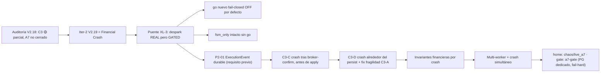

# PLAN A7 — Iter-2 · Financial Crash Certification (V2.19) — 2026-09-09

> **Padre:** auditoría externa **V2.18** sobre `bd2bd163` (tag `v2.18-beta`, paquete `1.48.0-beta`),
> **Release-tag CI `#34341628713` GREEN**. Verdicto: C3 🔴→🟡 **cubierto(parcial)** correcto; la
> **vertiente financiera** del crash queda a **Iter-2**. Este fichero = **marco de Iter-2** (plan +
> decisión de despark): NO escribe código/tests aún (escalera de honestidad Iter-0/1). Fija qué escenario
> cerrado falta, el puente XL-3 (despark real bajo go), la spec del go y el backlog comprometido.
> Núcleo financiero congelado **intacto** en V2.18; esta iteración documental no lo descongela: solo
> registra la decisión del puente y el orden de trabajo de la iteración de escritura.

## 1. Estado de partida verificado (sobre el HEAD actual)

- `git log`: HEAD `95cbee9c` (docs de elevación) sobre `bd2bd163` = **v2.18-beta** / `1.48.0-beta`.
- Home efectivo de C3: [`apps/api-python/tests/chaos/live_a7/`](../../apps/api-python/tests/chaos/live_a7/)
  (`test_c3_crash_injection_recovery_worker.py`, probe `_crash_recovery_probe.py`).
- Gate CI: job **`a7-gate`** en
  [`.github/workflows/release-tag-ci.yml`](../../.github/workflows/release-tag-ci.yml), BD dedicada
  `bolsa_v1_a7`, pytest `chaos/live_a7` con `LIVE_A7_PG_REQUIRED=1` (fail-hard si skip), `a7-gate` en
  `needs` de `certify`. Release-tag CI `#34341628713` → `conclusion: success`.

## 2. Veredicto de la auditoría V2.18 y nuestra posición (gap-map)

Frente a la auditoría externa:

1. **Aceptamos el veredicto**: V2.18 = Iter-1 gated a C3, **no** cierre de A7. C3 queda 🟡.
2. **Aceptamos** que la clasificación documental 🟡 es la correcta y NO subir C3 a 🟢 todavía: el recovery
   del UNKNOWN hoy resuelve la FSM pero **no materializa dinero** (modo `fsm_only`, dec. V2.18 — lo confirma
   el propio código en
   [`live_order_recovery_worker.py`](../../apps/api-python/src/bolsa_api/background/live_order_recovery_worker.py:
   `resolve_one_unknown` persiste la transición y **nunca** sintetiza `execute_trade`/ledger).
3. **Aceptamos** el mapa A7 del auditor; coincide con el gap-map Iter-0/1. Ver §5 del
   [`plan-a7-live-certification-gap-map-2026-09-09.md`](plan-a7-live-certification-gap-map-2026-09-09.md):
   el backlog de Iter-1+ dejó la **vertiente financiera del crash** para Iter-2 bajo XL-3, junto con A3/B2/P2-01.

### Mapa A7 — estado tras V2.18 (reconfirmado)

- 🟢 A1 Kill Switch · B1 Duplicate fill · B3 Capture/apply · B4 Doble materialización · B5 Reconciliation ·
  C2 Multi-worker.
- 🟡 A2 FSM · A3 Broker timeout · B2 Partial fill · C1 UNKNOWN/recovery · **C3 Crash-injection**.
- 🔴 A7 **Finance** (cash/position/ledger tras crash: NO demostrado contra crash real).

## 3. Lo que V2.18 demostró y lo que NO (gap financiero del crash)

V2.18 (C3-A/C3-B) demostró con PG real + proceso real + SIGKILL + rollback real:
claim `FOR UPDATE SKIP LOCKED` ([`live_order_store.py`](../../packages/py/application/src/bolsa_application/live_order_store.py),
`claim_unknown_batch` flush sin commit) → crash con claim abierto → segundo proceso reaparece y resuelve la
FSM **exactamente una vez** (`resolved=1`, `FILLED`, `financial_apply_count==0`). No-doble transición.

Lo que **NO** demuestra todavía (es el corazón de Iter-2):

> BROKER = FILLED 100 → crash en cualquiera de los puntos de la cadena
> `ExecutionEvent` → `apply_finance` → `Ledger` → `Position` → **restart/retry** →
> exactamente **una** materialización (sin `100+100`, sin `100+0`, sin ledger duplicado).

Invariante objetivo (math) de Iter-2:

```
Para cada (venue_order_id, fill_seq):
    Broker fill = N   ⇒   Ledger.qty += N  ∧  Position.qty += N   (una sola vez)
aun tras crash / restart / retry / duplicate-event / multi-worker.
```

## 4. Puntualizaciones al auditor (2 P2 de cobertura/estabilidad — aceptadas como limitaciones Iter-1)

- **C3 vs C3-S (nomenclatura de cobertura):** C3-A/C3-B prueban la **transacción de recovery**
  (`resolve_one_unknown` + `PostgresLiveOrderStore` vía probe por subprocess, unido por ruta de fichero),
  no el arranque del **`scheduler_worker` completo**. No es bug de producto; es límite de cobertura. Para
  Iter-2 se fija nomenclatura: **C3 = Recovery transaction crash injection** y **C3-S = Scheduler process
  crash** (a certificar cuando se lance el worker completo vía `live_order_recovery_worker_loop` sobre el
  probe). Correcto que el objetivo documentado en Iter-1 dijera "scheduler/recovery"; la realización quedó
  en recovery. Doc-Iter-1 ya lo describe con fidelidad.
- **C3-B no es un crash test:** `test_c3b_crash_after_resolve_put_no_double_on_relaunch` demuestra
  idempotencia del `put` durable (relanzar no re-procesa `drained=0`), **no** un SIGKILL después del `put`.
  Útil, pero distinto del crash-justo-después-put. Ambos se conservan; el gap (crash tras put/commit) cae en
  C3-D de Iter-2.
- **Fragilidad temporal C3-A (P2 bajo):** tras `proc.kill()` el driver hace `wait_for_exit` y pasa a proceso
  B **sin** verificar que PG ya procesó el disconnect y liberó el row-lock; hay ventana teórica
  `SKIP LOCKED → 0 rows` (fallo intermitente). Corregir en Iter-2-C3-D con espera de **recuperabilidad
  efectiva de la fila** (poll de reclaim controlado), no `sleep`.

## 5. Puente XL-3 · DECISIÓN registrada (desechando aplicar dinero a ciegas)

**La vertiente financiera exige DESPARK el apply en el camino recovery/confirm.** Hoy existe ya la espina
idempotente: [`execution_event.py`](../../packages/py/application/src/bolsa_application/execution_event.py)
`apply_fill_idempotent`/`apply_pending_execution` + `apply_finance` idempotente por `execution_id`
(kernel Decimal / sincronización Position·Ledger). La garantía de idempotencia REAL la da la clave
`execution_id = (venue_order_id + fill_seq)` con `ON CONFLICT DO NOTHING ... RETURNING` en
`PostgresExecutionEventStore`; **no** `financial_apply_count`.

**Decisión (owner, V2.19-Iter-2):** el despark es **real pero GATED** — el recovery no puede materializar
por defecto. Se introduce un **go fail-closed nuevo** (por defecto OFF) que habilita el apply; su ausencia
mantiene `fsm_only` exacto de V2.18 (sin cambio de comportamiento por defecto). **NO** se arranca el
`scheduler_worker` completo ni se sustituye el veto XL-3; C3-S sigue a Iter posterior. La honestidad
H4/H3 (detect ≠ heal / no money-sin-go) se mantiene.

### Spec del go de despark (fail-closed)

- **Nuevo env:** `LIVE_ORDER_RECOVERY_FINANCIAL_APPLY_ENABLED` (placeholder de trabajo), lectura en import
  como `live_drift_durable_writer_enabled` / `_worker_enabled`; default `0|false|off` → **OFF**.
- Reutiliza el go de consenso `ExecutionEvent` existente: con el recovery ya ofrece el camino de
  captura/apply (`permit` en `apply_fill_idempotent` o fase 2 vía `apply_pending_execution`). El valor
  `permit` de materializar se ata al go nuevo, no al venue.
- **Fail-closed:** venue LIVE sin go → fila sigue siendo FSM-only (UNKNOWN/FILLED, `financial_apply_count==0`),
  sin captura durable de evento financiero. Go encendido en venue no-LIVE → inerte.
- **Camino de integración del apply** (a fijar en la iteración de escritura): recovery (vía `resolve_one_unknown`/nuevo paso financiero dentro del mismo tick y misma sesión/threading de claim) **vs** confirm
  síncrono XL-2. No se decide aquí; el plan de escritura arrancará por el recovery (reusa `chaos/live_a7`) y
  evaluará si el puente debe ser transaccional unificado (`live_orders` + `execution_events` + `ledger` +
  `position` en el mismo commit) o por fases idempotentes separadas.

### Gap de diseño detectado (a cerrar en la iteración de escritura, NO en esta documental)

[`live_order_query.py`](../../packages/py/application/src/bolsa_application/live_order_query.py):
`BrokerOrderQueryResult` transporta cantidad (`filled_quantity`, `remaining_quantity`) y un `outcome`,
pero **NO transporta `fill_seq`**. El identity financiero `execution_id = (venue_order_id + fill_seq)` que
necesita `ExecutionEvent` hoy no es recuperable en el recovery tras `query_broker_order`. En Iter-2-Escritura
debe incorporarse `fill_seq` (campo opcional; si ausente → comportamiento `fsm_only` actual intacto,
fail-closed) sin romper la head de migración congelada `023`.

## 6. Home y gate de la iteración de escritura (decisión registrada)

- **Home:** prolongar `apps/api-python/tests/chaos/live_a7/` (mismo home de C3/Iter-1), reusando el driver
  de subproceso (`_crash_recovery_probe.py` patterns), el store PG dedicado y la verificación invariante.
- **Gate release:** los nuevos escenarios financieros corren dentro del job `a7-gate` existente
  (`LIVE_A7_PG_REQUIRED=1`, fail-hard). Un escenario financiero que requiera el go nuevo se auto-skipea a
  menos que el job inyecte también `LIVE_ORDER_RECOVERY_FINANCIAL_APPLY_ENABLED=1` con PG dedicado → no
  "CI verde" si solo corre fsm_only.
- **Migración:** si ExecutionEvent durable / campos nuevos (fill_seq, estados) requieren schema, definir la
  nueva head en la iteración de escritura (no en esta documental), cuidando el `ensure_migrated` de la
  batería que hoy fija `023`.

## 7. Backlog comprometido (orden de trabajo Iter-2 — decision del auditor asumida)

1. **P2-01 (durable)** — estados `APPLYING/APPLIED/FAILED/RETRY` del ExecutionEvent durable, hoy `capture`
   con `ON CONFLICT` + `get` (ver `execution_event.py`). Es el **requisito lógico previo**: sin workflow
   durable no se puede probar crash en medio del apply sin perder/duplicar dinero.
2. **C3-C** — crash DESPUÉS de broker-confirm y ANTES de apply/ledger: subproceso A consulta broker (mock
   rellenando `fill_seq`), recibe `FILLED`, captura evento, crash antes de commit/apply; subproceso B
   reaparece, detecta y hace **exactamente un** apply. Sin `100+100`, `100+0` ni ledger duplicado.
3. **C3-D** — crash alrededor del persist (puntos del auditor): antes de `put`/commit / durante la tx /
   tras `flush` / tras `commit`. Aquí entra también la **corrección de fragilidad C3-A** (espera de
   recuperabilidad efectiva). Invariante: una sola materialización por crash.
4. **Invariantes financieras tras crash** — después de cada crash verificar: `cash` invariant + `position`
   invariant + `ledger` invariant + `execution event` invariant + `order` invariant (same result financiero).
5. **Multi-worker + crash simultáneo** — Worker A y Worker B sobre el `mismo UNKNOWN`, crash de A:
   `A = killed`, `B = recovers`, `exactly one` aplicación financiera.
6. (Orden opcional, bloqueado por P2-01/C3-financiero de decisión XL-3 ya planteado arriba; no antes.)

**NO se hace todavía en esta iteración documental:** implementar C3 financiero, cerrar A3/B2 (roadmap
iteración XL-3), arrancar `scheduler_worker` completo (queda C3-S) ni tocar el núcleo congelado.

## 8. Diagrama de decisión



FIN DEL PLAN — Iter-2 (V2.19) fijada como Financial Crash Certification con puente XL-3 GATED (go fail-closed
OFF por defecto), spec de go y backlog comprometido; C3 permanece 🟡 hasta demostrar invariante financiero;
repo dispuesto para la iteración de escritura / decisión de despark.
