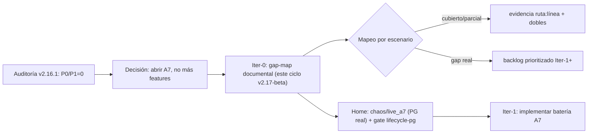

# PLAN A7 — LIVE Certification, Iter-0: marco + gap-map documental (sin tests todavía) — 2026-09-09

> **Padre:** auditoría externa V2.16.1 (veredicto Global 9.3, P0=0/P1=0) sobre `1596f4ad` (tag `v2.16.1-beta`),
> que recomendó **NO añadir más features** y abrir una fase de **LIVE CERTIFICATION / A7**.
> **Este fichero:** marco + mapa de gaps de la **Iter-0 de A7**. Entregable SOLO documental:
> no escribe código ni tests; detecta qué de la batería del auditor ya tiene cobertura y qué falta.
> Núcleo financiero congelado **intacto**. Alembic head `023_ohlcv_bars_unique_reconcile` (sin migración).

## 1. Por qué Iter-0 documental y por qué acotada

La batería A7 propuesta por el auditor (Risk Gate, Kill Switch, Order FSM, Idempotency, Broker timeout,
Network loss, Broker rejection, Partial fill, Duplicate fill, Unknown state, Restart during order,
Recovery, Reconciliation, Ledger consistency, Multi-worker, Crash injection) es un **programa**, no un
push. Escribir tools/tests de crash-injection sin antes mapear qué cobertura real-PG ya existe dispararía
esfuerzo duplicado y añadiría superficie sobre un núcleo congelado. La Iter-0 respeta la **escalera de
honestidad**: marca por escenario `🟢 cubierto / 🟡 parcial / 🔴 gap` con **evidencia ruta:línea** y
**nada de "batería pasando"** que aún no exista como suite agregada.

No hay, hoy, un único "checklist A7 agregado"; hay cobertura de dominio dispersa y varias suites
real-PG/históricas. Este fichero la consolida para decidir el gate de la Iter-1.

> **Estado tras V2.18 (Iter-1 A7, gated a C3):** el gap principal **C3** pasó a 🟡 **cubierto(parcial)**
> con la batería real-PG `apps/api-python/tests/chaos/live_a7/` + CI `a7-gate` (BD dedicada `bolsa_v1_a7`,
> fail-hard con `LIVE_A7_PG_REQUIRED=1`). Ver §3 fila C3, §4 (home efectivo) y §5 (backlog: el puente
> restante es la vertiente financiera del crash, reservada a Iter-2 bajo XL-3). Traspaso-relevo del ciclo:
> `traspaso-relevo-a7-iter1-c3-v2-18-beta-2026-09-09.md`.

## 1bis. Hallazgos de contexto frente a la auditoría externa V2.16.1

- **P2-05 (punto 9 del auditor) YA CERRADO.** La auditoría marcó que
  `traspaso-relevo-elevacion-v2-16-1-beta-2026-09-09.md` aún decía "sin push/aún falta el tag y el CI".
  El commit `b8858c2f` (HEAD de `main`) ya actualizó ese doc + `CHANGELOG.md` registrando el SHA
  `1596f4ad`, el tag `v2.16.1-beta` creado, el push a `origin/main` y el Release-tag CI `#34331846887`
  GREEN (certify). Docs = CODE; no queda incoherencia documental activa.
- **Gaps A7 nuevos (fruto de este mapa):** C3 (crash-injection sobre `scheduler_worker`) 🔴, y los 🟡
  A3 (timeout/network real) y B2 (partial fill → materialización) — ver §3 y backlog §5.

## 2. Veredicto de partida (verificado sobre `1596f4ad` = v2.16.1-beta GREEN)

- **P0:** sin evidencia de doble abono, bypass de kill-switch, escritura LIVE accidental, restore
  destructivo sobre `bolsa_v1`, cross-owner explotable, pérdida `fill_unseen`, CI oculto o DR roto.
- **P1:** cerrados los venidos siguiendo: P1-02 (`set_default_account`), P1-03
  (`delete_simulated_account`), iso account-less 43/43 real-PG, Release-tag CI `#34331846887` GREEN
  (certify success).
- **P2 fuera de esta Iter-0:** P2-01 (ExecutionEvent APPLIED durable + APPLYING/FAILED/RETRY durable),
  P2-02 (3-2-1 off-site operativo), P2-03 (RPO/RTO histórico con SLO P95), P2-04 (multi-owner end-to-end).
- **P3 del núcleo:** aceptados como riesgo medido en C2 (C2-07/09/10/11/C2-03/04) — NO tocar hasta runtime
  LIVE/A7; varias condiciones de reapertura de C2 apuntan precisamente a "cuando se arme runtime LIVE A7".

## 3. Los 16 escenarios de la certificación A7 → mapa contra la cobertura actual

Leyenda: `🟢` cubierto por suite existente · `🟡` parcial (algún hueco real-PG o de agregación) · `🔴` gap.

### Grupo A — Orden / FSM / adaptadores (dominio PY + espejo TS)

| #   | Escenario                | Fuentes (ruta:línea)                                                                                                                                                                                                                                                                                                                               | Dobles a reutilizar                                                  | Estado | Observación                                                                                                          |
| --- | ------------------------ | -------------------------------------------------------------------------------------------------------------------------------------------------------------------------------------------------------------------------------------------------------------------------------------------------------------------------------------------------- | -------------------------------------------------------------------- | ------ | -------------------------------------------------------------------------------------------------------------------- |
| A1  | **Kill Switch / unlock** | `packages/py/application/src/bolsa_application/live_execution_runtime.py` (`live_execution_unlocked`, env `LIVE_EXECUTION_UNLOCKED`); `risk_runtime.py` (`effective_kill_switch`); `XtbBrokerAdapter` en `broker_adapter.py` re-consulta kill antes de submit. Tests: `test_live_execution_runtime.py`, `test_broker_adapter.py`                   | env gates, lambda fake kill-switch                                   | 🟢     | env fail-closed; sin endpoint HTTP unlock-only-live (el venue se cambia por `/api/risk/broker-venue`)                |
| A2  | **Order FSM (XL-3)**     | `packages/py/analytics/src/bolsa_analytics/cognitive/live_order.py` (`LiveOrder`, `ALLOWED_LIVE_ORDER_TRANSITIONS`, `_TERMINAL`, `forbid_repost_from_unknown`, `forbid_execute_trade_for_partial`); espejo TS `packages/shared/src/cognitive/live-order.ts`. Tests: `analytics/tests/test_live_order.py`, `packages/shared/src/live-order.test.ts` | —                                                                    | 🟡     | Dominio lógico bien cubierto; no hay test FSM contra runtime LIVE real (partial-fill materializado en ledger PARKED) |
| A3  | **Broker timeout**       | `packages/py/market/src/bolsa_market/providers.py` (`XtbBridgeClient` submit/query); `XtbLiveOrderQueryAdapter` (`live_order_query.py`); `broker_adapter.py`                                                                                                                                                                                       | mock bridge `scripts/xtb-bridge-mock.mjs`; fakes `_FakeXtb` en tests | 🟡     | cobertura unit vía fakes; sin script de **timeout real** del bridge (red/timeout de socket)                          |

### Grupo B — fills / idempotencia / materialización financiera

| #   | Escenario                                                     | Fuentes (ruta:línea)                                                                                                                                                                                                                                                                                                                                                                                                                                                                                                                                                  | Dobles a reutilizar                | Estado | Observación                                                                                            |
| --- | ------------------------------------------------------------- | --------------------------------------------------------------------------------------------------------------------------------------------------------------------------------------------------------------------------------------------------------------------------------------------------------------------------------------------------------------------------------------------------------------------------------------------------------------------------------------------------------------------------------------------------------------------- | ---------------------------------- | ------ | ------------------------------------------------------------------------------------------------------ |
| B1  | **Idempotencia / Duplicate fill**                             | `packages/py/application/src/bolsa_application/execution_event.py` (`apply_fill_idempotent`, identidad `_EXECUTION` = venue_order_id+fill_seq, `apply_pending_execution`, `apply_finance`); `confirm/execution.py` (`apply_idempotent_replay`, `find_existing_fill`). Tests: `test_execution_event.py`, `test_execute_trade_idempotency.py`, `test_auto_execute_idempotency.py`, `test_http_retry_idempotency.py`                                                                                                                                                     | `InMemoryExecutionEventStore`      | 🟢     | cobertura amplia idempotencia on capture; doble-apply evitado por contrato `apply_finance` (ver P2-01) |
| B2  | **Partial fill**                                              | `live_order.py` (`forbid_execute_trade_for_partial` PARKED); brocha de materialización                                                                                                                                                                                                                                                                                                                                                                                                                                                                                | `MockBrokerAdapter`, fakes         | 🟡     | FSM no permite ejecutar parcial en ledger; camino partial→ledger PARKED (roadmap XL-3)                 |
| B3  | **Capture→apply 2 fases (consentimiento)**                    | `execution_event.py`, `apply_pending_execution(execution_id, apply_finance)`; tests `test_execution_event.py`, `test_confirm_crash_restart.py`, chaos `packages/py/infrastructure/tests/chaos/test_crash_consistency.py`                                                                                                                                                                                                                                                                                                                                              | `InMemoryExecutionEventStore`      | 🟢     | Auditoría 3 cerrado; la deuda durable `APPLYING/APPLIED/FAILED` es P2-01 (no Iter-0)                   |
| B4  | **Duplicate fill / doble materialización**                    | `execution_event.py` + `find_existing_fill`; tests de no doble materialización                                                                                                                                                                                                                                                                                                                                                                                                                                                                                        | `InMemoryExecutionEventStore`      | 🟢     | cubierto en Auditoría 3                                                                                |
| B5  | **Reconcile / Ledger consistency / Drift (LR-1, live_drift)** | `packages/py/application/src/bolsa_application/live_order_machine_reconcile.py` (`reconcile_live_order_machine`, fail-closed, no-muta); `order_live_drift_incident.py` (`publish_order_live_drifts`, merge por firma, `LIVE_LIVE_DRIFT_DURABLE_WRITER_ENABLED`); `reconcile_live_ledger.py`, `reconcile_live_positions.py`; `reconciliation_opening_gate.py`. Tests: `test_live_order_machine_reconcile.py`, `test_order_live_drift_incident.py`, `test_e2_v2_14_incident_dedup_pg.py`, `test_reconcile_live_ledger.py`, `test_reconcile_financial_integrity_v194.py` | `MockLiveOrderQuery`, fakes bridge | 🟢     | recon mantiene fail-closed; recovery reconciler + incidentes cubiertos (Auditoría 2)                   |

### Grupo C — Crash / restart / multi-worker (candidato a home real-PG para Iter-1)

| #   | Escenario                                             | Fuentes (ruta:línea)                                                                                                                                                                                                                                                                                                                                                                                                                                                                                                   | Dobles a reutilizar                       | Estado | Observación                                                                                                  |
| --- | ----------------------------------------------------- | ---------------------------------------------------------------------------------------------------------------------------------------------------------------------------------------------------------------------------------------------------------------------------------------------------------------------------------------------------------------------------------------------------------------------------------------------------------------------------------------------------------------------- | ----------------------------------------- | ------ | ------------------------------------------------------------------------------------------------------------ |
| C1  | **Unknown state / Restart during order / Recovery**   | store `packages/py/application/src/bolsa_application/live_order_store.py` (`PostgresLiveOrderStore`, `claim_unknown_batch`/lease `FOR UPDATE SKIP LOCKED`); worker `apps/api-python/src/bolsa_api/background/live_order_recovery_worker.py` (`live_order_recovery_worker_loop`, `_drain_unknowns`, `resolve_one_unknown`); scheduler `apps/api-python/src/bolsa_api/workers/scheduler_worker.py`. Tests: `test_live_order_recovery_worker.py`, `test_dex2_crash_restart_cross_pid.py`, `test_confirm_crash_restart.py` | `MockLiveOrderQuery`                      | 🟡     | recovery UNKNOWN cubierto unit+PG; poll/partial→ledger está portal PARKED (roadmap)                          |
| C2  | **Multi-worker (2+ reclaimers)**                      | store lease `claim_unknown_batch`; tests `test_live_order_recovery_concurrency_pg.py` (2 workers real-PG), `test_live_order_store_pg.py`                                                                                                                                                                                                                                                                                                                                                                               | `PostgresLiveOrderStore`                  | 🟢     | concurrency PG existe (job lifecycle-pg)                                                                     |
| C3  | **Crash injection sobre `scheduler_worker`/recovery** | Iter-1 (V2.18): batería `apps/api-python/tests/chaos/live_a7/` (+probe `_crash_recovery_probe.py`, +CI `a7-gate`). Evidencia ruta:línea: `test_c3_crash_injection_recovery_worker.py` (C3-A: `test_c3a_crash_after_recovery_claim_then_second_is_exact_once`, C3-B: `test_c3b_crash_after_resolve_put_no_double_on_relaunch`); harness proceso `live_a7/_crash_recovery_probe.py` (`_probe_crash_hold`, `_probe_reader`) sobre `live_order_recovery_worker.resolve_one_unknown`                                        | `PostgresLiveOrderStore`+probe subprocess | 🟡     | cubierto(parcial): crash real-PID + reclaim exacto-una vez + no-doble, **fsm_only** (sin dinero, dec. V2.18) |

## 4. Home futuro de la batería (decisión registrada para Iter-1)

- Área de tests nueva sugerida (Iter-0): **`packages/py/infrastructure/tests/chaos/live_a7/`** (PG-real) bajo estilo
  `chaos/`. En la **Iter-1 (V2.18, escenario C3) el home efectivo quedó en
  `apps/api-python/tests/chaos/live_a7/`**: la realización real-PG cruza la costura app (`bolsa_api.background`
  recovery) + `bolsa_application` (store/lease) y así la batería reusa el mismo camino que
  `test_live_order_recovery_concurrency_pg.py`/`test_live_order_recovery_worker.py`, sin acoplar infra a la app.
- **Gate del contrato de release:** en la Iter-1 se añadió el job **`a7-gate`** de
  [`.github/workflows/release-tag-ci.yml`](../../.github/workflows/release-tag-ci.yml) — Postgres service +
  BD dedicada `bolsa_v1_a7` (drop+create) + pytest `apps/api-python/tests/chaos/live_a7` con
  `LIVE_A7_PG_REQUIRED=1` (fail duro si skip) y `a7-gate` en `needs` de `certify` (no-GREEN si rojo).
- **Dobles canónicos a reutilizar en Iter-1:** `MockBrokerAdapter` (nunca envía), `MockLiveOrderQuery`,
  `InMemoryLiveOrderStore`, `InMemoryExecutionEventStore`, fakes `_FakeXtb` (tests confirm), y
  `scripts/xtb-bridge-mock.mjs` para desplegar el bridge contra el que correr timeout/rejection. En C3 se
  reutilizan `PostgresLiveOrderStore` + `MockLiveOrderQuery` real sobre el probe de proceso.
- **En esta Iter-0 NO se crea** el directorio ni el test: solo se fija el home y el gate. (Ya creados en V2.18.)

## 5. Backlog prioritizado para Iter-1+ (los 🔴/🟡 que deciden el siguiente ciclo)

El orden se deriva del mapa anterior y mantiene "infligir fallo en el punto peligroso sin escribir dinero":

1. **C3 🟡 (en curso, Iter-1 V2.18) — Crash-injection sobre `scheduler_worker`/recovery** ya no es un gap puro:
   la batería `apps/api-python/tests/chaos/live_a7/` + CI `a7-gate` cubren crash de proceso real (SIGKILL) con
   reclaim exacto-una-vez en modo **fsm_only** (ver `test_c3_crash_injection_recovery_worker.py`). Queda abierto
   en la Iter-2 la vertiente **financiera** del crash (recovery UNKNOWN → apply ledger), hoy PARKED por el roadmap
   XL-3 (A3/B2/P2-01 son los siguientes puentes hacia esa vertiente).
2. **A3 🟡 — Broker timeout / network-loss real** frente a `scripts/xtb-bridge-mock.mjs`: prueban el
   fail-closed `unknown` y el recovery en `C1`.
3. **B2 🟡 — Partial fill** → decidir si materializa ledger en esta iteración del roadmap XL-3 (hoy PARKED)
   o se mantiene forbid (la decisión cambia Iter-2).
4. **P2-01 — ExecutionEvent estado durable APPLYING/APPLIED/FAILED** sobre restart/crash/2 workers (cuelga
   aquí; hoy la garantía es el contrato idempotente de `apply_finance`, descrito por el auditor como A7-P2).

## 6. Qué NO se hace en Iter-0 (explícito)

- Escribir/agregar tests de batería A7 (todo lo de arriba es Iter-1+).
- Cerrar P2-01/02/03/04.
- Modificar el núcleo financiero congelado ni el FSM/reconcilers/DR activos.
- Añadir funcionalidades de producto.

## 7. Diagrama de decisión

FIN DEL PLAN — Iter-0 de A7 definida como marco + gap-map sin escribir tests; núcleo congelado intacto;
backlog y home listos para decidir la Iter-1.
