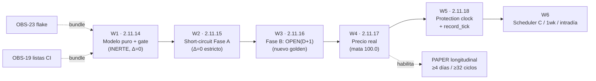

# Plan de trabajos — `GRANULARIDAD-OPERATIVA` AUTO (post-auditoría del tag `v2.88.12-beta`)

> **Clase de documento:** **PLAN** (no sello). No introduce versión, no toca `src`, no toca umbrales.
> **AsOf:** 2026-09-30 · **Base de diseño:** [`rethink-granularidad-operativa-auto-v2-2026-09-30.md`](./rethink-granularidad-operativa-auto-v2-2026-09-30.md) (diseño v2, sellado en **`v2.88.13-beta`** / `2.11.13-beta`).
> **Origen:** auditoría del propietario sobre `v2.88.12-beta` (22 puntos) + decisión de orden confirmada (modelo puro primero; en Fase B, **solo** el anclaje temporal).
> **Qué hace este documento:** fija la **secuencia de incrementos** (`W1`…`W6`), las **reglas de la partida** y las **citas verificables** que sostienen el diagnóstico. **Sustituye, en cuanto a orden**, al roadmap §11 del diseño v2; el contenido arquitectónico de ese diseño sigue vigente.
> **Padre:** [`PROJECT_STATE.md`](./PROJECT_STATE.md) · [`engineering-index-2026-08-03.md`](./engineering-index-2026-08-03.md) · [`deuda-p3-post-auditoria-v2.70-2026-09-26.md`](./deuda-p3-post-auditoria-v2.70-2026-09-26.md).

---

## 1. Punto de partida (verificado en el tag, no recordado)

El diagnóstico de la auditoría se sostiene sobre estos hechos, todos presentes hoy en el árbol:

| Hecho | Evidencia (fichero:línea) |
| --- | --- |
| El **bucle** del motor late cada **60 s** por defecto | `apps/api-python/src/bolsa_api/background/auto_simulation_worker.py:6036` (`_sim_interval_seconds(default: float = 60.0)`, env `AUTO_ENGINE_SIM_INTERVAL_SECONDS`) |
| El **dato** es diario: la barra decide, el tick no | `apps/api-python/src/bolsa_api/background/auto_simulation_worker.py:3026` (`bar_window(self._time, self._v2_tunables.signal_timeframe)`) |
| En producción el **precio es plano** (`100.0`) | `apps/api-python/src/bolsa_api/background/auto_simulation_worker.py:317` (`flat_price_script` → `return 100.0`), default en `:616`, `self._price_script` en `:686` |
| El **fill se ancla al minuto**, no a la barra | `apps/api-python/src/bolsa_api/background/auto_simulation_worker.py:1324` (`seed=self._minute * 100_003 + …`), `:1326` (`base_mid=self._price_script(symbol, self._minute)`) |
| El `AutoSimRuntime` productivo **no recibe `price_script`** → cae al plano | `apps/api-python/src/bolsa_api/background/auto_simulation_worker.py:5997` (construcción), `:6030` (`interval_seconds=…`) |
| La **protección** se evalúa con el **minuto** simulado, no con OHLC de barra | `packages/py/application/src/bolsa_application/protection_compat.py:87` (`protection_exit_reason`), `:94` (`minute: int`), `:109` (cierre de sesión por minuto) |
| La **frontera de barra** ya existe como autoridad única | `packages/py/analytics/src/bolsa_analytics/cognitive/signal_identity.py:118` (`def bar_window(moment, timeframe)`) |
| El **seam de barra** en el worker ya existe (se reutiliza, **no** se reescribe) | `apps/api-python/src/bolsa_api/background/auto_simulation_worker.py:3020` (`_v2_current_bar_start`), `:3029` (`_v2_roll_consumed_bar`), `:909` (`_v2_consumed_bar`) |
| El **contrato del `PriceScript`** ya es inyectable y determinista | `apps/api-python/src/bolsa_api/background/auto_simulation_worker.py:296` (`PriceScript = Callable[[str, int], float]`) |
| El **contrato del tick** es idempotente por `seq` monótono | `packages/py/application/src/bolsa_application/auto_engine_state_store.py:84` (`AutoEngineTickInput.seq`), `:107`/`:125` (`record_tick`), `:19` (idempotencia por `seq`) |
| El productor del tick vive en el worker de PAPER | `apps/api-python/src/bolsa_api/background/paper_auto_engine_worker.py:317` (`await store.record_tick(tick)`) |
| La **semántica correcta** (`OPEN(D+1)`) ya está implementada en el replay | `packages/py/application/src/bolsa_application/replay_oos.py:205` (`step_day_clock`), `:219` (`make_day_price_script`), `:260` (`ReplayCursor`) |
| El **seam de snapshot** ya acepta `timeframe` (hoy el worker no lo cablea) | `packages/py/application/src/bolsa_application/active_strategy_signal_evaluator.py:58` (`make_bar_snapshot_loader(..., timeframe=…)`) |
| La **matriz de mutaciones** llega a `M269` | `apps/api-python/scripts/v2_44_mutation_audit.py:747` (`MUTATIONS: list[...] = [`), última en `:2936` (`M269 (OBS-21, propagacion MUDA del rechazo permanente)`) |
| Los **gates** son `Release tag CI` + `python-ci`; las listas de pytest son **manuales** | `.github/workflows/release-tag-ci.yml:261` (job `python`), `.github/workflows/python-ci.yml`; deuda `OBS-19` |
| `OBS-21` está **CERRADA**; `OBS-23` sigue **ABIERTA** | `docs/engineering/evidence/v2.88.12/README.md:70` (`OBS-23`), `docs/engineering/evidence/v2.88.12/README.md:85` (`OBS-21` cerrada en `v2.88.11-beta`) |

> **Deriva de citas tras `W1` (`v2.88.14-beta`) — re-medida 2026-09-30 (anotación fechada, NO reescritura).**
> El sello `W1` toca **sólo dos** de los ficheros citados arriba (`auto_simulation_worker.py` y
> `v2_44_mutation_audit.py`), así que las citas de esas filas se han **desplazado**; el resto de ficheros
> (`protection_compat.py`, `signal_identity.py`, `auto_engine_state_store.py`, `paper_auto_engine_worker.py`,
> `replay_oos.py`, `active_strategy_signal_evaluator.py`, los dos workflows) **no** se tocaron y sus líneas
> siguen vigentes. Valores **hoy** en el árbol:
>
> - `auto_simulation_worker.py`: `PriceScript` `:296 → :297` · `flat_price_script` `:317 → :318` · default
>   `:616 → :617` · `self._price_script` `:686 → :687` · `AutoSimRuntime` `:5997 → :6005` ·
>   `interval_seconds=` `:6030 → :6038` · `_sim_interval_seconds` `:6036 → :6044` · `seed` del fill
>   `:1324 → :1333` · `base_mid` `:1326 → :1334` · `_v2_current_bar_start` `:3020 → :3028` ·
>   `_v2_roll_consumed_bar` `:3029 → :3037` · `_v2_consumed_bar` `:909 → :917`.
> - `v2_44_mutation_audit.py`: `MUTATIONS` `:747 → :760`; la última mutación ya **no** es `M269` (`:2936 →
>   :2949`): tras `W1` la matriz llega a **`M274`** (`:2962`, gate fail-OPEN / `1wk` habilitada /
>   `next_bar_open` / política sin gate / degradación silenciosa).
>
> **Y dos citas cambian de SEMÁNTICA, no sólo de línea:** la lectura del dato diario (`bar_window`, antes
> `:3026`) y la lectura de `signal_timeframe` (`:1936`) **ya no** leen `self._v2_tunables.signal_timeframe`
> directo, sino `self._v2_granularity.decision.timeframe` — el **seam inerte** de `W1`; con el default `1d`
> el valor es **idéntico** (`Δ = 0`, golden byte-idéntico).
>
> **Estado de la deuda:** la fila de `OBS-23` de esta tabla queda **caducada**: `OBS-23` fue **CERRADA** por
> `W1` (`_sell_seed_with_fill` determinista; ver [`evidence/v2.88.14/README.md`](./evidence/v2.88.14/README.md) §5).

**Consecuencia medida:** ~**1.440 ticks/día** para **~1 decisión real** por barra diaria, sobre un precio que **no se mueve** y con el fill anclado a un minuto que **no es la barra**.

---

## 2. Reglas de la partida (no negociables)

1. **Fase A y Fase B nunca en el mismo incremento.** La Fase A es **semánticamente neutra** (`Δ = 0`); la Fase B **puede** cambiar resultados y exige **golden nuevo**.
2. **Ningún cambio de semántica sin golden citado y explicado** (el delta old-vs-new va en la evidencia).
3. **`1wk` queda declarada pero NO habilitada** hasta definir resolución del hueco del lunes y sus tests temporales.
4. **Dato ausente ⇒ fail-closed.** Se rechaza la configuración o se declara `BLOCKED`; **nunca** degradación silenciosa ni `100.0`.
5. **No se toca el gobernador ni el `alembic head`** (`046_fill_reference_mid`) sin causa justificada.
6. **Todo fichero de test nuevo entra en AMBOS workflows** (`python-ci.yml` y `release-tag-ci.yml`) — rompe de paso `OBS-19` para esos ficheros.
7. **Dos relojes separados, nunca uno solo:** el **heartbeat de infraestructura** (60 s, recovery, watchdog) vive **fuera** del value object de dominio.

---

## 3. Secuencia de incrementos

### W1 — `v2.88.14-beta` (`2.11.14-beta`) · Modelo puro `OperativeGranularity` + capability gate (**INERTE**)

**Objetivo:** introducir el vocabulario y el gate **sin ningún efecto observable**.

> **ESTADO (2026-09-30): SELLADO y CERTIFICADO.** `v2.88.14-beta` (`421686d4`) publicado; `Release tag CI`
> run [`36737341525`](https://github.com/jvelasca/Bolsa_V1/actions/runs/36737341525) → **`SUCCESS`** en la
> primera pasada (`certify` GREEN, 10 jobs verdes; job `python` **`3137 passed, 38 skipped`**), con la cita
> POST-TAG en `main` (`7fabd2ff`). `OBS-23` **CERRADA** y el **caso** de `OBS-19` cerrado. Evidencia:
> [`evidence/v2.88.14/README.md`](./evidence/v2.88.14/README.md).

**Entregables**
- `packages/py/domain/src/bolsa_domain/operative_granularity.py` (nuevo): value object frozen.
  - `OperativeGranularity` = `DecisionClock` + `ProtectionClock` + `ExecutionModel` + `EvidenceBucket`.
  - `InfrastructureClock` **fuera** del VO (heartbeat/watchdog).
  - Matriz de capacidades: solo `1d` activa; `1wk` **declarada, no habilitada**.
  - Gate **fail-closed** con rechazo tipado (p. ej. `UnsupportedGranularityError`) para combinaciones que exijan resolución no soportada por la ingesta.
- `packages/py/application/src/bolsa_application/operative_granularity_policy.py` (nuevo): env (`AUTO_ENGINE_OPERATIVE_GRANULARITY`, default `1d`) → VO; `signal_timeframe` **derivado** del `DecisionClock`.
- Seam en el worker: leer el VO y alimentar `bar_window(...)` (`:3026`); con `1d` → **byte-idéntico**.
- Tests: `packages/py/domain/tests/test_operative_granularity.py` y `packages/py/application/tests/test_operative_granularity_policy.py`.
- Mutaciones **`M270+`**: degradación silenciosa a `1d`, `1wk` habilitada, gate fail-open.
- Golden `test_auto_v2_golden_day_evidence.py` **sin cambio**.
- Bundle de `OBS-23` (ver §4).

**Gate de cierre:** golden byte-idéntico · Ruff / Import-linter / Mypy verdes · mutaciones verdes · `certify` verde.

---

### W2 — `v2.88.15-beta` (`2.11.15-beta`) · Short-circuit Fase A (semánticamente **NEUTRO**)

**Objetivo:** dentro de la misma barra D1, no repetir el trabajo que no puede cambiar resultado.

> **ESTADO (2026-09-30): IMPLEMENTADO, pendiente de commit/tag del propietario.** `ruff`/`mypy`/
> `import-linter` verdes, golden del día intacto, suite nueva **5/5**, mutaciones `M275`→`M278` **4/4**.
> Evidencia: [`evidence/v2.88.15/README.md`](./evidence/v2.88.15/README.md). La cita del CI es **POST-TAG**
> (predicción declarada: job `python` **`3142 passed, 38 skipped`** = `3137 + 5`).
>
> **PRECISIÓN FECHADA AL DISEÑO DEL GUARD (no reescritura de los entregables).** Los entregables de abajo
> decían «saltar decisión / protección / marks / liquidación». **Medido y decidido al implementar:** se
> reutiliza **sólo el DATO de barra** (lecturas de régimen, espejo de consumo, contexto de cartera, órdenes
> pendientes, Adaptive y poda) y la **decisión pura se RECALCULA en cada turno** (`plan_v2_tick`), porque
> el embudo, el journal y la procedencia del ATR son **contabilidad del tick** y omitirlos cambiaría el
> informe del día (`Δ evidence ≠ 0`). **La PROTECCIÓN y la liquidación NO se cortocircuitan jamás:** corren
> en el bucle por símbolo de `auto_turn`, fuera del seam de I/O. Guardas **fail-closed** medidas: barra con
> aprobación **sin consumir** (`_v2_bar_pending`) ⇒ no se reutiliza; plan que **falla** ⇒ la barra no queda
> acreditada y el turno siguiente relee; **cambio de barra** ⇒ relee. El seam vive **sólo** dentro de
> `real_turn` (encendido con `try…finally`), así que el arnés hermético sigue midiendo el plan completo.
>
> **Y `OBS-16` deja de vigilarse «por suites vecinas»:** la cobertura local-vs-CI se **mide** con las dos
> listas recogidas localmente (`python-ci.yml` `3172`; `release-tag-ci.yml` `3180` = `3142 + 38`) y el único
> rojo local es el **PG-local pre-existente** `test_auto_v70_auto23_evidence_validation.py` (`assert 17 ==
> 26`), que CI **salta** y que falla **idéntico** con el cambio de `W2` descartado. La **instrumentación de
> CPU/ticks-día** queda declarada **NO MEDIDA**; lo medido es el I/O por turno (`4 → 1` lecturas de
> régimen/contexto/órdenes en una barra de 4 turnos).

**Entregables**
- Guard: si `_v2_current_bar_start()` (`:3050`) == `_v2_consumed_bar` (`:939`), reutilizar el **dato** de barra **manteniendo la decisión y el heartbeat** (`record_tick`; `auto_engine_state_store.py:107`) ⇒ **`Δ record_tick = 0`** y **sin tocar el contrato del store**.
- **Arnés de equivalencia estricta** (A/B sobre el **mismo** turno durable con el seam apagado): `Δ fills = Δ cycles = Δ PnL = Δ reservas = Δ settlements = Δ evidence = 0`.
- Instrumentación del I/O ahorrado por turno (**medida**); CPU/ticks-día: **NO MEDIDO** (no se inventa cifra).
- Mutaciones: **`M275`**(guarda de pendiente fail-open) · **`M276`**(sobrevive al cambio de barra) · **`M277`**(la decisión sí se omite) · **`M278`**(ahorro vacío) ⇒ el arnés rompe en todas.

**Gate de cierre:** tabla `Δ = 0` en evidencia + golden intacto.

> **Deriva de citas tras `W2` (`v2.88.15-beta`) — re-medida 2026-09-30.** El sello `W2` toca **sólo dos**
> ficheros citados en §1 (`auto_simulation_worker.py` `+131/−20` y `v2_44_mutation_audit.py` `+40`), así que
> las citas de esas filas se desplazan otra vez. Regla medida del desplazamiento: **`+22`** para todo lo
> posterior a `:743` (el bloque de estado de barra), **`+40`** adicional para lo posterior a `:3107` (los
> helpers del seam) y el resto de los hunks de `auto_turn`/`real_turn`. Valores **hoy** en el árbol:
>
> - `auto_simulation_worker.py`: `seed` del fill `:1333 → :1355` · `base_mid` `:1334 → :1356` ·
>   `_v2_consumed_bar` `:917 → :939` · `_v2_current_bar_start` `:3028 → :3050` (el `bar_window(...)` que
>   usa, `:3034 → :3056`) · `_v2_roll_consumed_bar` `:3037 → :3059` · `AutoSimRuntime` `:6005 → :6116` ·
>   `interval_seconds=` `:6038 → :6149` · `_sim_interval_seconds` `:6044 → :6155`. **Intactas** (≤`:743` o
>   ficheros no tocados): `PriceScript` `:297`, `flat_price_script` `:318`, default `:617`,
>   `self._price_script` `:687`.
> - `v2_44_mutation_audit.py`: `MUTATIONS` `:760 → :766`; la última mutación deja de ser `M274` y la matriz
>   llega a **`M278`** (`:3030`).
>
> **La lectura del dato de decisión sigue SIN leer `signal_timeframe` suelto:** `bar_window` se alimenta de
> `self._v2_granularity.decision.timeframe` (`:3056`), el seam inerte de `W1` — con el default `1d` el valor
> es idéntico.

---

### W3 — `v2.88.16-beta` (`2.11.16-beta`) · Fase B · Anclaje temporal `OPEN(D+1)` (**solo temporal**)

**Objetivo:** corregir *cuándo* se ejecuta, sin tocar aún el *proveedor* de precio.

- `signal_bar = D` → `execution_bar = D+1` → referencia `OPEN(D+1)`.
- Eliminar `seed = self._minute * 100_003` (`:1324`) y el anclaje a `_price_script(symbol, self._minute)` para el fill (`:1326`).
- Converger al contrato ya probado del replay (`replay_oos.py`: `step_day_clock` `:205`, `make_day_price_script` `:219`, `ReplayCursor` `:260`).
- **Nuevo golden** (los resultados cambian legítimamente): se re-sella con el delta old-vs-new explicado.
- Mutaciones: volver a `seed = minute`, ejecutar en `D`, tomar `CLOSE(D)` en vez de `OPEN(D+1)`.

**Gate de cierre:** comparación old-golden vs new-golden **explícita** en evidencia.

---

### W4 — `v2.88.17-beta` (`2.11.17-beta`) · Proveedor de precio real (mata el `flat_price_script`)

**Objetivo:** el runtime productivo deja de simular sobre `100.0`.

- Inyectar trayectoria real (barras persistidas / proveedor de mercado) respetando el contrato determinista `PriceScript` (`:296`) y `base_mid`/`_fill_reference_mid` (`:1326`).
- Configuración explícita en `AutoSimRuntime` (`:5997`): sin datos ⇒ **fail-closed** (`BLOCKED`), nunca `100.0` silencioso.
- Mutaciones: caer a constante, admitir precio no determinista.

**Hito:** a partir de aquí el PAPER **mide algo real** (desbloquea la validación longitudinal y da sentido a W5).

---

### W5 — `v2.88.18-beta` (`2.11.18-beta`) · Protection clock explícito (Modelo A) + contrato `record_tick`

- `ProtectionClock` deja de evaluarse por tick de 60 s y pasa a la resolución declarada (Modelo A: `Low(D) <= stop` sobre OHLC D1); **fail-closed** si el OHLC está incompleto. Punto actual: `protection_compat.py:87`.
- Separar formalmente **`HeartbeatEvent`** (infra, 60 s) de los eventos de barra/dominio en `record_tick`/`AutoEngineStore` (`auto_engine_state_store.py`) — el contrato se modela **antes** de cambiar frecuencias.
- Mutaciones + golden.

---

### W6 — diferido · Scheduler por barra (C), `1wk`, intradía

- Habilitar `1wk` **solo** con resolución del hueco del lunes y tests temporales definidos.
- Intradía / Modelo B de protección (requiere ingesta intradía real) → fase propia.

---

## 4. Trabajos transversales (no bloquean la refactorización)

| Id | Trabajo | Cuándo |
| --- | --- | --- |
| `OBS-23` | Fix del flake PG: fijar `instrument_id`/semilla o forzar un `queue_event` de llenado en `apps/api-python/tests/test_simulated_finance_pg.py::test_permanent_rejection_materializes_failed_not_retry` (≈5,6 % de cola terminal por uuid aleatorio) | **bundled en W1** (evita arrastrar rojos de CI) |
| `OBS-19` | Listas pytest manuales divergentes → alta en ambos workflows (auto-descubrimiento como deuda aparte) | W1 |
| `OBS-15` / `OBS-16` | Techo de 1000 `APPLIED` y cobertura local-vs-CI: vigilar al tocar el bucle | **W2 (`v2.88.15`)**: la cobertura local-vs-CI queda **medida** con las dos listas (`3180 = 3142 + 38`) y `OBS-15` **no se agrava** (el short-circuit no toca la liquidación) — **las dos siguen ABIERTAS** |
| **PAPER longitudinal** | **≥4 días, ≥2 episodios, ≥32 ciclos** — **el objetivo real del proyecto** | Medición en cuanto **W4** esté en `main`, en paralelo a W5/W6 |

---

## 5. Secuencia

**Lo esencial:** `W1` y `W2` son *demostrablemente neutros* (verificables con `Δ = 0`); `W3` es el primer incremento que **cambia resultados** y por eso exige golden nuevo; `W4` es el que da **valor medible real**; `W5`/`W6` son cadencia y cobertura. El PAPER longitudinal **no** se posterga al final: arranca en cuanto `W4` aterrice.

---

## 6. Deudas que este plan NO cierra

`P3-2` / `P3-3` (ventana PAPER real ≥4 días con material), `OBS-22`, `OBS-13`, `OBS-11`, `H-4`, `OBS-9`, `P3-5`, `OBS-5`. Las que **sí** entran en el plan: `OBS-23` y `OBS-19` (W1), `OBS-15` / `OBS-16` (W2, **vigiladas y medidas** en `v2.88.15`; siguen **ABIERTAS**).

---

## 7. Trazabilidad

- **Diseño v2 (vigente):** [`rethink-granularidad-operativa-auto-v2-2026-09-30.md`](./rethink-granularidad-operativa-auto-v2-2026-09-30.md).
- **Diseño v1 (SUPERSEDED en lo arquitectónico):** [`rethink-granularidad-operativa-auto-2026-09-30.md`](./rethink-granularidad-operativa-auto-2026-09-30.md).
- **Evidencia del diseño v2:** [`evidence/v2.88.13/README.md`](./evidence/v2.88.13/README.md).
- **Deuda P3:** [`deuda-p3-post-auditoria-v2.70-2026-09-26.md`](./deuda-p3-post-auditoria-v2.70-2026-09-26.md).
- **Replay OOS (referencia de la semántica `OPEN(D+1)`):** [`replay-oos-viabilidad-auto-v2.86-2026-09-29.md`](./replay-oos-viabilidad-auto-v2.86-2026-09-29.md).
