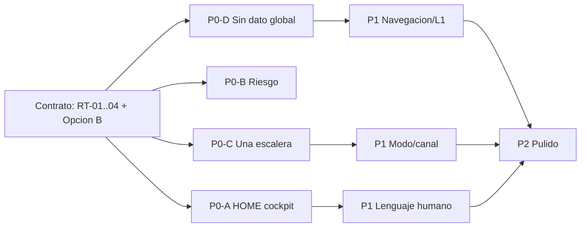

# Plan único UI 6.0 — derivado del Mapa de problemas UI 5.0

> **AsOf:** 2026-10-08 · **Estado:** **PLAN (no implementado)** — un único plan ordenado, sin parches pantalla a pantalla.
> **Base:** tag `v2.88.89-beta` (commit `b9557c21`), `Δ motor = 0`.
> **Padres:** [Mapa de problemas UI 5.0](./auditoria-ui-5-0-mapa-problemas-2026-10-08.md) · [UI Contract 5.0](./spec-ui-contract-5-0-2026-10-08.md) · [ADR-045](../adr/045-ui-contract-5-0.md).
> **Naturaleza:** UI / producto / semántica. Sin motor, sin worker, sin umbrales, sin Alembic, sin contrato HTTP.

---

## 0. Principios de ejecución

1. **Un solo plan, slices aditivos.** Ninguna pantalla se borra antes de que su sustituto esté verde.
2. **Simplificación global** (decisión de producto): una sola UI para todos; «Más información» es el **único** mecanismo de profundidad (RT-04). No se introduce rol por usuario.
3. **Cartera = vista rotulada** de `/mesa` (sin ruta propia nueva).
4. **`AdminRail` = administrativa/técnica** (sin duplicar las cinco puertas L1).
5. **Falsable por test:** cada slice cierra con test que rompe la regla `UI5-xx` correspondiente.
6. **`Δ motor = 0`** por construcción; el diff no toca el worker ni el esquema.

---

## 1. Contrato a actualizar antes de codificar

| Documento | Cambio |
| --- | --- |
| [`spec-ui-contract-5-0-2026-10-08.md`](./spec-ui-contract-5-0-2026-10-08.md) | Añadir a §2 las reglas **RT-01…RT-04** (§7 del mapa) y sustituir `UI5-14` por el **vocabulario Opción B** (§9 del mapa: `Sin dato todavía` / `No aplica` / `No disponible` / `—` solo nivel 3). |
| [`045-ui-contract-5-0.md`](../adr/045-ui-contract-5-0.md) | Enmendar §1: `Cartera` = vista rotulada; `AdminRail` administrativa/técnica; declarar RT-01…RT-04. |
| [`040-user-information-architecture.md`](../adr/040-user-information-architecture.md) | Enmienda: `Cartera` conserva su vista pero se rotula inequívocamente; `AdminRail` no replica L1. |
| `CHANGELOG.md` | Entrada del estudio (documento + plan). |

---

## 2. Roadmap por slices

### P0-A · HOME de AUTO = cockpit real (regla `UI5-04`, RT-03)

**Problema:** `SIMULACIÓN — DINERO VIRTUAL` pintado dos veces; estado/reloj repetidos con Sistema; hasta 6 huecos; `Ver todas las operaciones` colgando de Oportunidades.

**Ficheros:** [`auto-home-page.tsx`](../../apps/web/src/features/auto/auto-home-page.tsx) · [`auto-reality-strip.tsx`](../../apps/web/src/features/auto/auto-reality-strip.tsx) · [`auto-account-figures.ts`](../../apps/web/src/features/auto/auto-account-figures.ts) · [`auto-basic-home.ts`](../../apps/web/src/features/auto/auto-basic-home.ts) · [`auto-workspace-layout.tsx`](../../apps/web/src/components/layout/auto-workspace-layout.tsx) · [`auto-home-page.test.tsx`](../../apps/web/src/features/auto/auto-home-page.test.tsx)

**Cambios:**
- Único chip `SIMULADO` (heredado del reality strip; retirar el chip local del bloque Dinero).
- Único lugar para el estado del motor y el reloj de decisión (la HOME los declara; Sistema los referencia, no los repite).
- **Hueco único:** si varias cifras no están medidas, una sola declaración (no N «Sin dato todavía» apilados).
- Mover `Ver todas las operaciones` de **Oportunidades** a **Operación/Actividad**.
- Recortar la tarjeta de 6 slots del primer nivel (dejar resumen; el detalle, plegado).

**Test falsable:** `auto-home-page.test.tsx` — un solo `data-testid` de simulación; `SIMULACIÓN — DINERO VIRTUAL` aparece **una** vez; huecos declarados una vez; `auto-home-all-operations-link` fuera de `auto-home-opportunities`.

---

### P0-B · Riesgo human-first (regla `UI5-18`, RT-03, §9)

**Problema:** veredicto + 3 campos repiten hueco; `NO MEDIDO` en `h1` vs `Sin dato todavía` en cuerpo vs `"todavía no están disponibles"`.

**Ficheros:** [`auto-riesgo-page.tsx`](../../apps/web/src/features/auto/auto-riesgo-page.tsx) · [`auto-risk-summary.ts`](../../apps/web/src/features/auto/auto-risk-summary.ts) · [`auto-copy.ts`](../../apps/web/src/features/auto/auto-copy.ts) · [`auto-riesgo-page.test.tsx`](../../apps/web/src/features/auto/auto-riesgo-page.test.tsx)

**Cambios:**
- Primer nivel: **un** veredicto + **una** frase (`Controlado`/`Atención`/`Bloqueado`) + **un** mensaje de hueco, no cuatro.
- Vocabulario único: sustituir `NO MEDIDO` y `"todavía no están disponibles"` por el vocabulario Opción B.
- Métricas reales solo cuando existan; enlace único a `Cartera → Riesgo`.

**Test falsable:** ausencia de repetición del literal de hueco en primer nivel; el `h1` no contiene `NO MEDIDO`.

---

### P0-C · Una sola escalera de operación (reglas `UI5-09`, `UI5-20`)

**Problema:** segunda escalera en inglés en Confirm (`proposed/signed/submitted/filled*|rejected|not_wired`), `sin dato`, `Proponer Recommendation`.

**Ficheros:** [`live-virtual-order-gateway.tsx`](../../apps/web/src/features/confirm/live-virtual-order-gateway.tsx) · [`live-virtual-ladder.ts`](../../apps/web/src/features/confirm/live-virtual-ladder.ts) · [`supervised-f3-panel.tsx`](../../apps/web/src/features/settings/supervised-f3-panel.tsx)

**Cambios:**
- Reutilizar la **escalera universal** ([`auto-operation-ladder.ts`](../../apps/web/src/features/auto/auto-operation-ladder.ts)) para los peldaños visibles; eliminar los tokens ingleses de la UI.
- `sin dato` → `Sin dato todavía`.
- `Proponer Recommendation` → etiqueta en español y alineada con `Confirm = firma`.
- Garantizar que un ciclo `closed` no salta a `position_closed` sin evidencia intermedia.

**Test falsable:** ningún literal `proposed|submitted|filled*|rejected|not_wired|sin dato` en el DOM de Confirm; los peldaños usan el vocabulario `UI5-09`.

---

### P0-D · `Sin dato todavía` global (regla `UI5-14` + Opción B)

**Problema:** `—` es el estado de-facto fuera de AUTO (~100 ficheros); varias superficies de primer nivel.

**Ficheros (primer lote, nivel 1):** [`operations-panel.tsx`](../../apps/web/src/features/trading/operations-panel.tsx) · [`mesa-position-row.tsx`](../../apps/web/src/features/mesa/mesa-position-row.tsx) · [`chart-utils.ts`](../../apps/web/src/lib/chart-utils.ts) · [`trading-status-bar.tsx`](../../apps/web/src/features/trading/trading-status-bar.tsx) · [`research-page.tsx`](../../apps/web/src/features/research/research-page.tsx) · [`history-page.tsx`](../../apps/web/src/features/history/history-page.tsx)

**Cambios:**
- **Helper compartido** de estado de dato ausente (p. ej. `components/absent-data.ts`) que devuelve `Sin dato todavía` / `No aplica` / `No disponible` y reserva `—` para nivel 3.
- Sustituir `?? "—"` / `: "—"` en las superficies de **nivel 1** listadas; dejar `—` en consola de auditoría (nivel 3).
- Unificar `NO MEDIDO` / `Sin datos` / `Sin dato` / `No disponible` al vocabulario Opción B.

**Test falsable:** los ficheros de nivel 1 no contienen el literal `"—"`; el helper es la única fuente de rótulos de hueco.

---

### P1 · Navegación, L1 y chrome

**Ficheros:** [`app-top-bar.tsx`](../../apps/web/src/components/layout/app-top-bar.tsx) · [`admin-rail.tsx`](../../apps/web/src/components/layout/admin-rail.tsx) · [`daily-nav.ts`](../../apps/web/src/features/confirm/daily-nav.ts) · [`command-registry.ts`](../../apps/web/src/features/command-palette/command-registry.ts)

**Cambios:**
- **Doble activo:** resolver `Hoy`+`Cartera` en `/mesa?view=posiciones` (una sola puerta activa; Cartera rotulada como vista).
- **AdminRail:** dejar solo `Overview`/`Cuentas`/`Perfiles`/`Fiscal`/`AUTO` + `Diagnóstico`; retirar el stub `Estadísticas · pronto` que lanza `alert`.
- **Duplicados:** una sola `Configuración` y una sola `Notificaciones`; `Alertas` en un único sitio.
- **Toolbar avanzada** (layout, toggles, reset) a segundo nivel / palette, no permanente en la barra.
- Mercado: añadir `h1` visible.

**Test falsable:** en `/mesa?view=posiciones` una sola puerta `aria-current`; el chrome no contiene rutas duplicadas para `Configuración`/`Notificaciones`.

---

### P1 · Modo y canal unificados (regla `UI5-10`)

**Ficheros:** [`mode-badge.tsx`](../../apps/web/src/components/mode-badge.tsx) · [`operation-mode.ts`](../../apps/web/src/features/operations/operation-mode.ts) · [`mesa-position-row.tsx`](../../apps/web/src/features/mesa/mesa-position-row.tsx) · [`demo-book-mode-panel.tsx`](../../apps/web/src/features/trading/demo-book-mode-panel.tsx)

**Cambios:**
- `ModeBadge` sistemática en filas y ficha (`AUTO`/`SEMI`/`MANUAL` + `SIMULADO`/`LIVE`).
- Un solo casing y un solo vocabulario de canal (`SIMULADO`/`LIVE`), retirando `Paper`/`DEMO`/`PAPER REAL` en primer nivel.

**Test falsable:** toda fila de operación expone modo y canal; no hay `Paper`/`Demo` en nivel 1.

---

### P1 · Lenguaje humano (densidad RT-01/RT-02 + §8)

**Ficheros:** [`research-page.tsx`](../../apps/web/src/features/research/research-page.tsx) · [`backtests-page.tsx`](../../apps/web/src/features/backtests/backtests-page.tsx) · [`auto-cartera-page.tsx`](../../apps/web/src/features/auto/auto-cartera-page.tsx) · [`auto-analisis-page.tsx`](../../apps/web/src/features/auto/auto-analisis-page.tsx) · [`auto-nav.ts`](../../apps/web/src/features/auto/auto-nav.ts)

**Cambios:**
- Plegar jerga de Asesor/Laboratorio bajo «Más información»; ocultar `Total trials`, `K`, `preset`, `proposedBy`, `campaignId`, JSON `Params`/`Manifest`, `WFE`/`PBO`/`DSR`.
- `ledger y fills` / `ledger científico` → lenguaje humano.
- Copy **único** que explique `Hoy` (universo) vs `AUTO` (subconjunto).
- Eliminar el lenguaje residual «qué puedes hacer» en `auto-home-page.tsx:163` y `auto-nav.ts:74`.

**Test falsable:** ningún término de §8 del mapa en nivel 1 de las superficies tocadas.

---

### P2 · Pulido

- Compactar `AUTO Sistema` (solo diagnóstico) y `AUTO Análisis`.
- Un único «Detalle técnico» (hoy tres etiquetas distintas).
- Consola avanzada sin `—` cuando un dato se muestre fuera de nivel 3.
- Revisión responsive global (`UI5-01`).

---

## 3. Orden de ejecución y dependencias

- **Bloqueante:** §1 (contrato) antes de tocar código.
- **Paralelizables:** P0-A, P0-B, P0-C, P0-D (superficies disjuntas).
- **P1** depende de P0-D (vocabulario) y P0-C (escalera).

## 4. Criterio de cierre por slice

- Cada regla `UI5-xx`/`RT-xx` con **test falsable** verde.
- `pnpm --filter @bolsa/web typecheck` + `lint` + `test` verdes.
- `axe` re-certificado en las rutas tocadas (0 `critical`/`serious`).
- `Δ motor = 0`: sin cambios en motor, worker, umbrales, Alembic ni `contract:gen`.
- Checkbox marcado en la tabla §5 de [`spec-ui-contract-5-0-2026-10-08.md`](./spec-ui-contract-5-0-2026-10-08.md).

## 5. Fuera de alcance

- Motor/worker/umbrales/Alembic/`contract:gen`.
- Creación de tag: se decide **después** de completar los slices.
- Live/XTB real (fuera de AUTO; se declara `SIMULADO`).
- Cualquier rol por usuario (no se introduce; simplificación global).
