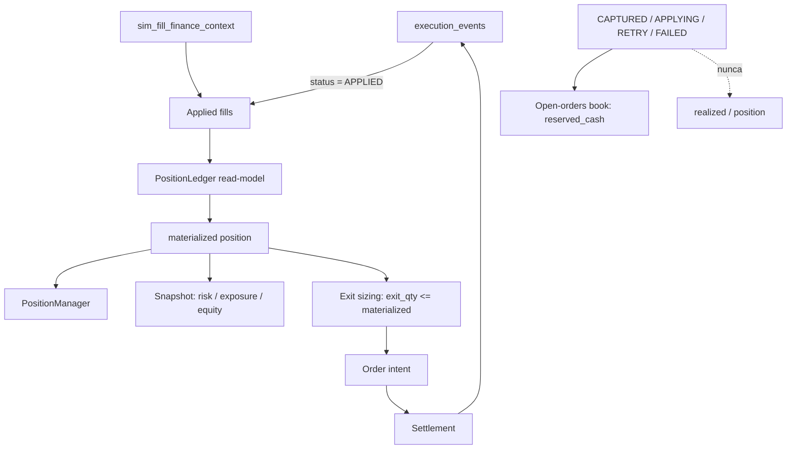

# Plan V2.40.5 — AUTO-1A Position Materialization & Partial-Fill Integrity (implementación)

> **Fecha:** 2026-09-17 · **Bump:** `1.65.4-beta` → `1.65.5-beta` · **Sin migración** (Alembic head
> sigue en `041_unique_natural_keys`). **Punto de partida:** auditorías 1 y 2 sobre
> `v2.40.4-beta` (slice AUTO Safety & Accounting).
>
> Este documento es el **plan de implementación** del slice. El roadmap por fases sigue en
> [`roadmap-auto-v2-40-4-a-v2-48-2026-09-16.md`](./roadmap-auto-v2-40-4-a-v2-48-2026-09-16.md),
> donde `AUTO-1A` queda insertado **antes** de `AUTO-1` (Reservation Engine).

---

## 1. Causa raíz (verificada en código, no en el comentario)

`simulated_fill_schedule` puede dejar una orden **parcialmente llena** (`mid_cut < 0.07` corta antes
del último chunk; `simulated_broker.py` L217-220, `_FILL_CHUNKS = 4`). El worker, sin embargo,
contabilizaba la **cantidad pedida**:

```1730:1730:apps/api-python/src/bolsa_api/background/auto_simulation_worker.py
exec_qty = min(qty, held) if action == "SELL" else qty
```

```1752:1756:apps/api-python/src/bolsa_api/background/auto_simulation_worker.py
            for o in fills:
                self._emit("fill", o.venue, o.execution_id, o.side, o.qty)
                self._record_applied_event(symbol, o, price)
            if action == "BUY":
                self._emit("position_open", venue, fills[0].execution_id, "buy", exec_qty)
                self._open[symbol] = held + exec_qty
```

`_settle` descartaba los outcomes del apply (`result, _out = ...`), así que devolvía **todas** las
`FillObservation` — incluidas las que quedaron en `RETRY` — y `_record_applied_event` las marcaba
como aplicadas. Consecuencias exactas:

- `_open` / `_persist_position` / `_v2_track_entry` / `_v2_track_reduce` usaban `exec_qty` ⇒ posición
  inflada (o deflactada) frente a Σ fills `APPLIED`.
- El exit se clampeaba contra `_open` (inflado) ⇒ `SELL 100` sobre una posición real de `73,5`.
- `_v2_known_fill_ids` deriva de `_applied_execution_events` ⇒ los `RETRY` entraban como "conocidos" y
  **desaparecían del libro de órdenes pendientes** (`_v2_refresh_open_orders`).
- El helper de equity de la suite de scheduler sumaba **todas** las filas de
  `sim_fill_finance_context`, incluidas las no-`APPLIED`:

```208:238:apps/api-python/tests/test_auto_scheduler_real_pg_zero_human_intervention.py
        fills = (
            await session.execute(
                select(
                    SimFillFinanceContextRow.side,
                    SimFillFinanceContextRow.quantity,
                    SimFillFinanceContextRow.price,
                ).where(SimFillFinanceContextRow.account_id == account_id)
            )
        ).all()
        closed_pnl = Decimal("0")
        for side, quantity, price in fills:
            notional = Decimal(str(quantity)) * Decimal(str(price))
            if (side or "").strip().lower() == "sell":
                closed_pnl += notional
            else:
                closed_pnl -= notional
```

`persist_fill_finance_context` escribe contexto de **todos** los fills planificados **antes** de mover
dinero (`simulated_settlement.py` L205-219) ⇒ el hueco `equity != initial + realized + unrealized`
aparecía de forma **intermitente** (dependía de si el tick dejó cola pendiente). Ese es el flake del
scheduler que la auditoría midió y que este slice cierra.

---

## 2. Invariantes que instala AUTO-1A

- `POSITION = Σ APPLIED BUY − Σ APPLIED SELL` (única fuente de verdad).
- `requested_qty`, `filled_qty` y `materialized_qty` son tres números distintos y se journalizan.
- `exit_qty <= materialized_position_qty` (invariante duro; T1/trailing/stop también).
- `realized` solo desde `APPLIED`; nunca `CAPTURED` / `APPLYING` / `RETRY` / `FAILED`.
- Fail-closed: libro no legible ⇒ aperturas vetadas, salidas protectoras permitidas.
- Ningún skip de gestión de posición queda sin rastro en el journal.

---

## 3. Workstreams

### WS1 — `PositionLedger` read-model (analytics, puro, hermético)

`packages/py/analytics/src/bolsa_analytics/cognitive/position_ledger.py`:

- `AppliedFillFact` (frozen): `execution_id`, `instrument_id`, `side`, `quantity`, `price`,
  `applied_at`, `strategy_version_id`. Sin `execution_id` no hay identidad financiera ⇒ `ValueError`.
- `LedgerPosition` (frozen): `quantity`, `realized_qty`, `remaining_qty`, `average_entry`,
  `realized_pnl`, `fills`, `violations`; `remaining_qty == quantity − realized_qty` (nunca negativa).
- `PositionLedger`: posiciones + `measurement` + `facts_applied`/`facts_rejected` + `violations`, con
  `quantities()` (solo posiciones **vivas**).
- `build_position_ledger(facts, rejected=…)` con orden determinista por `(applied_at, execution_id)`
  y agrupación por instrumento ⇒ dos ejecuciones con los mismos fills dan el mismo libro y el mismo
  P&L.
- Honestidad: una **sobreventa** aplicada es violación explícita (`oversell_above_position`,
  `oversell_without_position`), nunca un corto inventado; una fila no interpretable **no se descarta
  en silencio**: baja el `measurement`.
- Test: `packages/py/analytics/tests/test_position_ledger.py` (11 casos, incluido el de la auditoría
  `BUY 100 → fills 50 + 23,5 ⇒ 73,5`).

### WS2 — Lectura de fills `APPLIED` (application)

- `execution_event.py`: `list_applied(account_id, *, limit=1000)` en el protocolo +
  `InMemoryExecutionEventStore` + `PostgresExecutionEventStore`
  (`WHERE status='APPLIED' ORDER BY applied_at, execution_id LIMIT`). Sin índice parcial: deuda
  declarada y acotada por `limit` (la migración llega en `AUTO-1`).
- `sim_durable_store.py`: `get_many(execution_ids) -> Mapping[str, SimFillFinanceContext]` (batch,
  evita N+1) en protocolo + doble in-memory + store PG. Un `execution_id` ausente se **omite**: el
  llamante lo declara rechazado, nunca lo cuenta como cero.
- Nuevo `packages/py/application/src/bolsa_application/applied_fills.py`:
  - `read_applied_fill_facts(exec_store, context_store, account_id, *, limit)` → `AppliedFillsRead`
    con `facts`, `ledger`, `measurement`, `rejected`, `mismatched`, `truncated`, `error`.
  - Fail-closed en **cada** costura: sin store, store sin `list_applied`, excepción de lectura, sin
    contexto, `get_many` sin soporte o con excepción, `limit` agotado (`truncated`) ⇒ `UNKNOWN` con
    motivo, nunca un libro "vacío y plausible".
  - Un descuadre entre la cantidad del evento (identidad financiera) y la del contexto (aritmética
    del fill) ⇒ `mismatched` + `measurement` degradado.
  - `CanonicalPositions` (subclase de `dict[str, Decimal]`, contrato del seam
    `canonical_positions_reader` intacto) que además transporta los `AppliedFillFact` que sustentan
    cada cantidad: la reconciliación puede contrastar el canónico en el **mismo acto** de leerlo
    (imprescindible tras un crash, con la RAM del worker vacía).
- Tests: `packages/py/application/tests/test_applied_fills.py` (9 casos: parcial, `RETRY` como
  capital, `APPLIED` sin contexto, descuadre de cantidad, exit total, truncado, fuentes ilegibles,
  libro vacío).

### WS3 — Contabilidad del worker desde fills aplicados

`apps/api-python/src/bolsa_api/background/auto_simulation_worker.py`:

- `_settle` deja de descartar los outcomes: devuelve `_Settlement(applied, unapplied, requested_qty)`
  donde `applied = outcome ∈ {"applied", "already_applied"}`. En modo **structural** (sin
  `finance_applier`: el camino hermético/estructural) los chunks confirmados por el schedule se
  consideran materializados, porque ahí no hay dinero que mover.
- `auto_turn`: `applied_qty = settlement.applied_qty` sustituye a `exec_qty` en `_open`,
  `_persist_position`, `_v2_track_entry`, `_v2_track_reduce` y `_entry_price`; `_record_applied_event`
  recibe **solo** `settlement.applied` (cierra el agujero del libro de pendientes); el emit `order`
  conserva la cantidad **pedida** y `fill`/`position_open`/`position_close` publican la **aplicada**.
- Si no hay ningún fill aplicado: reason code `fill_not_materialized` + journal, nunca silencio. Si
  parte quedó pendiente: `fill_partially_materialized`.
- Invariante duro + defensa en profundidad: `applied_qty <= held` en SELL; si se violara, se aplanan
  las **ventas aplicadas** y se journaliza `exit_qty_over_position` (jamás posición negativa).
- `report.fills` cuenta fills **aplicados**.

### WS4 — Autoridad canónica = ledger

- `_compose_canonical_reader` construye `{symbol: qty}` desde
  `read_applied_fill_facts` (Σ `APPLIED`) en lugar de `position_state`. El seam
  `canonical_positions_reader` y todo `readopt_positions` / `_reconcile_before_trusting` /
  `reconcile_sim_account` se reutilizan sin cambios de contrato.
- Fallo de lectura del ledger ⇒ `None` ⇒ `POSITION_PROJECTION_UNKNOWN` ⇒ aperturas vetadas
  (fail-closed), salidas permitidas.
- Tras un crash: `_open`, cash, riesgo y `PositionState` se reconstruyen desde Σ `APPLIED` +
  proyección; una proyección **inflada** se reescribe a la posición materializada (`REBUILT`) sin
  doble efecto (idempotencia por `execution_id` ya existente).

### WS5 — Observabilidad de skips silenciosos (Auditoría 2)

- `position_manager.py`: `PositionManagerSkip` (frozen: `instrument_id`, `reason`, `detail`,
  `is_protective`, `to_dict()`) + `manage_position_outcome(...)` con retorno tri-estado
  (`PositionManagerResult` | `PositionManagerSkip` | `None`). `manage_position(...)` delega y colapsa
  skips a `None` (retrocompatible: los tests existentes no cambian). Los casos benignos
  (`position is None`, `CLOSED`, `remaining<=0`) siguen siendo `None`.
- Nuevo `auto_reason_codes.py`: dueño único de los literales
  (`no_mark_data`, `mark_rejected`, `decision_unavailable`, `fill_not_materialized`,
  `fill_partially_materialized`, `exit_qty_over_position`) junto a los ya existentes `REGIME_EXIT`
  (`position_manager`) y `TOP_N_EXCLUDED` (`opportunity_ranker`).
- `auto_investment_system.run_auto_cycle`: usa `manage_position_outcome`; el `mark is None` deja de
  ser `continue` mudo ⇒ journal `auto_position_skip` con `no_mark_data` y `attention="high"`; los
  skips del manager se journalizan igual con su motivo.
- El llamador del worker (`_v2_position_package`) propaga el motivo a `_v2_last_exit_reasons[symbol]`
  en vez de quedarse mudo.

### WS6 — Tests, mutaciones y flake

- Nuevo `apps/api-python/tests/test_auto_v2_partial_fills.py` (hermético, sin PG): **seam
  determinista de settlement** (parcial fijo `50 + 23,5 = 73,5`, cola en `RETRY`) que ejecuta el
  camino REAL de liquidación con el mismo applier de dinero del worker. 6 casos: contabilidad de la
  cantidad aplicada, libro vs. capital pendiente, dimensionado del exit, defensa ante sobreventa,
  reconstrucción tras crash de una proyección inflada y libro ilegible (veto de aperturas sin perder
  la posición).
- `packages/py/application/tests/test_position_manager.py`: casos `mark_rejected` y
  `decision_unavailable` devuelven skip con motivo; benignos siguen en `None`.
- `packages/py/application/tests/test_auto_investment_system.py`: `no_mark_data` y `mark_rejected`
  journalizados con `attention="high"`.
- Nuevo helper compartido `apps/api-python/tests/applied_fill_equity.py`:
  `realized_notional_from_applied_fills(session, account_id)` deriva el P&L cerrado del día de
  `execution_events.status='APPLIED'` joined con `sim_fill_finance_context` (cantidad del **evento**,
  lado/precio del contexto) y **declara** con `AssertionError` un `APPLIED` sin contexto o con
  cantidad divergente. Usado por las dos suites PG de jornada completa
  (`test_auto_scheduler_real_pg_zero_human_intervention.py` y
  `test_a9_scheduler_process_pg_zero_human.py`), que ahora miden el MISMO número.
- Instrumento determinista de la mutación M3 (PG, en la suite del scheduler):
  `test_equity_realized_ignores_unapplied_fill_context` siembra un BUY `APPLIED`, un BUY en `RETRY`
  (mismo importe) y un SELL `APPLIED`, y exige que el realizado sea **solo** el de los aplicados
  (`−3.000`, no `−8.000`).
- P0.7: `AUTO_SCHEDULER_PG_REQUIRED=1` + la suite del scheduler en bucle de 30 ejecuciones, buscando
  **30/30** sin retries ni `xfail`.

---

## 4. Matriz de mutaciones (medida, no declarada)

Cada mutación se aplicó sobre el código de este slice, se corrió la suite y se revirtió:

| Mutación                                                                                  | Efecto medido                                                                                                                                                                                                                                                                                                                                    |
| ----------------------------------------------------------------------------------------- | ------------------------------------------------------------------------------------------------------------------------------------------------------------------------------------------------------------------------------------------------------------------------------------------------------------------------------------------------ |
| M1 · `applied_qty = exec_qty` (volver a contabilizar lo **pedido**)                       | **6 rojos** en `test_auto_v2_partial_fills.py`: contabilidad, libro/pendientes, exit, sobreventa, restart y libro ilegible                                                                                                                                                                                                                       |
| M2 · `_record_applied_event` también con `settlement.unapplied`                           | **1 rojo**: `test_partial_entry_ledger_and_pending_tail_stay_separate` (la cola `RETRY` desaparece del libro de pendientes)                                                                                                                                                                                                                      |
| M4 · quitar el clamp `applied_qty <= held`                                                | **1 rojo**: `test_protective_exit_never_exceeds_the_applied_position`                                                                                                                                                                                                                                                                            |
| M5a · `manage_position_outcome` vuelve a `None` en `mark_rejected`/`decision_unavailable` | **2 rojos**: `test_manage_position_outcome_declares_rejected_mark`, `..._declares_decision_unavailable`                                                                                                                                                                                                                                          |
| M3 · quitar el filtro `APPLIED` del helper de equity (sumar todo el contexto)             | **1 rojo determinista**: `test_equity_realized_ignores_unapplied_fill_context` (realizado `−8.000` en vez de `−3.000`: contaba el chunk en `RETRY`). En bucle de 30× sobre la jornada completa **no** se detectó (0/30): el escenario de jornada acaba con el contexto de los fills ya aplicados, así que hace falta el instrumento determinista |

---

## 5. Flujo objetivo



---

## 6. Verificación ejecutada

- `uv run pytest packages/py/application/tests/test_execution_event.py
packages/py/application/tests/test_position_manager.py
packages/py/application/tests/test_simulated_settlement.py
packages/py/analytics/tests/test_position_ledger.py
packages/py/application/tests/test_applied_fills.py
packages/py/application/tests/test_auto_investment_system.py -q`: **80 passed**.
- `uv run pytest apps/api-python/tests/test_auto_v2_worker_integration.py
apps/api-python/tests/test_auto_v2_partial_fills.py apps/api-python/tests/test_a9_1_crash_battery.py
apps/api-python/tests/test_auto_simulation_worker.py -q`: **54 passed**.
- `AUTO_V2_DURABLE_PG_REQUIRED=1 … test_auto_v2_durable_pg.py`: **2 passed** (PG real).
- `AUTO_SCHEDULER_PG_REQUIRED=1 … test_auto_scheduler_real_pg_zero_human_intervention.py` en bucle:
  **30/30 verde** (0 fallos, sin retries ni `xfail`).
- `AUTO_SCHEDULER_PROCESS_PG_REQUIRED=1 … test_a9_scheduler_process_pg_zero_human.py`: **2 passed**
  (proceso de scheduler real, jornada completa, 31 s).
- `mypy packages/py/{domain,market,infrastructure,application}/src apps/api-python/src
--follow-imports=silent`: **485 source files, sin issues**.
- `lint-imports --config packages/py/.importlinter`: **4 contratos kept, 0 broken**.

## 7. Fuera de alcance (deuda declarada, no silenciosa)

- La cola no llena de una entrada parcial queda en `RETRY` como **cash pendiente** (dirección
  segura): no se cuenta como posición ni como realizado, y su cancelación/liberación explícita es
  `AUTO-1` (Reservation Engine).
- Sin índice parcial `execution_events(account_id, status)`: lectura acotada por `limit`; la
  migración llega en `AUTO-1`.
- El `PositionLedger` es un **read-model** derivado (sin tabla propia): la persistencia con
  rollback/replay es `AUTO-1`.
- No se toca la numeración de cabina ni se añade estrategia, Adaptive ni optimizador.

---

## 8. Arranque del auditor

> **Qué auditar:** el slice `V2.40.5` (AUTO-1A) sobre `1.65.4-beta`, **sin migración** (head
> `041_unique_natural_keys`). **No se afirma CI de un tag aún no publicado.**
> **De dónde leer (orden recomendado, 15-30 min):**
>
> 1. **Este fichero** (alcance, causa raíz, invariantes, mutaciones medidas y límites declarados).
> 2. `CHANGELOG.md` `[1.65.5-beta]` (qué cambia para el operador).
> 3. [`roadmap-auto-v2-40-4-a-v2-48-2026-09-16.md`](./roadmap-auto-v2-40-4-a-v2-48-2026-09-16.md)
>    §2 (`AUTO-1A`, invariante/gate/criterio de salida) y §3 (`AUTO-1`, el punto de partida).
> 4. Código: `bolsa_analytics.cognitive.position_ledger`,
>    `bolsa_application.applied_fills`, `bolsa_application.auto_reason_codes`,
>    `bolsa_application.position_manager` (`manage_position_outcome`) y `_settle`/`auto_turn` de
>    `auto_simulation_worker.py`.
> 5. Tests: `packages/py/analytics/tests/test_position_ledger.py`,
>    `packages/py/application/tests/test_applied_fills.py`,
>    `apps/api-python/tests/test_auto_v2_partial_fills.py` y
>    `apps/api-python/tests/applied_fill_equity.py`.

**Las tres preguntas que la auditoría dejó abiertas y cómo se responden aquí**

1. _¿La posición es lo pedido o lo aplicado?_ Lo **aplicado** (Σ `APPLIED`), y el journal publica los
   tres números (`fill_not_materialized` / `fill_partially_materialized` / `fill_unapplied`).
2. _¿El exit puede exceder la posición?_ No: invariante duro `applied_qty <= held`, medido con un
   seam que devuelve de más (`exit_qty_over_position`).
3. _¿La intermitencia del scheduler era un flake de test?_ No era del test: era un **bug de
   contabilidad** (el contexto financiero se persiste antes de mover dinero) que el helper de equity
   confiaba en él. Corregido en el helper y, sobre todo, en el worker.

**Qué NO afirma**

- Que exista índice parcial `execution_events(account_id, status)`: la lectura va acotada por `limit`
  (deuda con migración asignada a `AUTO-1`).
- Que la cola no llena se libere sola: queda como capital en `RETRY` (dirección segura) hasta el
  Reservation Engine.
- Que el bucle 30/30 del scheduler sustituya a la matriz de mutaciones: se complementan (M3 solo se
  detecta con el instrumento determinista, ver §4).
