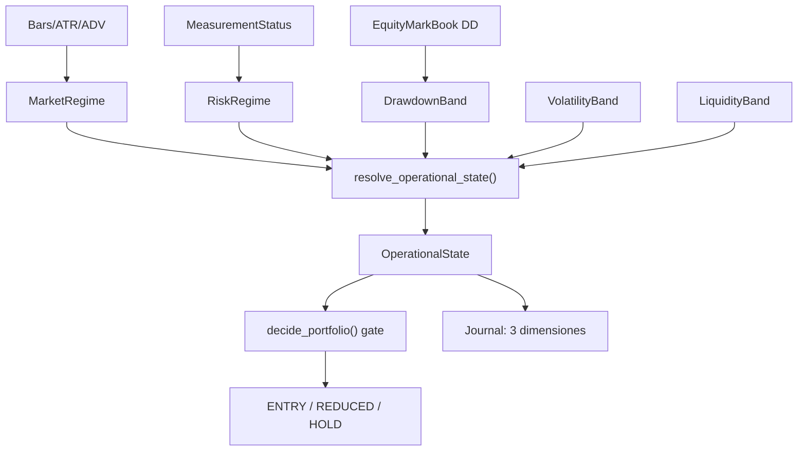

# Plan V2.43 — AUTO-3 Risk & Market Governor (slice 1: ejes, tabla y gate de entradas)

> **Fecha:** 2026-09-18 · **Bump:** `1.67.2-beta` → `1.68.0-beta` · **Sin migración** (Alembic head
> sigue en `042_portfolio_reservations`) · **Punto de partida:** `v2.42.2-beta` (`3e8aa359`), AUTO-2
> cerrado.
>
> Base: §5 del [roadmap AUTO](./roadmap-auto-v2-40-4-a-v2-48-2026-09-16.md) y §3 del
> [traspaso de relevo post-v2.42.2](./traspaso-relevo-post-v2-42-2-auto-2-slice-2c-2026-09-18.md).
>
> Este documento es el **plan de implementación** del primer slice de `AUTO-3`. Los eventos FSM
> `REGIME_EXIT`/`RISK_EXIT` y la precedencia/atribución del día quedan **fuera** (declarados al
> final), igual que el flip de la activación a default ON.

---

## 1. Decisiones fijadas (confirmadas por el owner antes de escribir código)

- **Wiring = solo entradas.** `OperationalState` se consulta en `decide_portfolio` / `plan_v2_tick`.
  El camino de salida **no** cambia: `REGIME_EXIT` legacy queda intacto y los eventos FSM
  `REGIME_EXIT`/`RISK_EXIT` se difieren al slice siguiente (junto con la decisión de
  precedencia/atribución).
- **`RiskRegime` sale de cartera:** drawdown medido (`EquityMarkBook`) + estado de medición. Sin dato
  ⇒ `UNKNOWN` (fail-closed). Esto obligó a cablear el drawdown, que **no** llegaba a AUTO V2
  (`AutoPortfolioSnapshot.drawdown_pct` siempre `None`).
- **Activación por flag, default OFF:** `AUTO_ENGINE_SIM_V2_GOVERNOR` (patrón `_env_flag`). Con el
  flag OFF el comportamiento es **byte-idéntico**; el flip a default ON es decisión del owner con
  el número delante.

## 2. Invariantes que instala el slice

1. "El mercado está bajista" y "AUTO tiene prohibido abrir" son hechos **distintos y explícitos**:
   `MarketRegime` (hecho de mercado) y `OperationalState` (permiso) viajan por separado en el
   journal, y el veto de permiso tiene **motivo propio** (`governor_exit_only` / `governor_halted`),
   distinto de `regime_invalid`.
2. La tabla `(MarketRegime × RiskRegime × DD × Vol × Liquidez) → OperationalState` es **total y
   monótona**: más riesgo nunca produce un estado más permisivo, y cualquier `UNKNOWN` en un eje
   nunca es "libre". Propiedades **certificadas por test** sobre el producto cartesiano (1 728
   combinaciones) y, además, mutadas para medir que los tests las defienden.
3. El motor **lee** `OperationalState`; no reconstruye política de riesgo por su cuenta. El gate
   solo **endurece** (nunca relaja la regla direccional existente de `regime_allows_entry_for`).
4. El tamaño (`risk_scale`) se **deriva del estado resuelto**, y la composición es "el más estricto
   gana" (no producto de factores): la severidad es el contrato auditable y el número es
   reconstruible desde el journal. Dos ejes al 75 % no dan 56 %, y se declara.

## 3. Flujo objetivo

## 4. Cambios por workstream

### WS1 — Ejes y tabla puros (`bolsa_analytics`, hermético)

`packages/py/analytics/src/bolsa_analytics/cognitive/operational_governor.py` (nuevo, puro y
determinista: sin I/O, sin reloj, sin red):

- Ejes canónicos: `MarketRegime`, `RiskRegime`, `OperationalState`, `DrawdownBand`,
  `VolatilityBand`, `LiquidityBand` (+ tuplas `ENCODED_*` para recorrerlos en tests).
- `_STATE_SEVERITY` y `RISK_SCALE_BY_STATE` declarados; `_MARKET_CAP` / `_RISK_CAP` /
  `_DRAWDOWN_CAP` / `_VOLATILITY_CAP` / `_LIQUIDITY_CAP` son **la política, a la vista**.
- `resolve_operational_state(...)` = máximo de severidad de los techos por eje (kill switch
  `halted` fuerza `HALTED`); función **total** (todos los kwargs con default `None` ⇒ `UNKNOWN`).
- `assess_operational_state` / `assess_from_measurements` devuelven `OperationalAssessment` (hechos
  - permiso + `risk_scale` + `binding_axis`), que es lo que viaja al journal y a la config del motor.
- Derivación de bandas desde medidas: `DrawdownPolicy` (cuatro cortes declarados, estrictamente
  crecientes, con `ValueError` si no lo son), `risk_regime_from`, `volatility_band_for`,
  `liquidity_band_for`, `GovernorPolicy` (rechaza `restricted_edge_factor < 1` y notional negativo).
- `to_market_regime` traduce el eje operativo existente (`market_regime_gate`) al eje de mercado;
  `RISK_OFF` macro **no** se traduce a régimen de mercado (es un hecho de riesgo ⇒ `UNKNOWN`).

**Colisiones de nombre (resueltas sin romper):** alias aditivos `MacroRegime = MarketRegime` en
`weight_rules.py`, `FinancialIntegrityState = OperationalState` en `reconcile_financial_integrity.py`
(documentando que el eje canónico de AUTO-3 vive en `operational_governor`) y export
`GovernorMarketRegime` en `cognitive/__init__.py`. Ningún eje existente cambia de significado.

### WS2 — Eje de mercado y `LOW_VOL`

- `LOW_VOLATILITY` era **valor muerto** (nunca producido). `discovery_market_regime.py` gana
  `MATH_VERSION_MARKET_REGIME_V1` con la rama `low_vol` (rango medio intradía por debajo de
  `_LOW_VOL_RATIO_THRESHOLD = 0.005`) y `TRIAL_REGIMES_V1`; `v0` **no cambia** (misma medición,
  misma rama: el clasificador `v0` queda intacto y su eje de etiquetas válidas también). Una
  `math_version` desconocida ⇒ `NO_REGIME` (fail-closed).
- `is_valid_regime(regime, math_version=...)`: con `v0` el contrato es exactamente el de siempre.
- `map_trial_regime` gana `low_vol → LOW_VOLATILITY`; `DiscoveryRegimeSource` acepta `math_version`
  y la agregación del universo (`_REGIME_CONSERVATIVE_PRIORITY`) incluye `low_vol` en su prioridad.
- Activación por env `AUTO_ENGINE_SIM_V2_REGIME_MATH=v1` (default `v0`).

### WS3 — Drawdown medido y `RiskRegime`

- `AutoSimulationWorker` recibe un `EquityMarkBook` **inyectable** (`equity_marks=`) y alimenta la
  marca una vez por tick con el equity **marcado a mercado**: base declarada
  (`AUTO_ENGINE_SIM_V2_EQUITY`) + P&L realizado acumulado (`_sim_realized_pnl`, alimentado por las
  ventas aplicadas con referencia de entrada) + P&L no realizado (marca vs entrada).
- `_v2_governor_drawdown_pct()` devuelve `None` con el flag OFF (ni se mide ni se paga el cómputo) y
  el `daily_pct` medido con el flag ON; `_v2_snapshot` lo publica en `drawdown_pct`.
- `build_worker_snapshot(drawdown_pct=...)` (aditivo) y `V2TickPlan.governor_states` (estado
  EFECTIVO por candidata, en orden de evaluación) completan el cableado.
- `DrawdownBand` desde `daily_pct` con los cortes de `V2Tunables`; `resolve_risk_regime` ⇒
  `RISK_ON` / `RISK_REDUCING` / `RISK_OFF` / `UNKNOWN`.

### WS4 — Bandas de volatilidad y liquidez + flag y umbrales

- `VolatilityBand`: `HIGH_VOL → HIGH`, `LOW_VOL → LOW`, resto `NORMAL`; régimen `UNKNOWN` o ATR
  ausente ⇒ `UNKNOWN` (los tramos extremos mandan sobre la disponibilidad del ATR: son su medida).
- `LiquidityBand`: reutiliza el `TradeContext` / `liquidity_notional` de la señal; `KNOWN` y
  `> min_liquidity_notional` ⇒ `OK`, `KNOWN` y `<=` ⇒ `THIN`, no conocido ⇒ `UNKNOWN`.
- `V2Tunables` gana el flag y los umbrales (`governor_enabled`, cuatro cortes de drawdown,
  `governor_min_liquidity_notional`, `governor_restricted_edge_factor`, `regime_math_version`) y
  `tunables_from_env()` los lee **saneados como bloque**: un corte no creciente, un número no finito
  o un factor que relajaría el listón descartan los umbrales de env y quedan los defaults declarados
  (nunca a medias, nunca tumbando el tick).

### WS5 — Gate en el motor (solo entradas)

- `PortfolioDecisionConfig.governor: OperationalAssessment | None = None` (aditivo; `None` =
  no consultado = comportamiento histórico).
- Gate en el paso **3.b**, tras el régimen y antes de liquidez:
  `EXIT_ONLY → ("HOLD", "governor_exit_only")`, `HALTED → ("HOLD", "governor_halted")`. Un estado no
  canónico se trata como `HALTED` (fail-closed: no se confía en lo que no se entiende).
- `ALLOWED` no cambia nada; `REDUCED` / `RESTRICTED` escalan el riesgo por `risk_scale` (aplicado a
  `max_risk_per_trade_pct` vía `decision_config`) y `RESTRICTED` sube además el listón de edge
  (`min_edge * restricted_edge_factor`). El motor **no** reconstruye política: lee el veredicto.
- Nuevos `DecisionReasonCode`s `governor_exit_only` / `governor_halted` y alta en `_NO_TRADE_REASONS`
  (sin eso, un veto del gobernador no contaría como no-trade en el journal).
- `plan_v2_tick` computa la lectura **por candidata** (las bandas de volatilidad y liquidez son datos
  de la candidata) y la pasa a `decide_portfolio`; con el flag OFF la lectura es `None`.

### WS6 — Journal: las tres dimensiones

- `PortfolioDecision` gana `market_regime` / `risk_regime` / `operational_state` (aditivos, default
  `None`) y `to_dict()` **solo** emite las claves cuando el gobernador se consultó: con el flag OFF
  el payload es el histórico (byte-idéntico).
- `_journal_entry` publica `marketRegime` / `riskRegime` / `operationalState` en el payload de toda
  decisión que pasó por el motor (criterio de salida del roadmap). Un descarte **antes** de decidir
  (identidad duplicada, etc.) no inventa dimensiones: no hay lectura de gobernador que publicar.

### WS7 — Tests, mutaciones y evidencia

- Puros: `packages/py/analytics/tests/test_operational_governor.py` (totalidad sobre el producto
  cartesiano, techo declarado por eje, monotonía por dominancia de vectores, `UNKNOWN` nunca libre,
  `assess_*` extremo a extremo).
- Aplicación: `packages/py/application/tests/test_auto_v3_governor_gate.py` (flag OFF byte-idéntico,
  vetos con motivo propio, escalado de tamaño, listón de edge, las tres dimensiones en el journal,
  saneado de env **como bloque**, `v1` que añade `low_vol` sin cambiar `v0`).
- Integración hermética: `apps/api-python/tests/test_auto_v3_governor_evidence.py` (carga el script
  de evidencia y exige la escalera medida) y script reproducible
  `apps/api-python/scripts/v2_43_governor_evidence.py` (sin PG, sin red, sin reloj real; **exit ≠ 0**
  si la tabla no gobierna la decisión).
- CI: `packages/py/application/tests/test_auto_v3_governor_gate.py` va **explícito** en `python-ci.yml`
  (job `quality`) y en `release-tag-ci.yml` (job `python`); la tabla pura la recoge el pase de
  directorio de `packages/py/analytics/tests` y la evidencia el de `apps/api-python/tests`.

### WS8 — Cierre de slice

- `package.json` → `1.68.0-beta`; entrada en `CHANGELOG.md`; este documento.
- Freeze comprobado (ver §6).

## 5. Matriz de mutaciones **medida** (7 mutaciones, 7 rojos)

Aplicada sobre el árbol final, con el target acotado, revirtiendo y **verificando el contenido
exacto** (hash del fichero mutado antes y después). Ninguna mutación queda en el árbol:

| #   | Mutación                                                                     | Fichero                                | Rojos medidos                                                                              |
| --- | ---------------------------------------------------------------------------- | -------------------------------------- | ------------------------------------------------------------------------------------------ |
| M1  | Un techo de eje mal mapeado (`_MARKET_CAP["HIGH_VOL"] → ENTRY_ALLOWED`)      | `operational_governor.py`              | **1 rojo** (`test_declared_caps_are_the_roadmap_policy`)                                   |
| M2  | Quitar `UNKNOWN ⇒ nunca libre` (`_LIQUIDITY_CAP["UNKNOWN"] → ENTRY_ALLOWED`) | `operational_governor.py`              | **3 rojos** (techos, `test_unknown_axis_never_allows_entry[liquidity_band]`, `assess` E2E) |
| M3  | `EXIT_ONLY` deja pasar entradas (solo `HALTED` veta)                         | `portfolio_decision_engine.py`         | **4 rojos** (veredicto de permiso, medición ausente, journal, lectura directa del motor)   |
| M4  | Romper monotonía (`strictest_state` devuelve el **menos** severo)            | `operational_governor.py`              | **11 rojos** (totalidad/máximo, monotonía, `UNKNOWN`, ejes, `binding_axis`)                |
| M5  | `drawdown_pct` no cableado (el worker publica siempre `0.0` ⇒ banda `FULL`)  | `auto_simulation_worker.py`            | **3 rojos** (escalera, pata no realizada, seam de medición)                                |
| M6  | Journal sin las tres dimensiones                                             | `auto_v2_entry.py` (`_journal_entry`)  | **2 rojos** (journal del gate + evidencia)                                                 |
| M7  | `risk_scale` ignorado en el sizing (`scale = 1.0`)                           | `auto_v2_entry.py` (`decision_config`) | **2 rojos** (REDUCED al 75 %, RESTRICTED al 50 %)                                          |

## 6. Verificación medida

Árbol final del slice, con las invocaciones exactas de CI:

- `uv run ruff check packages/py apps/api-python --config pyproject.toml`: **All checks passed**.
- `uv run mypy ... --follow-imports=silent`: **487 ficheros, 0 issues**.
- `uv run lint-imports --config packages/py/.importlinter`: **4 kept / 0 broken** (600 ficheros,
  3 184 dependencias analizadas).
- Tests del slice: `test_operational_governor.py` + `test_auto_v3_governor_gate.py` +
  `test_auto_v3_governor_evidence.py` ⇒ **48 passed** (45 puros/gate + 3 de evidencia).
- Evidencia reproducible: `uv run python apps/api-python/scripts/v2_43_governor_evidence.py --out
governor.json` ⇒ **exit 0**, `OK: la tabla gobierna la decisión de entrada`, con la escalera
  `0 % → ENTRY_ALLOWED`, `6 % → ENTRY_REDUCED` (cantidad × 0.75 sobre su control), `12 % →
ENTRY_RESTRICTED` (tamaño × 0.5 y listón de edge que separa `edge=0.5` de `edge=0.9`),
  `15 % → EXIT_ONLY` (`governor_exit_only`), `22 % → HALTED` (`governor_halted`); los dos tramos
  vetados tienen **control con el flag OFF aprobando**, así que el freno se atribuye al gobernador
  y no a otro gate; y la pata no realizada se mide (posición viva marcada −10 % sobre 60 000 de
  exposición ⇒ 6 % de drawdown con la equity base intacta).
- Bloques offline de CI (targets y `--ignore` **extraídos del YAML** con
  `scripts/verify/offline_ci_run_yaml.py`, verificación de que cada ruta existe):
  - `python-ci.yml` job `quality`: **42 rutas** objetivo, 8 ficheros PG movidos a `--ignore`,
    **1983 passed, 0 failed, 0 skipped** (`exit 0`).
  - `release-tag-ci.yml` job `python`: **51 rutas** objetivo, 8 ficheros PG a `--ignore`,
    **1994 passed, 0 failed, 0 skipped** (`exit 0`).
  - Las dos cifras incorporan los **48 tests nuevos** de este slice (1935 + 48 = 1983 en `quality`;
    1946 + 48 = 1994 en el job del tag), que es la comprobación de que lo nuevo **sí** corre en CI.

## 7. Freeze comprobado

| Freeze                                                       | Comprobación                                                                                               |
| ------------------------------------------------------------ | ---------------------------------------------------------------------------------------------------------- |
| `AUTO_ENGINE_SIM_V2=0` sigue siendo `v2.39.x`                | el nuevo gate vive **dentro** del pipeline V2; con V2 OFF no se construye snapshot ni se llama al motor V2 |
| Con `AUTO_ENGINE_SIM_V2_GOVERNOR=0` el camino V2 es idéntico | test de byte-identidad del journal con y sin `drawdown_pct` en el snapshot + `governor_states == ()`       |
| Sin migración                                                | Alembic head sigue en `042_portfolio_reservations`; ningún fichero de `alembic/versions` nuevo             |
| Gates PG intactos                                            | no se toca ningún fichero `*_pg*`, ni stores durables, ni el worker de reservas                            |

## 8. Fuera de alcance (deuda declarada, no silenciosa)

- Eventos FSM `REGIME_EXIT`/`RISK_EXIT` y la decisión de **precedencia y atribución** del día.
- Políticas completas de `VolatilityGovernor`/`LiquidityGovernor` (calibración por ADV/spread
  medido; aquí solo bandas con umbral declarado).
- Productor real de `HALTED` (aquí alcanzable vía tabla/kill switch, sin política propia).
- Flip de la activación a default ON (decisión del owner con el número delante).
- Regla "solo el mejor candidato" en `RESTRICTED` (aquí `RESTRICTED` = tamaño reducido + umbral de
  edge más exigente).

---

## 9. Arranque del auditor

> **Qué auditar:** el slice `V2.43` (AUTO-3, slice 1) sobre `1.67.2-beta`, **sin migración** (head
> `042_portfolio_reservations`). **No se afirma CI de un tag aún no publicado.**
> **De dónde leer (orden recomendado, 15-30 min):**
>
> 1. **Este fichero** (alcance, invariantes, mutaciones medidas y límites declarados).
> 2. `CHANGELOG.md` `[1.68.0-beta]` (qué cambia para el operador).
> 3. [roadmap AUTO](./roadmap-auto-v2-40-4-a-v2-48-2026-09-16.md) §5 (`AUTO-3`) y §3 del
>    [traspaso post-v2.42.2](./traspaso-relevo-post-v2-42-2-auto-2-slice-2c-2026-09-18.md).
> 4. Código: `bolsa_analytics.cognitive.operational_governor`, el gate de
>    `bolsa_application.portfolio_decision_engine` (`decide_portfolio` paso 3.b), `auto_v2_entry`
>    (`V2Tunables.decision_config`, `plan_v2_tick`, `_journal_entry`) y
>    `_v2_governor_drawdown_pct` de `auto_simulation_worker.py`.
> 5. Tests: `packages/py/analytics/tests/test_operational_governor.py`,
>    `packages/py/application/tests/test_auto_v3_governor_gate.py`,
>    `apps/api-python/tests/test_auto_v3_governor_evidence.py` y el script
>    `apps/api-python/scripts/v2_43_governor_evidence.py`.

**Las tres preguntas que el auditor debería poder responder solo con esto**

1. _¿Se puede abrir una entrada con un eje `UNKNOWN`?_ No: cada eje `UNKNOWN` tiene techo declarado
   (`EXIT_ONLY` o `ENTRY_RESTRICTED`), y hay un test por eje que lo exige.
2. _¿El gobernador puede relajar la regla direccional existente?_ No: se inserta **después** del
   régimen, solo añade vetos y endurece el listón de edge (`restricted_edge_factor >= 1` es
   invariante del constructor de la política).
3. _¿Puede una env mal puesta tumbar el tick o relajar el listón?_ No: los umbrales del gobernador se
   validan como bloque y caen a los defaults declarados; un factor `< 1` se descarta.

**Qué NO afirma este slice**

- Que el gobernador **cierre** posiciones: en este slice el permiso solo gobierna entradas (el camino
  de salida no cambia).
- Que `HALTED` tenga productor propio (kill switch / tabla, sin política nueva).
- Que la evidencia sea una sesión de mercado real: es un día hermético (stores `InMemory*`, precios y
  ATR inyectados).
- Que los umbrales de drawdown (5/10/15/20 %) estén calibrados contra datos: son **declarados y
  calibrables**, con el mecanismo separado del número.
