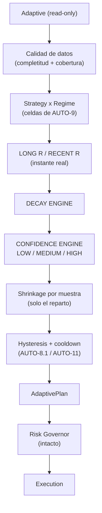

# Plan `AUTO-12` — Confidence + calidad estadística — `V2.53` / `1.78.0-beta`

**Estado:** cerrado (pasos 1–5 **cerrados** y verificados) · **Fecha:** 2026-09-23 · **Sello:** tag
`v2.53-beta` → `a6655e6e` con `Release tag CI` `35836248169` **GREEN** (`10 success` + `1 skipped`,
job `python` del tag `2459 passed / 35 skipped`) · **Fase anterior:**
`V2.52` / `AUTO-11` (sellada: tag `v2.52-beta` → `71c97880`, `Release tag CI` `35827266670` **GREEN**,
`1.77.0-beta`).

**Decisiones de alcance ratificadas por el propietario (2026-09-23):** `AUTO-12` **core backend** —
`sample_size`, `measurement_completeness`, `confidence`, `recent_R`/`long_R`, `decay` y multiplicador
ajustado por confianza. **Sin UI**, **sin migración**, **sin Data Gate** y **sin recovery gradual**
(esos dos últimos quedan para `AUTO-13`). Y las **dos decisiones abiertas** del §5 del plan, ratificadas:

1. **Eje de recencia por instante REAL** — se lleva `created_at` al dominio de fills (aditivo, sin
   migración) para que `recent`/`long` ordenen por instante y **declaren** lo ilegible. Descartado
   seleccionar por posición de lista: repetiría la fragilidad que cerró la Auditoría 2.
2. **Confianza → reparto por *shrinkage*** — el peso se **encoge por muestra** (`w' = w · n/(n+k)`):
   redistribuye, no ensancha, mantiene `[0, 1]` y nunca 0, y **solo** actúa sobre edges decisorios.
   Descartado el *cap* duro por banda: más simple, pero con saltos y más fácil de sobre-reaccionar.

---

## 0. El hueco exacto que cierra esta fase

`AUTO-8`…`AUTO-11` dejaron el reparto del riesgo proporcional a la expectancy **sin ponderar por
tamaño de muestra real**. El gate existente es **binario** (`decisive`, `trades >= min_trades`):
dentro de él, `N=12` pesa **igual** que `N=180`. Y no existe lectura de **recencia**:
[auto_self_evaluation.py](../../packages/py/analytics/src/bolsa_analytics/cognitive/auto_self_evaluation.py)
agrega **una única** ventana, así que `LONG +0.21R` con `RECENT −0.15R` —una estrategia que ha dejado
de funcionar— es **invisible** hoy.

| Pieza | Ancla actual | Estado antes de esta fase |
| --- | --- | --- |
| Muestra | `StrategySelfEvaluation.trades` / `decisive` | existe, **binario**: no pondera |
| Completitud de medición | `MeasurementStatus` (risk/cost/pnl) | existe por campo, **no compuesta** ni consumida por Adaptive |
| Ventana reciente | — | **no existe**: solo una agregación |
| Decay | — | **no existe** |
| Confianza | — | **no existe** (`StrategyHealth` no la llevaba) |
| Reparto | `recommend_allocation` | proporcional a expectancy, sin castigo por muestra fina |
| Eje de recencia de fills | `SimFillFinanceContext` | **sin `created_at`** proyectado (la columna PG ya existía) |

## 1. Invariante que instala `AUTO-12`

> **Ninguna recomendación Adaptive puede pesar más de lo que su evidencia estadística sostiene.**
> Una muestra fina se **declara** (`confidence`), no se castiga a ciegas; una mejora reciente que
> contradice el histórico se **declara** (`decay`), no se convierte en pausa automática. Adaptive sigue
> siendo **read-only**: la confianza modula el **reparto** (multiplicador en `[0, 1]`), nunca la
> autoridad de ejecución.

Corolario: **ausencia de dato ≠ dato malo.** Una estrategia sin edge decisorio conserva el
`unknown_multiplier` neutral (1.0); la confianza **solo** reduce el peso de un edge **medido pero fino**.
Y el corolario que el audit §14 pedía literalmente: **`UNKNOWN` nunca premia** — un `decay` que no se
pudo leer pone **techo** a la confianza en vez de pasar por bueno.

Pipeline tras esta fase (la confianza entra entre la evidencia y la asignación; **no** toca el gobernador):

## 2. Diseño implementado (lo que quedó, con su porqué)

### 2.1 Módulo puro nuevo — `auto_adaptive_confidence.py`

`packages/py/analytics/src/bolsa_analytics/cognitive/auto_adaptive_confidence.py`, **sin I/O y sin
estado** (mismo patrón que `cycle_risk.py`). **Reutiliza** lo existente en vez de reinventarlo:
`aggregate_by_regime` (AUTO-9) sobre **dos rebanadas** de los ciclos ordenados, `sample_quality_from_n`
(expectancy.py) como base de banda y `combine_measurements`/`is_complete` (measurement.py) para la
completitud compuesta.

Contrato (frozen dataclass `StrategyConfidence`, por `strategy × regime` en `by_regime`):

| Campo | Significado |
| --- | --- |
| `sample_size` | ciclos de la celda (muestra **bruta**) |
| `effective_n` | ciclos con **R medido** — el denominador **real** de `expectancy_r`: es la muestra que de verdad sostiene el número |
| `measurement_completeness` | `combine(r_measurement, net_r_measurement, pnl_coverage)` ⇒ `COMPLETE`/`PARTIAL`/`UNKNOWN` |
| `risk_coverage` / `cost_coverage` | `1 − cycles_without_risk/cycles`, `1 − cycles_without_cost/cycles` |
| `regime_coverage` | cuota de ciclos con régimen **declarado** (nivel estrategia) |
| `long_expectancy_r` / `recent_expectancy_r` | el eje declarado (R bruto; el neto se mantiene como eje alternativo de AUTO-9) |
| `decay` | `NONE` / `MILD` / `SEVERE` / `UNKNOWN` (§2.3) |
| `confidence` | `LOW` / `MEDIUM` / `HIGH` (§2.4) |
| `notes` | huecos **declarados**, nunca rellenados |

`AdaptiveConfidence` (el sobre) declara además `recent_window`, `long_window`, `recent_available` y sus
`notes`; `as_dict()` es la forma JSON que el worker registra. **`by_strategy` vacío no es un cero mudo**:
es una lectura vacía **declarada** (`ADAPTIVE_CONFIDENCE_NO_CYCLES`) y `confidence_for(...)` devuelve
`None`, no una fila de ceros.

### 2.2 Eje de recencia honesto (aditivo, con la lección de la Auditoría 2)

`recent`/`long` **no** se seleccionan por posición de lista: se lleva el **instante**.

- **`sim_durable_store.py`**: `SimFillFinanceContext` gana `created_at: datetime | None = None`
  (**aditivo**, la columna PG ya existía ⇒ **sin migración**). El store PG lo proyecta en `get`,
  `get_many` y `list_for_strategy_version` (que ya ordena por `created_at.asc()`); el doble `InMemory`
  lo acepta y, si falta, **declara** el orden por `execution_id` en su docstring en vez de fingir
  cronología.
- **`auto_self_evaluation_feed.py`**: `_fill_instant` extrae el instante del fill y `cycles_from_fills`
  añade `closedAt` (instante del **último** fill del ciclo). Como `_read_cycle` ya lo leía
  opcionalmente, **AUTO-7 queda byte-idéntico** sin fechas (test explícito: sin `created_at`, la tupla
  de ciclos es **exactamente** la histórica y **ninguna** fila tiene `closedAt`).
- Orden por **instante parseado** (patrón `_instant` de `cycle_risk.py`), con el no-parseable **al final
  y declarado** (`recent_undated`). Sin fechas legibles, la ventana reciente **no se inventa**: se
  declara `recent_unavailable` y `decay = UNKNOWN`. Un ciclo **anónimo** (sin `cycle_id`) no reclama
  instante de cierre: no hay frontera que afirmar.
- **`build_adaptive_confidence_from_fills(...)`** es la costura del feed: construye la lectura de los
  **mismos** `fills` + `cycle_risk` que el informe, sin segundo productor y **sin I/O nuevo**.

### 2.3 Decay (declarativo y versionado)

Con ambas ventanas medidas, `effective_n` suficiente y `long > 0`:

- `recent >= long · 0.75` ⇒ `NONE`.
- `recent < long · 0.75` y `recent >= 0` ⇒ `MILD`.
- `recent < 0` con `long > 0` ⇒ `SEVERE`.

Si alguna ventana no está medida, o la reciente no alcanza la muestra mínima, o no hay instantes
legibles ⇒ `UNKNOWN` (**declarado**, no castiga por sí solo). El decay **no** añade motivo de pausa:
alimenta confianza y reparto. Es la frontera explícita contra el "sistema nervioso" que el audit pide no
crear: el deterioro **se declara**, la reacción gradual es de `AUTO-13`.

### 2.4 Confidence (bandas declaradas, no inferidas)

Base por `sample_quality_from_n(effective_n)` — `useful`/`developing` ⇒ HIGH, `preliminary` ⇒ MEDIUM,
`insufficient` ⇒ LOW. Ajustes, **en este orden**:

- `measurement_completeness != COMPLETE` ⇒ baja un nivel (`UNKNOWN` ⇒ LOW).
- `decay == SEVERE` ⇒ baja un nivel.
- `decay == UNKNOWN` ⇒ **techo MEDIUM** (no se premia lo que no se pudo leer).

Se publica el par `(confidence, notes)`; **nunca** un valor por ausencia de dato.

### 2.5 Reparto ajustado por confianza (protege del *winner chasing*)

En `auto_adaptive.py`, `recommend_allocation(..., confidence=None)` y
`build_adaptive_plan(..., confidence=None)`:

- **Sin `confidence` ⇒ byte-idéntico al histórico** (mismo patrón que `by_regime` en AUTO-9: "las celdas
  solas no mueven el reparto"). Test explícito: `confidence=None` y la llamada sin el argumento producen
  el **mismo** `as_dict()`, con los multiplicadores históricos (`a: 1.0, b: 0.5, c: 1.0`).
- **Con** `confidence`, el peso de cada estrategia **decisoria positiva** se **encoge por muestra** antes
  de normalizar: `w' = w · n/(n + k)`, con `k = ADAPTIVE_CONFIDENCE_PRIOR_DEFAULT = 20.0` (campo nuevo de
  `AdaptivePolicy`). Si `decay == SEVERE`, un factor adicional declarado
  (`ADAPTIVE_SEVERE_DECAY_FACTOR_DEFAULT = 0.5`). Ambos son **política versionada**, no constantes
  sueltas: el test fija que un prior distinto cambia el reparto sin tocar la evidencia.
- Se normaliza **como hoy** (`(w'/Σw') · count`) y se acota con `_clamp_unit`, así que el reparto sigue
  sumando-preservando y acotado a `[0, 1]`; se mantiene el **suelo > 0** (ninguna activa queda a 0:
  encoger es **redistribuir**, no eliminar).
- Una estrategia **sin** edge decisorio conserva `unknown_multiplier` (1.0): la confianza fina **solo**
  actúa sobre un edge **medido**. Es el punto exacto del audit §25: `A +2R/N=12` no puede llevarse el
  peso pleno frente a `B +1R/N=180`.
- **`ADAPTIVE_POLICY_VERSION` sube a `auto12-v1`** (cambia la regla de asignación ⇒ sello nuevo
  obligatorio; el test del sello se actualiza **con nombre**).

### 2.6 Evidencia durable sin cambiar el contrato del journal

`StrategyHealth` gana `confidence`, `recent_expectancy_r`, `long_expectancy_r` y `decay`;
`AdaptivePlan.evidence_for()` los incluye. Como `auto_adaptive_journal.py` proyecta `healthByStrategy`
vía `evidence_for`, la confianza viaja en el payload durable **dentro de las filas de la forma
existente** (sin clave nueva en el **nivel superior** del payload, sin migración, **sin tocar el contrato**
del journal: las filas ganan cuatro campos con `null` cuando no se aporta la lectura, porque la ausencia se
declara). `readOnly` se conserva.

### 2.7 Cableado en el worker (una vez por tick)

`_v2_build_adaptive_plan` construye la confianza con `build_adaptive_confidence_from_fills` usando los
**mismos** `fills` y `cycle_risk` que ya leyó para el informe ⇒ **una lectura por versión**, cero I/O
nuevo. Si `confidence.recent_available` es `False`, se registra un `warning` con los huecos declarados
(no se finge ventana). El plan se construye **con** la lectura y se publica después del compromiso de
capital, como en `AUTO-10`/`AUTO-11` (**primero el dinero, después la traza**).

## 3. Pasos, con su gate (todos cerrados)

- **Paso 1 — Módulo puro.** Gate: `recent`/`long` desde ventanas; `effective_n ≤ sample_size`;
  completitud **compuesta**; `decay` por bandas declaradas; `confidence` con su tabla; ventana sin fechas
  ⇒ `recent_unavailable` y `decay=UNKNOWN`; orden-invariante. **CERRADO.**
- **Paso 2 — Eje de recencia aditivo.** Gate: AUTO-7 **byte-idéntico** sin fechas; con fechas, reciente =
  último instante; ciclo anónimo sin `closedAt`. **CERRADO.**
- **Paso 3 — Integración en `auto_adaptive.py`.** Gate: sin `confidence` ⇒ los tests de `HEAD` **pasados
  sin tocar** (salvo el sello, actualizado con nombre); con `confidence` ⇒ *winner chasing* con
  `multiplier_A` por debajo del techo y `multiplier_B ≥ multiplier_A`, ambos en `(0, 1]`. **CERRADO.**
- **Paso 4 — Feed y worker.** Gate: **una** lectura por versión (medida con un store que cuenta
  llamadas), byte-identidad sin instantes, y el hueco declarado en el log. **CERRADO.**
- **Paso 5 — Verificación y sello.** `ruff`/`mypy`/`import-linter`; delta **simétrico**; matriz de
  mutaciones `M60…M71`; docs; bump `1.77.0-beta` → `1.78.0-beta`; tag `v2.53-beta`. **CERRADO** (§4).

## 4. Verificación (con el método medido del repo)

- **Tests nuevos:** `packages/py/analytics/tests/test_auto_adaptive_confidence.py` (**21**),
  `apps/api-python/tests/test_auto_v53_auto12_confidence_seam.py` (**9**). **Ampliados:**
  `test_auto_adaptive.py` (`HEAD` 44 → **55**, +11) y
  `packages/py/application/tests/test_auto_self_evaluation_feed.py` (`HEAD` 13 → **22**, +9).
  **Delta total del área: +50.**
- **Delta simétrico fichero a fichero contra `HEAD`** (nunca restando fases): los ficheros **modificados**
  se corrieron en su versión de `HEAD` contra el código de la fase ⇒ **56 pasan y 1 rojo nombrado**
  (`test_the_policy_version_seals_the_auto9_evidence_contract`, cuya expectativa la fase actualiza con
  nombre a `..._auto12_evidence_contract`). Ningún otro rojo: la integración **no** cambia nada por
  debajo.
- **Mutaciones:** `M60…M71` (**12**) muerden todas con nombre y la matriz **completa** no deja ninguna
  etiqueta en `NADA` (§5 del audit-pack). La trampa de `M39` en `V2.52` (una etiqueta que dejó de morder
  y afirmaba cobertura) es el gate explícito de este paso. La corrida completa da **`71/71` medidas, `0`
  en `NADA`** y árbol intacto; `AUTO-12` **realineó** `M33` (su fragmento —la llamada *inline* al riesgo
  por ciclo— dejó de existir al medirlo **una sola vez** en una local compartida) sin cambiar la
  intención de la etiqueta, y esa sonda vuelve a morder (§7 del audit-pack).
- **Compuertas:** `ruff check packages/py apps/api-python --config pyproject.toml` (el de CI, no rutas
  sueltas), `mypy` con el comando de CI (`--follow-imports=silent`) e `import-linter` **4/4**; bloques
  offline **sin PostgreSQL**, con la extracción de targets del propio YAML (§4 del audit-pack).
- **Sello:** tag `v2.53-beta` → `a6655e6e` con `Release tag CI` `35836248169` **GREEN** (`10 success` +
  `1 skipped`, `check-runs` `27 success` + `1 skipped`, job `python` del tag **`2459 passed / 35 skipped`**
  frente a los `2409` de `v2.52-beta`: **+50**, el delta declarado) y los otros cuatro workflows del tag en
  verde.

## 5. Límites declarados (no silenciosos)

- **`confidence` no es un permiso:** sigue siendo evidencia read-only; la autoridad es el motor
  determinista y el gobernador.
- **Ventana finita:** `recent`/`long` son ventanas declaradas (`30`/`200`); con menos filas que la
  ventana el número es un **suelo** (`recent_insufficient`).
- **Sin fechas legibles no hay decay:** se declara `recent_unavailable`; no se inventa cronología.
- **`AUTO-12` no toca la rotación:** el decay **no** genera un motivo de pausa nuevo.
- **`effective_n` es la muestra que sostiene el número**, no la bruta; una celda de 40 ciclos con 4
  medidos declara **4**.
- **La confianza no se persiste como estado propio:** viaja en `healthByStrategy` del journal de
  `AUTO-11`, sin migración ni clave nueva.
- **`AUTO-13` fuera:** Data Gate (`OK/DEGRADED/STALE/BLOCKED`), recovery gradual (`RECOVERING` +
  multiplicadores `0.25→1.0`) y matriz de régimen avanzada.
- **Sin UI** (deuda declarada), **sin migración** (Alembic head sigue en `044_auto_cycle_trace`),
  **`governor.json` sigue sin trackear**.

## 6. Freeze / no tocar (respetado)

- **No** se reabrió el sello de `V2.52` (tag `v2.52-beta` quieto en `71c97880`).
- **No** se tocó `auto_adaptive_journal.py` (contrato) ni `auto_adaptive_recovery.py` (la confianza
  viaja en `healthByStrategy`; **sin migración**): **byte a byte iguales**.
- **No** se tocaron umbrales de rotación, `ADAPTIVE_ADVERSE_REGIMES`, el gobernador ni su evidencia.
- **No** se tocó `decision_journal_entries` ni su índice; **sin backfill**.
- Sin SHORT. Sin `prettier` para `*.md`.
