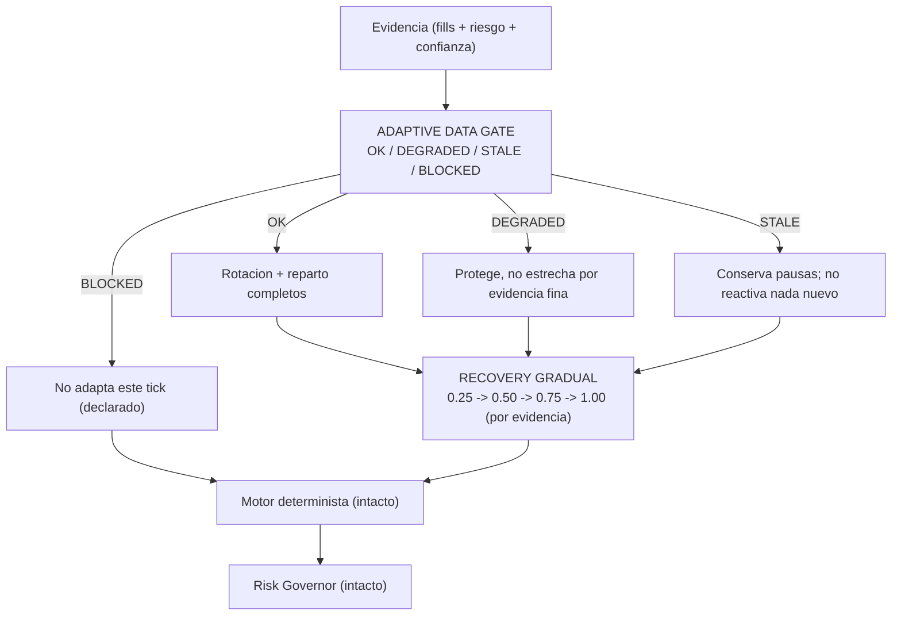

# Plan `AUTO-13` — Adaptive Data Gate + recovery gradual — `V2.54` / `1.79.0-beta`

**Estado:** propuesto (a ratificar) · **Fecha:** 2026-09-23 · **Fase anterior:** `V2.53` / `AUTO-12`
(sellada: tag `v2.53-beta` → `a6655e6e`, `Release tag CI` `35836248169` **GREEN**, `1.78.0-beta`).

**Punto de partida — el audit, §21/§22/§23/§24/§29 de la revisión de `v2.52-beta` (texto literal):**

- §21: «journal failure debe afectar inmediatamente al estado de Adaptive. Yo introduciría
  `ADAPTIVE_DATA_HEALTH` con `OK / DEGRADED / STALE / BLOCKED`. Por ejemplo: 1 fallo → `DEGRADED`;
  N fallos consecutivos → `STALE`; sin journal durante X ciclos → `BLOCKED`. Pero: **Risk Engine
  continúa funcionando**.»
- §22: «Falta un Adaptive Data Gate … `OK / DEGRADED / BLOCKED` → `adapta / limita / no adapta`.
  Así nunca confundimos **estrategia mala** con **datos Adaptive incompletos**.»
- §23: «Adaptive sigue siendo demasiado "binario": `ACTIVE / PAUSED` y cooldown … añadiría
  `PAUSED → cooldown terminado → RECOVERING → evidencia suficiente → HEALTHY`. Esto evita
  `PAUSED → ACTIVE` demasiado bruscamente.»
- §24: «Falta un período de recuperación gradual … `RECOVERING` → multiplier `0.25 → 0.50 → 0.75 →
  1.00`, **sólo si la evidencia confirma recuperación**. Esto reduce muchísimo el riesgo de:
  `PAUSE → una operación buena → reapertura completa → otra racha mala`.»
- §20 (el otro lado del mismo hueco): ante un **hueco de régimen**, «NO usar `strategy × regime` →
  usar evidencia global si está completa → si no: `UNKNOWN` / no adaptación. Nunca asumir `RANGE` ni
  usar el último régimen conocido sin declararlo.»
- §29: «La UI debe distinguir tres cosas y **no mezclar**: estado operativo
  (`ACTIVE / PAUSED / RECOVERING`), estado de datos (`COMPLETE / DEGRADED / STALE`) y calidad
  estadística (`LOW / MEDIUM / HIGH`). Porque `ACTIVE + DATA DEGRADED + LOW CONFIDENCE` es
  perfectamente posible.»

**Decisiones de alcance propuestas:** `AUTO-13` **core backend**, cerrando §22+§24 y **el fallback
del §20** (que es barato y hoy no existe). **Sin UI** (deuda declarada de `AUTO-7`…`AUTO-13`; lo que
esta fase sí hace es dejar los **tres ejes separados en el contrato**, que es lo que la UI
necesitará), **sin migración** (Alembic head sigue en `044_auto_cycle_trace`), **sin tocar el
gobernador**, **sin estado propio persistido** si se puede derivar (patrón `AUTO-11`).

---

## 0. El hueco exacto que cierra esta fase

Medido sobre el código de `v2.53-beta`, no supuesto:

| Pieza | Ancla actual | Estado antes de esta fase |
| --- | --- | --- |
| Salud de la evidencia Adaptive | — | **no existe**: se declaran huecos (`read_ok`, notas de `confidence`) pero nada los **gradúa** |
| Fallos del sink del journal | `except Exception: logger.exception(...)` ([worker](../../apps/api-python/src/bolsa_api/background/auto_simulation_worker.py) 3112-3115) | **no existe contador** de fallos: un journal caído es invisible salvo en el log |
| Efecto de datos incompletos | — | un hueco **no limita** la adaptación: se adapta igual con lo que haya |
| Estado operativo de estrategia | `RotationDecision.active: bool` + `reason` (`auto_adaptive.py` 335-338) | **binario**: no hay `RECOVERING` |
| Reincorporación tras una pausa | cooldown → activa | **salto a peso pleno**: es el `PAUSED → ACTIVE 100 %` que el §24 critica |
| Régimen ausente en el cruce | cubo `UNKNOWN` propio, `declared_regime` devuelve indeterminado | **no hay fallback declarado** a evidencia global (el §20 lo pide) |
| Exposición del estado Adaptive | solo journal durable + DTO del cruce | **nada** por API/UI (y el §29 pide tres ejes separados) |

Y una precisión que el reconocimiento dejó clara y conviene no olvidar: hoy **no existe** ningún
contador de fallos de journal/sink en el repo (el `consecutive_failures` que sí existe es del
**circuito del feed de mercado**, `yahoo_circuit_breaker.py` 43-106, otro eje). El §21 pide
justamente lo que falta.

## 1. Invariante que instala `AUTO-13`

> **Ninguna estrategia puede ser castigada por una deuda de los datos.** Un dato incompleto se
> **declara** (`DataGateStatus`) y **limita la adaptación**; nunca se convierte en "esta estrategia es
> mala". Y una estrategia que vuelve **no vuelve de golpe**: se declara `RECOVERING` y sube por
> **evidencia**, no por el simple paso del tiempo.

Corolarios, que son el contrato con el resto del sistema:

- **El gate no decide dinero.** Limita **cuánto adapta** Adaptive; el motor determinista, el
  gobernador, el kill switch y los gates duros siguen **intactos** (§21: «Risk Engine continúa
  funcionando»).
- **Read-only intacto.** El gate y la rampa modulan el **reparto** (multiplicador en `[0, 1]`) y la
  **frescura** de la rotación, nunca la autoridad.
- **Los tres ejes no se mezclan** (§29): estado **operativo** (`ACTIVE`/`PAUSED`/`RECOVERING`),
  estado de **datos** (`OK`/`DEGRADED`/`STALE`/`BLOCKED`) y calidad **estadística**
  (`LOW`/`MEDIUM`/`HIGH`) viajan por separado. `ACTIVE + DEGRADED + LOW` es un estado legal.
- **Ausencia de dato ≠ dato malo** (la regla de `AUTO-8`…`AUTO-12`, que no se relaja): sin evidencia
  no se pausa ni se premia; con evidencia fina, se declara.

Pipeline tras esta fase (el gate **envuelve** la decisión; no sustituye nada):

## 2. Diseño propuesto (lo que se propone, con su porqué)

### 2.1 Módulo puro nuevo — `auto_adaptive_data_gate.py`

`packages/py/analytics/src/bolsa_analytics/cognitive/auto_adaptive_data_gate.py`: **sin I/O y sin
estado** (mismo patrón que `cycle_risk.py` y `auto_adaptive_confidence.py`). **No inventa insumos**:
recibe **hechos que ya existen** y los gradúa.

| Insumo | De dónde sale ya | Qué aporta |
| --- | --- | --- |
| Completitud compuesta de medición | `AdaptiveConfidence` (AUTO-12): `measurement_completeness`, `risk_coverage`, `cost_coverage`, `regime_coverage` | ¿la evidencia estadística está entera? |
| Ventana reciente disponible | `AdaptiveConfidence.recent_available` / notas | ¿se pudo medir el presente? |
| Salud de la lectura durable | `AdaptiveStateReading` (AUTO-11): `read_ok`, `insufficient_history`, `unreadable`, `policy_version_mismatch` | ¿la memoria de Adaptive es legible? |
| Salud del sink | **contador nuevo en memoria** (§2.2) | ¿se está pudiendo escribir la evidencia? |
| Antigüedad de la última evidencia publicada | journal durable (`adaptive_recommendation`, `created_at`) | «sin journal durante X ciclos → `BLOCKED`» (§21) |

Contrato propuesto: `DataGateStatus = OK | DEGRADED | STALE | BLOCKED`, `DataGateReading`
(frozen) con `status`, `effect`, `notes` y los **hechos** que lo motivaron (para que la fila sea
auditable sin releer el log), y `as_dict()` para el journal/log.

**Los cuatro estados con TRES efectos** (el §21 nombra cuatro; el §22 dibuja tres ramas: «adapta /
limita / no adapta»). Propuesta declarada:

- **`OK` → adapta.** Rotación y reparto completos, como hoy.
- **`DEGRADED` → limita.** Se **conserva la protección** (pausas vivas y sus cooldowns, y las pausas
  **nuevas por salud** siguen permitidas: son lo que evita perder dinero) pero **no se estrecha por
  evidencia fina**: se desactiva el shrinkage por confianza de `AUTO-12` y el reparto cae a su **eje
  histórico**. Degradar = dejar de usar la parte de la evidencia que no es de fiar, **sin** quitar la
  protección.
- **`STALE` → limita más.** Además, **no se admiten reactivaciones nuevas**: una pausa viva no
  levanta su cooldown mientras la evidencia no sea legible (levantarla exigiría evidencia que no
  tenemos) y el reparto se congela en el histórico. Lo que **sí** sigue: las pausas nuevas por salud
  y los cooldowns ya corriendo.
- **`BLOCKED` → no adapta.** El plan Adaptive del tick se declara **ausente** (`adaptive = None`,
  exactamente el camino que ya usa el flag OFF) y se registra el **motivo**: el motor determinista
  decide sin Adaptive y el gobernador sigue mandando. Efecto lateral deseado y declarado: el contador
  de cooldown **no avanza** ese tick (no se reactiva nada por olvido).

Nunca hay un quinto estado ni un efecto implícito: el estado y su efecto se publican juntos.

### 2.2 El contador de fallos del sink (§21) — en memoria, declarado

Hoy un fallo del sink solo se **loguea**. Se añade en el worker un contador **en memoria** de fallos
**consecutivos** y del último éxito (patrón del circuito del feed, que ya existe para mercado, pero
**sin tocar** ese módulo: es otro eje). Reglas propuestas, declaradas en la política:

- `1` fallo → `DEGRADED`.
- `N` fallos consecutivos (`data_gate_sink_failures`, default `3`) → `STALE`.
- Un éxito **resetea** el contador (un fallo aislado no arrastra).
- «Sin journal durante `X` **ciclos**» (`data_gate_journal_gap`, default `10`) → `BLOCKED`. Este
  umbral se mide sobre la **evidencia durable** (antigüedad de la última `adaptive_recommendation`
  publicada), no sobre el contador: así **sobrevive a un reinicio** aunque el contador en memoria no.

**Límite declarado:** el contador vive en el proceso y un reinicio lo limpia; el ancla duradera es la
antigüedad del journal. La combinación se declara en la lectura (`sink_failures` + `journal_age`) para
que nadie lea una como la otra.

### 2.3 Recovery gradual (§23/§24): `RECOVERING` con rampa por evidencia

Un tercer estado operativo por estrategia, `RECOVERING`, con una **rampa** de factor de reincorporación
`0.25 → 0.50 → 0.75 → 1.00` (escalones de la política, declarados):

- **Entrada.** Cuando una versión **deja de estar pausada** habiendo estado pausada (racha de pausa
  `>= min_pause_cycles` y ya sin motivo), entra en `RECOVERING` con el factor **inicial** (`0.25`).
  No vuelve a peso pleno de golpe: es exactamente el salto que el §24 señala.
- **Subida.** Un escalón por **evidencia**, no por reloj: `recovery_step_cycles` (default `3`) ciclos
  de evaluación **con expectancy medida positiva** (y sin `decay == SEVERE`) suben un escalón. La
  evidencia que confirma la recuperación es la del material que `AUTO-12` ya construye por tick.
- **Vuelta a pausa.** Si la evidencia se deteriora (muestra decisoria con expectancy `<= 0`,
  profit factor bajo umbral, o `decay == SEVERE`), manda la **rotación** como siempre y el escalón se
  **descarta** (se reinicia la rampa). La rampa nunca compite con la protección.
- **Aplicación.** El factor actúa como **techo** del multiplicador: `m_final = min(m_reparto, factor)`
  — solo **estrecha**, nunca ensancha, y **nunca** deja a nadie en `0` (el suelo de la rampa es
  `0.25`). Se aplica **después** del reparto y **antes** de publicar, para que la evidencia durable
  lleve el valor que de verdad se aplicó.
- **Memoria: derivada, no persistida.** El escalón no necesita tabla ni clave nueva en el journal:
  se deriva de (a) **cuándo** dejó de estar pausada la versión —dato que la racha durable de
  `AUTO-11` ya contiene, y que el lector pasaría a **declarar** (`reactivated_at`) en vez de solo
  contar— y (b) los **ciclos posteriores** a ese instante con evidencia medida, que vienen de los
  fills y su `closedAt` (**`created_at` que `AUTO-12` ya trajo al dominio, sin migración**).
- **Hueco declarado.** Sin fechas legibles en los fills (el caso que `AUTO-12` declara como
  `recent_unavailable`) la rampa **no puede subir**: se queda en el escalón actual y lo **declara**.
  Jamás se inventa una recuperación que no se pudo medir — la misma regla que «`UNKNOWN` no premia».
- **Bump de política.** Cambia la regla de asignación ⇒ `ADAPTIVE_POLICY_VERSION` sube a
  **`auto13-v1`**, y el test del sello se actualiza **con nombre** (como en cada fase).

### 2.4 El fallback del hueco de régimen (§20), acotado

Hoy ya **no** se asume `RANGE` ni se hereda el régimen de otro ciclo (el cubo `UNKNOWN` es propio y
`declared_regime` devuelve indeterminado), así que la mitad del §20 ya está cumplida y se **declara**
como tal. Lo que falta y esta fase añade, en pequeño:

- Con el régimen del cruce **no determinado** para una estrategia, la rotación por régimen **no
  aplica** (como hoy) y se declara `regime_undetermined`; el fallback es la **evidencia global**
  (la fila de la estrategia), que es justo lo que ya hace la rotación por salud.
- Con el **régimen del tick** ausente (`None`) o `UNKNOWN`, el gate lo trata como **evidencia
  incompleta declarada** (`DEGRADED`), nunca como un régimen adverso ni favorable. Nunca se activa la
  rama `adverse` por un régimen que no se pudo leer.

### 2.5 Evidencia durable sin migración

El estado del gate y el estado operativo (`ACTIVE`/`PAUSED`/`RECOVERING`) viajan en la evidencia del
tick. Se propone **no tocar** el contrato del journal de `AUTO-11` (`_ROTATION_KEYS`/`_ALLOCATION_KEYS`
siguen siendo la forma declarada): el gate se publica en el **log** del tick con nombre propio y, si
el paso 3 muestra que hace falta durablemente, se decide **entonces** si se añade una clave **dentro
de la forma existente** (aditivo y declarado, nunca silencioso). `readOnly` se conserva.

## 3. Pasos, con su gate

- **Paso 1 — Módulo puro del gate.** `auto_adaptive_data_gate.py` con `DataGateStatus`/`DataGateReading`
  y la tabla estado→efecto. Gate: cada transición cubierta por test; `BLOCKED` solo con motivo
  medido; sin insumos ⇒ estado **declarado**, nunca `OK` por defecto; orden-invariante y sin I/O.
- **Paso 2 — Contador de fallos del sink y ancla durable.** Contador consecutivo en el worker,
  `journal_age` desde el journal. Gate: 1 fallo ⇒ `DEGRADED`, `N` ⇒ `STALE`, éxito ⇒ reset; el ancla
  durable **sobrevive a un reinicio** (test con store que falla las primeras `N` escrituras).
- **Paso 3 — Cableado del gate en el worker.** `DEGRADED` desactiva el shrinkage y cae al eje
  histórico; `STALE` no reactiva; `BLOCKED` ⇒ `adaptive = None` **declarado**. Gate: con el gate `OK`
  el plan es **byte-idéntico** al de `v2.53` (la trampa de `AUTO-12` con `confidence=None`, ahora con
  `gate=None`); con flag OFF, **cero I/O** nuevo.
- **Paso 4 — `RECOVERING` y la rampa.** Estado operativo, escalones por evidencia, `min` con el
  reparto, descarte al deteriorarse, `reactivated_at` en el lector durable. Gate: `PAUSED → RECOVERING`
  sube por **evidencia** (no por tiempo): con evidencia plana se queda donde está; con deterioro
  vuelve a pausa; `m_final` **nunca** sube ni llega a `0`.
- **Paso 5 — Fallback de régimen (§20) y los tres ejes separados.** Gate: régimen ausente ⇒
  `DEGRADED` declarado y **nunca** rama adversa; `regime_undetermined` declarado con la evidencia
  global; los tres ejes viajan sin mezclarse en un mismo campo.
- **Paso 6 — Verificación y sello.** `ruff` con el comando exacto de CI, `mypy`, `import-linter` 4/4;
  delta **simétrico** contra `HEAD`; matriz de mutaciones ampliada (`M72…`); docs (`plan`,
  `audit-pack`, `relevo`, `CHANGELOG`, `PROJECT_STATE`, `engineering-index`); bump `1.78.0-beta` →
  `1.79.0-beta`; tag `v2.54-beta`. Gate: árbol limpio y CI del tag verde (la forma de `v2.52`/`v2.53`).

## 4. Verificación (el método medido del repo)

- **Tests nuevos:** `packages/py/analytics/tests/test_auto_adaptive_data_gate.py` (puro: estados,
  efectos, motivos), y seam nueva `apps/api-python/tests/test_auto_v54_auto13_data_gate_seam.py`
  (contador de fallos, ancla durable, `BLOCKED` ⇒ `None` declarado, `RECOVERING` con la rampa).
  **Ampliados:** `test_auto_adaptive.py` (rampa y `min` con el reparto), `test_auto_adaptive_recovery.py`
  (`reactivated_at`), `test_auto_self_evaluation_feed.py` si la rampa toca el feed.
- **Delta simétrico fichero a fichero contra `HEAD`** (nunca restando fases): los ficheros modificados
  se corren además en su versión de `HEAD` contra el código de la fase; el único rojo admisible es el
  test del sello de política, actualizado **con nombre**.
- **Mutaciones `M72…`** por cada frontera nueva: estado→efecto invertido, `OK` por defecto, contador
  sin reset, `STALE` reactivando, `BLOCKED` adaptando, rampa que sube por tiempo, rampa que ensancha,
  rampa que llega a `0`, régimen ausente tratado como adverso, `RESET` del contador sin éxito. **Gate
  de la lista: ninguna etiqueta devuelve `NADA`** (la trampa de `M39`), con la matriz **completa**.
- **Compuertas:** `uv run ruff check packages/py apps/api-python --config pyproject.toml` (el de CI,
  no rutas sueltas), `mypy` con `--follow-imports=silent` e `import-linter --config
  packages/py/.importlinter` **4/4**; bloques offline **sin PostgreSQL**, con la extracción de
  targets del propio YAML para que los `skipped` cuadren.

## 5. Decisiones a ratificar por el propietario (4)

1. **De dónde sale el estado del gate.** Propuesta: **combinar** la salud **durable** derivada del
   journal (antigüedad de la evidencia, sobrevive a reinicios) con un contador de fallos **en
   memoria** (detecta el fallo al instante), declarando que el segundo se pierde al reiniciar y el
   primero no. Alternativa descartada: solo memoria (un reinicio volvería a `OK` con el journal caído
   y afirmaría salud que no hay).
2. **Qué significa `BLOCKED`.** Propuesta: **no adaptar ese tick** (`adaptive = None` declarado con
   motivo, el mismo camino del flag OFF), con el motor determinista intacto. Alternativa descartada:
   un plan "neutral" fabricado, que afirmaría una evaluación que no se pudo hacer.
3. **Memoria de la rampa de recuperación.** Propuesta: **derivarla** de la racha durable de
   `AUTO-11` (declarando `reactivated_at`) + los fills posteriores con su `closedAt` de `AUTO-12`:
   **sin migración y sin clave nueva** en el journal. Alternativa: persistir el escalón en el
   journal (más simple de leer, pero toca el contrato de `AUTO-11` y añade estado que hoy se puede
   reconstruir).
4. **Alcance del §20.** Propuesta: **incluir** el fallback declarado de hueco de régimen (evidencia
   global, nunca heredar, régimen ausente ⇒ `DEGRADED`) porque es pequeño y cierra un punto del
   audit; la **matriz de régimen avanzada** (reparto *por celda* de régimen) se deja **fuera** y se
   declara para `AUTO-14`.

## 6. Límites declarados (no silenciosos)

- **El gate no es un permiso**: limita la adaptación; no ejecuta, no pausa dinero, no toca el
  gobernador.
- **El contador de fallos es de proceso**: su límite se declara y el ancla duradera es el journal.
- **La rampa nunca ensancha ni inventa**: `min` con el reparto, suelo `0.25`, subida **solo** por
  evidencia medida; sin fechas legibles se queda y lo declara.
- **`RECOVERING` no es un cuarto modo de la rotación**: es estado **operativo** derivado; quien pausa
  y reactiva sigue siendo `recommend_rotation` con su hysteresis y su cooldown.
- **Los tres ejes se publican separados** (§29); esta fase **no** hace la UI.
- **`AUTO-14` fuera:** reparto por celda de régimen (matriz avanzada), Data Gate **persistido** si el
  paso 3 demuestra que hace falta, y la UI de explicación.
- **Sin migración** (head `044_auto_cycle_trace`), **sin backfill**, **`governor.json` sigue sin
  trackear**.

## 7. Freeze / no tocar (respetado)

- **No** se reabre el sello de `V2.53` (tag `v2.53-beta` quieto en `a6655e6e`).
- **No** se toca el gobernador ni su evidencia, ni `ADAPTIVE_ADVERSE_REGIMES`, ni los umbrales de
  rotación existentes.
- **No** se toca `auto_adaptive_journal.py` (contrato) salvo que la decisión 3 se ratifique en
  contra; **por defecto queda byte a byte igual**.
- **No** se toca `yahoo_circuit_breaker.py` (es otro eje: mercado, no evidencia Adaptive).
- **No** se toca la tabla `decision_journal_entries` ni su índice; **sin backfill**.
- Sin SHORT. Sin `prettier` para `*.md`.
