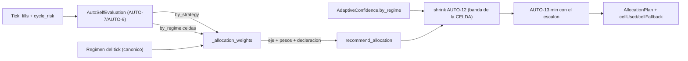

# Plan de fase — `AUTO-14` · Reparto por CELDA de régimen (`V2.55` / `1.80.0-beta`)

**Fase:** `AUTO-14` · **Fecha:** 2026-09-23 · **Fase anterior:** `V2.54` / `AUTO-13` (sellada: tag
`v2.54-beta` → `54a3b86a`, `Release tag CI` `35857892968` **GREEN**, `1.79.0-beta`).
**Rótulo:** `AUTO-14` sobre `V2.55` / `1.80.0-beta` · **Alcance ratificado por el propietario
(2026-09-23):** **core backend**, **sin UI**, **sin migración**, **sin tocar el gobernador** y **sin
clave nueva en el journal durable**. El flag Adaptive sigue **OFF** por defecto: nada de lo nuevo
cambia el comportamiento publicado.

**Origen.** El §20 del audit de `AUTO-13` dejó **fuera** la *matriz de régimen avanzada* —el reparto
*por celda*— y la declaró para esta fase:

> «**`AUTO-14` fuera:** reparto por celda de régimen (matriz avanzada), Data Gate **persistido** (si
> el Paso 3 demuestra que hace falta) y la **UI de explicación**.»
> — `traspaso-relevo-post-v2.54-auto-13-...md:489-490`

De los tres candidatos, este plan ejecuta **el primero** (el único que **no** exige migración) y deja
los otros dos declarados, sin tocarlos.

---

## 1. El invariante que instala

> **El reparto no puede mejorar su peso con una celda que no se ha medido.**

Es la extensión del invariante de `AUTO-13` al **material del reparto**: `AUTO-9` cerró *«¿de qué
ciclo es?»* y dejó el cruce `strategy × regime` medido; `AUTO-12` cerró *«¿cuánto puedo creérmelo?»*;
`AUTO-13` cerró *«¿están sanos los datos, y cómo vuelvo?»*. `AUTO-14` cierra *«¿el peso que reparto se
midió en el régimen en el que voy a operar?»*.

Cuatro corolarios, todos medibles:

1. **La celda afina el PESO, nunca la composición.** Quien entra al numerador del reparto lo sigue
   decidiendo la **fila** de la estrategia (`decisive` + expectancy positiva), exactamente como en
   `v2.50`–`v2.54`. La celda solo puede **cambiar el número** con el que una versión ya admitida
   compite. Por eso la fase **no puede** añadir ni quitar competidores: los mutantes que lo intenten
   deben morir.
2. **Sin muestra, no hay celda.** Una celda que no es `decisive` (ciclos `< min_trades` o R no medido
   en todos sus ciclos), una celda ausente, una celda con el R **neto** no medido o una celda medida
   **no positiva** **no mueven el peso**: esa versión conserva su número **global** y el hueco se
   **declara** con su motivo.
3. **Sin régimen legible no hay juicio de régimen.** El régimen del tick ilegible (`None`, `""`,
   `UNKNOWN`) no elige celda: cae al global y lo declara (la lección de `M81`/§20).
4. **La moneda no se inventa por celda.** La celda mide **R** (y R neto); **no** mide moneda por
   régimen. Con el eje histórico (`expectancy_currency`) el reparto sigue siendo **global** y se
   declara: no se deriva un cociente paralelo para fabricar una moneda por celda.

---

## 2. Diseño: dónde entra la celda

### 2.1 Selección de celda (helper puro nuevo)

`regime_cell_for(cells, strategy_version, regime) -> (celda | None, motivo | None)`

- **Normalización declarada y única:** `strip().upper()` en los dos lados. El plan recibe el régimen
  **canónico** de mercado (`TREND_UP`/`TREND_DOWN`/`RANGE`/`HIGH_VOL`/`LOW_VOL`/`UNKNOWN`) porque el
  worker ya lo traduce (`to_market_regime`); aquí **no se traduce otra vez** (un segundo mapa podría
  divergir del que usó la rotación).
- `UNKNOWN`/vacío ⇒ motivo `cell_regime_absent`.
- Sin celda para `(versión, régimen)` ⇒ `cell_not_found`.
- Celda no `decisive` ⇒ `cell_not_decisive`.
- Celda con `net_r_measurement != COMPLETE` ⇒ `cell_net_unmeasured`.
- Celda medida **no positiva** ⇒ `cell_not_positive` (solo una célula medida y positiva afina).
- **Nunca** se elige otra celda ni se hereda la de otro ciclo ni de otra versión.

### 2.2 El reparto (`_allocation_weights` / `recommend_allocation`)

- El **grupo que compite** y el **eje** se calculan **exactamente** como hoy, a partir de la fila:
  con eso la composición del numerador es **byte-idéntica** a `v2.54` y la fase solo puede mover pesos
  **relativos**.
- Cuando el eje adoptado es el **R neto medido**, el valor de cada versión competidora se toma de su
  **celda** si es utilizable; si no, del valor **global** de la fila y el motivo se declara.
- Cuando el eje adoptado es la **moneda**, no se toca el reparto y se declara `cell_axis_without_cell`
  (declaración por versión y `cell_axis=None` en el plan).
- `recommend_allocation` gana dos parámetros **keyword-only opcionales** (`by_regime`, `regime`): sin
  ellos el reparto es **byte-idéntico** al de `v2.54` (el patrón de `AUTO-12` con `confidence=None`).
- Sigue **suma-preservado**, acotado a `[0, 1]` y **sin ceros**; la rampa de `AUTO-13` sigue siendo
  **techo** (`min`) y se aplica **después**.

### 2.3 El encogimiento por confianza (AUTO-12) usa la banda de la celda

`StrategyConfidence.by_regime` ya publica un `RegimeConfidence` por celda (`sample_size`, `effective_n`,
`decay`, `confidence`). Cuando el peso de una versión salió de su celda, el factor de encogimiento se
calcula con **esa** banda; si el peso salió del global, con la banda de la estrategia. Sin lectura de
confianza el comportamiento es el histórico.

### 2.4 Declaración (sin tocar el contrato durable)

`AllocationPlan` gana tres campos declarativos:

- `cell_axis: str | None` — el eje en que las celdas afinaron el reparto (`net_expectancy_r`), o `None`.
- `cell_used: Mapping[str, str]` — versión → régimen de la celda que aportó su peso.
- `cell_fallback: Mapping[str, str]` — versión → motivo del hueco (vocabulario propio).

Viajan en `AllocationPlan.as_dict()` (traza del tick), **no** en el journal: `_ALLOCATION_KEYS` de
`auto_adaptive_journal.py` proyecta solo `riskMultipliers`/`evidenceAxis`, así que el contrato durable
de `AUTO-11` queda **byte a byte igual** y `evidenceAxis` conserva sus dos literales (el eje es el
mismo; lo que se declara aparte es **de dónde salió el número**). El worker **declara** la base de
celda del tick en el log, como `AUTO-13` hace con la rampa y el hueco de régimen.

### 2.5 Sello

`ADAPTIVE_POLICY_VERSION` → **`auto14-v1`** (cambia la regla de asignación), con el test del sello
actualizado **con nombre**. **Consecuencia declarada y medida:** el mismatch de política
(`auto_adaptive_recovery.read_adaptive_state`) marcará las filas históricas `auto13-v1` hasta que se
escriba la primera fila `auto14-v1`, de modo que el gate puede declarar `STALE` **un tick**; se cura
con la primera escritura, **no** resetea el contador (continuidad de política) y **no se ejecuta con
el flag OFF**. No se relaja el contrato de `AUTO-11`.

---

## 3. Ficheros

- `packages/py/analytics/src/bolsa_analytics/cognitive/auto_adaptive.py` — constantes de motivos, sello,
  `regime_cell_for`, `AllocationPlan` (+3 campos), `_allocation_weights`, `recommend_allocation`,
  `build_adaptive_plan`, `__all__`.
- `apps/api-python/src/bolsa_api/background/auto_simulation_worker.py` — **sin cambio de firma** (ya
  pasa `by_regime`/`regime`); se añade la **declaración** de la base de celda del tick en el log.
- `packages/py/analytics/tests/test_auto_adaptive.py` — tests de celda + el test del sello; el test
  `test_regime_cells_alone_do_not_move_rotation_or_allocation` **cambia de contrato** (declarado).
- `apps/api-python/tests/test_auto_v55_auto14_regime_cell_allocation_seam.py` — **costura nueva** con
  el camino real del worker y su **control**.
- `apps/api-python/scripts/v2_44_mutation_audit.py` — `M99…M107`.
- Paquete de cierre: audit-pack, relevo `post-v2.55`, `CHANGELOG.md`, `PROJECT_STATE.md`, índice,
  bump `1.79.0-beta` → `1.80.0-beta`; tag `v2.55-beta` y `main` en fast-forward.

**Sin migración** (Alembic head sigue en `044_auto_cycle_trace`): las celdas ya se producen
(`_aggregate_by_regime`) y ya llegan al plan; el cambio es cálculo puro.

---

## 4. Verificación

- **Compuertas (§5 del relevo):** `ruff check packages/py apps/api-python --config pyproject.toml` · el
  `mypy` exacto del YAML · `lint-imports --config packages/py/.importlinter`.
- **Unit:** celda decisiva **mueve** el multiplicador; celda no decisiva / ausente / net no medido /
  no positiva / régimen ilegible **no** lo mueven y **declaran**; composición byte-idéntica a `v2.54`;
  eje no mezclado; suma-preservado / bounded / never-zero; rampa como techo sobre el peso de celda;
  shrink con la banda de la celda.
- **Costura** con el camino real del worker y **control**: una celda sin muestra no mueve y una
  decisiva sí (un control mudo ya se destapó una vez en esta línea).
- **Delta simétrico fichero a fichero contra `HEAD`** (nunca restando totales): los rojos admisibles son
  los **declarados** —el test de contrato de celdas y el sello renombrado a `auto14`—; cualquier otro
  rojo es regresión.
- **Mutaciones `M99…M107`:** celda no decisiva moviendo peso · fallback sin declarar · celda no
  positiva usada como peso · celda de otra versión/régimen · régimen ilegible eligiendo celda · celda
  `PARTIAL` tratada como medida · eje mezclado por fila · shrink con la banda de la fila en vez de la de
  la celda · composición cambiada por la celda. **Matriz COMPLETA sin ninguna etiqueta en `NADA`** y
  árbol intacto.
- **Cierre:** `Release tag CI` del tag medido (cifras citadas por su run) y `main` en fast-forward.

---

## 5. Límites declarados

- El reparto por celda **solo** actúa sobre el eje del **R neto medido**; con el eje de moneda el reparto
  es global y lo declara (no hay moneda medida por celda y no se inventa).
- La celda **nunca** cambia quién compite: solo el peso relativo de quien ya competía.
- El flag Adaptive sigue **OFF**; sin él, esta fase no se ejecuta.
- **Fuera de alcance (sin tocar):** Data Gate persistido y la UI de `AUTO-7`…`AUTO-13`.

## 6. Freeze respetado

No se toca el sello de `V2.53`/`V2.54`, `auto_adaptive_journal.py` (byte a byte igual),
`yahoo_circuit_breaker.py`, `ADAPTIVE_ADVERSE_REGIMES`, los umbrales de rotación, el gobernador
(`v2_43_governor_evidence.py`, diff vacío y `exit 0`), la tabla `decision_journal_entries` ni el
esquema. Sin SHORT, sin backfill, sin UI. `*.md` sin `prettier`.
