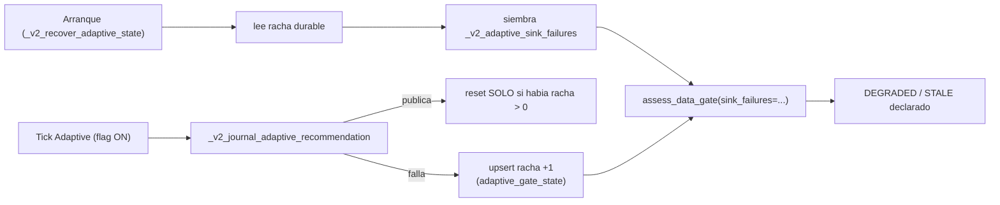

# AUTO-15 — Data Gate PERSISTIDO (`V2.56` / `1.81.0-beta`)

**Estado:** **alcance ratificado por el propietario** (Opción A de la tabla de candidatos del §5 del
[arranque del agente post-v2.55](./arranque-agente-post-v2.55-auto-14-2026-09-23.md)) y **plan
ratificado «tal cual»** — las dos decisiones abiertas del final se cerraron a favor de lo propuesto
(PK `(account_id, engine_id)` y reset con `WHERE sink_failures > 0`). **Fase EJECUTADA y sellada**:
el paquete de cierre es el [audit-pack `v2.56`](./audit-pack-v2-56-auto-15-data-gate-persistido-2026-09-23.md).
**Fase anterior:** `AUTO-14` / `V2.55` (tag `v2.55-beta` → `e29e6227`, `Release tag CI` `35889751810`
**GREEN**, `1.80.0-beta`, PR de auditoría [#64](https://github.com/jvelasca/Bolsa_V1/pull/64)).
**Producto:** BETA / no producción · **el flag Adaptive sigue OFF por defecto**.

---

## Alcance ratificado

Opción **A**. Core backend, **sin UI**, **sin tocar el gobernador** y **sin clave nueva en el journal
durable**. **SÍ exige migración** (y aquí se justifica por qué, medido). El flag Adaptive sigue **OFF**:
con OFF este trabajo **no ejecuta ni un I/O nuevo** y el runtime publicado sigue siendo, en
comportamiento, el de `v2.53-beta`.

## Invariante que protege

> **«No acusar sin prueba» sobrevive a un reinicio.**

Hoy el contador de fallos consecutivos del sink vive **solo en la memoria del proceso**
(`auto_simulation_worker.py:748`). Un reinicio lo devuelve a `0`, así que la racha que degrada el gate
(`DEGRADED`) y la que lo congela (`STALE`, umbral `sink_failures_stale = 3`) **se olvidan**: un journal
que lleva días fallando puede arrancar creyéndose sano. Esto es exactamente el P0 que `AUTO-3` cerró
para la parada dura («la parada DURA pertenecía a la MEMORIA del proceso, así que un crash las
olvidaba», `versions/043_exit_identity_and_kill_state.py:4-11`) y la ventana que `AUTO-13` **declaró**
como límite suyo: «el contador de fallos es **de proceso** (se pierde al reiniciar)»
(`audit-pack-v2-54-...md:263`, §3) y la **primera pregunta abierta** de su arranque de auditor
(`arranque-auditor-v2.54-...md:285-288`), que la cerró pidiendo **persistir la racha**.

Lo que **no** cambia: los umbrales (`DATA_GATE_SINK_FAILURES_STALE_DEFAULT = 3`,
`DATA_GATE_JOURNAL_GAP_BLOCKED_DEFAULT = 10`, `DATA_GATE_EVALUATION_CYCLE_SECONDS_DEFAULT = 60.0`), la
tabla estado→efecto, la precedencia `BLOCKED > STALE > DEGRADED > OK` ni la regla de corroboración del
ancla de antigüedad (`_v2_adaptive_gate_journal_age`, `auto_simulation_worker.py:3385`). El gate sigue
siendo un **gate de evidencia**, no de riesgo.

## El hecho medido (lo que hay hoy, con su `ruta:línea`)

| Qué | Dónde | Límite declarado |
| --- | --- | --- |
| Contador de fallos consecutivos del sink (**RAM**) | `auto_simulation_worker.py:748` (`_v2_adaptive_sink_failures`), `:749` (`..._last_success_at`) | se pierde al reiniciar |
| Se incrementa al fallar / se resetea al publicar | `auto_simulation_worker.py:3436-3441` / `:3448-3450` | — |
| Entra al gate como hecho | `auto_simulation_worker.py:3320` (`sink_failures=...`) | — |
| Umbral que lo convierte en `STALE` | `auto_adaptive_data_gate.py:75` (`=3`), usado en `:291-292` | — |
| Mitad que **sí** sobrevive (antigüedad del journal) | `auto_adaptive_data_gate.py:206` (`journal_age_cycles`) + `auto_simulation_worker.py:3372` | corroborada por un fallo propio (`:3385-3400`) |
| Estado durable de Adaptive (journal) | `auto_adaptive_recovery.py:357` (`read_adaptive_state`) · `auto_simulation_worker.py:3452` (`_v2_recover_adaptive_state`) | **no** contiene el fallo de escritura: una escritura que falló no dejó fila |

**Por eso la migración es la única salida honesta:** el fallo **no se puede reconstruir** del journal
—no se escribió nada— ni del ancla de antigüedad (que mide publicación, no error). Deducirlo sería
inventar la prueba que el invariante exige.

## Flujo objetivo

## Decisiones de diseño a ejecutar (y a medir)

- **Dónde vive.** Tabla **nueva** `adaptive_gate_state`, una fila por `(account_id, engine_id)`
  (PK compuesta, mismo criterio que `auto_kill_state`), con `sink_failures`, `last_failure_at`,
  `last_success_at`, `updated_at`. **Sin backfill**: la ausencia de fila es información (racha 0), nunca
  un cero fabricado. Espeja el patrón ya certificado de `auto_kill_state`:
  `tables.py:2708` (`AutoKillStateRow`) + `kill_switch_store.py:172` (`PostgresKillSwitchStore`,
  upsert idempotente con `pg_insert`).
- **Lectura al arrancar, UNA vez.** Se siembra dentro de `_v2_recover_adaptive_state`
  (`auto_simulation_worker.py:3452`), **gateado por `adaptive_enabled`** (`:3469`): con el flag OFF no
  hay I/O nuevo y el camino publicado no cambia. Fail-open **declarado**, sin fingir salud ni fallo:
  sin store o sin lector ⇒ racha `0` + motivo en el log (el hueco se declara); lectura rota ⇒ `0` +
  motivo (nunca se convierte en `STALE` por un error de lectura propio, que ya lo cubre `read_ok`).
- **Escritura sin amplificación.** En **fallo**: `upsert` de la racha (`+1`) y `last_failure_at`. En
  **éxito**: reset **solo si hay racha que resetear** (`UPDATE ... WHERE sink_failures > 0`), de modo
  que un despliegue sano **no paga una escritura por tick**. El contador se escribe en la **misma
  sesión del tick** y con el mismo contrato que el sink (`commit` propio y `rollback` en el fallo, para
  no envenenar la sesión) — el sink ya está en el camino del tick, así que no se añade un store nuevo al
  turno.
- **Aritmética invariante.** La racha durable entra al gate **por el mismo hecho**
  (`sink_failures=`), así que `assess_data_gate` no cambia: el gate sigue sin saber de dónde viene el
  número. Un fallo aislado sigue siendo `DEGRADED` y solo `3` consecutivos son `STALE`.
- **«Se cura en un tick».** Una racha durable vieja de un proceso muerto mantiene el gate degradado
  hasta la **primera publicación**, que la resetea. Es el mismo patrón declarado del mismatch de
  política de `AUTO-13`, y **no** se le pone un TTL: un TTL sería una heurística no declarada, y una
  racha vieja es prueba real de que hubo fallos.
- **Sello del gate (`DataGatePolicy.policy_version`).** Sube a **`auto15-v1`**
  (`auto_adaptive_data_gate.py:69`): la **procedencia** de uno de los hechos cambia (de proceso a
  durable) y eso tiene que quedar sellado, aunque los umbrales y la tabla estado→efecto sean los
  mismos. **NO** se toca `ADAPTIVE_POLICY_VERSION` (`auto14-v1`): la regla de **reparto** no cambia, y
  subirla sería mentir sobre ella.
- **Declaración nueva, sin romper la lectura vieja.** `DataGateReading.as_dict()`
  (`auto_adaptive_data_gate.py:170`) publica `sinkFailuresDurable: bool`, el único campo nuevo: dice si
  la racha vino del estado durable o nació en el proceso. Un log viejo se sigue leyendo igual.

**Dos decisiones que el propietario puede cambiar en la ratificación** (no las doy por cerradas):

1. **Granularidad de la PK**: `(account_id, engine_id)` (espeja `auto_kill_state`) frente a
   `(account_id)` a secas. Propongo la primera, y lo **declaro**: con la segunda, dos motores de la
   misma cuenta compartirían racha y uno curaría el fallo del otro.
2. **Reset en el éxito**: `UPDATE ... WHERE sink_failures > 0` (sin amplificación) frente a escribir
   siempre. Propongo la primera; la segunda paga una escritura por tick para no ganar nada.

## Ficheros que tocaría

- **Nueva migración** `packages/py/infrastructure/alembic/versions/045_adaptive_gate_state.py`:
  `revision = "045_adaptive_gate_state"`, `down_revision = "044_auto_cycle_trace"` (head actual),
  idempotente y `upgrade`/`downgrade` **simétricos** (patrón medido en `versions/043_...py:150-216`:
  `_table_exists`/`_index_exists`, `DROP` ordenado).
- **Nueva fila ORM** en `packages/py/infrastructure/src/bolsa_infrastructure/database/models/tables.py`
  (espejo de `AutoKillStateRow`, `:2708`).
- **Nuevo store** `packages/py/application/src/bolsa_application/adaptive_gate_store.py`: contrato puro
  (`AdaptiveGateState` + el store in-memory que espeja el contrato) y `PostgresAdaptiveGateStore` con
  **dos** operaciones y **ninguna** que guarde la fila entera (`load`, `record_failure` con incremento
  atómico `ON CONFLICT DO UPDATE`, `record_success` con `WHERE sink_failures > 0` y `commit` explícito;
  espejo de `kill_switch_store.py:172-210`, más el `rollback`+`raise` del sink de `AUTO-10`).
- **Gate (analytics)** `packages/py/analytics/src/bolsa_analytics/cognitive/auto_adaptive_data_gate.py`:
  sello (`:69`) y el campo de procedencia en `as_dict()` (`:170`). **Ni un umbral ni la tabla
  estado→efecto** (`:84-90`) se tocan.
- **Worker** `apps/api-python/src/bolsa_api/background/auto_simulation_worker.py`: el contador
  (`:748-749`), la siembra al arrancar (`:3452`), el incremento/reset (`:3436-3450`) y el cableado de
  producción (`:5468-5491`, junto a `build_adaptive_recommendation_sink` `:4964`).
- **CI** `.github/workflows/python-ci.yml`: una variable de gate nueva
  (`ADAPTIVE_GATE_PG_REQUIRED`, patrón `:504-525`) y el test PG en la lista del job
  `auto-v2-durable-pg` (`:557-563`), que ya tiene guard fail-if-skipped (`:565-577`).
- **Tests**: unit del gate (`packages/py/analytics/tests/test_auto_adaptive_data_gate.py`), unit del
  store, costura nueva `apps/api-python/tests/test_auto_v56_auto15_data_gate_durable_seam.py` (con
  **control**) y PG `apps/api-python/tests/test_auto_v56_auto15_data_gate_pg.py` (reinicio real).
- **Sonda** `apps/api-python/scripts/v2_44_mutation_audit.py`: `M108…M118` (once: las nueve previstas más
  `M117`/`M118`, que cubren el contrato de **sesión limpia** del store —`rollback` + `raise`—, añadido al
  implementar el paso 1 con la firma del sink de `AUTO-10`).
- **Paquete de cierre**: audit-pack `v2.55`→`v2.56`, relevo `post-v2.56`, arranques, `CHANGELOG.md`
  (`1.81.0-beta`), `PROJECT_STATE.md`, entrada del `engineering-index`; bump
  `package.json` `1.80.0-beta` → `1.81.0-beta`; tag `v2.56-beta` y `main` en fast-forward; **PR de
  auditoría** (paridad con [#64](https://github.com/jvelasca/Bolsa_V1/pull/64), base anclada en
  `e29e6227`).

## Migración: **SÍ**

`045_adaptive_gate_state`, cadena lineal desde `044_auto_cycle_trace`. **Por qué es inevitable:** la
racha que se quiere conservar nace de un **fallo de escritura**, y una escritura que falló **no dejó
fila** en `decision_journal_entries`; el ancla durable de `AUTO-13` mide *publicación*, no *error*. Sin
tabla propia, o se deduce (inventar la prueba) o se sigue perdiendo al reiniciar. La migración es
**aditiva, sin backfill** y con `downgrade` simétrico; el contrato de `decision_journal_entries` y
`auto_adaptive_journal.py` quedan **byte a byte iguales**. Alembic head pasará de `044_auto_cycle_trace`
a `045_adaptive_gate_state`.

## Gate de verificación

- **Compuertas §5** (los comandos de CI, no rutas sueltas): `ruff check packages/py apps/api-python
  --config pyproject.toml`, el `mypy` exacto del YAML y `lint-imports --config packages/py/.importlinter`.
- **Unit del gate**: mismos hechos ⇒ misma lectura y mismo `as_dict` salvo `sinkFailuresDurable`; los
  umbrales y la tabla estado→efecto **intactos**; `sinkFailuresDurable` nunca afirma durable sin store.
- **Unit del store**: upsert idempotente (dos `+1` = racha 2), reset que deja la fila en `0`, y
  `load` de una cuenta/engine que no existe ⇒ `None` (no un `0` inventado).
- **Costura con CONTROL** (por el camino real del worker): `3` fallos del sink en un proceso ⇒ el tick
  publica `STALE`; **proceso NUEVO** con el mismo estado durable ⇒ el gate sigue viendo la racha (el
  control negativo: sin store, el reinicio leería `0` = `OK`); una publicación intermedia ⇒ el reinicio
  lee `0`. Y con el **flag OFF** ningún camino nuevo hace I/O ni cambia el plan.
- **PG real (reinicio de verdad)** en el job `auto-v2-durable-pg` con `ADAPTIVE_GATE_PG_REQUIRED=1`:
  roundtrip de la migración (`upgrade`/`downgrade`), la racha **sobrevive a una sesión nueva** y el
  reset no amplifica escrituras.
- **Mutaciones `M108…M118`**: racha que se resetea al reiniciar · fallo que no persiste · racha durable
  leída pero ignorada · reset amplificando (escribir en cada éxito) · store leyendo la fila de **otra**
  cuenta/engine · estado durable ilegible tratado como **sano** · estado durable ilegible tratado como
  **fallo** · sello del gate sin subir · `sinkFailuresDurable` afirmando durable sin store · escritura
  fallida que **no** limpia la sesión del tick · reset fallido que **no** la limpia.
- **Matriz COMPLETA** (`M1…M118`): `0` etiquetas en `NADA`, `0` fragmentos ausentes, restauración
  **byte a byte** y huella `git status` **idéntica** antes y después.
- **Delta simétrico FICHERO A FICHERO contra `HEAD`** (nunca restando totales), con los rojos
  declarados de antemano (contratos que esta fase cambia: sello del gate y el campo nuevo).
- **Cierre**: `Release tag CI` del tag `v2.56-beta` **medido y citado por su run**; `main` en
  fast-forward; PR de auditoría abierto y declarado.

## Freeze respetado

No se toca el sello de `V2.53`/`V2.54`/`V2.55`, `auto_adaptive_journal.py` (**byte a byte igual**), el
contrato de `decision_journal_entries`, `yahoo_circuit_breaker.py`, `ADAPTIVE_ADVERSE_REGIMES`, los
umbrales de rotación, el **gobernador** (`v2_43_governor_evidence.py`, diff vacío) ni el esquema previo.
**Sin UI**, sin SHORT, sin backfill; `*.md` **sin `prettier`**; `governor.json` sigue **sin trackear**.

## Pasos (cada uno con su gate)

| # | Paso | Gate |
| --- | --- | --- |
| 1 | Migración `045` + fila ORM + store (contrato puro + PG) | roundtrip `upgrade`/`downgrade`, unit del store, idempotencia |
| 2 | Contador durable en el worker (siembra al arrancar + escritura sin amplificación, gateado por el flag) | costura con control + flag OFF sin I/O |
| 3 | Declaración: sello `auto15-v1` + `sinkFailuresDurable` (sin tocar umbrales ni el reparto) | unit del gate |
| 4 | Costura de reinicio real + test PG en el job `auto-v2-durable-pg` | `ADAPTIVE_GATE_PG_REQUIRED=1` sin skips |
| 5 | `M108…M118`, matriz completa, compuertas, delta simétrico, paquete de docs, bump y sello `v2.56-beta` | §5 + CI del tag medida + PR de auditoría |

---

**Ratificación cerrada.** El propietario ratificó el plan **«tal cual»**, incluidas las dos decisiones
abiertas: PK **`(account_id, engine_id)`** y **reset sin amplificación** (`WHERE sink_failures > 0`).
La fase se ejecutó en cinco pasos con sus gates y se selló en `v2.56-beta`; el resultado **medido** (y lo
que no se pudo medir aquí) está en el [audit-pack `v2.56`](./audit-pack-v2-56-auto-15-data-gate-persistido-2026-09-23.md).
