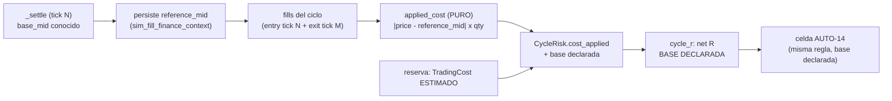

# AUTO-16 — Coste REAL por ciclo (`V2.57` / `1.82.0-beta`)

**Estado:** **alcance ratificado por el propietario** (Opción **C** de la tabla de candidatos del §5 del
[arranque del agente post-v2.56](./arranque-agente-post-v2.56-auto-15-2026-09-23.md)) y **plan ratificado
«tal cual»** — las dos decisiones abiertas del final se cerraron a favor de lo propuesto (persistir
**solo la referencia cruda** `reference_mid` y usar el **estimado declarado** como base de respaldo).
**Fase EJECUTADA y sellada**: el paquete de cierre es el
[audit-pack `v2.57`](./audit-pack-v2-57-auto-16-coste-real-por-ciclo-2026-09-24.md) (y el
[relevo](./traspaso-relevo-post-v2.57-auto-16-coste-real-por-ciclo-2026-09-24.md)). **Una desviación
declarada** respecto a este texto: la referencia se persiste **siempre** (en la escritura del settlement
que ya existía), y lo que el flag gatea es su **uso** — ver el audit-pack §3.
**Fase anterior:** `AUTO-15` / `V2.56` (tag `v2.56-beta` → `8ad54416`, `Release tag CI` `35928080874`
**GREEN**, `1.81.0-beta`, PR de auditoría [#65](https://github.com/jvelasca/Bolsa_V1/pull/65)).
**Producto:** BETA / no producción · **el flag Adaptive sigue OFF por defecto**.

---

## Alcance ratificado

Opción **C**. Core backend, **sin UI**, **sin tocar el gobernador** y **sin clave nueva en el journal
durable**. **SÍ exige migración** (y aquí se justifica por qué, medido). El flag Adaptive sigue **OFF**:
con OFF este trabajo **no ejecuta ni un I/O nuevo** y el runtime publicado sigue siendo, en
comportamiento, el de `v2.56-beta`.

## Invariante que protege

> **El R neto declara su BASE: el coste que el simulador APLICÓ cuando se midió, y el que el decisor
> SUPUSO cuando no — nunca se adivina cuál de los dos es.**

Hoy el coste que entra al R neto es el **estimado en el instante de la decisión** y así está declarado
(`auto_self_evaluation.py:372-375`): «la atribución por fill exigiría el spine de settlement, fuera de
esta fase». Ese spine **ya existe**: el fill persiste su precio (`sim_fill_finance_context.price`), el
ciclo está atado al fill (`cycle_id`, migración `044`) y el simulador **construye** el precio con una
fricción determinista y adversa sobre un mid de referencia (`simulated_broker.py:228-247`). Lo que
falta no es el dato: es **persistir su referencia** para poder recomponerlo tras un reinicio.

El resultado de cerrar ese hueco es medible en dos direcciones:

- El neto deja de depender de una **suposición del decisor** en los ciclos donde el simulador aplicó una
  fricción conocida (y sigue declarando cuándo no).
- El **desvío modelo-vs-aplicado** deja de ser invisible: el `TradingCostModel` del decisor usa
  `spread_bps=2.0`/`slippage_bps=5.0`/`commission_bps=10.0` (`portfolio_reservation.py:175-177`) y el
  simulador aplica `adverse_slippage_bps=4`/`spread_bps=6` (`simulated_broker.py:145-146`). Dos modelos
  distintos se estaban leyendo como si fueran el mismo número.

Lo que **no** cambia ni se promete: los umbrales, la tabla estado→efecto, la regla de reparto (quién
compite y con qué eje) ni el gate de evidencia. **No** se promete que las celdas de `AUTO-14` dejen de
abstenerse (`ADAPTIVE_CELL_NOTE_NET_UNMEASURED`): un ciclo sin coste medido sigue declarando su hueco —
lo que cambia es **de dónde sale el número cuando sí existe**.

## El hecho medido (lo que hay hoy, con su `ruta:línea`)

| Qué | Dónde | Límite declarado |
| --- | --- | --- |
| Coste que entra al R neto (**ESTIMADO**) | `cycle_r` `auto_self_evaluation.py:353`; etiquetado como estimado en `:372-375` | no es el aplicado |
| De dónde lo toma el ciclo | `cycle_risk.py:212` (`cost = entry.cost`) ← reserva | copia literal del estimado |
| Qué persiste la reserva | `tables.py:2579-2581` (`TradingCost.to_dict()` en `cost`) | **estimado**, no aplicado |
| Modelo con el que se estima | `portfolio_reservation.py:205` (`TradingCost`) · `:263` (`estimate_trading_cost`) · `:161-177` (bps) | `spread 2` / `slippage 5` / `commission 10` |
| Fricción que el simulador **APLICA** | `simulated_broker.py:228-247` (`px = mid ± |slip + spr/2|`), bps en `:145-146` | `adverse_slippage 4` + `spread 6` |
| Mid de referencia del fill | `auto_simulation_worker.py:1274` (`base_mid=self._price_script(...) or 100.0`) | **no se persiste** |
| Precio del fill (sí persiste) | `sim_fill_finance_context.price` (`sim_durable_store.py:87`), migración `028` | sin su referencia no hay fricción |
| Atadura fill↔ciclo | `cycle_id` (migración `044`) + índice `sim_fill_finance_context_cycle_id_idx` | ya existe |
| Lectura de un ciclo por sus fills | patrón ya certificado: `reservation_store.py:146`/`:448`/`:658` (`list_by_cycle_ids`) | reutilizable |
| Comisión realizada en SIM | `lifecycle_from_auto.py:122` (`fees=0 if mapping.fill_id`) | **no se modela**: el aplicado no la trae |

**Por eso la migración es la única salida honesta:** la fricción de **entrada** de un ciclo se midió en un
tick **anterior** (otra sesión, posiblemente otro proceso) y su referencia no está en ningún sitio. Sin
persistirla, o se deduce del precio solo (inventar la referencia) o se sigue midiendo con la suposición
del decisor — y esto es exactamente la lección que `AUTO-15` pagó: **lo que vive en la memoria del
proceso se olvida**.

## Flujo objetivo

## Decisiones de diseño a ejecutar (y a medir)

- **La fricción aplicada es un COSTE, por construcción y por signo.** El simulador hace el precio
  adverso (`buy`: `mid + |Δ|`; `sell`: `mid − |Δ|`), así que `|price − reference_mid| × qty` es una
  **pérdida**, jamás un ingreso. El módulo puro lo declara con esa semántica y **no** acepta un signo
  que convierta la fricción en rebaja (la mutación que invierte el signo tiene que morder).
- **La referencia se persiste CRUDA, la fricción se computa PURA.** Se guarda `reference_mid` (hecho
  medido en el settlement, `worker:1274`) y la fricción se deriva en una función pura y determinista.
  Una sola fuente de verdad; la migración es aditiva y mínima.
- **Granularidad por fill, agregación por ciclo.** Misma identidad que la traza (`execution_id`) y la
  misma atadura `cycle_id` de `044`; el agregado por ciclo (entrada + salida) es aritmética pura. Una
  sola pata medida ⇒ el ciclo declara su hueco (no se inventa la otra).
- **La comisión se declara, no se finge.** El aplicado cubre **solo** la fricción del schedule; la
  comisión sigue siendo la **estimada** del modelo. La base se publica tal cual
  (`costBasis: "applied_friction+modelled_commission"`) para que nadie lea el número como un coste
  realizado completo.
- **Sin backfill.** Una fila anterior a `046` no tiene `reference_mid`: el ciclo no tiene coste aplicado
  y lo **declara** (hueco honesto). Un `reference_mid` ausente **nunca** vale `0` (diría "fricción
  gratis", que es regalar R).
- **Sello del reparto (`ADAPTIVE_POLICY_VERSION`).** Sube a **`auto16-v1`** (`auto_adaptive.py:168`):
  cambia la **procedencia de un INPUT** del eje del R neto (estimado → aplicado declarado), aunque ni
  los umbrales ni la regla de reparto cambien. Es el mismo criterio con el que `AUTO-15` subió el sello
  del gate; **no** se toca `DATA_GATE_POLICY_VERSION` (`auto15-v1`).
- **Declaración nueva sin romper la lectura vieja.** Se añade la base y el número aplicado a la lectura
  (`costApplied` + `costBasis` en el ciclo; base y medición en el agregado). El `costEstimate` **sigue
  publicándose** igual: un log viejo y un consumidor viejo se siguen leyendo.

**Dos decisiones que el propietario puede cambiar en la ratificación** (no las doy por cerradas):

1. **Qué se persiste por fill**: (a) **solo la referencia cruda** `reference_mid` y la fricción se
   computa pura — una sola fuente de verdad, migración mínima (**propuesta**); frente a (b) referencia
   **y** fricción aplicada persistidas — auditable sin recomputar, pero con dos fuentes que pueden
   divergir y ensanchan el esquema.
2. **Qué base usa el R neto cuando el aplicado falta** (histórico, o pata sin medir): (a) el **estimado,
   declarado** como base (`costBasis: "estimated"`), manteniendo el neto utilizable como hoy y sin
   mezclar nada a escondidas (**propuesta**); frente a (b) **hueco declarado** (el neto no se calcula),
   más estricto pero con MÁS abstenciones que hoy en el histórico.

**CERRADAS en la ratificación:** (1) **solo la referencia cruda**; (2) **el estimado, declarado** como
base de respaldo. Con la segunda, el camino sin coste aplicado publica **el mismo número que `v2.56`**
(byte a byte) y la diferencia viaja en `costBasis`, nunca en silencio.

## Ficheros que tocaría

- **Nueva migración** `packages/py/infrastructure/alembic/versions/046_fill_reference_mid.py`:
  `revision = "046_fill_reference_mid"`, `down_revision = "045_adaptive_gate_state"` (head actual),
  columna `reference_mid` `Numeric(18,6)` **nullable** en `sim_fill_finance_context` (sin backfill),
  idempotente y `upgrade`/`downgrade` **simétricos** (patrón medido en `versions/045_...py` y
  `043_...py:150-216`).
- **Guardia de la head** `apps/api-python/tests/test_discovery_evidence_snapshot_pg.py:43`
  (`_ALEMBIC_HEAD`): **bumpear `045_adaptive_gate_state` → `046_fill_reference_mid`** en el **mismo**
  paso 1. Es la causa raíz del **re-sello** de `v2.56`; aquí se paga por adelantado.
- **Fila ORM** `packages/py/infrastructure/src/bolsa_infrastructure/database/models/tables.py:2211`
  (`SimFillFinanceContextRow`): la columna nueva, espejo del modelo puro.
- **Modelo puro + store** `packages/py/application/src/bolsa_application/sim_durable_store.py:80`
  (`SimFillFinanceContext`) y `:147`/`:357` (contrato + PG): el campo nuevo y la lectura
  **`list_by_cycle_ids`** por `cycle_id` (patrón espejo de `reservation_store.py:146/448/658`).
- **Productor** `packages/py/application/src/bolsa_application/sim_finance_context.py:33`
  (`persist_fill_finance_context`): recibe y persiste la referencia del settlement.
- **Seam del settlement** `apps/api-python/src/bolsa_api/background/auto_simulation_worker.py:1240-1295`
  (`_settle`): la `base_mid` de `:1274` viaja hasta la persistencia del contexto.
- **Módulo puro nuevo** `packages/py/application/src/bolsa_application/applied_cost.py`: fricción
  aplicada por fill y agregado por ciclo (con su medición), sin I/O ni reloj.
- **Ciclo** `packages/py/application/src/bolsa_application/cycle_risk.py`: `cost_applied` +
  `cost_applied_measurement` nuevos junto al `cost` estimado (`:105`), el pegador puro
  `attach_applied_cost` y `to_cycle_fields` (`:118-129`) / `as_dict` (`:135`, `costEstimate` se
  mantiene y aparece `costApplied` **con su medición**). La **base** NO se declara aquí: se declara
  donde se calcula el neto (`auto_self_evaluation.cycle_r`) —una sola regla, un solo sitio—, porque
  dos implementaciones de la misma regla podrían divergir en silencio.
- **Cableado (sin I/O nuevo)** `packages/py/application/src/bolsa_application/auto_self_evaluation_feed.py`:
  los fills que ya se leen para reconstruir el ciclo llevan su `reference_mid`, así que la fricción
  aplicada se pega en ``_risk_with_applied_cost`` —un solo punto, del que cuelgan el informe
  ``AUTO-7``, la confianza ``AUTO-12`` y la rampa ``AUTO-13``—. Medido en el código actual, el
  llamante del worker (`auto_simulation_worker.py:3078-3093`) ya tiene los fills en la mano: **no
  hace falta una segunda lectura** en el tick.
- **R neto** `packages/py/analytics/src/bolsa_analytics/cognitive/auto_self_evaluation.py`:
  `cycle_r` (`:353`) con base declarada, el agregado (`:1040-1042`, `:1100`, `:1118`) con la medición de
  la base aplicada, y la nota `SELF_EVAL_COST_UNMEASURED` sin cambios de semántica.
- **Reparto (analytics)** `packages/py/analytics/src/bolsa_analytics/cognitive/auto_adaptive.py`: sello
  (`:168` → `auto16-v1`). **Ni la regla de composición (`:902`, `:940-950`) ni la nota de celda
  (`:247-249`) cambian de semántica.**
- **Lector de verificación** `packages/py/application/src/bolsa_application/sim_durable_store.py`
  (`list_by_cycle_ids`, espejo de `reservation_store.py:146/448/658`): NO entra en el tick (los
  fills ya están en la mano); certifica en el test PG que la referencia de un ciclo **sobrevive a
  una sesión nueva** y que un fill de otra cuenta no casa.
- **Tests**: unit de `applied_cost` (nuevo), unit del store (nuevo caso), unit del ciclo y del neto,
  costura nueva `apps/api-python/tests/test_auto_v57_auto16_applied_cost_seam.py` (con **control**) y PG
  `apps/api-python/tests/test_auto_v57_auto16_applied_cost_pg.py` (roundtrip + reinicio real).
- **CI** `.github/workflows/python-ci.yml` y `.github/workflows/release-tag-ci.yml`: los puros nuevos
  (`test_sim_fill_reference.py`, `test_applied_cost.py`) van **EXPLÍCITOS** en el job `quality` —ese
  directorio no tiene pase de directorio, un fichero sin listar no corre en ninguna parte—, el test PG
  nuevo en el job `auto-v2-durable-pg` (lista `:557-563`) con guard fail-if-skipped (`:565-577`) y
  variable nueva `APPLIED_COST_PG_REQUIRED=1` (patrón `ADAPTIVE_GATE_PG_REQUIRED`).
- **Sonda** `apps/api-python/scripts/v2_44_mutation_audit.py`: **`M119…M128`** (diez).
- **Paquete de cierre**: audit-pack `v2.57`, relevo `post-v2.57`, arranques, `CHANGELOG.md`
  (`1.82.0-beta`), `PROJECT_STATE.md`, entrada del `engineering-index`; bump `package.json`
  `1.81.0-beta` → `1.82.0-beta`; tag `v2.57-beta` y `main` en fast-forward; **PR de auditoría** (paridad
  con [#65](https://github.com/jvelasca/Bolsa_V1/pull/65), base anclada en `8ad54416`).

## Migración: **SÍ**

`046_fill_reference_mid`, cadena lineal desde `045_adaptive_gate_state`, **una columna nullable** en
`sim_fill_finance_context`. **Por qué es inevitable:** la fricción que se quiere medir necesita la
referencia con la que el simulador construyó el precio, y esa referencia **no se persiste** en ningún
sitio (`worker:1274` la tiene en memoria y la tira). Deducirla del precio solo es imposible —el precio ya
lleva la fricción dentro—; y la pata de **entrada** de un ciclo se midió en otro tick, así que un cálculo
en memoria cubriría la mitad del ciclo y perdería la otra al reiniciar. La migración es **aditiva, sin
backfill** y con `downgrade` simétrico; el contrato de `decision_journal_entries` y
`auto_adaptive_journal.py` quedan **byte a byte iguales**. Alembic head pasará de `045_adaptive_gate_state`
a `046_fill_reference_mid` (y el `_ALEMBIC_HEAD` de la guardia se bumpea en el paso 1).

## Gate de verificación

- **Compuertas §5** (los comandos de CI, no rutas sueltas): `ruff check packages/py apps/api-python
  --config pyproject.toml`, el `mypy` exacto del YAML y `lint-imports --config packages/py/.importlinter`.
- **Unit del módulo puro**: `buy` y `sell` producen coste **positivo** (adverso por construcción); una
  sola pata medida ⇒ hueco declarado, nunca la mitad del agregado; `reference_mid` ausente ⇒ **no** hay
  coste aplicado (jamás `0`); la aritmética es determinista y sin reloj.
- **Unit del ciclo/neto**: con aplicado completo el neto se calcula **sobre él** y la base se declara;
  sin aplicado y con estimado, la base es `estimated` y el número es el de `v2.56` (**byte a byte**);
  ninguna ruta mezcla bases sin declararlo.
- **Costura con CONTROL** (`apps/api-python/tests/test_auto_v57_auto16_applied_cost_seam.py`, por el camino
  real del worker): un ciclo cerrado ⇒ fricción de entrada **y** salida medidas y el neto del plan sale
  de ellas; el **control negativo**: con el MISMO material y solo sin `reference_mid` persistida, el
  ciclo declara el hueco, el neto es el estimado de `v2.56` (**byte a byte**) y su base se declara; el
  aplicado **mueve los pesos** del reparto (la consecuencia que justifica el sello); y se **mide** que
  no hay I/O nuevo: una lectura de fills por versión (la de `AUTO-9`) y **cero** por ciclo.
- **PG real (reinicio de verdad)** (`apps/api-python/tests/test_auto_v57_auto16_applied_cost_pg.py`, job
  `auto-v2-durable-pg` con `APPLIED_COST_PG_REQUIRED=1`): roundtrip de la `046` (`upgrade`/`downgrade`),
  la `reference_mid` **sobrevive a una sesión nueva**, la fricción aplicada se **recompone fuera del
  proceso** que la midió (las dos patas), una fila sin referencia se declara sin fricción (jamás `0`), la
  lectura por ciclo **no cruza cuentas**, y la guardia `_ALEMBIC_HEAD` pasa.
- **Mutaciones `M119…M128`**: coste aplicado **ignorado** (se usa el estimado sin declararlo) · signo
  invertido (la fricción se lee como rebaja) · comisión **omitida** del agregado sin declararlo · ciclo
  compuesto **solo** con los fills del tick (se pierde la pata de entrada) · `reference_mid` ausente
  tratado como fricción **0** · store leyendo la fila de **otra** cuenta/ciclo · sello del reparto sin
  subir · migración que **no** persiste la referencia · base declarada como `applied` sin medición
  detrás · agregado que mezcla bases **sin** declararlo.
- **Matriz COMPLETA** (`M1…M128`): `0` etiquetas en `NADA`, `0` fragmentos ausentes, restauración
  **byte a byte** y huella `git status` **idéntica** antes y después.
- **Delta simétrico FICHERO A FICHERO contra `HEAD`** (nunca restando totales), con los rojos declarados
  de antemano (contratos que esta fase cambia: el sello del reparto, el `as_dict` del ciclo y el campo
  nuevo del contexto del fill).
- **Cierre**: `Release tag CI` del tag `v2.57-beta` **medido y citado por su run**; `main` en
  fast-forward; PR de auditoría abierto y declarado.

## Freeze respetado

No se toca el sello de `V2.53`/`V2.54`/`V2.55`/`V2.56`, `auto_adaptive_journal.py` (**byte a byte
igual**), el contrato de `decision_journal_entries`, `yahoo_circuit_breaker.py`,
`ADAPTIVE_ADVERSE_REGIMES`, los umbrales de rotación, el **gobernador** (`v2_43_governor_evidence.py`,
diff vacío) ni el esquema previo. **Sin UI**, sin SHORT, sin backfill; `*.md` **sin `prettier`**;
`governor.json` sigue **sin trackear**.

## Pasos (cada uno con su gate)

| # | Paso | Gate |
| --- | --- | --- |
| 1 | Migración `046` + columna ORM + campo en el modelo/store + **bump de `_ALEMBIC_HEAD`** | roundtrip `upgrade`/`downgrade`, unit del store, idempotencia, guardia de la head |
| 2 | Módulo puro `applied_cost` + persistencia de la referencia en el settlement (gateado por el flag) | unit del módulo (signo, huecos, sin `0` fabricado) + flag OFF sin I/O |
| 3 | `CycleRisk.cost_applied` + `cycle_r` con **base declarada** (sin tocar umbrales ni la regla de reparto) | unit del ciclo y del neto (estimado byte a byte idéntico) |
| 4 | Lector de verificación por `cycle_id` (no entra en el tick) + costura de reinicio real + test PG en `auto-v2-durable-pg` | `APPLIED_COST_PG_REQUIRED=1` sin skips |
| 5 | `M119…M128`, matriz completa, compuertas, delta simétrico, paquete de docs, sello `auto16-v1`, bump y tag `v2.57-beta` | §5 + CI del tag medida + PR de auditoría |

---

**Ratificación CERRADA.** El propietario ratificó el plan **«tal cual»**, incluidas las dos decisiones
abiertas: persistir **solo la referencia cruda** (`reference_mid`) y usar el **estimado declarado** como
base de respaldo cuando el aplicado no está medido. La fase se ejecuta en los cinco pasos de arriba, cada
uno con su gate; el resultado **medido** (y lo que no se pueda medir aquí) irá al audit-pack `v2.57`.
