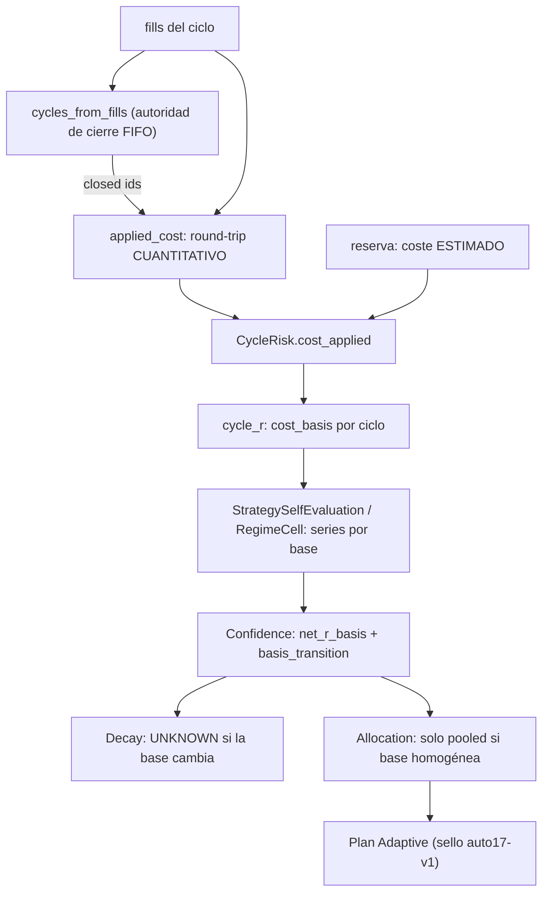

# AUTO-17 — Integridad de la población de medida (`V2.58` / `1.83.0-beta`)

**Estado:** **alcance ratificado por el propietario** (AUTO-17 **completo** con **Opción A: dos series
separadas**) y **plan ratificado «tal cual»**. **Fase EJECUTADA y sellada**: el paquete de cierre es el
[audit-pack `v2.58`](./audit-pack-v2-58-auto-17-integridad-poblacion-medida-2026-09-24.md) (y el
[relevo](./traspaso-relevo-post-v2.58-auto-17-integridad-poblacion-medida-2026-09-24.md)).
**Fase anterior:** `AUTO-16` / `V2.57` (tag `v2.57-beta` → `c5e14ae1`, `Release tag CI` `35968175990`
**GREEN**, `1.82.0-beta`, PR de auditoría [#66](https://github.com/jvelasca/Bolsa_V1/pull/66)).
**Producto:** BETA / no producción → **el flag Adaptive sigue OFF por defecto**.

**Sin migración.** La base del R neto es **recomputable** de `reference_mid` presente/ausente + comisión;
`_ALEMBIC_HEAD` sigue en `046_fill_reference_mid`. Sin UI, sin SHORT, sin backfill, sin tocar el
gobernador.

**Overview:** AUTO-17 «Integridad de la población de medida» cierra el **round-trip cuantitativo** del
coste aplicado y hace viajar la **base del R neto** (`estimated`/`applied_friction+modelled_commission`)
de extremo a extremo, con **dos series separadas** y **sin promediar** poblaciones de base distinta.

---

## Correcciones al acta del auditor (verificadas contra el tag y el árbol)

- **P0 CI del tag — cerrado, no hay hueco.** `v2.57-beta` es un tag anotado (objeto `5354d278…`) que
  apunta a `c5e14ae1…`. El `statuses: []` que vio el auditor es la API **legacy de Commit Status**; el
  repo publica **check-runs**. Medido: `check-runs` de `c5e14ae1` = **37** y `Release tag CI` run
  [`35968175990`](https://github.com/jvelasca/Bolsa_V1/actions/runs/35968175990) (`event=push`,
  `headSha=c5e14ae1`) = **success**. No hubo re-sello ni rojo: es un cruce de API, no un check ausente.
  Se documenta en el audit-pack (§11.7 del pack de `v2.57`).
- **Round-trip (P1) — ya mitigado en el sistema, hueco real en el CONTRATO.** `cycles_from_fills` hace
  FIFO con cantidad y descarta ciclos incompletos (`auto_self_evaluation_feed.py:189`, `open_qty > 0`),
  así que `BUY 100 / SELL 10` no llega al informe. Pero `applied_cost.py` declaraba `COMPLETE` con solo
  presencia de lados (`applied_cost.py:219`) y se alimentaba de `cycle_risk.keys()` (todos los fills,
  incluidos ciclos abiertos). Se endurece el contrato.
- **netR basis (P1) — existía a medias.** `_net_r_basis` + `netRBasis` + nota `mixed` ya existían en el
  agregado (`auto_self_evaluation.py:1124`, `:1222`), pero **no** llegaban a `auto_adaptive_confidence.py`
  (confianza/decay) ni a `auto_adaptive.py` (eje del reparto, `auto_adaptive.py:968`). El `MIXED` se
  **declaraba** pero el pooled `net_expectancy_r` seguía promediando bases (`auto_self_evaluation.py:1154`).

## Invariante

> **Ningún número con el que Adaptive decide promedia dos bases de coste distintas: la base del R neto
> viaja con la evidencia, y una población mixta se declara y se abstiene, nunca se interpreta como mejora
> o deterioro.**

## Alcance ratificado

AUTO-17 **completo** con **Opción A (dos series separadas)**: pre-2.57 = `estimated`, post-2.57 =
`applied`; NUNCA se promedian; un detector `basis_transition` evita leer el cambio de base como señal.
Core backend, **sin UI**, **sin tocar el gobernador**, **sin SHORT**.
**NO hay migración** (la base es recomputable de `reference_mid` presente/ausente + comisión);
`_ALEMBIC_HEAD` sigue en `046_fill_reference_mid`.

## Flujo objetivo

## Pasos (cada uno con su gate)

### Paso 0 — Documentar la verificación del CI del tag (solo docs)
- Añadir al audit-pack de `v2.57` y al arranque de `v2.58` la medición real (37 check-runs + run
  `35968175990`), y la distinción **Commit Status vs check-runs**.
- Declarar el `downgrade` de `046` como **DESTRUCTIVE DATA DOWNGRADE** (simetría de esquema ≠
  reversibilidad de datos) en el docstring de `046_fill_reference_mid.py` y en el audit-pack.

### Paso 1 — Round-trip cuantitativo en `applied_cost` (P1)
- `applied_cost.py`: exigir **balance de cantidades** (`Σ buy qty == Σ sell qty`, tolerancia declarada)
  además de la presencia de lados para declarar `COMPLETE`. Notas nuevas:
  `APPLIED_COST_UNBALANCED_ROUND_TRIP` y `APPLIED_COST_WITHOUT_CYCLE_CLOSURE`.
- Mantener `APPLIED_COST_WITHOUT_ROUND_TRIP` para el caso de lado ausente; el balance usa cantidades
  **aunque falte `reference_mid`** (cierre y medición son ejes independientes: un BUY sin referencia
  sigue cerrando contra su SELL, pero el ciclo queda `PARTIAL`/suelo).
- `auto_self_evaluation_feed.py`: `_risk_with_applied_cost` recibe los `closed_cycle_ids` que ya produce
  `cycles_from_fills` (calcular el ciclo una sola vez en `build_*`, sin segundo FIFO ni I/O nuevo) y
  restringe el mapa aplicado a ciclos cerrados.
- Gate: unit de `applied_cost` con `BUY 100 / SELL 10` (no `COMPLETE`), `3 BUY + 2 SELL` que sí cuadran
  (sí `COMPLETE`), `BUY 100 / SELL 100 / BUY 20` (no `COMPLETE`); costura que prueba que un ciclo abierto
  nunca sale `COMPLETE`.

### Paso 2 — `net_r_basis` de extremo a extremo con DOS SERIES
- `auto_self_evaluation.py`: añadir a `StrategySelfEvaluation` y `StrategyRegimeEvaluation` un desglose
  tipado **por base** (`NetRBasisSeries`: base, N, expectancy), determinista. Con base homogénea el
  `net_expectancy_r` pooled sale **byte a byte** como hoy; con `MIXED` el pooled **no se publica**
  (`None`) y el número viaja en las series, con `net_r_basis`/`net_r_measurement` declarando por qué.
- `auto_adaptive_confidence.py`: `StrategyConfidence`/`RegimeConfidence` ganan `net_r_basis` + las series;
  `_facts` y `_regime_cells` los leen de la fila/celda.
- Detector puro `basis_transition`: `STABLE_ESTIMATED` / `STABLE_APPLIED` / `TRANSITION` / `MIXED` /
  `UNKNOWN`.
- `decay` devuelve `UNKNOWN` cuando long y recent no comparten base (`TRANSITION`/`MIXED`): comparar
  expectativas sobre bases distintas no es deterioro ni mejora.
- Gate: con dos series conviviendo, `net_expectancy_r` pooled es `None`, las series suman la evidencia y
  `basis_transition = MIXED`; con una sola base todo es idéntico a `v2.57` byte a byte.

### Paso 3 — Protección de poblaciones mixtas en el reparto
- `auto_adaptive.py`: `StrategyHealth` gana `net_r_basis` + `basis_transition` (y `evidence_for` los
  publica). `_allocation_weights` **solo** adopta el eje `net_expectancy_r` si la base es una única base
  estable; con `MIXED`/`TRANSITION`/`UNDECLARED` cae al eje histórico con el motivo declarado (nueva nota
  `ADAPTIVE_CELL_NOTE_BASIS_UNSTABLE`), sin mezclar bases.
- Bump `ADAPTIVE_POLICY_VERSION = "auto17-v1"` (`auto_adaptive.py:175`); `DATA_GATE_POLICY_VERSION`
  (`auto15-v1`) intacto.
- Gate: un grupo con una pata `estimated` y otra `applied` no mueve pesos por el delta de base (control:
  el mismo grupo con base única sí); el sello sube solo si la regla cambia.

### Paso 4 — Política de transición histórica
- Reusar `cost_basis` por ciclo (ya existe) como fuente de la dimensión `strategy × regime × basis`; se
  representa como las dos series del Paso 2 (no se parten las celdas decisivas, para no romper
  `min_trades`). Declarar esta elección en el plan/audit-pack.
- Sin backfill: el histórico pre-2.57 queda `STABLE_ESTIMATED`; post-2.57 `STABLE_APPLIED`; el periodo con
  ambos `TRANSITION`/`MIXED` y Adaptive **no** interpreta el salto como señal.
- Gate: un histórico con base mezclada reporta `basis_transition` correcto y el reparto no cambia de
  composición por el salto de base.

### Paso 5 — Cierre
- Mutaciones `M129…M138` (10 nuevas): balance de cantidades aceptado con desbalanceo, `MIXED` promediado,
  `decay` calculado cruzando bases, allocation usando pooled mixto, `basis_transition` forzado `STABLE`,
  cierre ignorado en `applied_cost`, nota perdida, etc.
- Compuertas con el comando de CI (`ruff`, el `mypy` exacto del YAML, `lint-imports`), delta simétrico
  fichero a fichero con los rojos declarados de antemano, paquete de docs (plan, audit-pack, arranque del
  auditor, arranque del agente siguiente, relevo), `CHANGELOG.md`, `PROJECT_STATE.md`, `engineering-index`,
  bump `1.82.0-beta → 1.83.0-beta`, tag `v2.58-beta`, `main` en fast-forward, PR de auditoría.
- Los ficheros de test nuevos se listan **EXPLÍCITAMENTE** en `.github/workflows/python-ci.yml` y
  `.github/workflows/release-tag-ci.yml` (ese directorio no tiene pase de directorio). **En esta fase no
  hay fichero de test nuevo**: los tests van en ficheros ya registrados.
- El audit-pack debe distinguir **mutación esperada / detectada / corregida / residual** (punto #27 del
  auditor).

## Ficheros que se tocan

- `applied_cost.py` — balance de cantidades, notas nuevas.
- `auto_self_evaluation_feed.py` — `closed_cycle_ids` sin FIFO duplicado.
- `auto_self_evaluation.py` — series por base, pooled ausente si `MIXED`.
- `auto_adaptive_confidence.py` — basis + `basis_transition`, decay gated.
- `auto_adaptive.py` — `StrategyHealth`, allocation gated, sello `auto17-v1`.
- `046_fill_reference_mid.py` — docstring de downgrade (sin cambio de esquema).
- Tests: `test_applied_cost.py`, `test_auto_self_evaluation.py`, `test_auto_adaptive_confidence.py`,
  `test_auto_adaptive.py` + costura `test_auto_v57_auto16_applied_cost_seam.py`.

## Gate de verificación

- Compuertas §5 con los comandos de CI (no rutas sueltas); tests con `uv run --no-sync python -m pytest`.
- Unit del round-trip cuantitativo (balance, lados, patas múltiples, sin `0` fabricado).
- Unit del basis: homogéneo byte-idéntico; mixto con pooled ausente y series correctas; `basis_transition`.
- Costura end-to-end: con `MIXED`/`TRANSITION` el reparto no cambia de composición ni interpreta el delta
  de base como señal.
- Matriz completa de mutaciones `M1…M138` con restauración byte a byte y huella `git status` idéntica.

## Freeze

No se tocan: el contrato de `decision_journal_entries`, `auto_adaptive_journal.py` (**byte a byte**),
`v2_43_governor_evidence.py`, `ADAPTIVE_ADVERSE_REGIMES`, umbrales de rotación, la tabla estado→efecto,
`yahoo_circuit_breaker.py`, `DATA_GATE_POLICY_VERSION`. Sin UI, sin SHORT, sin backfill; `*.md` sin
`prettier`; `governor.json` sin trackear.

## Límites declarados

- La comisión aplicada sigue siendo la **del modelo** (SIM no cobra fees reales): la serie `applied` es
  `applied_friction+modelled_commission`, no un coste realizado completo.
- Las cantidades se comparan con tolerancia declarada; un fill con cantidad ilegible hace que el ciclo no
  se declare `COMPLETE`.
- La base no se persiste por ciclo (se recomputa); no hay migración ni backfill.
