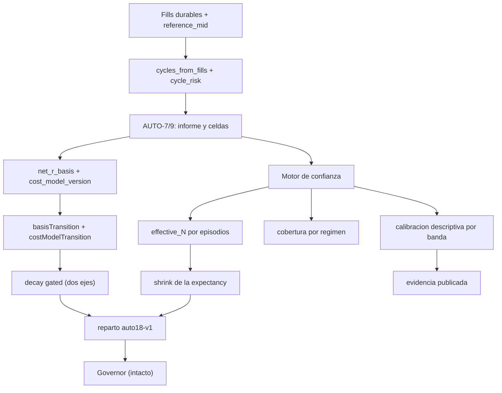

# AUTO-18 — Confianza estadística (`V2.59` / `1.84.0-beta`)

**Estado:** **alcance ratificado por el propietario** (los 8 bloques en **una sola fase**, un solo sello
`auto18-v1`) y **plan ratificado «tal cual»**. **Fase EJECUTADA y sellada**: el paquete de cierre es el
[audit-pack `v2.59`](./audit-pack-v2-59-auto-18-confianza-estadistica-2026-09-24.md) (y el
[relevo](./traspaso-relevo-post-v2.59-auto-18-confianza-estadistica-2026-09-24.md)).
**Fase anterior:** `AUTO-17` / `V2.58` (tag `v2.58-beta` → `72f6084a`, `Release tag CI` `35976693458`
**GREEN**, `1.83.0-beta`, PR de auditoría [#67](https://github.com/jvelasca/Bolsa_V1/pull/67)).
**Producto:** BETA / no producción → **el flag Adaptive sigue OFF por defecto**.

**Sin migración.** `costModelVersion` entra como clave **aditiva** en el JSON de `TradingCost.to_dict()`
(ya persistido en reservas) y la confianza viaja en `healthByStrategy`/`evidence_for` con campos nuevos
que son `null` por defecto; `_ALEMBIC_HEAD` sigue en `046_fill_reference_mid`. Sin UI, sin SHORT, sin
backfill, sin tocar el gobernador.

**Overview:** AUTO-18 «Confianza estadística» mide la evidencia con un `effective_N` **estadístico**
(rachas/episodios de régimen, no el bruto), publica la **cobertura por régimen** y la **fiabilidad** de
cada banda (calibración **descriptiva**), encoge la expectancy con esa `n`, y exige que dos versiones solo
compitan en el eje del R neto cuando comparten **`(net_r_basis, cost_model_version)`**.

---

## Invariante

> **Ninguna recomendación Adaptive puede pesar más de lo que su población independiente, homogénea,
> comparable y calibrada sostiene.** La evidencia se mide con `effective_N` **estadístico** (no con el
> bruto), se publica con su **cobertura por régimen** y su **fiabilidad por banda**, y solo compite en un
> eje cuando comparte `(net_r_basis, cost_model_version)`. Adaptive sigue siendo **read-only**: modula el
> reparto (`[0,1]`), nunca la autoridad de ejecución.

## Decisiones ratificadas por el propietario

- **Alcance:** los 8 bloques en **una sola fase**, un solo sello `auto18-v1`.
- **Reparto:** **cambia** (shrinkage sobre la expectancy/peso con `effective_N` estadístico).
- **`effective_N` estadístico:** por **episodios de régimen** (rachas de ciclos consecutivos con el mismo
  régimen entre los medidos), acotado por la muestra medida; se publica `measuredN` / `episodes` /
  `effectiveN` y el descuento se declara. Cada ciclo `UNKNOWN` forma/extiende su propia racha.
- **Calibración:** **descriptiva/medida** (read-only): tabla banda→rango esperado + fiabilidad por banda;
  no mueve la banda ni el reparto.

## Correcciones al acta del auditor (verificadas contra el árbol)

- **Parte de la base ya existía desde AUTO-12.** `effective_n` (= ciclos con R medido), `regime_coverage`
  escalar, las bandas `LOW/MEDIUM/HIGH` y el shrinkage del **peso** (`w' = w·n/(n+k)`) existían. AUTO-18
  **extiende** (no reinventa): cambia la `n` a la estadística, añade cobertura por régimen, calibración
  descriptiva, `shrunk_expectancy_r` y el metro del coste.
- **`shrinkage` ya operaba sobre la expectancy-como-peso**: el cambio es usar la `n` **nueva** y publicar
  el factor aplicado, no un cambio de fórmula.
- **Sin migración**: `costModelVersion` es aditivo y recomputable; los históricos quedan `None`/`undeclared`
  (declarado, nunca afirmado).

## Flujo objetivo

## Pasos (cada uno con su gate)

### Paso 1 — Puro de confianza (`auto_adaptive_confidence.py`)
- `measured_n` (renombrar el `effective_n` actual = ciclos con R medido) y nuevo `effective_n` =
  nº de **rachas** de régimen de los ciclos medidos ordenados por `closedAt`; se publica el descuento
  declarado (`ADAPTIVE_CONFIDENCE_EPISODE_DISCOUNT`). `UNKNOWN` forma/extiende su propia racha.
- Cobertura **por régimen**: cada `RegimeConfidence` se clasifica en `HIGH`/`MEDIUM`/`LOW`/`UNCOVERED`
  (eje PROPIO, no mueve la banda); la `regime_coverage` escalar de estrategia se conserva.
- Calibración descriptiva: `ConfidenceCalibration` (por banda: `n`, `mean_r`, `win_rate`, rango prometido,
  fiabilidad observada vs prometida), read-only, colgada de `AdaptiveConfidence`.
- `shrunk_expectancy_r` publicada en `StrategyConfidence`/`RegimeConfidence` (solo lectura; el uso es el
  Paso 4).
- **Gate:** tests puros; `effective_n ≤ measured_n`; orden-invariante; sin fechas legibles la
  cobertura/calibración se declaran, no se inventan.

### Paso 2 — `cost_model_version` aditivo (sin migración)
- `TradingCostModel.to_dict()` gana una firma determinista (`costModelVersion`, p. ej.
  `cm:<preset|bps>:10/2/5/0`); `TradingCost` gana `cost_model_version` (`None` por defecto) y su clave
  aditiva en `to_dict()`.
- Propagar por `CycleRisk.cost` → `CycleR` → `NetRBasisSeries.cost_model_version` →
  `StrategySelfEvaluation`.
- **Gate:** sin el campo el informe es **byte-idéntico** a AUTO-17; filas históricas quedan
  `None`/`undeclared`.

### Paso 3 — Transición de modelo de coste
- La clave de agrupación de `_net_r_series` pasa a `(basis, cost_model_version)`: un cambio de modelo
  **separa series** en vez de promediar.
- `_basis_transition` gana `COST_MODEL_TRANSITION`; `_decay` y la adopción del eje del R neto
  (`_net_basis_comparable`) bloquean ante `TRANSITION`, `MIXED` o `COST_MODEL_TRANSITION` (población
  homogénea = `(basis, cost_model_version)`).
- **Gate:** mismo modelo ⇒ byte-idéntico; cambio de modelo entre ventanas ⇒ `decay=UNKNOWN` y eje
  histórico con motivo declarado.

### Paso 4 — Reparto ajustado y sello `auto18-v1`
- `_confidence_factor` usa el `effective_n` estadístico; se publica el factor aplicado
  (`shrinkFactor`) y el `shrunkExpectancyR` en `evidence_for`/`healthByStrategy`.
  `ADAPTIVE_POLICY_VERSION = "auto18-v1"`; `DATA_GATE_POLICY_VERSION` (`auto15-v1`) intacto.
- **Gate:** sin `confidence` el plan es **byte-idéntico**; con `confidence`, `multiplier` en `(0,1]`,
  sigue sumando-preservando y no elimina a nadie; se actualiza con **nombre** el test del sello.

### Paso 5 — Sonda de mutaciones `M139…M148`
- 10 nuevas en el bloque AUTO-18 de `v2_44_mutation_audit.py` + realineos declarados (`M60`, `M125`,
  `M128`, `M131`, `M134`).
- **Gate:** corrida completa `M1…M148` con restauración byte a byte y huella `git status` idéntica.

### Paso 6 — Deudas P2 (§16–19) en el mismo sello
- Enums cerrados `NetRBasis` (`ESTIMATED`/`APPLIED`/`MIXED`/`UNDECLARED`) y `BasisTransition`, con los
  **mismos valores** de string (JSON byte-idéntico).
- Invariante de dominio: `net_r_measurement == COMPLETE` y `net_expectancy_r is not None` ⇒
  `net_r_basis is not None`, como predicado (`affirms_declared_net_r_basis`) + guarda en `_strategy_row`
  + test.
- `net existe + base sin declarar` ⇒ estado declarado `DATA_DEGRADED` (baja confianza), distinto del
  `UNKNOWN` inocuo (que sigue sin bloquear).
- Documentar en docstring y tests que `MIXED` (heterogeneidad **interna**) y `TRANSITION` (cambio
  **temporal** de base) son **dos ejes distintos**.

### Paso 7 — Cierre: docs, verificación, bump y sello
- Compuertas con el comando de CI (`ruff check packages/py apps/api-python --config pyproject.toml`; el
  `mypy` exacto del YAML; `lint-imports --config packages/py/.importlinter`); pytest con
  `uv run --no-sync python -m pytest`.
- Delta **simétrico** fichero a fichero contra `HEAD`, con los rojos declarados de antemano.
- Bump `1.83.0-beta` → **`1.84.0-beta`**, tag **`v2.59-beta`**, `main` en fast-forward y PR de auditoría.
- Documentos: este plan, el audit-pack, el arranque del auditor y el relevo, más `CHANGELOG.md`,
  `PROJECT_STATE.md` y `engineering-index`.

## Ficheros que se tocan

- `auto_adaptive_confidence.py` — `measured_n`/`episodes`/`effective_n`, cobertura por celda, calibración,
  `shrunk_expectancy_r`, `COST_MODEL_TRANSITION`, `DATA_DEGRADED`, enums cerrados.
- `auto_self_evaluation.py` — `cost_model_version` en `CycleR`/`NetRBasisSeries`, series por
  `(basis, cost_model_version)`, `NetRBasis`, `affirms_declared_net_r_basis` + guarda.
- `auto_adaptive.py` — `_confidence_factor` con `effective_n` estadístico, `shrink_factors`, evidencia
  con `measuredN`/`episodes`/`effectiveN`/`coverage`/`shrunkExpectancyR`/`shrinkFactor`, sello `auto18-v1`.
- `portfolio_reservation.py` — `cost_model_signature` en `TradingCostModel`, `cost_model_version` en
  `TradingCost` y en los dos `to_dict()`.
- Tests: `test_auto_adaptive_confidence.py`, `test_auto_adaptive.py`, `test_auto_self_evaluation.py`,
  `test_cycle_risk.py`, costura nueva `test_auto_v59_auto18_confidence_seam.py` y los dos arneses de
  seam de AUTO-13/AUTO-14 realineados.

## Gate de verificación

- Compuertas con los comandos de CI (no rutas sueltas); tests con `uv run --no-sync python -m pytest`.
- Unit del `effective_N` estadístico (episodios, `UNKNOWN` como racha propia, acotado por la muestra),
  cobertura por celda, calibración descriptiva y `shrunk_expectancy_r`.
- Unit del metro: dos modelos dentro de una base son **dos series**, `COST_MODEL_TRANSITION` bloquea decay
  y eje; mismo modelo ⇒ byte-idéntico.
- Costura end-to-end: la evidencia publicada lleva los seis campos y el factor aplicado es el de la `n`
  **estadística**; sin `confidence`, el plan es byte-idéntico.
- Matriz completa de mutaciones `M1…M148` con restauración byte a byte y huella `git status` idéntica.

## Freeze

No se tocan: el contrato de `decision_journal_entries`, `auto_adaptive_journal.py` (**byte a byte**),
`v2_43_governor_evidence.py`, `ADAPTIVE_ADVERSE_REGIMES`, umbrales de rotación, la tabla estado→efecto,
`yahoo_circuit_breaker.py`, `DATA_GATE_POLICY_VERSION`. Sin UI, sin SHORT, sin backfill; `*.md` sin
`prettier`; `governor.json` sin trackear.

## Límites declarados

- La calibración es **descriptiva**: no mueve la banda ni el reparto.
- El `effective_N` por episodios es una **cota conservadora declarada**, no una varianza muestral.
- `cost_model_version` no se puede reconstruir para históricos previos a esta fase: se publica
  `None`/`undeclared`.
- La tolerancia `_QTY` y la autoridad de cierre de AUTO-17 no se tocan.
