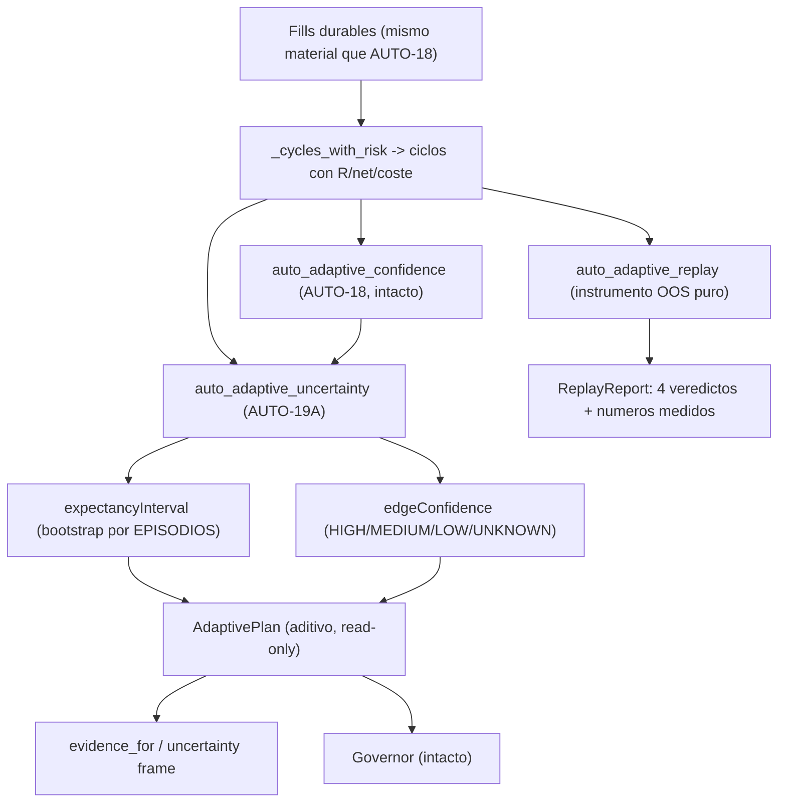

# AUTO-19A — Incertidumbre del edge + Replay OOS (`V2.60` / `1.85.0-beta`)

**Estado:** **alcance ratificado por el propietario** (dos decisiones: **solo medición** — el sello del
reparto se queda en `auto18-v1` — y replay **estadístico**, sin Postgres) y **plan ratificado tal cual**.
**Fase EJECUTADA y sellada**: el paquete de cierre es el
[audit-pack `v2.60`](./audit-pack-v2-60-auto-19a-incertidumbre-edge-replay-oos-2026-09-24.md) (y el
[relevo](./traspaso-relevo-post-v2.60-auto-19a-incertidumbre-edge-replay-oos-2026-09-24.md)).
**Fase anterior:** `AUTO-18` / `V2.59` (tag `v2.59-beta`, `1.84.0-beta`, PR de auditoría
[#68](https://github.com/jvelasca/Bolsa_V1/pull/68)).
**Producto:** BETA / no producción → **el flag Adaptive sigue OFF por defecto**.

**Sin migración.** `_ALEMBIC_HEAD` sigue en `046_fill_reference_mid`. Sin UI, sin SHORT, sin backfill,
sin tocar el gobernador.

**Overview:** AUTO-19A cierra el hueco que AUTO-18 **dejó declarado**: la confianza publicaba **cuánto**
se había medido y una expectancy encogida, pero **no** el **intervalo de incertidumbre** del número ni la
**confianza de que haya edge**. Esta fase añade un intervalo por **bootstrap de EPISODIOS** (rachas de
régimen), separa `edgeConfidence` de `confidence` (dos ejes distintos), y entrega una **batería de replay
OOS pura** que responde con datos a las cuatro preguntas del auditor. **No mueve la regla**: el reparto
sigue sellado en `auto18-v1`.

---

## Invariante

> **Ninguna lectura de edge se publica como certeza ni como permiso.** La expectancy se publica con su
> **intervalo de incertidumbre**; la **confianza de medición** (`confidence`, ya existente) se separa de
> la **confianza de edge** (`edgeConfidence`); y **ninguna de las dos mueve el reparto** (que sigue siendo
> `auto18-v1`). La batería de replay demuestra —o declara **inconcluso**— con datos si el shrinkage, el
> `effective_N`, la banda y la cobertura predicen mejor **fuera de muestra**.

Seis corolarios, cada uno con test y con mutación que lo mata:

1. **La independencia se mide una sola vez.** El material del intervalo sale de `regime_episodes`
   (promovida en `auto_adaptive_confidence.py`): la incertidumbre **no** reimplementa la semántica de
   episodios de AUTO-18, así que no puede divergir de la que acota el peso.
2. **La ausencia no es un defecto, pero se declara.** Sin ciclos medidos ⇒ `None` + `no_cycles`; con
   menos de `min_episodes` rachas ⇒ solo el punto + `insufficient_episodes` y `edgeConfidence=UNKNOWN`.
   Nunca se fabrica un intervalo que la muestra no sostiene.
3. **El intervalo contiene a su punto.** `lower ≤ point ≤ upper` **por construcción** (se ensancha si
   hiciera falta): un intervalo que contradijera su propio punto sería una contradicción publicada.
4. **El eje del EDGE es propio.** `HIGH`/`MEDIUM`/`LOW`/`UNKNOWN` derivan del **signo del intervalo
   frente a cero**, modulados (a la baja, con suelo `LOW`) por cobertura, deterioro y base del neto.
   `UNKNOWN` = no-medición, **nunca** un `LOW` por defecto.
5. **El replay no inventa veredictos.** Cada pregunta declara su `sample` y sin los **dos** grupos que la
   comparación exige el veredicto es `inconclusive`. Read-only, sin I/O, sin re-simular órdenes.
6. **La lectura es ADITIVA.** Sin `uncertainty` el plan y la evidencia son **byte-idénticos** a los de
   `AUTO-18`; el sello del reparto **no** se mueve.

---

## Decisiones ratificadas por el propietario

- **Alcance:** **solo medición/validación**. El sello del reparto se queda en **`auto18-v1`** y la
  asignación **no** cambia; la incertidumbre es evidencia publicada, no un permiso.
- **Replay:** **estadístico** — motor puro + fixture grabado + script/reporte, **sin Postgres**.
- **Frontera:** la correlación entre estrategias (bloque 5 del acta) queda para **AUTO-20**.

## Correcciones al acta del auditor (verificadas contra el árbol)

- **Parte de la base ya existía.** La **banda de medición** (`confidence`), la **cobertura** por régimen
  y el **shrinkage** son de AUTO-12/AUTO-18. AUTO-19A **no los renombra** (`confidence` es contrato JSON
  sellado) y **añade** el eje nuevo en campos nuevos.
- **El `holdout` existente es de barras, no de ciclos.** `optimize/holdout.py` parte series de precio;
  el replay de esta fase parte **ciclos cerrados** y re-aplica las estadísticas de decisión (no
  re-simula órdenes). Por eso es un módulo nuevo y no un reuso.
- **Sin migración**: el intervalo y el replay son **recomputables** del material ya medido.

## Flujo objetivo

## Pasos (cada uno con su gate)

### Paso 1 — Puro de incertidumbre (`auto_adaptive_uncertainty.py`)
- `ExpectancyInterval` (frozen): `point`, `lower`, `upper`, `level` (defecto `0.90`), `method`,
  `effective_n`, `episodes`, `measured_n`, `resamples`, `dispersion_r`, `notes`.
- Método **declarado** `bootstrap_episodes_v1`: block bootstrap de **percentil** resampleando **rachas de
  régimen** (episodios) **con reemplazo**, con **semilla declarada** (reproducible). Promover en
  `auto_adaptive_confidence.py` la lógica de rachas a una función **pública** (`regime_episodes`) y la
  lectura de R/régimen (`measured_r`/`regime_of`) para no tener un segundo productor que diverja.
- `EdgeConfidence`: banda **propia** derivada del signo del intervalo frente a cero, modulada (a la baja,
  con suelo `LOW`) por `coverage`, `decay` y la base del neto. `UNKNOWN` sin medición.
- `AdaptiveUncertainty`: lectura por `strategyVersion` **y por celda `strategy × regime`**, con
  `dispersion_r` (desviación de las medias bootstrap) como lectura mínima de estabilidad.
- **Gate:** `lower ≤ point ≤ upper`; sin muestra no hay intervalo; `effective_N` no puede aumentar la
  muestra; bootstrap determinista y **orden-invariante**; celdas medidas sobre las MISMAS rachas.

### Paso 2 — Puro de replay OOS (`auto_adaptive_replay.py`)
- Entrada: los **mismos ciclos** que produce `cycles_from_fills`/`apply_cycle_risk`.
- Split **cronológico** IS/OOS por `strategyVersion` (fracción OOS con clamp `0.1–0.4` y mínimos
  declarados, patrón `optimize/holdout.py`). Con material insuficiente la estrategia **no entra** y el
  hueco se declara; la pregunta queda `inconclusive`.
- Por celda/estrategia: IS → expectancy cruda, encogida, `effective_N`, `episodes`, banda, `coverage`,
  `expectancyInterval` y `edgeConfidence`; OOS → expectancy realizada. Errores `|pred_IS − real_OOS|`
  (raw vs shrunk) y acierto de signo.
- Las **cuatro preguntas** con veredicto `supported`/`not_supported`/`inconclusive` + números y `sample`:
  1. ¿el **shrinkage** mejora la predicción OOS?
  2. ¿el **`effective_N`** mejora la calibración?
  3. ¿**HIGH** produce OOS más estables que **LOW**?
  4. ¿la **cobertura** del régimen que dominó el OOS reduce el error?
- `REPLAY_METHOD = "statistical_oos_v1"`; config y `seed` publicados. **Read-only, sin I/O.**
- **Script/CLI (sin PG):** `scripts/research/auto_replay_battery.py` (patrón
  `warmup_audit_report.py`) que lee un JSON de ciclos (fixture por defecto) y emite el `ReplayReport`.
- **Fixture grabado:** `packages/py/analytics/tests/fixtures/auto_replay_cycles.json`, determinista y
  **sintético**: mide el instrumento, no la estrategia real (declarado en el `note` del fixture y en
  `stderr` del script).
- **Gate:** el instrumento detecta los cuatro casos (soporta/refuta/inconcluso) y **nunca** emite
  veredicto sin muestra.

### Paso 3 — Cableado aditivo (sin cambiar la regla)
- `auto_adaptive.py`: `StrategyHealth` gana `expectancy_interval` y `edge_confidence`;
  `build_strategy_health(..., uncertainty=None)`; `build_adaptive_plan(..., uncertainty=None)` los hila a
  `health`, a `evidence_for` (nuevas claves `expectancyInterval`/`edgeConfidence`) y a un frame propio
  `uncertainty` en `as_dict()`. **Sin `uncertainty`, el plan es byte-idéntico.** No se toca
  `_confidence_factor`, `recommend_allocation` ni `ADAPTIVE_POLICY_VERSION`.
- `auto_self_evaluation_feed.py`: nuevo `build_adaptive_uncertainty_from_fills(...)` reutilizando
  `_cycles_with_risk` (un solo material, sin segundo FIFO).
- `auto_simulation_worker.py` (`_v2_build_adaptive_plan`): construye la incertidumbre desde los mismos
  fills y la pasa al plan, registrando los huecos declarados. La lectura se publica **aunque el gate
  límite el shrinkage** (es un hecho medido, como la banda).
- **Gate:** unit de la aditividad y costura hermética por el camino real del worker.

### Paso 4 — Sonda de mutaciones `M149…M158`
- 10 nuevas en el bloque AUTO-19A de `v2_44_mutation_audit.py` (episodios aplanados, azar sin semilla,
  edge deducida de la medición, `UNKNOWN` disfrazado de `LOW`, rachas insuficientes calladas, replay sin
  partir, veredicto sin muestra, refutado leído como soportado, cobertura invertida, sello movido) +
  realineos declarados.
- **Gate:** corrida completa `M1…M158` con restauración byte a byte y huella `git status` idéntica.

### Paso 5 — Cierre: docs, verificación, bump y sello
- Compuertas con el comando de CI (`ruff check packages/py apps/api-python --config pyproject.toml`; el
  `mypy` exacto del YAML; `lint-imports --config packages/py/.importlinter`); pytest con
  `uv run --no-sync python -m pytest`.
- Delta **simétrico** fichero a fichero contra `HEAD`, con los rojos declarados de antemano.
- Bump `1.84.0-beta` → **`1.85.0-beta`**, tag **`v2.60-beta`**, `main` en fast-forward y PR de auditoría.
- Documentos: este plan, el audit-pack, el arranque del auditor, el relevo y el arranque del agente
  siguiente, más `CHANGELOG.md`, `PROJECT_STATE.md` y `engineering-index`.

## Ficheros que se tocan

- `auto_adaptive_uncertainty.py` (**nuevo**) — `ExpectancyInterval` (bootstrap por episodios),
  `edgeConfidence`, `AdaptiveUncertainty` por estrategia y por celda, `percentile` puro.
- `auto_adaptive_replay.py` (**nuevo**) — split IS/OOS cronológico, las cuatro preguntas, `ReplayReport`.
- `auto_adaptive_confidence.py` — promoción a público de `regime_episodes`, `coverage_band`, `measured_r`,
  `regime_of` (sin cambiar la semántica ni el resultado de AUTO-18).
- `auto_adaptive.py` — `StrategyHealth.expectancy_interval`/`edge_confidence`, `uncertainty` en
  `StrategyHealth`/`AdaptivePlan`, claves nuevas en `evidence_for`/`as_dict()`, sello **intacto**.
- `auto_self_evaluation_feed.py` — `build_adaptive_uncertainty_from_fills`.
- `auto_simulation_worker.py` — `_v2_build_adaptive_plan` construye y publica la incertidumbre.
- `scripts/research/auto_replay_battery.py` (**nuevo**) + fixture `auto_replay_cycles.json`.
- Tests: `test_auto_adaptive_uncertainty.py`, `test_auto_adaptive_replay.py`, costura nueva
  `test_auto_v60_auto19_uncertainty_seam.py` (lista explícita en los dos workflows) y la byte-identidad
  añadida a `test_auto_adaptive.py`.
- Sonda `v2_44_mutation_audit.py` (bloque `M149…M158`) y CI (`python-ci.yml`, `release-tag-ci.yml`).

## Gate de verificación

- Compuertas con los comandos de CI (no rutas sueltas); tests con `uv run --no-sync python -m pytest`.
- Unit del intervalo: bootstrap **por episodios** (no por ciclos), `lower ≤ point ≤ upper`,
  orden-invariancia, `insufficient_episodes`/`no_cycles` declarados, semilla reproducible.
- Unit del EDGE: `HIGH` solo con `lower > 0`; cruzar cero ⇒ `MEDIUM`; punto no positivo ⇒ `LOW`; sin
  medición ⇒ `UNKNOWN`; cada degradación baja un escalón con suelo `LOW` y su nota.
- Replay: los cuatro veredictos se detectan en material determinista y **nunca** hay veredicto sin muestra;
  el split es cronológico (el IS es el tramo viejo).
- Costura end-to-end: el plan lleva el frame `uncertainty` y las dos claves nuevas en la evidencia; **sin
  `uncertainty`** el plan es byte-idéntico y el sello sigue en `auto18-v1`.
- Matriz completa de mutaciones `M1…M158` con restauración byte a byte y huella `git status` idéntica.

## Freeze

No se tocan: `auto_adaptive_journal.py` (**byte a byte**), `v2_43_governor_evidence.py`,
`ADAPTIVE_ADVERSE_REGIMES`, umbrales de rotación, la tabla estado→efecto del gate,
`DATA_GATE_POLICY_VERSION` (`auto15-v1`) ni `ADAPTIVE_POLICY_VERSION` (sigue `auto18-v1`). Sin UI, sin
SHORT, sin backfill; `*.md` sin `prettier`; `governor.json` sin trackear.

## Límites declarados

- `confidence` se mantiene como la banda de **MEDICIÓN** (no se renombra): `edgeConfidence` es el eje
  nuevo y la diferencia se documenta.
- El intervalo es un **bootstrap por episodios** (**cota conservadora declarada**), no una varianza
  muestral teórica; con pocos episodios no hay intervalo.
- El replay es **estadístico** (re-aplica las estadísticas de decisión sobre ciclos históricos), **no**
  re-simula órdenes; sus veredictos dependen de que exista material suficiente y se declaran
  `inconclusive` si no.
- Correlación entre estrategias y el gating por régimen actual en la asignación quedan **fuera** de
  v2.60 (AUTO-20).
