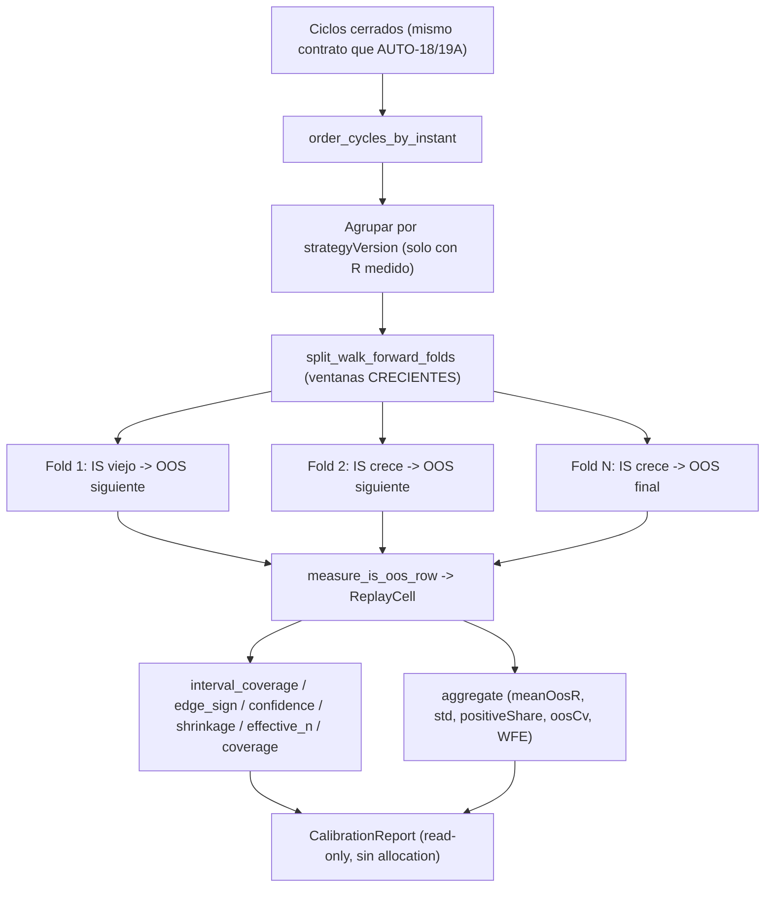

# AUTO-19B — Calibración del intervalo y Walk-Forward (`V2.61` / `1.86.0-beta`)

**Estado:** **alcance ratificado por el propietario** (instrumento **puro y read-only**, **solo
medición**) y **fase EJECUTADA**. **Fase anterior:** `AUTO-19A` / `V2.60` (tag `v2.60-beta`,
`1.85.0-beta`, PR de auditoría
[#69](https://github.com/jvelasca/Bolsa_V1/pull/69)).

**Producto:** BETA / no producción → **el flag Adaptive sigue OFF por defecto**.

**Sin migración.** `_ALEMBIC_HEAD` sigue en `046_fill_reference_mid`. Sin UI, sin SHORT, sin backfill,
sin tocar el gobernador, el plan ni el journal durable.

**Overview:** `AUTO-19A` construyó el **instrumento** (el intervalo de incertidumbre por episodios y
la confianza de EDGE) y una batería de replay con **una** partición IS/OOS. Lo que dejó declarado como
deuda es la pregunta que ahora importa: **¿está BIEN CALIBRADA esa incertidumbre?** `AUTO-19B` la
responde con un **walk-forward** de ventanas crecientes y tres lecturas de calibración (cobertura del
intervalo, signo del EDGE y banda de medición). **No mueve la regla**: el reparto sigue sellado en
`auto18-v1`.

---

## Invariante

> **La incertidumbre no se declara calibrada: se mide.** Toda lectura de calibración viaja con su
> `sample`, el nivel declarado y la tolerancia declarada; sin muestra suficiente el veredicto es
> `inconclusive`, nunca `supported`. Ninguna métrica de calibración mueve el reparto (sigue
> `auto18-v1`), ni toca el plan, el journal o el gobernador.

Seis corolarios, cada uno con test y con mutación que lo mata:

1. **El walk-forward no se contamina.** Las ventanas son **crecientes** (IS viejo → OOS inmediatamente
   posterior) y nunca solapan; el IS jamás contiene el tramo OOS. (M159 ⇔ medir el IS con el OOS
   dentro; M164 ⇔ ventana que no crece.)
2. **Sin intervalo no hay cobertura.** Una celda sin `isIntervalLower/Upper` no cuenta como cubierta
   NI como descubierta: queda fuera de la muestra y el hueco se declara. (M160 ⇔ contar celdas sin
   intervalo.)
3. **La cobertura se mide, no se afirma.** `interval_coverage` compara la fracción observada contra el
   nivel declarado (`level`, 0.90 por defecto) con tolerancia declarada; el ancho se publica como
   diagnóstico, no como permiso. (M161 ⇔ invertir la cobertura.)
4. **El signo del EDGE se calibra contra el OOS.** `edge_sign_calibration` mide el acierto de
   `edgeConfidence` (solo `HIGH`/`LOW`, nunca `UNKNOWN`/`MEDIUM`) sobre el signo realizado, con
   muestra mínima declarada. (M162 ⇔ quitar la muestra mínima.)
5. **La banda de medición se calibra.** `confidence_calibration` publica OOS por banda y decide con la
   comparación declarada (menor dispersión OOS en `HIGH`), no por anécdota.
6. **La lectura es ADITIVA.** No se toca `auto_adaptive.py`, `auto_self_evaluation_feed.py`,
   `auto_simulation_worker.py`, el journal ni el gobernador; el CLI de `AUTO-19A` sin `--walk-forward`
   emite el mismo `ReplayReport`. (M163 ⇔ un solo pliegue llamado walk-forward.)

---

## Decisiones ratificadas por el propietario

- **Alcance:** **solo medición/validación**. El sello del reparto se queda en **`auto18-v1`** y la
  asignación **no** cambia; la calibración es evidencia publicada, no un permiso.
- **Datos:** **instrumento primero**. El fixture sigue siendo **sintético y declarado**; el material
  PAPER real entra por el JSON de ciclos del CLI, que ya es la costura del instrumento.
- **Frontera:** `P(R > 0)`, la correlación entre estrategias y el current-regime gating quedan
  **fuera** de esta fase.

## Flujo objetivo

## Pasos (cada uno con su gate)

### Paso 1 — Extracción aditiva en `auto_adaptive_replay.py`

Se separa el núcleo de medición del split: `measure_is_oos_row` (público) mide un par IS/OOS **ya
partido** y `_build_cell` conserva su split y delega en él. **Una sola aritmética de celda, dos
particiones.** No se renombran `_compare` ni las cuatro `_question_*` (sus fragmentos anclan
`M155`/`M156`/`M157`) y las líneas del split de `_build_cell` se conservan (`M154`).

- **Gate:** el `ReplayReport` del fixture de `AUTO-19A` sigue dando las mismas 6 celdas (delta
  simétrico sin rojos).

### Paso 2 — Puro nuevo de calibración (`auto_adaptive_calibration.py`)

- Config declarada: `CALIBRATION_METHOD = "walk_forward_calibration_v1"`, `CALIBRATION_FOLDS_*`
  (defecto 3, clamp `[2, 5]`), `CALIBRATION_COVERAGE_TOLERANCE_DEFAULT = 0.10`,
  `CALIBRATION_EDGE_SIGN_FLOOR_DEFAULT = 0.5`. Reutiliza los mínimos y el bootstrap declarados de
  `AUTO-19A`.
- `split_walk_forward_folds`: `n_folds + 1` segmentos; el pliegue `i` entrena con los `i` primeros
  (**expanding**) y testea con el siguiente; el último absorbe el resto. Los pliegues que no alcanzan
  los mínimos **no se forman**.
- `CalibrationReport` (`folds`, `questions`, `aggregate`, `method`, `foldsRequested`, `level`, `seed`,
  `notes`), con `cells` **derivadas** de `folds` (un solo productor).
- Seis preguntas: `interval_coverage`, `edge_sign_calibration`, `confidence_calibration` (nuevas) y
  `shrinkage_calibration` / `effective_n_calibration` / `coverage_calibration` (reutilizan
  `_question_shrinkage` / `_question_effective_n` / `_question_coverage` de `AUTO-19A`).
- `aggregate` en R, espejo de `aggregate_walk_forward_metrics` de `optimize`: `foldCount`,
  `meanIsExpectancyR`, `meanOosExpectancyR`, `stdOosExpectancyR`, `positiveOosFoldShare`, `oosCv` y
  `walkForwardEfficiency`.
- **Gate:** sin ciclos ⇒ seis preguntas `inconclusive` con `sample = 0`; sin intervalos ⇒
  `interval_coverage` inconclusa; cada pregunta detecta `supported`/`not_supported`.

### Paso 3 — CLI (sin PG) y fixture

- `scripts/research/auto_replay_battery.py` gana `--walk-forward` y `--folds`. **Sin el flag la salida
  es byte-idéntica** a la de `AUTO-19A` (mismo fixture, mismo JSON).
- Fixture nuevo `packages/py/analytics/tests/fixtures/auto_calibration_cycles.json`: determinista, con
  `note` que declara **SYNTHETIC** (3 estrategias con material para 3 pliegues y una estrategia fina
  que se declara como hueco). No se toca el fixture de `AUTO-19A`.
- **Gate:** `python scripts/research/auto_replay_battery.py` no cambia; `--walk-forward` emite el
  `CalibrationReport`.

### Paso 4 — Sonda de mutaciones `M159…M164`

Seis etiquetas nuevas (walk-forward contaminado, cobertura fabricada, cobertura invertida, signo del
edge sin muestra, un pliegue llamado walk-forward, ventana que no crece) + corrida **COMPLETA**
`M1…M164` con restauración byte a byte y huella `git status` idéntica.

- **Gate:** `164/164` muerden, `0` realineos.

### Paso 5 — Cierre: docs, verificación, bump y sello

- Compuertas con el comando de CI (`ruff check packages/py apps/api-python --config pyproject.toml`;
  el `mypy` exacto del YAML; `lint-imports --config packages/py/.importlinter`); pytest con
  `uv run --no-sync python -m pytest`.
- Delta **simétrico** fichero a fichero contra `HEAD`, con los rojos declarados de antemano.
- Bump `1.85.0-beta` → **`1.86.0-beta`**, tag **`v2.61-beta`**, `main` en fast-forward y PR de
  auditoría.
- Documentos: este plan, el audit-pack, el arranque del auditor, el relevo y el arranque del agente
  siguiente, más `CHANGELOG.md`, `PROJECT_STATE.md` y `engineering-index`.

## Ficheros que se tocan

- `auto_adaptive_calibration.py` (**nuevo**) — split walk-forward, las seis preguntas y `aggregate`.
- `auto_adaptive_replay.py` — extracción aditiva de `measure_is_oos_row`.
- `auto_replay_battery.py` — `--walk-forward` / `--folds`.
- `auto_calibration_cycles.json` (**nuevo**) + `test_auto_adaptive_calibration.py` (**nuevo**).
- `v2_44_mutation_audit.py` (`M159…M164`), `.github/workflows/python-ci.yml`,
  `.github/workflows/release-tag-ci.yml`.
- `CHANGELOG.md`, `PROJECT_STATE.md`, `engineering-index-2026-08-03.md` + los cinco documentos de fase.

## Gate de verificación

- Compuertas con los comandos de CI; tests con `uv run --no-sync python -m pytest`.
- Unit del walk-forward: ventanas crecientes, sin solape, split cronológico (invertir la entrada no
  cambia los pliegues), pliegues insuficientes declarados.
- Unit de la cobertura: cubierto/descubierto/sin-intervalo; ancho publicado.
- Unit del EDGE: `HIGH`/`LOW` calibrados, `MEDIUM`/`UNKNOWN` fuera de la muestra.
- Unit de la banda: `HIGH` vs `LOW` por dispersión OOS.
- Reutilización: las tres preguntas de `AUTO-19A` aparecen con clave propia.
- Fixture determinista y orden-invariante; `as_dict()` con el conjunto de claves esperado.
- No-regresión: el `ReplayReport` de `AUTO-19A` sigue igual.
- Matriz completa `M1…M164` con restauración byte a byte y huella idéntica.

## Freeze

No se tocan: `auto_adaptive.py`, `auto_self_evaluation_feed.py`, `auto_simulation_worker.py`,
`auto_adaptive_journal.py` (**byte a byte**), `v2_43_governor_evidence.py`, `ADAPTIVE_ADVERSE_REGIMES`,
los umbrales de rotación, la tabla estado→efecto del gate, `DATA_GATE_POLICY_VERSION` (`auto15-v1`) ni
`ADAPTIVE_POLICY_VERSION` (sigue `auto18-v1`). Sin UI, sin SHORT, sin backfill; `*.md` sin `prettier`;
`governor.json` sin trackear.

## Límites declarados

- El walk-forward es **expanding** con segmentos de igual tamaño (el patrón de `optimize`), no ventanas
  rodantes de tamaño fijo: una sola partición de tamaño distinto puede dar otro número.
- La calibración es **descriptiva**: publica cobertura, ancho y acierto de signo; **no** convierte esa
  lectura en un `P(R > 0)` ni en un permiso de sizing.
- El fixture por defecto es **sintético y declarado**: mide el instrumento, no la estrategia real. La
  ejecución sobre ciclos PAPER reales es el paso operativo posterior, ya con el contrato validado.
- `P(R > 0)`, la correlación entre estrategias y el current-regime gating quedan **fuera** de v2.61.
