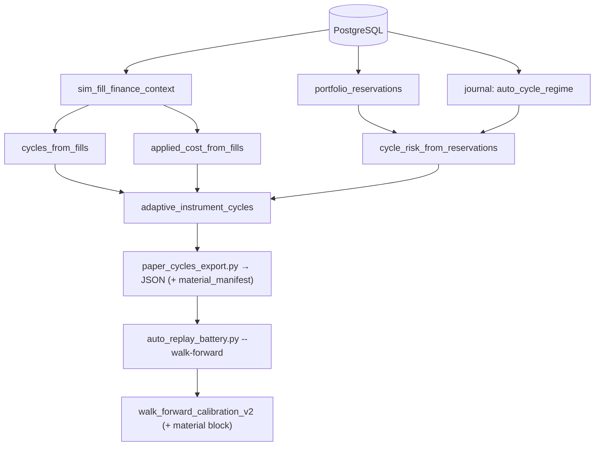

# Plan de fase — AUTO-20B · Export E2E + oráculo same-material (`V2.63` / `1.88.0-beta`)

**Versión:** `1.87.0-beta` → **`1.88.0-beta`** · **Rótulo:** `AUTO-20B` / `V2.63` · **Fecha:** 2026-09-25 ·
**Migración: NO** (Alembic head sigue en `046_fill_reference_mid`).
**Origen:** [auditoría de `v2.62-beta`](./auditoria-v2-62-auto-20-material-paper-real-2026-09-24.md) ·
**Pack que cierra:** [audit-pack v2.62](./audit-pack-v2-62-auto-20-material-paper-real-2026-09-24.md) (deuda nº 1).

## 1. Objetivo e invariante

Cerrar la deuda nº 1 declarada en el [audit-pack v2.62](./audit-pack-v2-62-auto-20-material-paper-real-2026-09-24.md):
**demostrar físicamente, contra PostgreSQL real, que el ciclo que entra en el calibrador es exactamente
el ciclo que AUTO cree que está midiendo**.

> Invariante: el instrumento mide el MISMO material que el informe durable, y lo que no pudo medir se
> declara. Nada mueve el reparto (`auto18-v1`), el gate (`auto15-v1`), el worker, el journal ni el plan.

## 2. Decisiones fijadas

- **`--limit` deja de truncar en silencio: se pagina hasta completitud.** Se añade `offset: int = 0`
  (keyword-only) a `list_by_cycle_ids` en `Protocol`, `InMemoryReservationStore` y
  `PostgresReservationStore`. El worker sigue llamando sin `offset` ⇒ comportamiento **byte-idéntico**
  (`auto_simulation_worker.py` no se toca). El exportador recorre páginas y hace **fail-closed**
  (exit 2, motivo declarado) si no puede garantizar completitud (página que satura sin progreso).
- **Material manifest + fingerprint en los dos sitios.** El exportador emite `material_manifest`
  (hermano de `note`/`cycles`, nunca dentro de `cycles`), y `auto_replay_battery.py` lo propaga al
  informe de calibración como bloque `material` **opcional**: sin manifest el informe queda
  **byte-idéntico** a hoy, así que `CALIBRATION_METHOD` sigue siendo `walk_forward_calibration_v2`
  (es metadata de ENTRADA declarada, no cambia la medición). El fingerprint se versiona aparte con
  `MATERIAL_FINGERPRINT_METHOD`.
- **Sin tocar el journal/DB** para el manifest: es artefacto de investigación (stdout/JSON), no estado
  runtime.
- **`P(R>0)`, correlación entre estrategias y current-regime gating quedan fuera** (AUTO-21).

## 3. Cambios por pieza

### 3.1 Paginación completa de reservas

- `packages/py/application/src/bolsa_application/reservation_store.py`: `offset` en el `Protocol`, en
  `InMemoryReservationStore.list_by_cycle_ids` y en `PostgresReservationStore.list_by_cycle_ids`
  (`.offset(offset)` tras el `order_by` determinista: `created_at ASC NULLS FIRST, reservation_id ASC`).
  Se documenta el suelo: "recibir `limit` filas ≠ verlo todo".
- `apps/api-python/scripts/paper_cycles_export.py`: bucle de páginas acumulando por `reservation_id`
  (dedupe), parada cuando la página trae `< limit`; **exit 2 declarado** si una página satura sin
  aportar ids nuevos. `--limit` pasa a documentarse como **tamaño de página**.
- Tests puros: `test_auto_v47_cycle_trace.py::test_a_cycle_query_can_be_paginated_without_gaps_or_repeats`
  (InMemory) + los del fichero hermético del exportador.

### 3.2 Fingerprint puro

- Nuevo `packages/py/analytics/src/bolsa_analytics/cognitive/auto_material_manifest.py`:
  `material_fingerprint(cycles)`, `MATERIAL_FINGERPRINT_METHOD = "material_fingerprint_v1"` y
  `FINGERPRINT_FIELDS` (por ciclo: `cycleId`, `strategyVersion`, `pnl`, `closedAt`, `riskAmount`,
  `costApplied`, `regime`). Serialización canónica (orden estable, `ensure_ascii=False`, números por
  VALOR). **El timestamp NO entra al fingerprint**; los identificadores **no** se normalizan aunque
  parezcan números.

### 3.3 Manifest de material (application)

- Nuevo `packages/py/application/src/bolsa_application/auto_material_manifest.py`:
  `build_material_manifest(...)` con `account`, `requestedStrategyVersions`, `fillsRead`,
  `closedCycles`, `cyclesWithRisk`, `cyclesWithoutRisk`, `cyclesWithVersion`, `cyclesWithoutVersion`,
  `cyclesWithoutIdentity`, `costAppliedCycles`, `perVersion` (`cycles`/`withRisk`/`withoutRisk`),
  `regimeRead` (`confirmed`/`absent`/`unconfirmed`/`notDerivable`), `cyclesWithoutRegime`,
  `reservationsRead`, `riskReadSaturated`, `riskBasis = "reservation_reserved_risk"`,
  `fingerprint` + `fingerprintMethod`, `exportTimestamp`.
- `paper_cycles_export.py` lo ensambla y lo emite como `material_manifest`.

### 3.4 Propagación en el battery

- `scripts/research/auto_replay_battery.py`: `_load` devuelve también el manifest; `main` imprime la
  huella por stderr y pasa `material=manifest` a `build_calibration_report`.
- `auto_adaptive_calibration.py`: `build_calibration_report(..., material: Mapping | None = None)`;
  `as_dict()` emite `material` **solo si se aporta** (ausente ⇒ informe actual byte-idéntico). El
  sello `walk_forward_calibration_v2` **no cambia**.

### 3.5 Fixture PostgreSQL + E2E + oráculo

- `apps/api-python/tests/test_auto_v63_auto20b_export_e2e_pg.py` — E2E **solo PG** (job
  `auto-v2-durable-pg`, gate fail-if-skipped `AUTO20B_EXPORT_PG_REQUIRED=1`).
- `apps/api-python/tests/test_auto_v63_auto20b_export_completeness.py` — los dos casos **puros**
  (paginación fail-closed + passthrough del manifest en el battery): corren en el job offline, así que
  no hay un skip silencioso que aparente certificar la cadena.
- Fixture exacto y conocido de antemano (26 ciclos):
  - **A** — 12 ciclos, 9 con `reserved_risk > 0`, 3 sin reserva ⇒ **medida parcial** (NO `unmeasured_r:A`).
  - **B** — 8 ciclos, los 8 con riesgo ⇒ **medida completa**.
  - **C** — 5 ciclos, ninguno con riesgo ⇒ **`unmeasured_r:C`**.
  - **U** — 1 ciclo cuyos fills declaran DOS versiones distintas ⇒ **`unversioned_cycles`**.
  - **≥2 regímenes** — trazas `TREND_UP`/`RANGE` en el journal; 6 ciclos sin traza (se declaran).
  - **coste aplicado** — `reference_mid` en los 17 ciclos con riesgo ⇒ `costApplied` COMPLETE.
- Fases: sembrar → oráculo independiente → exportador REAL (`main`, sin mocks, JSON en stdout) →
  cardinalidades contra el oráculo → calibración como el battery → oráculo de igualdad → **same-material**
  (`build_auto_self_evaluation` vs `adaptive_instrument_cycles` desde las MISMAS lecturas).
- Casos puros: `--limit` pequeño con reservas de sobra recupera TODO y `riskReadSaturated == false`;
  una página que satura sin progreso bloquea con exit 2.

### 3.6 Mutaciones

`apps/api-python/scripts/v2_44_mutation_audit.py` — **M169–M174**, cada una muerta por un test puro:

| Id | Qué rompe | Rojo en |
|---|---|---|
| **M169** | La paginación se desactiva (una sola página del exportador) | `test_pagination_reads_the_whole_universe_across_pages` (+2) |
| **M170** | El `offset` se ignora: la lectura paginada repite la primera página | `test_a_cycle_query_can_be_paginated_without_gaps_or_repeats` |
| **M171** | `cyclesWithoutRisk` se falsea (todo con denominador) | `test_the_manifest_counts_the_same_material_the_instrument_carries` |
| **M172** | La huella deja de ver `strategyVersion`/`regime` | `test_changing_the_universe_changes_the_fingerprint` (+1) |
| **M173** | El informe publica `material` aunque no se aporte (rompe el byte-idéntico) | `test_the_report_without_material_is_byte_identical_to_the_audited_one` (+2) |
| **M174** | El battery deja de propagar el manifest | `test_the_battery_propagates_the_exported_manifest_to_the_calibration_report` |

## 4. Ficheros clave

- `packages/py/application/src/bolsa_application/reservation_store.py` — `offset` (aditivo).
- `apps/api-python/scripts/paper_cycles_export.py` — paginación + manifest + fail-closed.
- `packages/py/analytics/src/bolsa_analytics/cognitive/auto_material_manifest.py` — **nuevo**, fingerprint puro.
- `packages/py/application/src/bolsa_application/auto_material_manifest.py` — **nuevo**, manifest.
- `scripts/research/auto_replay_battery.py` — passthrough `material`.
- `packages/py/analytics/src/bolsa_analytics/cognitive/auto_adaptive_calibration.py` — bloque `material` opcional.
- `apps/api-python/tests/test_auto_v63_auto20b_export_e2e_pg.py` — **nuevo**, E2E.
- `apps/api-python/tests/test_auto_v63_auto20b_export_completeness.py` — **nuevo**, puros.

## 5. Compuertas

- `ruff check packages/py apps/api-python --config pyproject.toml` · `lint-imports --config
  packages/py/.importlinter` · `mypy` (misma superficie) · puros `packages/py/analytics/tests` +
  `packages/py/application/tests`.
- E2E PG: `AUTO20B_EXPORT_PG_REQUIRED=1 uv run pytest apps/api-python/tests/test_auto_v63_auto20b_export_e2e_pg.py -q`.
- Matriz de mutaciones completa (M1–M174) con restauración byte a byte.

## 6. Freeze

No se tocan: `auto_adaptive.py` (`auto18-v1`), `auto_adaptive_data_gate.py` (`auto15-v1`),
`auto_simulation_worker.py`, `auto_adaptive_journal.py`, `v2_43_governor_evidence.py`, `governor.json`,
`auto_adaptive_replay.py` (`statistical_oos_v1`). **Sin migración** (el `offset` es solo código).

## 7. Documentos y sello

Plan, [audit-pack](./audit-pack-v2-63-auto-20b-export-e2e-2026-09-25.md) nuevo, [arranque del
auditor](./arranque-auditor-v2.63-auto-20b-export-e2e-2026-09-25.md), [traspaso/relevo](./traspaso-relevo-post-v2.63-auto-20b-export-e2e-2026-09-25.md)
y [arranque del agente](./arranque-agente-post-v2.63-auto-20b-export-e2e-2026-09-25.md); `CHANGELOG`,
`PROJECT_STATE`, `engineering-index`; sello `1.87.0-beta` → **`1.88.0-beta`** y comentario de los dos
workflows (el E2E se certifica en el job PG con gate; los puros entran por el pase offline).

## 8. Límites declarados

- El walk-forward con los umbrales por defecto (`folds=3`, `min_is=8`, `min_oos=4`) sobre material real
  exige ≥32 ciclos medidos por estrategia: es un **paso operativo** del propietario con su cuenta
  PAPER, no algo que este fixture pueda fabricar.
- El fixture del E2E es **sintético y declarado** (siembra determinista): mide la **cadena de material**,
  no el edge.
- `P(R>0)`, correlación y current-regime gating siguen fuera; el material sigue sin demostrar edge.
