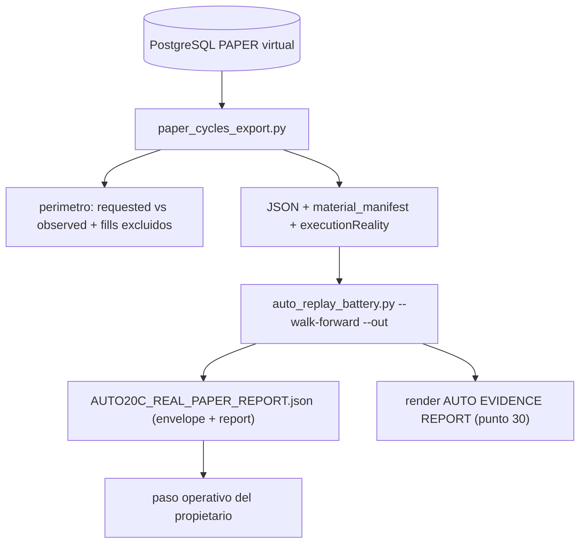

# Plan de fase — AUTO-20C · Primera calibración PAPER (virtual) + perímetro + invariante (`V2.64` / `1.89.0-beta`)

**Versión:** `1.88.1-beta` → **`1.89.0-beta`** · **Rótulo:** `AUTO-20C` / `V2.64` · **Fecha:** 2026-09-25 ·
**Migración: NO** (Alembic head sigue en `046_fill_reference_mid`).
**Origen:** auditoría de `v2.63.1-beta` (puntos 17-30) · **Base:**
[traspaso post-v2.63](./traspaso-relevo-post-v2.63-auto-20b-export-e2e-2026-09-25.md).

## 1. Objetivo e invariantes

Cerrar la frontera que la propia arquitectura ya dejó preparada: correr la cadena
`paper_cycles_export.py` → `auto_replay_battery.py --walk-forward` **sin nueva arquitectura de motor** y
conservar el resultado como artefacto reproducible. El veredicto real (`SUPPORTED` / `NOT_SUPPORTED` /
`INCONCLUSIVE`) es un **resultado**, no un error de software.

Invariantes que NO se mueven:

- `ADAPTIVE_POLICY_VERSION = "auto18-v1"` y `DATA_GATE_POLICY_VERSION = "auto15-v1"` intactos.
- Freeze de ficheros: `auto_adaptive.py`, `auto_adaptive_data_gate.py`, `auto_simulation_worker.py`,
  `auto_adaptive_journal.py`, `auto_adaptive_replay.py`, `v2_43_governor_evidence.py`, `governor.json`.
- Sin migración. El contrato sellado `CalibrationReport.as_dict()` no cambia: el artefacto es un
  **envoltorio nuevo**, no una mutación del informe auditado.
- **PAPER = dinero VIRTUAL.** Ninguna operación se ejecuta jamás sobre XTB ni ninguna plataforma real.
  AUTO permanece SIM-only (`LIVE_EXECUTION_AUTHORIZED`/`LIVE_EXECUTION_UNLOCKED` false).

## 2. Regla de ejecución VIRTUAL — declarada en todos los sitios

Fuente única de verdad (regla "un solo productor por medida"):

- **Nuevo módulo puro** `packages/py/analytics/src/bolsa_analytics/cognitive/auto_evidence_report.py` con
  `EXECUTION_REALITY_VIRTUAL_PAPER = "virtual_paper_only"`, `REAL_MONEY_AT_RISK = False` y
  `EVIDENCE_ARTIFACT_SCHEMA = "auto20c_evidence_artifact_v1"`. El import de `application`/scripts sale
  de aquí, nunca se re-declara.

Se propaga a:

- **Artefacto** (`AUTO20C_REAL_PAPER_REPORT.json`): campos de primer nivel `executionReality`,
  `realMoneyAtRisk`, `brokerVenue`, `materialOrigin` y una nota explícita.
- **Manifest** (`auto_material_manifest.py`): `executionReality` + `brokerVenue` (de `get_settings()`).
- **Nota del exportador** (`paper_cycles_export.py`, `MATERIAL_NOTE`): declara que el material es PAPER
  **virtual**.
- **Guard fail-closed** en el exportador: si `settings.broker_venue != "paper"`, no se sella un artefacto
  PAPER (`exit 2`, motivo declarado).
- **Docs**: `docs/engineering/invariante-paper-virtual-2026-09-25.md`, referenciado desde
  `PROJECT_STATE.md`, `engineering-index`, `CHANGELOG` y este pack.
- **Regresión**: test que confirma que el artefacto/exportador declara la realidad virtual y que un
  carril no-PAPER se bloquea.

## 3. Perímetro declarado (deudas puntos 21-24)

Cambios **declarativos**, read-only, sin alterar el universo medido ni la huella `material_fingerprint_v1`:

- `sim_durable_store.py`: nueva lectura **agregada** (`count_by_strategy_version`, solo
  `COUNT ... GROUP BY strategy_version_id`, acotada por `account_id`) para cuantificar sin traer filas.
  Aditiva: el worker y `list_by_cycle_ids` no cambian.
- `auto_material_manifest.py` (application) añade:
  - `observedStrategyVersions` (las que realmente aparecen en los ciclos exportados) junto a
    `requestedStrategyVersions`.
  - `fillsTotalForAccount`, `fillsSelected`, `fillsExcludedNoVersion`, `fillsExcludedOtherVersion`.
  - `materialOrigin` (`paper_real` vs `synthetic_fixture`, **obligatorio**) para que un artefacto nunca
    confunda ambos.
  - `regimesPresent` (regímenes realmente presentes en el material).
- Discrepancia visible: `versionsRequestedWithoutMaterial` y `versionsObservedNotRequested` (siempre
  declaradas, aunque sean `[]`).
- `riskReadSaturated`: docstring/manifest reforzados — `false` significa "la lectura paginada terminó de
  forma considerada completa", **no** "todas las reservas existen"; el render imprime
  `reservationsRead`/`cyclesWithRisk`/`cyclesWithoutRisk` al lado.
- La huella **no** incluye excluidos (sigue sellando el universo medido); los excluidos son metadata del
  perímetro.

## 4. Artefacto + render AUTO EVIDENCE REPORT

- `scripts/research/auto_replay_battery.py`: nuevas opciones **opcionales** `--out PATH` (escribe el
  artefacto) y `--render PATH` (escribe el render legible). Sin ellas, stdout queda **byte-idéntico** al
  informe auditado (regla de compatibilidad ya usada en AUTO-20B).
- `auto_evidence_report.py` (puro):
  - `build_evidence_artifact(report, *, material, execution_reality, broker_venue, material_origin)` →
    envelope determinista + `report` verbatim.
  - `render_evidence_report(artifact)` → tabla del punto 30 (Material / Shrinkage / Effective-N / Interval
    coverage / Edge sign / Confidence / Coverage / Walk-forward efficiency) + los huecos declarados
    (`Current regime` / `Current evidence` → `AUTO-21 (fuera de alcance)`, `Allocation change` → `none`) +
    pie con la **regla de oro**: *insufficient evidence no se "arregla" bajando `min_is`/`min_oos`/`folds`*.
  - Etiquetas de veredicto mapeadas 1:1 a las 6 preguntas ya emitidas por `build_calibration_report` +
    `aggregate.walkForwardEfficiency`. Nada se inventa: veredicto ausente ⇒ `INCONCLUSIVE`.
- El artefacto guarda material (huella + conteos), versiones solicitadas/observadas, ciclos/episodios,
  regímenes, `costAppliedCycles`/`riskBasis`, y el informe completo.

## 5. Tests y mutaciones

- Puros nuevos: `packages/py/analytics/tests/test_auto_evidence_report.py` (envelope, render con cada
  veredicto, `INCONCLUSIVE` cuando falta muestra, declaración virtual presente) y ampliación de
  `test_auto_v63_auto20b_material_manifest.py` (perímetro, `observed` ⊂ `requested`, excluidos,
  `materialOrigin`).
- E2E PG: ampliación de `test_auto_v63_auto20b_export_e2e_pg.py` con un fill `strategy_version_id = NULL`
  y uno de otra versión en el fixture; asertos de `fillsExcludedNoVersion`/`fillsExcludedOtherVersion` y de
  que el universo medido **no** cambia. Nuevo `test_auto_v64_auto20c_artifact.py` (puro) para
  `--out`/`--render`, byte-identidad sin flags y bloqueo de venue no-PAPER.
- Mutaciones nuevas **M175–M178** en `v2_44_mutation_audit.py`: excluidos falseados a cero;
  `observedStrategyVersions` eliminado; procedencia virtual borrada; artefacto no escrito.

## 6. Compuertas

- `ruff check packages/py apps/api-python --config pyproject.toml` · `lint-imports --config
  packages/py/.importlinter` · `mypy` (misma superficie) · puros `packages/py/analytics/tests` +
  `packages/py/application/tests`.
- E2E PG con gate `AUTO20B_EXPORT_PG_REQUIRED=1` (sin skips) + matriz de mutaciones M1–M178 con
  restauración byte a byte.

## 7. Docs, sello y paso operativo

- Nuevos: plan, audit-pack, invariante, traspaso/relevo, arranque-auditor, arranque-agente de v2.64;
  `CHANGELOG`, `PROJECT_STATE`, `engineering-index`; `package.json` → `1.89.0-beta`; tag `v2.64-beta`.
- **Paso operativo del propietario** (no lo fabrica la fase): con ≥32 ciclos medidos por estrategia,
  correr export → `--walk-forward --out` y conservar `AUTO20C_REAL_PAPER_REPORT.json` + render como
  artefacto reproducible; aceptar honestamente cualquiera de los tres veredictos.

## 8. Límites declarados

- Sin material PAPER real suficiente en esta fase, el entregable es el **instrumento** + el invariante; la
  corrida real queda como paso del propietario.
- El material sigue sin demostrar edge; la huella no prueba procedencia criptográfica.
- `P(R>0)`, correlación entre estrategias y current-regime gating siguen fuera (AUTO-21).
