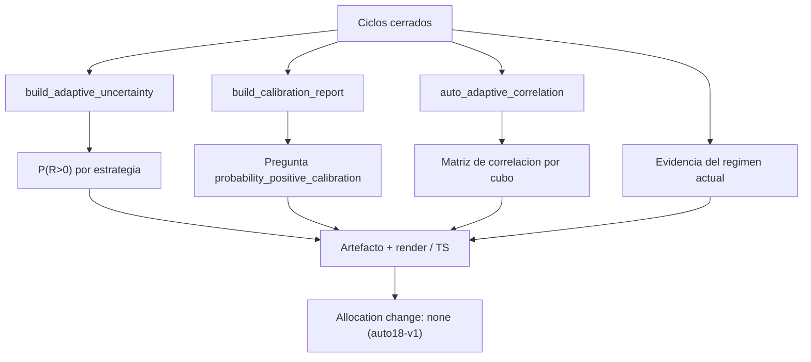

# Plan de fase — `v2.68` / `AUTO-21` · `P(R>0)`, correlación entre estrategias y evidencia del régimen actual

> **AsOf:** 2026-09-25 · **Versión:** `1.92.0-beta` → **`1.93.0-beta`** · **Base:** tag `v2.67-beta`
> **Alcance:** los tres workstreams de `AUTO-21` — la **`P(R>0)`** por bootstrap, la **correlación entre
> estrategias por cubo temporal** y la **evidencia del régimen actual** por estrategia.
> **Naturaleza:** fase estrictamente de **medición/evidencia** (no de producto). **SIN migración**
> (head `046_fill_reference_mid`). **El freeze no se toca.**

## Intención e invariante

Fase de **medición/evidencia**, no de producto. El invariante que instala:

> **La probabilidad y el co-movimiento no se afirman: se miden, viajan con su muestra y NO mueven el
> reparto.** Un número sin muestra suficiente es `NO MEDIDO`, nunca un `0` disfrazado de lectura.

Sello del reparto **`auto18-v1` congelado**, `DATA_GATE_POLICY_VERSION` = `auto15-v1`, **sin migración**
(head `046_fill_reference_mid`), freeze y gobernador intactos. Todos los datos se publican como
**evidencia**, nunca como permiso de sizing.

## Decisiones ratificadas

- **Naturaleza:** solo medición/evidencia (descartado el gating real y el advisory que mueva asignación).
- **Correlación:** alineación por **cubo temporal declarado** (día por defecto) derivado de `closeAt`; sin
  cubos compartidos suficientes ⇒ `NO MEDIDO`.

## Entregables (3 workstreams)

### A. `P(R>0)` — probabilidad de outcome positivo

Reutiliza el bootstrap que ya existe (un solo productor):

- `auto_adaptive_uncertainty.py`: al dataclass `ExpectancyInterval` se le añade `probabilityPositive` =
  fracción de las medias bootstrap ya calculadas (`means`, en `_interval_from_episodes`) estrictamente
  `> 0`. Sube el sello `ADAPTIVE_UNCERTAINTY_METHOD` (`bootstrap_episodes_v1` → `..._v2`).
- `auto_adaptive_calibration.py`: nueva pregunta `probability_positive_calibration` (constante junto a
  `CALIBRATION_QUESTION_*`, registrada en `_CALIBRATION_QUESTIONS`) que compara la `P(R>0)` declarada
  contra la fracción positiva OOS realizada, con tolerancia declarada e `inconclusive` sin muestra.
  `_aggregate` añade `probabilityPositiveOos`. Sube `CALIBRATION_METHOD`
  (`walk_forward_calibration_v2` → `..._v3`).

### B. Correlación entre estrategias

Hoy **no existe** ningún cálculo de correlación (solo escalares declarados por el llamante). Nuevo módulo
puro:

- `auto_adaptive_correlation.py` (**nuevo**): `STRATEGY_CORRELATION_METHOD = "bucket_correlation_v1"`,
  `CORRELATION_BUCKET_DEFAULT = "day"`, `CORRELATION_MIN_BUCKETS_DEFAULT`. Empareja dos `strategyVersion`
  por cubo temporal de `closeAt`, correlaciona (**Pearson** sobre medias de cubo) y **declara el hueco**
  (`None` + nota `no_shared_buckets` / `insufficient_buckets` / `constant_series`). Dataclasses
  `StrategyCorrelation` y `StrategyCorrelationReport` (`as_dict`).
- **No se conecta** al `portfolio_optimizer` ni a `portfolio_reservation`: la correlación se **publica**,
  no reparte.

### C. Evidencia del régimen actual

Reutiliza la maquinaria existente (`regime_episodes`, `regime_cell_for`, `ADAPTIVE_ADVERSE_REGIMES`):

- Calcula, para el régimen actual declarado, la `P(R>0)` / expectancy por estrategia y declara
  `cubierto` / `sin evidencia` / `NO MEDIDO`.
- **Régimen actual:** flag `--current-regime`; si falta, el `marketRegime` del ciclo más reciente; si no
  hay, `NO MEDIDO`.
- **Render:** sustituir el stub `AUTO-21 (fuera de alcance)` por los valores medidos en
  `auto_evidence_report.py` (`Current regime` / `Current evidence`) y su espejo TS
  `auto-evidence-report.ts`. Sin dato ⇒ `NO MEDIDO`.

## Sellos y compatibilidad

- Suben: `ADAPTIVE_UNCERTAINTY_METHOD`, `CALIBRATION_METHOD`; nuevo `STRATEGY_CORRELATION_METHOD`.
- `EVIDENCE_ARTIFACT_SCHEMA` **se mantiene** `auto20c_evidence_artifact_v1` con claves **aditivas y
  opcionales** (`correlation`, `currentRegime`, `currentEvidence`); ausentes ⇒ artefacto byte-idéntico al
  auditado y la UI sigue parseando v1 sin romper el contrato TS (`contract:check`).

## Superficie

| Fichero | Cambio |
|---|---|
| `packages/py/analytics/src/bolsa_analytics/cognitive/auto_adaptive_uncertainty.py` | `probabilityPositive` + sello `_v2` |
| `packages/py/analytics/src/bolsa_analytics/cognitive/auto_adaptive_calibration.py` | pregunta + `probabilityPositiveOos` + sello `_v3` |
| `packages/py/analytics/src/bolsa_analytics/cognitive/auto_adaptive_correlation.py` | **nuevo** |
| `packages/py/analytics/src/bolsa_analytics/cognitive/auto_adaptive_regime_evidence.py` | **nuevo** |
| `packages/py/analytics/src/bolsa_analytics/cognitive/auto_adaptive_replay.py` | celdas con `is_probability_positive`/`oos_positive_share` (aditivo) |
| `packages/py/analytics/src/bolsa_analytics/cognitive/auto_adaptive_confidence.py` | `closed_instant` público (sin cambio de semántica) |
| `packages/py/analytics/src/bolsa_analytics/cognitive/auto_evidence_report.py` | `correlation`/`currentRegime`/`currentEvidence` + render medido (retira el stub) |
| `scripts/research/auto_replay_battery.py` | `--bucket`, `--current-regime`; claves aditivas en el artefacto |
| `apps/web/src/features/operational-console/auto-evidence-report.ts` (+ test) | clave nueva de calibración, correlación y régimen |
| `apps/web/src/features/operational-console/auto-evidence-section.tsx` (+ test) | bloque de correlación |
| `apps/api-python/scripts/v2_44_mutation_audit.py` | **M182…M187** |
| `package.json` / `CHANGELOG.md` | bump `1.92.0-beta` → `1.93.0-beta` |

## Verificación prevista

- Unit: `P(R>0)` = fracción de medias bootstrap `> 0`; sin bootstrap ⇒ `None` + `insufficient_episodes`.
- Unit calibración: la pregunta nueva es `inconclusive` sin ambos términos y no sella `supported` por
  debajo de la tolerancia.
- Unit correlación: cubos compartidos ⇒ valor; sin solape / pocos cubos / serie constante ⇒ `None` + nota;
  orden-invariante.
- Unit TS: espejo de etiquetas y de `NO MEDIDO`; `buildEvidenceView` no recalcula ni revienta con claves
  ausentes.
- Paridad TS-vs-Python del contrato de claves (el test lee el `.py` y extrae las constantes).
- Compuertas: `pnpm --filter @bolsa/web test` · `typecheck` · `lint` · `build` · `contract:check`;
  `uv run pytest packages/py/analytics -q` · `ruff` · `lint-imports`; matriz completa.
- No-regresión: sin las nuevas claves, el artefacto es byte-idéntico al auditado en `v2.67`.

## Freeze (no se toca)

`auto_adaptive.py`, `auto_self_evaluation_feed.py`, `auto_simulation_worker.py`, `auto_adaptive_journal.py`,
`v2_43_governor_evidence.py`, `ADAPTIVE_ADVERSE_REGIMES` (uso), umbrales de rotación,
`DATA_GATE_POLICY_VERSION` (`auto15-v1`), `ADAPTIVE_POLICY_VERSION` (`auto18-v1`). Sin migración, sin
SHORT, sin backfill.

## Fuera de alcance

- La **corrida PAPER real** (paso operativo del propietario; bloqueo por material).
- Que la correlación o el régimen **muevan** el reparto: esta fase solo los **publica**.
