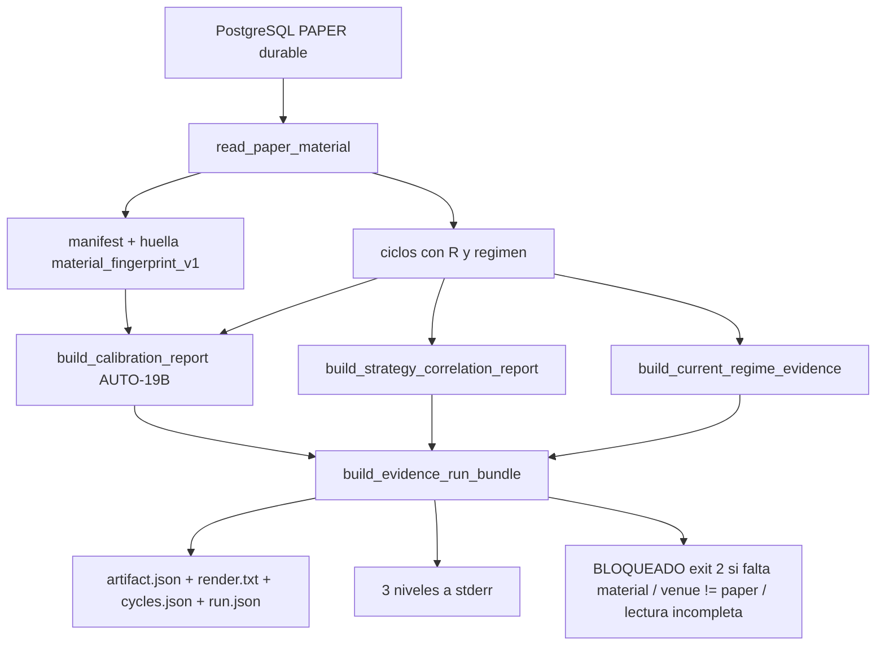

# Plan de fase — `v2.69` / `AUTO-22` · Real PAPER Evidence Run (runner reproducible + UI de evidencia)

> **AsOf:** 2026-09-25 · **Versión:** `1.93.0-beta` → **`1.94.0-beta`** · **Base:** tag `v2.68-beta`
> **Alcance:** un **RUN end-to-end reproducible** de evidencia PAPER (export PostgreSQL → walk-forward →
> `P(R>0)` → OOS → correlación → régimen → artefacto, en un comando que guarda el bundle con su huella)
> y el **rediseño de la sección AUTO EVIDENCE en tres niveles**.
> **Naturaleza:** fase de **instrumentación de la corrida**, no de decisión. **SIN migración**
> (head `046_fill_reference_mid`). **El freeze no se toca.**
> **Origen:** [auditoría de `v2.68-beta`](./auditoria-v2-68-auto-21-probabilidad-correlacion-regimen-2026-09-25.md).

## Intención e invariante

El invariante que instala:

> **La corrida de evidencia es UN comando reproducible que se guarda con su huella; o se ejecuta
> completa o se declara BLOQUEADA — nunca un bundle parcial, recálculo manual ni número copiado.**

El **material PAPER real todavía no existe** (respuesta del propietario): esta fase deja el RUN
**ejecutable y probado**, pero **no produce evidencia de mercado**. La UI mostrará `NO MEDIDO` en los
tres niveles hasta que el propietario aporte material. **Sin migración**, freeze y reparto intactos
(`auto18-v1` / `auto15-v1`).

## Decisiones ratificadas

- **Alcance:** runner end-to-end reproducible **+** rediseño de la UI AUTO EVIDENCE en 3 niveles.
- **Material:** no disponible; la corrida real queda como paso operativo del propietario. El runner se
  prueba con fixture declarado (`synthetic_fixture`) y con PG cuando exista material.
- **Una sola fuente matemática:** el runner **compone** piezas ya auditadas (`AUTO-19A/19B`, `AUTO-21`)
  y **no** reimplementa estadística ni toca `allocation`.

## Diagrama del RUN (AUTO-22)

## Entregables

### A. Runner end-to-end reproducible (`AUTO-22`)

- **Lector único (evitar una segunda ruta divergente):** la lectura PG se extrae a
  `packages/py/application/src/bolsa_application/auto_paper_material.py` como
  `read_paper_material(account_id, versions, *, limit)` (guarda de venue PAPER, paginación de
  completitud, manifest + huella). `paper_cycles_export.py` pasa a ser un **envoltorio fino** que la
  llama; se conserva su contrato (stdout JSON, `exit 2`, nombres `MATERIAL_NOTE`,
  `MaterialIncompleteError`, `NonPaperVenueError`, `_read_all_reservations`).
- **Composición pura (testeable sin PG):**
  `packages/py/analytics/src/bolsa_analytics/cognitive/auto_evidence_run.py` con
  `EVIDENCE_RUN_SCHEMA = "auto22_evidence_run_bundle_v1"` y
  `build_evidence_run_bundle(cycles, *, material, material_origin, broker_venue, bucket,
  current_regime, folds, seed, level, resamples)` que orquesta `build_calibration_report` +
  `build_strategy_correlation_report` + `build_current_regime_evidence` + `build_evidence_artifact` +
  `render_evidence_report`, y **lanza** `EvidenceRunBlockedError` si no hay ciclos medibles (fail-closed).
- **Script:** `apps/api-python/scripts/auto_evidence_run.py` (`--account-id`, `--strategy-version`
  repetible, `--bucket`, `--current-regime`, `--folds`, `--out-root`; y `--cycles FILE` para modo fixture
  declarado). Escribe un **bundle autónomo** por corrida en `--out-root`
  (`evidence_runs/<UTC>-<huella8>/` por defecto): `cycles.json`, `artifact.json`, `render.txt`,
  `run.json` (schema, timestamp, args, huella, `materialOrigin`, versiones, procedencia). Imprime los 3
  niveles (Material / Estadística / Contexto) a **stderr**; `exit 2` BLOQUEADO sin material / sin PG /
  venue ≠ paper / lectura incompleta / corrida ya existente.
- **Sin recálculo:** `run.json` referencia la huella; el artefacto viaja **verbatim** desde el instrumento
  ya auditado.

### B. UI de evidencia en 3 niveles (puntos 21–24 de la auditoría)

En `apps/web/src/features/operational-console/auto-evidence-report.ts` (lectura pura, sin recalcular) y
`auto-evidence-section.tsx`:

- **SOURCE** — badge de procedencia actual (PAPER REAL / FIXTURE / SIN MATERIAL) + avisos de integridad.
- **GLOBAL EVIDENCE** — `P(R>0)` (de
  `report.questions[probability_positive_calibration].metrics.meanDeclaredProbability`),
  `P(R>0) OOS` (de `report.aggregate.probabilityPositiveOos`) y `WFE`
  (de `report.aggregate.walkForwardEfficiency`). **Claves ya existentes: no hay cambio de esquema.**
- **CURRENT REGIME** — régimen actual o `NO MEDIDO`.
- **REGIME EVIDENCE** — una fila por estrategia con su veredicto (`edgeConfidence` → `SUPPORTED` /
  `NOT_SUPPORTED` / `INCONCLUSIVE`); sin celda ⇒ `INCONCLUSIVE`.
- **CROSS-STRATEGY** — una fila por par de la correlación; `null` ⇒ `NO MEDIDO` con su nota
  (**punto 23: nunca `0` cuando significa "no medido"**).
- **ALLOCATION** — `FROZEN — auto18-v1 (la evidencia no mueve el reparto)`.
- Se mantienen `NO MEDIDO` (número/impar ausente) e `INCONCLUSIVE` (veredicto ausente); el bloque vacío
  **no se oculta** cuando hay estrategias declaradas.

### C. Contratos, mutaciones y tests

- **Mutaciones nuevas** en `apps/api-python/scripts/v2_44_mutation_audit.py` (**M188…M190**), sobre la
  composición pura: `M188` (huella perdida al componer el bundle), `M189` (origen `paper_real` fabricado
  sin material), `M190` (bundle vacío en vez de BLOQUEADO).
- **Python:** tests de `read_paper_material` (application) reutilizando el E2E PG existente
  (`test_auto_v63_auto20b_export_e2e_pg.py`), tests de `build_evidence_run_bundle` (fixture → bundle
  determinista; sin ciclos ⇒ bloqueado; `materialOrigin` declarado) y sonda PG real del runner.
- **TS:** tests en `auto-evidence-report.test.ts` y `auto-evidence-section.test.tsx` para el layout de 3
  niveles, `P(R>0)`/OOS, veredicto por estrategia y par de correlación `null` ⇒ `NO MEDIDO`.
- **Paridad TS-vs-Python** del contrato de claves **sin cambios de esquema** (se conserva el test que lee
  el `.py`).

### D. Paquete documental

- Auditoría de `v2.68` (veredicto APROBADA + observaciones) y deuda P3
  ([auditoría](./auditoria-v2-68-auto-21-probabilidad-correlacion-regimen-2026-09-25.md) ·
  [deuda P3](./deuda-p3-post-auditoria-v2.68-2026-09-25.md)).
- Paquete de fase: este plan, `audit-pack-v2-69-…`, `arranque-auditor-v2.69-…`,
  `arranque-agente-post-v2.69-…`, `traspaso-relevo-post-v2.69-…`.
- `PROJECT_STATE.md`, `engineering-index-2026-08-03.md`, `CHANGELOG.md` y bump `package.json`
  `1.93.0-beta` → `1.94.0-beta`.

## Superficie

| Fichero | Cambio |
|---|---|
| `packages/py/application/src/bolsa_application/auto_paper_material.py` | **nuevo** (lector único PG) |
| `packages/py/analytics/src/bolsa_analytics/cognitive/auto_evidence_run.py` | **nuevo** (composición pura + `EVIDENCE_RUN_SCHEMA`) |
| `apps/api-python/scripts/auto_evidence_run.py` | **nuevo** (CLI + bundle) |
| `apps/api-python/scripts/paper_cycles_export.py` | pasa a envoltorio del lector único (contrato intacto) |
| `apps/web/src/features/operational-console/auto-evidence-report.ts` (+ test) | `global` / `regimeEvidence` / `crossStrategy` en 3 niveles |
| `apps/web/src/features/operational-console/auto-evidence-section.tsx` (+ test) | layout de 3 niveles |
| `apps/api-python/scripts/v2_44_mutation_audit.py` | **M188…M190** |
| `docs/engineering/*`, `PROJECT_STATE.md`, `CHANGELOG.md`, `package.json` | paquete + bump |

## Verificación

- `uv run pytest packages/py/application packages/py/analytics apps/api-python/tests/test_auto_v69_auto22_evidence_run.py -q` ·
  `uv run ruff check packages/py apps/api-python --config pyproject.toml` ·
  `uv run lint-imports --config packages/py/.importlinter` ·
  `uv run mypy packages/py/domain/src packages/py/market/src packages/py/infrastructure/src packages/py/application/src apps/api-python/src --follow-imports=silent`.
- `pnpm --filter @bolsa/web test` · `typecheck` · `lint` · `build` · `contract:check`.
- `uv run python apps/api-python/scripts/v2_44_mutation_audit.py M188 M189 M190` + matriz completa
  (187 + 3) con restauración byte a byte.
- Sonda del runner en seco con fixture (declara `synthetic_fixture`) y con `--cycles` inexistente ⇒
  BLOQUEADO `exit 2`, sin bundle parcial.

## Freeze (no se toca)

`portfolio_optimizer.py`, `portfolio_reservation.py`, `auto_adaptive.py`,
`auto_simulation_worker.py`, `auto_adaptive_journal.py`, umbrales de rotación,
`ADAPTIVE_POLICY_VERSION` (`auto18-v1`), `DATA_GATE_POLICY_VERSION` (`auto15-v1`).
**Sin migración**, sin SHORT, sin backfill.

## Fuera de alcance

- La **corrida PAPER real** (paso operativo del propietario; bloqueo por **material**): `V2.69` deja el
  RUN listo, no la ejecuta.
- Que `P(R>0)`, la correlación o el régimen **muevan** el reparto: siguen siendo **evidencia publicada**.
- LIVE, allocation dinámica y current-regime gating operativo.
- Deudas **P3-2** (validación empírica de la correlación por cubos) y **P3-3** (`P(R>0)` vs tamaño
  muestral): requieren el primer dataset real; se declaran, no se cierran aquí.
