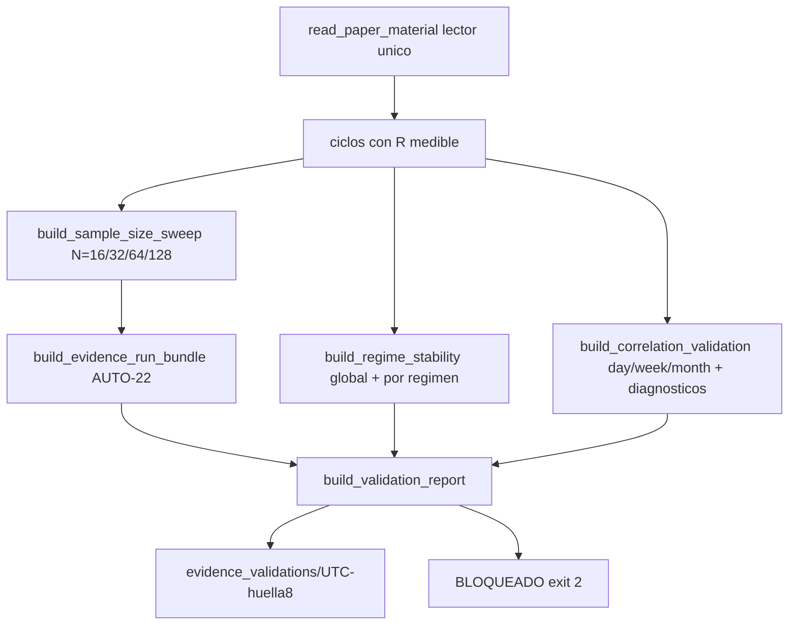

# Plan de fase — `v2.70-beta` / `AUTO-23` · Validación de evidencia PAPER real

> **AsOf:** 2026-09-25 · **Versión:** `1.94.0-beta` → **`1.95.0-beta`** · **Base:** tag `v2.69-beta`
> **Alcance:** (A) procedencia y realidad de ejecución **imposibles de confundir** en la UI; (B)
> **harness de validación** reutilizable (`P(R>0)` vs N, estabilidad de régimen, validación de la
> correlación por cubos `P3-2`/`P3-3`) listo para el primer material real; (C) **protocolo operativo**
> del primer RUN.
> **Naturaleza:** fase de **preparación y blindaje**, no de decisión. **SIN migración**
> (head `046_fill_reference_mid`). **El freeze no se toca.**
> **Origen:** [auditoría de `v2.69-beta`](./auditoria-v2-69-auto-22-real-paper-run-2026-09-25.md).

## Decisión de alcance (ratificada por el propietario)

- **Todavía no hay material PAPER real.** Esta fase **no ejecuta** la corrida real: deja el RUN ya
  auditado (`AUTO-22`) **más** el andamiaje de validación y el runbook; la **ejecución + auditoría
  empírica** son el paso operativo del propietario que **cierra** la fase.
- **No se añade ninguna métrica ni regla estadística nueva.** Bootstrap, WFE, `P(R>0)`, correlación,
  régimen y banda de edge quedan **congelados**. El harness **no decide** y **no elige N**.
- **Una sola matemática.** El harness **no reimplementa** nada: llama a `build_evidence_run_bundle` y
  a los productores de `AUTO-21`. Si el harness publicara su propia `P(R>0)`, tendríamos la "segunda
  aritmética" que toda la cadena existe para impedir.

## Invariante que instala

> **La procedencia y la realidad de ejecución se leen antes que cualquier número; y la validación de
> la evidencia es un consumidor de la ÚNICA matemática de `AUTO-22` — se ejecuta completa o se declara
> BLOQUEADA, y nunca elige el `N` que mejor suena.**

## Entregables

### A. UI — `SOURCE` y `EXECUTION REALITY` imposibles de confundir (punto 22)

- `auto-evidence-report.ts` gana `classifyExecutionReality` y un bloque `execution` en `EvidenceView`
  (`virtual_paper` / `no_medido` / `desconocido`), y el `SOURCE` gana un `subtitle` que separa
  **dato real** de **dinero real** ("DATOS REALES DE LA CUENTA PAPER · DINERO VIRTUAL · NO ES DINERO
  REAL"). Nunca se degrada `desconocido` ⇒ `paper_real`; `null` ⇒ `NO MEDIDO`.
- `auto-evidence-section.tsx` renderiza dos bloques de cabecera de alto contraste antes de los tres
  niveles: **`SOURCE`** (rojo/verde según procedencia) y **`EXECUTION REALITY`**
  (`VIRTUAL — NO REAL MONEY`). La UI sigue **leyendo**, nunca recalculando.

### B. Harness de validación (módulo puro + CLI)

- **`bolsa_analytics/cognitive/auto_evidence_validation.py`** (**nuevo**, puro):
  `EVIDENCE_VALIDATION_SCHEMA = "auto23_evidence_validation_v1"`.
  - `build_sample_size_sweep` — `P(R>0)` / OOS / WFE / `effective_n` sobre el **prefijo cronológico**
    para `N ∈ {16,32,64,128}` (llama a `build_evidence_run_bundle` y **copia**; `N` mayor que el
    medido ⇒ `NO MEDIDO`). Sin umbral, sin selección de `N`.
  - `build_regime_stability` — veredicto global vs por régimen por estrategia y sus **divergencias**
    (lectura, no gate), reutilizando `build_adaptive_uncertainty`.
  - `build_correlation_validation` — la matriz de `AUTO-21` por cubo con los **diagnósticos `P3-2`**
    (ciclos/cubos activos por estrategia y `sharedSingleCycleShare`), sin tocar la métrica.
  - `build_validation_report` — compone los tres bloques; sin ciclos con R medible lanza
    `EvidenceValidationBlockedError`. Origen por defecto: **fixture sintético**.
- **`apps/api-python/scripts/auto_evidence_validate.py`** (**nuevo**): mismo contrato de entrada que el
  RUN (`--cycles` declarado **o** `--account-id`/`--strategy-version` por el **lector único**
  `read_paper_material`), `--sizes`, `--buckets`, `--folds`, `--seed`, `--level`, `--resamples`,
  `--min-episodes`, `--out-root`. Escribe un **bundle inmutable** en
  `evidence_validations/<UTC>-<huella8>/` (`sweep.json`, `regime_stability.json`,
  `correlation_validation.json`, `validation.json`) con `exist_ok=False`. `exit 2` **BLOQUEADO** sin
  PG / sin material / sin R medible / venue ≠ PAPER / validación ya existente, **sin escribir nada**.

### C. Protocolo operativo del primer RUN real

`docs/engineering/protocolo-primer-run-paper-real-v2.70-2026-09-25.md` (**nuevo**): prerrequisitos
(PG durable, `brokerVenue=paper`, **≥32 ciclos medibles** para **una** estrategia); paso 1 = 1
estrategia → `auto_evidence_run.py` → importar `artifact.json`; paso 2 = añadir la 2ª estrategia →
validar `correlation(A,B)`; paso 3 = sweep `P(R>0)` vs N y estabilidad de régimen; **regla dura: NO
se bajan `min cycles` / `min R` / `folds` para forzar una corrida**.

### D. Contratos, tests y mutaciones

- `packages/py/analytics/tests/test_auto_evidence_validation.py` — el sweep **reutiliza** la
  matemática (a `N` completo == valor del bundle), `N` > muestra ⇒ `NO MEDIDO`, sin selección,
  régimen global vs por régimen, diagnóstico de correlación, fail-closed y determinismo.
- `apps/api-python/tests/test_auto_v70_auto23_evidence_validation.py` — fixture declara
  `synthetic_fixture`; sin fichero / sin R ⇒ `exit 2` sin ficheros; validación existente ⇒ `exit 2`;
  comparte el lector único; sonda PG **opt-in**.
- `apps/web/.../auto-evidence-report.test.ts` y `auto-evidence-section.test.tsx` — clasificación de
  ejecución, no-degradación de origen y bloques `SOURCE`/`EXECUTION REALITY`.
- **Mutaciones `M191`** (segunda aritmética: el barrido recalcula `P(R>0)`) y **`M192`** (fila
  fabricada: un `N` mayor que el material deja de ser `NO MEDIDO`) en
  `apps/api-python/scripts/v2_44_mutation_audit.py`.

### E. Paquete documental y release

- Persistir la auditoría de `v2.69` y su deuda P3; este plan, `audit-pack`, `arranque-auditor`,
  `arranque-agente-post` y `traspaso-relevo` de `v2.70`.
- `PROJECT_STATE.md`, `engineering-index-2026-08-03.md`, `CHANGELOG.md` y bump `package.json`
  `1.94.0-beta` → `1.95.0-beta`.

## Superficie

| Fichero | Cambio |
|---|---|
| `apps/web/.../auto-evidence-report.ts` (+ test) | `classifyExecutionReality`, `execution` view, `source.subtitle` |
| `apps/web/.../auto-evidence-section.tsx` (+ test) | bloque `EXECUTION REALITY` + `SOURCE` reforzado |
| `packages/py/analytics/src/bolsa_analytics/cognitive/auto_evidence_validation.py` | **nuevo** (harness puro) |
| `apps/api-python/scripts/auto_evidence_validate.py` | **nuevo** (CLI + bundle inmutable) |
| `packages/py/analytics/tests/test_auto_evidence_validation.py` | **nuevo** |
| `apps/api-python/tests/test_auto_v70_auto23_evidence_validation.py` | **nuevo** |
| `apps/api-python/scripts/v2_44_mutation_audit.py` | **M191/M192** |
| `docs/engineering/*`, `PROJECT_STATE.md`, `CHANGELOG.md`, `package.json` | paquete + bump |

## Verificación

- `uv run pytest packages/py/application packages/py/analytics -q`
- `uv run ruff check packages/py apps/api-python --config pyproject.toml`
- `uv run lint-imports --config packages/py/.importlinter`
- `uv run mypy packages/py/domain/src packages/py/market/src packages/py/infrastructure/src packages/py/application/src apps/api-python/src --follow-imports=silent`
- `pnpm --filter @bolsa/web test` · `typecheck` · `lint` · `build` · `contract:check`
- `uv run python apps/api-python/scripts/v2_44_mutation_audit.py M191 M192` + matriz completa con
  restauración byte a byte.
- Puesta en seco: `auto_evidence_validate.py --cycles <fixture>` (declara `synthetic_fixture`) y
  `--cycles inexistente` ⇒ **BLOQUEADO** `exit 2` sin ficheros.

## Freeze (no se toca)

`portfolio_optimizer.py`, `portfolio_reservation.py`, `auto_adaptive.py`,
`auto_simulation_worker.py`, `auto_adaptive_journal.py`, umbrales de rotación,
`ADAPTIVE_POLICY_VERSION` (`auto18-v1`), `DATA_GATE_POLICY_VERSION` (`auto15-v1`). **Sin migración.**
Y **no** se modifican `build_calibration_report`, `build_strategy_correlation_report`,
`build_current_regime_evidence` ni `build_evidence_run_bundle`: se **consumen**.

## Fuera de alcance

- **Ejecutar** la corrida PAPER real (paso operativo del propietario; bloqueo por **material**).
- Que `P(R>0)`, la correlación o el régimen **muevan** el reparto (allocation dinámica): fase
  posterior con contrato propio.
- `current-regime gating` operativo, LIVE y SHORT.
