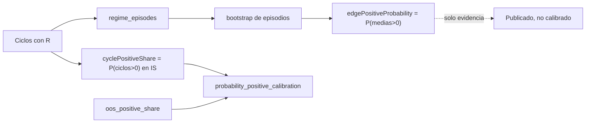

# Plan de fase — `v2.71-beta` / `AUTO-19A`+`AUTO-19B` · Corrección de la semántica de `P(R>0)` y cierre de P3

> **AsOf:** 2026-09-26 · **Versión:** `1.95.0-beta` → **`1.96.0-beta`** · **Base:** tag `v2.70-beta`
> **Alcance:** (A) separar las **dos probabilidades** que el nombre `P(R>0)` mezclaba
> (`P(ciclo>0)` vs `P(edge>0)`) y hacer que la **calibración compare términos homogéneos**;
> (B) cerrar los **tres hallazgos P3** de la auditoría de `AUTO-19A`/`AUTO-19B` (cobertura no medida
> contada como no cubierta; nivel de intervalo publicado sin clampar; colisión de la clave
> `regimeCoverage`).
> **Naturaleza:** **corrección del instrumento**, no estadística nueva. **SIN migración**
> (head `046_fill_reference_mid`). **El freeze no se toca.** El reparto **no se mueve** (`auto18-v1`
> / `auto15-v1`).
> **Origen:** auditoría profunda de `auto_adaptive_uncertainty.py` y `auto_adaptive_replay.py`.

## Decisión de alcance (ratificada por el propietario)

- **Publicar AMBAS probabilidades con nombres distintos.** Renombrar la fracción de medias bootstrap
  a `edgePositiveProbability` (`P(edge>0)`) e introducir `cyclePositiveShare` (`P(ciclo>0)` = fracción
  de ciclos medidos con `R>0`). La calibración usa la **homogénea** (`P(ciclo>0)` IS vs frecuencia
  positiva OOS).
- **No se añade ninguna regla estadística nueva.** Bootstrap, WFE, correlación, régimen y banda de
  edge quedan **congelados**: solo cambia **la lectura** de una de las probabilidades, y por eso
  **suben los sellos**.
- **La ausencia de medición no es evidencia negativa.** Una celda sin cobertura del régimen dominante
  (`None`) sale de la comparación y se declara en `cellsUnmeasured`.
- **El nivel que se publica es el que se usó.** `build_replay_report` publica el nivel **clampeado**
  (el mismo que pasó el bootstrap), igual que su hermano `CalibrationReport`.

## Invariante que instala

> **`P(R>0)` es la fracción de CICLOS positivos (lo medido) y `P(edge>0)` es la fracción de MEDIAS
> bootstrap positivas (el edge); la calibración solo compara magnitudes homogéneas, y lo que no se
> midió se declara — nunca se cuenta como evidencia negativa ni se publica con un nivel que no se usó.**

## Entregables

### A. `auto_adaptive_uncertainty.py` — separar las dos probabilidades

- `ExpectancyInterval.probability_positive` → **`edge_positive_probability`** (`P(edge>0)`, fracción
  de medias bootstrap `> 0`).
- Nuevo **`ExpectancyInterval.cycle_positive_share`** (`P(ciclo>0)`, fracción de ciclos medidos con
  `R>0`; estricto `> 0`, mismo criterio que el OOS). Sobrevive sin bootstrap (hay ciclos aunque no
  haya rachas).
- `as_dict`: `probabilityPositive` → `edgePositiveProbability`; se añade `cyclePositiveShare`.
- Sello `ADAPTIVE_UNCERTAINTY_METHOD` `bootstrap_episodes_v2` → **`bootstrap_episodes_v3`**.

### B. `auto_adaptive_replay.py` — celda coherente y cierre de P3

- `ReplayCell`: `is_probability_positive` → `is_edge_positive_probability`; se añade
  `is_cycle_positive_share`; `oos_positive_share` se mantiene. Claves JSON: `isEdgePositiveProbability`,
  `isCyclePositiveShare`, `oosPositiveShare`.
- **H4**: `regime_coverage` → **`dominant_regime_coverage`** y clave JSON `regimeCoverage` →
  **`dominantRegimeCoverage`** (elimina la colisión banda/`float` con `StrategyConfidence`).
- **H2**: `_question_coverage` excluye `dominant_regime_coverage is None` de la comparación y lo
  declara en **`cellsUnmeasured`**; `sample` y veredicto solo miran bandas medidas.
- **H3**: `build_replay_report` calcula `resolved_level = min(max(level, MIN), MAX)` y publica **ese**
  nivel (el que usó el bootstrap).

### C. Consumidores — `P(R>0)` = `P(ciclo>0)` en todo el pipeline

- `auto_adaptive_calibration.py`: `_question_probability_positive` compara
  `is_cycle_positive_share` vs `oos_positive_share` (IS vs OOS, misma magnitud). Sellos
  `walk_forward_calibration_v3` → **`_v4`**.
- `auto_adaptive_regime_evidence.py`: `probability_positive = cell.interval.cycle_positive_share`
  (clave `probabilityPositive` estable) + `edgePositiveProbability` aditivo. Sello
  `current_regime_evidence_v1` → **`_v2`**.
- `auto_evidence_validation.py`: `_interval_cell` publica `probabilityPositive =
  cycle_positive_share` y añade `edgePositiveProbability`. Sellos
  `auto23_evidence_validation_v1` → **`_v2`**, `auto23_sample_size_sweep_v1` → **`_v2`**,
  `auto23_regime_stability_v1` → **`_v2`**; método `chronological_prefix_sweep_v1` → **`_v2`**.
- `auto_evidence_run.py`: los rótulos no cambian (`P(R>0)`, `P(R>0) OOS`); la fila de contexto del
  régimen ya lee la `P(ciclo>0)`.
- Frontend `auto-evidence-report.ts`: las claves consumidas no cambian; se corrige el comentario de
  `globalRows` (IS y OOS son el **mismo** funcional en distinto tramo).

### D. Contratos, tests y mutaciones

- `test_auto_adaptive_uncertainty.py`: `edge_positive_probability` (medias) + **nuevo**
  `test_cycle_positive_share_counts_cycles_not_bootstrap_means` (divergen).
- `test_auto_adaptive_replay.py`: fixtures/forma JSON, `isCyclePositiveShare`, `dominantRegimeCoverage`,
  nivel **clampeado**, cobertura no medida y **contrato H4** (la celda no emite `regimeCoverage`).
- `test_auto_adaptive_calibration.py`: **nuevo** test que prueba que la pregunta **ignora**
  `P(edge>0)`.
- `test_auto_evidence_validation.py`, `test_auto_adaptive_regime_evidence.py`,
  `test_auto_v60_auto19_uncertainty_seam.py`, `test_auto_v64_auto20c_artifact.py`,
  `test_auto_v70_auto23_evidence_validation.py`: claves y sellos nuevos.
- **Mutaciones** `M182`–`M184`/`M187` actualizadas y **`M193`–`M197`** nuevas; matriz **192 → 198**.

### E. Paquete documental y release

- Este plan, `audit-pack`, `arranque-auditor`, `arranque-agente-post`, `traspaso-relevo` de `v2.71`
  y la copia de la deuda P3 de la auditoría de `v2.70`.
- `PROJECT_STATE.md`, `engineering-index-2026-08-03.md`, `CHANGELOG.md` y bump `package.json`
  `1.95.0-beta` → `1.96.0-beta`.

## Superficie

| Fichero | Cambio |
|---|---|
| `.../auto_adaptive_uncertainty.py` | `edge_positive_probability` + `cycle_positive_share`; sello `_v3` |
| `.../auto_adaptive_replay.py` | `isCyclePositiveShare`, `dominantRegimeCoverage`, `cellsUnmeasured`, nivel clampeado |
| `.../auto_adaptive_calibration.py` | pregunta sobre `is_cycle_positive_share`; sello `_v4` |
| `.../auto_adaptive_regime_evidence.py` | `probabilityPositive` por ciclos + `edgePositiveProbability`; sello `_v2` |
| `.../auto_evidence_validation.py` | celdas por ciclos + `edgePositiveProbability`; sellos `_v2` |
| `.../auto-evidence-report.ts` | comentario de `globalRows` |
| `apps/api-python/scripts/v2_44_mutation_audit.py` | `M182`–`M187` + `M193`–`M197` |
| tests analytics/api-python | claves, sellos y contratos |
| `docs/engineering/*`, `PROJECT_STATE.md`, `CHANGELOG.md`, `package.json` | paquete + bump |

## Verificación

- `uv run pytest packages/py/analytics packages/py/application -q` y las suites `api-python` afectadas.
- `pnpm --filter @bolsa/web test` · `typecheck` · `build` · `contract:check`.
- `uv run ruff check ...` · `uv run lint-imports ...` · `uv run mypy ...`.
- `uv run python apps/api-python/scripts/v2_44_mutation_audit.py` (**198/198**, restauración byte a byte).

## Freeze (no se toca)

`portfolio_optimizer.py`, `portfolio_reservation.py`, `auto_adaptive.py`,
`auto_simulation_worker.py`, `auto_adaptive_journal.py`, umbrales de rotación,
`ADAPTIVE_POLICY_VERSION` (`auto18-v1`), `DATA_GATE_POLICY_VERSION` (`auto15-v1`). **Sin migración.**

## Fuera de alcance

- **Ejecutar** la corrida PAPER real: sigue siendo el **paso operativo del propietario** y el
  **hito siguiente**; no se toca `evidence_runs`/`evidence_validations` ni el runbook.
- Que `P(R>0)`/`P(edge>0)`, la correlación o el régimen **muevan** el reparto.
- `current-regime gating` operativo, LIVE y SHORT.
