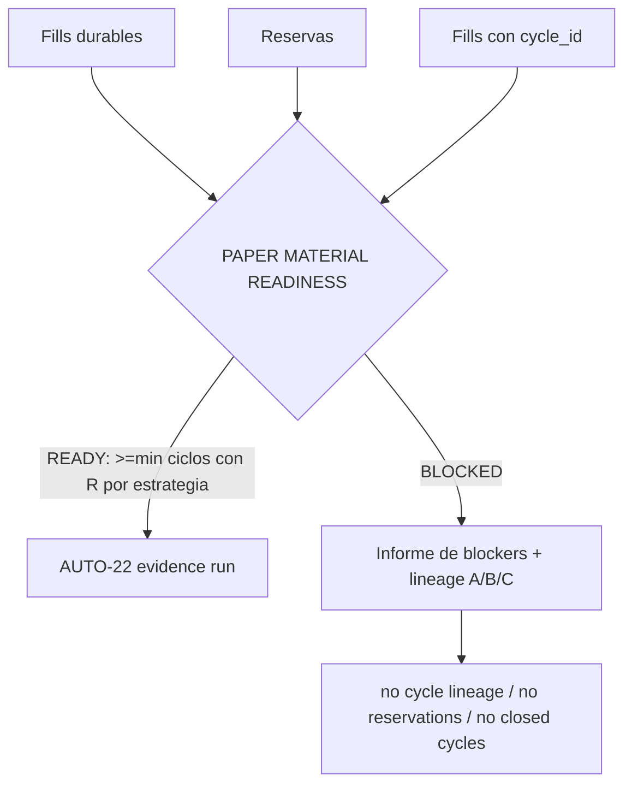

# Plan de fase — `V2.73` · `AUTO-MATERIAL-1`: PAPER MATERIAL READINESS (diagnóstico de linaje)

> **AsOf:** 2026-09-26 · **Versión de partida:** `1.97.0-beta` (`v2.72-beta`)
> **Versión objetivo:** `1.98.0-beta` · **SIN migración** (Alembic head sigue en `046_fill_reference_mid`)
> **Origen:** el primer RUN PAPER real de `v2.72` se declaró **BLOQUEADO por material** (761 fills /
> 0 `cycle_id` / 0 reservas). El instrumento hizo lo correcto (`exit 2`), pero el motivo solo se veía
> **después** de intentar la corrida.
> **Alcance:** fase **de diagnóstico read-only**. Un gate **PAPER MATERIAL READINESS** (CLI + JSON) que
> mide y declara por qué el material no produce ciclos con R medible. **No** produce estadística nueva,
> **no** repara el productor, **no** toca el freeze ni el reparto y **no** ejecuta el RUN.

## 1. El hallazgo (a MEDIR, no a creer)

El camino que escribe `cycle_id` y `reserved_risk` es **solo el pipeline AUTO 2.0**
(`AUTO_ENGINE_SIM_V2`), que está **OFF por defecto**:

- las reservas de entrada solo se persisten en `_v2_persist_tick_reservations` → `save_claim`,
  **dentro** del camino V2 del worker;
- `cycle_id` solo llega al fill por `_settle(..., cycle_id=self._v2_cycle_for(symbol))`, y
  `_v2_cycle_for` devuelve algo **solo si el plan V2 acuñó el ciclo**.

Con V2 OFF, el worker usa el camino legacy (`self._decider`): materializa fills **sin `cycle_id`** y
**sin reservas**. Eso explicaría los tres ceros con 761 fills. Esta fase lo **confirma o refuta con
medición** (SQL + el propio lector), no lo da por hecho.

## 2. El gate

El pre-flight que se corre **antes** de `auto_evidence_run.py` (AUTO-22):

**Reglas duras:** es un **LECTOR**, no un productor. **No** repara material, **no** infiere
`cycle_id`, **no** inventa `reserved_risk`, **no** sustituye el denominador por capital/equity/nominal
y **no** convierte N fills en N operaciones. Sin material, el veredicto correcto es **BLOCKED**.

## 3. Entregables

| # | Entregable | Dónde |
|---|---|---|
| 1 | Módulo puro `build_paper_material_readiness` (`PaperMaterialReadiness` + blockers + linaje) | `packages/py/application/src/bolsa_application/paper_material_readiness.py` |
| 2 | CLI read-only (tabla + `--json`, `exit 0/2`) con guarda de venue `BROKER_VENUE=paper` | `apps/api-python/scripts/paper_material_readiness.py` |
| 3 | Sondas de linaje A (cycle_id / exit orders) · B (reservas) · C (cierre FIFO) · D (readiness) | JSON del CLI |
| 4 | Tests puros (legacy BLOCKED · V2 READY · bajo mínimo BLOCKED · sin relleno) + costura CLI | `packages/py/application/tests/test_paper_material_readiness.py` · `apps/api-python/tests/test_auto_v73_material_readiness_seam.py` |
| 5 | `M199`: el gate no puede devolver `READY` sin mínimo de ciclos con R | `apps/api-python/scripts/v2_44_mutation_audit.py` (matriz **199/199**) |
| 6 | Evidencia cruda contra `bolsa-postgres` | `docs/engineering/evidencia-material-readiness-v2.73-2026-09-26.txt` |
| 7 | Bump `1.97.0-beta` → `1.98.0-beta` | `package.json`, `CHANGELOG.md` |

**Base de la reutilización (nada se reimplementa):** `adaptive_instrument_cycles` (el **mismo**
material que el instrumento: `cycles_from_fills` + `cycle_risk_from_reservations` + fricción) y los
stores del lector único (`PostgresSimFillFinanceContextStore`, `PostgresReservationStore`,
`read_cycle_regimes`). El mínimo `≥32` es el **operativo declarado** del
[protocolo del primer RUN](./protocolo-primer-run-paper-real-v2.70-2026-09-25.md) (`folds=3`,
`min_is=8`, `min_oos=4`), parametrizable por `--min-cycles` y **nunca rebajado** para forzar una corrida.

## 4. Motivos de bloqueo (fail-closed, nombrados)

| Motivo | Significado |
|---|---|
| `no cycle lineage` | ningún fill lleva `cycle_id`: sin identidad no se agrupa entrada/salida |
| `no reservations` | `portfolio_reservations` vacía: sin `reserved_risk` no hay denominador de R |
| `no closed cycles` | hay fills, pero ninguna operación cerrada (ida y vuelta completa) |
| `insufficient measurable cycles per strategy` | hay cierres, pero ninguno alcanza el mínimo con R positivo |
| `producer path not exercised` | **hecho observable**, no causa: hay fills y a la vez ni linaje ni reservas |

## 5. Reglas duras de la fase

- **No** se toca el freeze (`portfolio_optimizer.py`, `portfolio_reservation.py`, `auto_adaptive.py`,
  `auto_simulation_worker.py`, `auto_adaptive_journal.py`).
- **No** se toca AUTO-19/20/21/22/23 ni la estadística; **no** se modifica el `exit 2` de
  `paper_cycles_export.py` / `auto_evidence_run.py` (el gate es un **pre-flight separado**).
- **No** hay migración (head `046_fill_reference_mid`).
- **No** se infiere `cycle_id` ni `reserved_risk`; **no** se sustituye por capital/equity/nominal.
- **No** se escribe en `evidence_runs` / `evidence_validations` / `governor.json`; **no** hay UI.
- **No** se bajan `min cycles` / `min R` / `folds` / `min_episodes`.

## 6. Criterio de cierre

1. El CLI, contra `bolsa-postgres`, reproduce los hechos de `v2.72` y sale `2` con `BLOCKERS` y
   `lineage` declarados.
2. El gate **jamás** devuelve `READY` con 0 R medible ni por debajo del mínimo (fijado por test + `M199`).
3. Compuertas en verde: `ruff`, `import-linter` 4/4, `mypy`, `analytics`, costuras `api-python`;
   matriz **199/199** byte a byte y `git status` limpio.
4. Diff del freeze y del head de Alembic **intacto**; sin escrituras a `evidence_runs/`.
5. Docs + evidencia cruda + bump + tag `v2.73-beta` con CI verde.

## 7. Fuera de alcance (fase siguiente)

Reparar el productor / activar `AUTO_ENGINE_SIM_V2` y re-ejecutar la corrida para acumular `≥32`
ciclos medibles por estrategia (la "reparación de material" real), y la pantalla en la UI. Esta fase
**solo mide y declara**.
