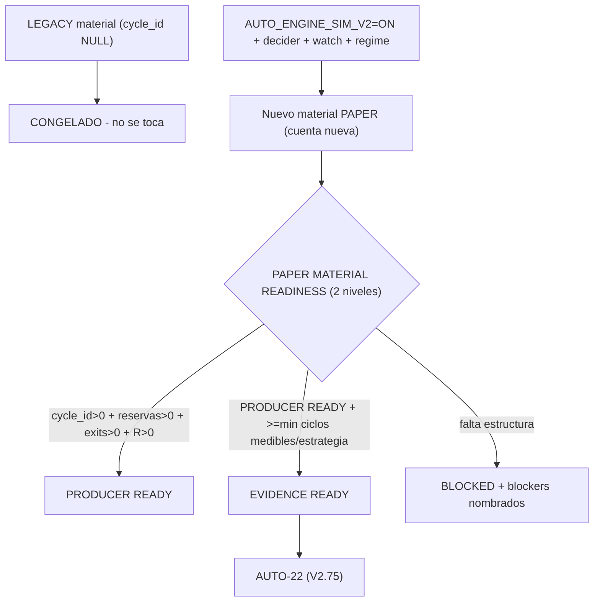

# Plan de fase — `V2.74` · `AUTO-MATERIAL-2`: PAPER PRODUCER (PRODUCER READY)

> **AsOf:** 2026-09-26 · **Versión de partida:** `1.98.0-beta` (`v2.73-beta`)
> **Versión objetivo:** `1.99.0-beta` · **SIN migración** (Alembic head sigue en `046_fill_reference_mid`)
> **Origen:** `v2.73` convirtió el bloqueo por material en un **diagnóstico** (gate read-only) y declaró
> la causa probable: con `AUTO_ENGINE_SIM_V2` **OFF** el worker usa el camino legacy y materializa fills
> **sin `cycle_id` y sin reservas**. Esta fase **activa y controla el productor V2** y exige que el
> material NAZCA con estructura, sin tocar el material legacy.
> **Alcance:** productor de ejercicio controlado (cuenta PAPER nueva) + **veredicto de dos niveles**
> (`PRODUCER_READY` / `EVIDENCE_READY`). La fase **para en `PRODUCER_READY`**; `≥32` ciclos medibles,
> `EVIDENCE_READY` y `AUTO-22` son **V2.75**.

## 1. La decisión (declarada por el propietario)

Si el camino V2 sigue roto, **se repara aunque toque el worker congelado**, declarándolo con evidencia.
El freeze incluye `auto_simulation_worker.py`; `auto_v2_entry.py` y los stores **no** están congelados.
La reparación de esta fase fue en **`reservation_store.py`** (store, no congelado): la fila durable de una
reserva **liberada** conserva el riesgo COMPROMETIDO en el alta (el denominador de R). Ver §5.

## 2. Contexto verificado (base del plan)

- `AUTO_ENGINE_SIM_V2` **no** elige un escritor de fills distinto: con OFF, `_v2_cycle_for`
  (`auto_simulation_worker.py:2150`) devuelve `None` y `_settle` (`:4597`) escribe `cycle_id=NULL`;
  `_v2_positions`/`_v2_plan` quedan vacíos porque solo se pueblan dentro de la guarda del flag (`:4430`).
- Con ON: `plan_v2_tick` acuña `cyc-*` vía `auto_cycle_id` (`auto_v2_entry.py:1749`),
  `_v2_persist_tick_reservations → save_claim` persiste reservas (`auto_simulation_worker.py:2266/2304`),
  y `_v2_reserve_exit` escribe `auto_exit_orders` con `cycle_id` (`:2435/2471`).
- El flag ON **no basta**: hace falta worker habilitado (`AUTO_SIMULATION_WORKER_ENABLED`), un decider
  que proponga (`AUTO_ENGINE_SIM_SPINE_AUTO=1` o `AUTO_ENGINE_SIM_ACTIVE_STRATEGY[_SIGNAL]`), watch list
  y régimen (`AUTO_ENGINE_SIM_V2_REGIME`).
- No existe CLI one-shot del productor; el precedente de ejercicio controlado es
  `apps/api-python/scripts/v2_42_2_golden_day_evidence.py` (`_configure_env`, `_decider`, `_run_ticks`,
  `_run_until_closed`).

## 3. Arquitectura objetivo

## 4. Entregables

| # | Entregable | Dónde |
|---|---|---|
| 1 | Productor de ejercicio controlado (A/B estructural LEGACY vs V2, `--json`) | `apps/api-python/scripts/v2_74_paper_producer_evidence.py` |
| 2 | **Veredicto de dos niveles** `PRODUCER_READY` / `EVIDENCE_READY` + blockers de productor + sello `v2` | `packages/py/application/src/bolsa_application/paper_material_readiness.py` |
| 3 | CLI con `--level {producer,evidence}` y las **tres poblaciones** (`DATABASE TOTAL` / `INSTRUMENT UNIVERSE` / `AUTO MATERIAL`) | `apps/api-python/scripts/paper_material_readiness.py` |
| 4 | Reparación del denominador de R en el cierre (fila durable conserva el riesgo comprometido) | `packages/py/application/src/bolsa_application/reservation_store.py` |
| 5 | Guarda de **inmutabilidad legacy** (sin backfill de `cycle_id`) + aislamiento en cuenta nueva | `apps/api-python/tests/test_auto_v74_producer_seam.py` |
| 6 | Tests puros (dos niveles · exits · totales de tabla · reserva liberada) + costura del productor y del CLI | `packages/py/application/tests/test_paper_material_readiness.py` · `apps/api-python/tests/test_auto_v74_producer_seam.py` |
| 7 | `M200`: el gate **no** declara `PRODUCER_READY` sin estructura | `apps/api-python/scripts/v2_44_mutation_audit.py` (matriz **200/200**) |
| 8 | Evidencia cruda del productor contra `bolsa-postgres` | `docs/engineering/evidencia-material-producer-v2.74-2026-09-26.txt` |
| 9 | Bump `1.98.0-beta` → `1.99.0-beta` | `package.json`, `CHANGELOG.md` |

**Base de la reutilización (nada se reimplementa):** el gate sigue midiendo el **mismo** material que el
instrumento (`adaptive_instrument_cycles` = `cycles_from_fills` + `cycle_risk_from_reservations` +
fricción). No hay un segundo FIFO ni una segunda aritmética de R.

## 5. La reparación (con evidencia)

`ReservationLedger.release` escala `reserved_risk` a `0.0` en la liberación total — invariante del libro
vivo. Pero `cycle_risk_from_reservations` lee las reservas **liberadas** (vía `list_by_cycle_ids`) y exige
`reserved_risk > 0` para reconstruir el denominador. Resultado: **todo ciclo cerrado quedaba con
`risk_amount = None` (R inmedible) justo cuando ya tenía resultado**.

Arreglo declarado (excepción al "no recalcula nada", **en el store, no en el ledger**):

- La **fila durable** de una reserva liberada conserva el riesgo comprometido
  (`_committed_risk(row) = reserved_risk × quantity / remaining_qty`, la MISMA proporción que aplica el
  libro, leída al revés: exacta para liberación total intacta y para la última liberación de una escalera).
- El **objeto devuelto** y el **libro vivo** siguen escalando a `0`/escalado: `list_live` no cambia.
- Sin riesgo comprometido no hay nada que conservar: devuelve `None`, **nunca un `0` inventado**.

**No se toca `auto_simulation_worker.py`** (sigue congelado). La reparación es en el store.

## 6. Motivos de bloqueo (fail-closed, nombrados)

| Nivel | Motivo | Significado |
|---|---|---|
| Productor | `no cycle lineage` | ningún fill lleva `cycle_id`: sin identidad no se agrupa entrada/salida |
| Productor | `no reservations` | `portfolio_reservations` vacía: sin `reserved_risk` no hay denominador de R |
| Productor | `no closed cycles` | hay fills, pero ninguna operación cerrada (ida y vuelta completa) |
| Productor | `no measurable risk` | hay cierres, pero ningún denominador positivo: el R no es reconstruible |
| Productor | `no exit orders` | se midieron las salidas y ninguna lleva `cycle_id` |
| Productor | `producer path not exercised` | **hecho observable**: hay fills y a la vez ni linaje ni reservas |
| Evidencia | `insufficient measurable cycles per strategy` | estructura completa pero ningún ciclo alcanza el mínimo |

`EVIDENCE_READY` **implica** `PRODUCER_READY`: jamás se declara READY sin estructura.

## 7. Reglas duras de la fase

- **No** se rellena el histórico legacy: la cuenta histórica conserva `cycle_id = NULL`, sin `UPDATE` de
  backfill; el material V2 vive en una **cuenta nueva**.
- **No** se infiere `cycle_id` ni `reserved_risk`; **no** se sustituye el denominador por
  capital/equity/nominal; **no** se convierte N fills en N operaciones.
- **No** se tocan `auto18-v1` / `auto15-v1`; **no** hay migración (head `046_fill_reference_mid`).
- **No** se baja `min cycles` / `min R` / `folds` / `min_episodes` para forzar una corrida.
- **No** se escribe en `evidence_runs` / `evidence_validations` / `governor.json`; **no** hay UI.

## 8. Criterio de cierre

1. El ejercicio V2 sobre la cuenta nueva produce, medido por el gate: `cycle_id>0`, `closedCycles>0`,
   `reservations>0` con `reserved_risk>0`, `exit orders>0`, `R medible>0`.
2. El gate devuelve **PRODUCER READY**; devuelve **EVIDENCE READY** solo si alcanza
   `≥min ciclos medibles/estrategia` (no en esta fase, y se declara, sin rebajar umbrales).
3. Legacy intacto: la cuenta histórica conserva `cycle_id=NULL`, sin `UPDATE` de backfill.
4. Excepción de freeze declarada (store, no worker); reparto/allocation y estadística sin cambios.
5. Compuertas verdes: `ruff`, `import-linter` 4/4, `mypy`, `analytics`+`application`, costuras
   `api-python`, matriz **200/200** byte a byte, `git status` limpio.
6. Docs + evidencia cruda + bump + tag `v2.74-beta` con CI de tag en verde.

## 9. Fuera de alcance (V2.75)

Acumular `≥32` ciclos medibles por estrategia, alcanzar **EVIDENCE READY**, correr `AUTO-22` y cerrar
`P3-2` (correlación por cubos) y `P3-3` (`P(R>0)` vs N). V2.74 solo garantiza y declara que el material
está **correctamente formado**.
