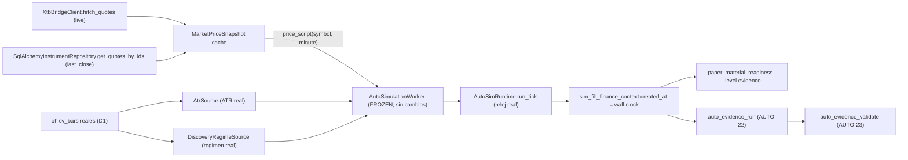

# Plan de fase — V2.76 / `AUTO-MATERIAL-4`: MARKET MATERIAL (forward PAPER con precio real)

> **AsOf:** 2026-09-26 · **Bump:** `2.00.0-beta` → **`2.01.0-beta`** · **Base:** `v2.75-beta`
> **Alembic head:** `046_fill_reference_mid` (**SIN migración**) · **Freeze intacto**
> (`auto_simulation_worker.py` no se toca) · **Reparto congelado** (`auto18-v1` / `auto15-v1`) ·
> **`ALLOCATION = none`**.
> **Naturaleza:** fase de **material de MERCADO**, no de decisión. El instrumento no cambia; lo que
> cambia es de dónde sale el PRECIO y el RÉGIMEN del tick. **Forward, no replay**: no se inyecta ni se
> backdatea `created_at`; los cubos salen del **reloj real**.

## 1. Por qué esta fase (hallazgo que la define)

`v2.75` cruzó la **cantidad** (`EVIDENCE_READY`, 42 ciclos medibles ≥ 32) pero **no la diversidad**:
1 cubo de calendario (`2026-09-26` / `2026-W39`) y 1 episodio de régimen (`BULL_TREND`). `AUTO-23` dio
correlación **sin pares** (`activeBuckets=1 < minBuckets=4`) y régimen `INCONCLUSIVE` (`episodes=1`).
`P3-2` / `P3-3` quedaron **abiertas** y el relevo de `v2.75` lo declaró sin ambigüedad: «el bloqueante
ya no es de CÓDIGO ni de CANTIDAD: es de **MATERIAL REAL**».

Tres hechos verificados en código que fijan el diseño:

- **El cubo sale del reloj real, no del mercado.** El cubo es
  `bucket_key(closed_instant(row))`, con `closedAt` = último fill del ciclo =
  `sim_fill_finance_context.created_at` = `sim_durable_store._now()` (`datetime.now(UTC)`). **Un replay
  rápido seguiría dando 1 cubo**: la diversidad exige **tiempo real transcurrido**.
- **El precio es un único seam inyectable.** `PriceScript = Callable[[str, int], float]` en
  `auto_simulation_worker.py` (default `flat_price_script` = `100.0`). En producción `AutoSimRuntime`
  **no** inyecta precio ⇒ precio plano ⇒ sin movimiento ⇒ sin ciclos. Las barras reales ya alimentan
  **ATR y régimen** (`_compose_atr_source` / `_compose_regime_source`), pero **nunca** el precio de
  ejecución/marca.
- **El régimen se fuerza con un override.** `AUTO_ENGINE_SIM_V2_REGIME` tiene prioridad sobre
  `DiscoveryRegimeSource`; el harness de `v2.75` lo fijó a `BULL_TREND` ⇒ 1 episodio. Esta fase **no**
  lo fija: el régimen lo aporta el mercado.

## 2. Objetivo y criterio de salida

Material PAPER **forward** sobre **≥2 versiones** con **≥4 cubos** y **≥2 episodios**, luego AUTO-22/23
y cierre de `P3-2` / `P3-3`. **No** se bajan `min cycles` / `min R` / `folds` / `min_episodes`; **no**
se toca el freeze; **sin migración**; `evidence_runs/` / `evidence_validations/` inmutables.

## 3. Flujo (forward)

## 4. Entregables

| Entregable | Ruta |
|---|---|
| Fuente de precio de mercado (nuevo) | `packages/py/application/src/bolsa_application/market_price_snapshot.py` |
| Puros del precio (nuevo) | `packages/py/application/tests/test_market_price_snapshot.py` (14) |
| Par real de versiones (nuevo) | `packages/py/application/src/bolsa_application/auto_forward_deciders.py` |
| Puros del par real (nuevo) | `packages/py/application/tests/test_auto_forward_deciders.py` (11) |
| Runner forward + preflight de mercado (nuevo) | `apps/api-python/scripts/v2_76_forward_market_material.py` |
| Matriz de mutaciones | `apps/api-python/scripts/v2_44_mutation_audit.py` (**M201–M205**, **200 → 205**) |
| Evidencia cruda (4 `.txt`) | `docs/engineering/evidencia-*-v2.76-2026-09-26.txt` |
| Docs de fase | plan · audit-pack · arranques (agente/auditor) · relevo |

## 5. Cambios de código

### 5.1 Fuente de precio de mercado (nuevo, I/O, fuera del freeze)

`MarketPriceSnapshot` con providers **inyectados** (patrón `AtrSource` / `DiscoveryRegimeSource`):
`quotes_provider(symbols) -> {symbol: price}` (XTB live) y `closes_provider(symbols) -> {symbol:
price}` (cierre durable). `async refresh(symbols)` sirve XTB live primero y **solo** rellena los
símbolos ausentes con el cierre; `__call__(symbol, minute) -> float` es la lectura **síncrona** del
cache (firma exacta de `PriceScript`). Reglas:

- **Fail-closed**: `None`, `NaN`, `inf` o `<= 0` **no son un precio** (`_usable_price`) ⇒ el símbolo
  queda sin dato y `__call__` devuelve `0.0` (el motor lo trata como «sin precio»), nunca un cero
  inflado ni un `0.9` de relleno.
- **Filtro estricto por watch**: un provider que devuelva símbolos fuera de la lista pedida **no**
  entra en el cache (ni sobrevive el símbolo retirado del watch en el tick anterior).
- **Sin red en tests** (providers fake). **No** se modifica `auto_simulation_worker.py`.

### 5.2 Par real de versiones sobre UNA cuenta (para `P3-2`)

`SplitWatchDecider` enruta por símbolo: `watch_a` → **versión A** (`VersionedReentryDecider`, que
estampa `DecisionPackage.source = "auto-2.0:<vA>"`, prefijo ya reconocido por
`_strategy_version_from_source`) y el resto → **versión B** = estrategia **ACTIVE** promovida
(`load_active_strategy_decider`, `source = "active-strategy:<vB>"`). `split_watch` reparte el universo
de forma **determinista, disjunta y exhaustiva** (normaliza, ordena, `cut = clamp(round(n·share), 1,
n-1)`; con 1 solo símbolo A lo recibe y B queda vacío, declarado).

La versión A **re-entra** cuando el símbolo está plano (no hay cooldown) y devuelve `HOLD`
**fail-closed** si la lectura de posición falla (nunca apila). Ambas versiones operan en los **mismos
cubos** y la **misma cuenta**, que es lo que `AUTO-23` necesita para medir correlación.

**Prerrequisito operativo:** una estrategia promovida **ACTIVE** con `EdgeReport` para `<vB>`; sin ella
B queda fail-closed a `HOLD` y el runner lo **declara** (`versionB: ""`, `pairAvailable: false`) sin
inventarse una estrategia.

### 5.3 Runner forward

`v2_76_forward_market_material.py`:

- Compone por sesión `XtbBridgeClient` + `InstrumentRepository` y construye
  `AutoSimulationWorker(price_script=snapshot, clock=default_clock, ...)`; se pasa `worker=` a
  `AutoSimRuntime` (el runtime **no** acepta precio: el harness de `v2.75` es el patrón).
- Bucle de ticks: `await snapshot.refresh(watch)` **entre** ticks (el refresh vive en el runner, NO en
  el worker congelado) y `await runtime.run_tick()`. El watch se deriva del **catálogo real**
  (activo + sector + `≥ --min-bars` barras D1, orden por `id` ⇒ determinista).
- **NO** fija `AUTO_ENGINE_SIM_V2_REGIME`: el régimen operativo sale de `DiscoveryRegimeSource`.
- **Preflight de mercado** (`--preflight-only`, read-only, **no escribe nada**): compone las MISMAS
  piezas del tick (loader → clasificador → agregado → eje operativo) y declara si el universo admite
  entradas LONG. `exit 0` si las admite, `exit 2` si el eje las veta.
- En modo ejecución también publica `marketRegime` en el JSON de evidencia (el operador ve el estado
  del mercado **de cada corrida**, no solo del preflight).
- Lee el material con `build_paper_material_readiness` (**la misma pieza que el gate**) y emite
  `--json` / `--out`. `exit 0` ⇔ nivel pedido alcanzado; `exit 2` ⇔ no alcanzado (declarado).

### 5.4 CI, mutaciones y calidad

- `.github/workflows/python-ci.yml`: los dos ficheros puros nuevos entran **EXPLÍCITOS** en la lista
  del job `quality` (ese directorio no tiene pase de directorio en ese step).
- `v2_44_mutation_audit.py`: **M201–M205** (2 sobre el precio: respaldo que **no** sobrescribe la
  cotización viva y precio no utilizable que **no** se sirve; 3 sobre el par real: no apilar con
  posición viva, no romper el enrutado por símbolo, reparto sin tramos solapados). Matriz **200 → 205**.
- El runner es **I/O de `scripts/`**: fuera del gate de `mypy` por diseño (como el harness de `v2.75`),
  `ruff` limpio.

### 5.5 Docs, bump y evidencia

`docs/engineering/`: plan, audit-pack, arranque-agente, arranque-auditor y relevo, con la convención
`*-v2-76-*`. Bump `2.00.0-beta` → **`2.01.0-beta`**; evidencia cruda en `.txt`.

## 6. Operación (tiempo real — es el cierre real de `P3-2` / `P3-3`)

1. Asegurar barras reales frescas (`SyncInstrumentDailyBars` / `auto_sync_worker`) para ATR y régimen.
2. Antes de comprometer días: **preflight** (`--preflight-only`) para saber si el universo puede entrar.
3. Correr el runner a diario sobre un universo amplio durante **≥4 días de calendario** (cubos `day`)
   hasta **≥32 ciclos medibles/versión**.
4. Gate con cada avance:
   `paper_material_readiness.py --account-id <u> --strategy-version <vA> --strategy-version <vB>
   --level evidence` (`BROKER_VENUE=paper`). Debe seguir `EVIDENCE_READY` **sin** bajar umbrales.
5. Con **≥4 cubos compartidos** y **≥2 episodios**:
   `auto_evidence_run.py --bucket day --folds 3` (AUTO-22) y
   `auto_evidence_validate.py --sizes 16,32,64,128 --buckets day,week,month` (AUTO-23).
   - **`P3-2`:** comparar la correlación por cubos contra el diagnóstico (`sharedBuckets`,
     `singleCycleBucketShare`) y declarar el sesgo **antes** de tocar la métrica.
   - **`P3-3`:** documentar `P(R>0)` vs N con **`Effective-N > 1`**.

## 7. Hallazgo operativo medido en esta fase (declarado)

**El agregado de régimen es el veredicto MÁS CONSERVADOR presente**
(`_REGIME_CONSERVATIVE_PRIORITY`: `high_vol` > `trend_down` > `range` > `trend_up` > `low_vol`). Con un
watch amplio, **un solo** `trend_down` deja el eje operativo en `BEAR_TREND` y el motor (long-only)
veta por `regime_invalid` **todas** las entradas del tick. Medido sobre el catálogo real el
2026-09-26: 12 símbolos → `{range: 5, trend_down: 6, trend_up: 1}` ⇒ `BEAR_TREND` ⇒ 0 entradas; el
forward de 8 ticks produjo `regime_invalid:40` + `top_n_excluded:24` y **0 fills**. Por eso el runner
publica el preflight: sin él, el operador descubriría a los cuatro días que el universo no podía
operar. **No** se fuerza el régimen (`AUTO_ENGINE_SIM_V2_REGIME` sigue sin fijarse) y **no** se elige a
propósito un watch «que pase»: se declara y se deja que el mercado decida.

## 8. Reglas duras (vigentes)

- No bajar `min cycles` / `min R` / `folds` / `min_episodes`; no rellenar histórico (`cycle_id` /
  `reserved_risk`); no reparar material; no sobrescribir `evidence_runs/` / `evidence_validations/`.
- No tocar el freeze (`auto_simulation_worker.py`); sin migración (head `046`); `ALLOCATION = none`.
- **Forward, no replay:** no se inyecta ni se backdatea `created_at`; los cubos deben ser días reales.
- No se fija `AUTO_ENGINE_SIM_V2_REGIME`: forzarlo garantiza 1 solo episodio (el hallazgo de `v2.75`).

## 9. Riesgos declarados

- **El cierre depende de tiempo real y de que el mercado dé ≥2 regímenes.** Con stop estructural
  ~1.5×ATR, un símbolo puede tardar días en cerrar ciclo; por eso el universo amplio (muchas
  entradas × símbolos × días). Si el material sigue degenerado, el veredicto correcto sigue siendo
  `INCONCLUSIVE` / `NO MEDIDO` — **no** se fuerza.
- **El agregado conservador hace raros los días operables** con watch amplio (§7): es una propiedad
  del instrumento congelado, no un defecto del runner.
- **Prerrequisito `<vB>`**: sin estrategia ACTIVE promovida + `EdgeReport`, la versión B no opera y
  `P3-2` no tiene par.
- **XTB bridge**: requiere `XTB_BRIDGE_URL` operativo; si cae, el respaldo es el cierre diario
  (menos movimiento ⇒ menos cierres intradía). Medido: con el bridge caído, 8/8 símbolos se sirven
  por `market_close` (el respaldo declarado, no un fallo silencioso).
