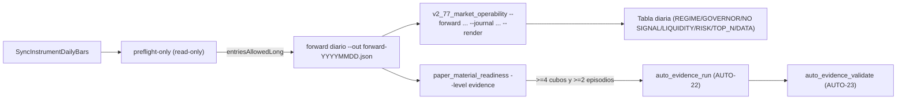

# V2.77 / AUTO-MATERIAL-5 — MARKET OPERABILITY (instrumento de medición)

> **AsOf:** 2026-09-26 · **Versión:** `2.02.0-beta` · **Base:** `v2.76-beta` (`2.01.0-beta`)
> **Alembic head:** `046_fill_reference_mid` (**SIN migración**) · **Reparto:** `auto18-v1` /
> `auto15-v1` (`ALLOCATION = none`) · **Freeze:** `auto_simulation_worker.py` **intacto**.
> **Tipo de fase:** **instrumento de medición**, no de decisión. El motor, el gobernador
> (`aggregate_trial_regime`), `TOP_N` y los umbrales estadísticos **no cambian**.

## Objetivo

Responder a la pregunta que la auditoría de `v2.76` deja abierta **sin sesgar el resultado**:
**¿la falta de material PAPER es estadística o estructuralmente causada por el gobernador
conservador y por `TOP_N`?** `V2.77` **no cambia ninguna decisión**; añade la pieza que lo
**mide a diario** y deja la ventana de **≥4 días** como operación manual del propietario.

Queda fuera de alcance, por decisión explícita: tocar el motor, el gobernador
(`aggregate_trial_regime`), `TOP_N`, los umbrales estadísticos y la deuda PG (`assert 17 == 26`),
que sigue **declarada**.

## Contexto (medido)

El forward smoke de `v2.76` (8 ticks, mercado cerrado) ya trae todo lo necesario en su JSON:
`marketRegime` (`aggregateTrialRegime`, `operationalRegime`, `entriesAllowedLong`, `bySymbol`,
`counts`), `journalReasons` (`regime_invalid:40`, `top_n_excluded:24`), `turnTotals`
(`decided:64`, `proposals:0`, `vetoes:64`, `fills:0`), `priceSources`, `readiness` y el par
(`pairAvailable:false`, `versionB:""`). Hoy ese JSON se imprime y **se pierde**: `V2.77` lo
convierte en una **serie diaria** sin recalcular nada del gate.

## Qué se construye

### 1. Puro nuevo — clasificador de operabilidad

Nuevo módulo `packages/py/application/src/bolsa_application/market_operability.py` (puro, sin
I/O, sin reloj):

- `classify_veto_reasons(reasons) -> dict[str, dict[str, int]]`: reparte cada código de motivo en
  una familia declarada. La tabla se deriva del **dueño único** de los literales,
  `DecisionReasonCode` / `_NO_TRADE_REASONS` en
  `packages/py/application/src/bolsa_application/portfolio_decision_engine.py`, más
  `TOP_N_EXCLUDED` de `packages/py/analytics/src/bolsa_analytics/cognitive/opportunity_ranker.py`
  (este último **importado**, no re-declarado). Familias:
  - `regime`: `regime_invalid`
  - `governor`: `governor_exit_only`, `governor_halted` (veto de PERMISO, distinto del hecho de
    mercado)
  - `liquidity`: `liquidity_insufficient`, `liquidity_unknown`
  - `risk`: `edge_below_threshold`, `risk_reward_below_threshold`, `risk_budget_exceeded`,
    `concentration_exceeded`, `correlation_conflict`, `correlation_unknown`,
    `risk_measurement_partial`, `risk_measurement_unknown`, `exposure_measurement_partial`,
    `exposure_measurement_unknown`, `plan_invalid`, `reservation_failed`,
    `open_orders_unmeasurable`
  - `top_n`: `top_n_excluded`
  - `data`: `sector_unknown`, `sector_conflicting`, `sector_stale`,
    `sector_exposure_unverifiable`, `stale_data`, `atr_unknown`
  - `other`: cualquier código no listado (`position_exists`, …) — **declarado, nunca descartado**
    (fail-closed de contabilidad).
- `build_operability_record(evidence, *, day) -> dict`: traduce el JSON del runner a una fila
  diaria: `day`, `regime`, `operationalRegime`, `entriesAllowedLong`, `watchSize`,
  `symbolsOperable`, `decided`, `proposals`, `vetoes`, `fills`, `orders`, `opened`, `closed`,
  `measurableCycles`, `vetoByBucket`, `vetoCounted`, `topVetoCodes`, `priceSources {live, close,
  missing}`, `pairCapable`, `pairActive`, `secondaryActive`, `versions`, `state`.
- `operability_state(record)`: estado primario. Regla fail-closed: `no_signal` **solo** si
  `proposals == 0 and vetoes == 0` (el motor no llegó a considerar candidata); si hubo vetos, el
  estado es `vetoed` y el motivo está en las familias (protege contra leer «no hay señal» donde
  hubo veto de régimen).
- `pair_capable(evidence)` / `pair_active(evidence)`: ver §2.
- `symbols_operable(marketRegime)`: cuántos símbolos del watch admitirían LONG **por sí mismos**
  (prefiere `bySymbol`; sin él agrega `counts`; sin ninguno declara `None`, nunca `0`).
- `render_operability_table(records) -> str`: tabla textual Día · Régimen · Long · Símbolos
  operables · Decididos · Propuestas · Vetos · Fills · Ciclos · Par, más el desglose de vetos por
  familia y los códigos concretos.

### 2. Nomenclatura PAIR CAPABLE vs PAIR ACTIVE (cambio aditivo)

En `apps/api-python/scripts/v2_76_forward_market_material.py` (I/O de `scripts/`, **no** es el
motor):

- `pairCapable = (len(watch) >= 2)` — el reparto y el enrutado A/B son posibles (arquitectura lista).
- `pairActive = secondary_loaded and version_b and watch_b` — es el `pairAvailable` actual,
  renombrado.
- Se publican `pairCapable` y `pairActive` **y** se conserva `pairAvailable` como **alias** de
  `pairActive`, para no romper lecturas previas. En el smoke real: `pairCapable=true`,
  `pairActive=false`, `versionB=""` — exactamente la distinción que pide la auditoría.

### 3. Script I/O nuevo — captura y tabla diaria (read-only, sin DB)

Nuevo `apps/api-python/scripts/v2_77_market_operability.py`:

- `--forward <json>` (repetible o glob): JSON(s) de salida del runner V2.76.
- `--journal <path.jsonl>`: acumula una fila por forward (por defecto
  `operability_runs/journal.jsonl`, directorio nuevo **no versionado** y gitignoreado; nunca toca
  `evidence_runs/` ni `evidence_validations/`).
- `--render`: imprime la tabla diaria y el desglose de vetos. `--no-write`: dry-run.
- El día de cada fila se **declara con su procedencia** (`evidence.day/asOf/date`, `filename` o
  `mtime`); nunca se inventa una fecha.
- No abre PostgreSQL, no escribe material, no recalcula el gate: `exit 2` si no hay registros.

### 4. Puros, mutaciones y CI

- `packages/py/application/tests/test_market_operability.py` (nuevo, sin red/PG) con fixture = el
  JSON real del smoke; **25** casos.
- `apps/api-python/scripts/v2_44_mutation_audit.py`: **M206–M210**, matriz **205 → 210**:
  - M206: todo el veto se reporta como `regime` (no separa top_n/liquidity/risk).
  - M207: un código desconocido se descarta en vez de declararse en `other`.
  - M208: `pairCapable` se calcula como `pairActive` (rompe la distinción CAPABLE/ACTIVE).
  - M209: se reporta `no_signal` aunque hubo vetos.
  - M210: la suma de familias no cuadra (se pierde la familia `other`).
- CI: registrar `test_market_operability.py` **explícito** en `.github/workflows/python-ci.yml`
  (job `quality`) **y** en `.github/workflows/release-tag-ci.yml` (job `python`), para no repetir
  el hueco de registro de `V2.76`.

### 5. Docs, bump y evidencia

- Docs de fase con convención `*-v2-77-*`: plan, audit-pack, arranque-agente, arranque-auditor, relevo.
- `PROJECT_STATE.md`, `docs/engineering/engineering-index-2026-08-03.md`, `CHANGELOG.md`,
  `docs/engineering/deuda-p3-post-auditoria-v2.70-2026-09-26.md`.
- Bump `2.01.0-beta` → **`2.02.0-beta`** (`package.json`); tag `v2.77-beta` al cerrar.
- Evidencia cruda nueva: primera tabla de operabilidad calculada sobre el forward smoke de V2.76
  (`evidencia-operabilidad-v2.77-2026-09-26.txt`, fila `2026-09-26`: `BEAR_TREND`,
  `regime_invalid:40` + `top_n_excluded:24`, 0 fills, `pairCapable=true`, `pairActive=false`) +
  matriz `evidencia-matriz-mutaciones-v2.77-210-2026-09-26.txt`.

## Lo que NO cambia (reglas duras)

- No se toca `auto_simulation_worker.py`, `paper_material_readiness.py`, `auto_adaptive.py`,
  `aggregate_trial_regime`, `TOP_N`, ni `auto18-v1`/`auto15-v1`. **Sin migración** (Alembic head
  `046_fill_reference_mid`). `ALLOCATION = none`.
- No se bajan `min cycles` / `min R` / `folds` / `min_episodes`; no se fuerza
  `AUTO_ENGINE_SIM_V2_REGIME`; no se backdatea `created_at`.
- `evidence_runs/` y `evidence_validations/` no se crean ni se sobrescriben (no hay ventana en
  esta fase).

## Runbook operativo (lo ejecuta el propietario; el agente no lo automatiza)

1. Barras D1 frescas para ATR y régimen reales.
2. Preflight read-only: si `entriesAllowedLong=false`, ese día **no habrá** entradas (se declara,
   no se fuerza).
3. Forward diario con `--out forward-YYYYMMDD.json`, dejando `XTB_BRIDGE_URL` vivo para capturar
   `market_live` (si cae, `market_close` es el respaldo declarado).
4. `v2_77_market_operability.py --forward forward-*.json --journal ... --render` tras cada sesión.
5. Gate `paper_material_readiness.py --account-id <u> --strategy-version <vA> --strategy-version
   <vB> --level evidence` con cada avance.
6. **Prerrequisito de `pairActive`:** promover una estrategia **ACTIVE** + `EdgeReport` por el flujo
   de ciclo de vida existente; sin ella, `pairCapable=true` y `pairActive=false` (declarado).
7. Solo con **≥4 cubos compartidos** y **≥2 episodios**: `auto_evidence_run.py` (AUTO-22) y
   `auto_evidence_validate.py` (AUTO-23) → cierre de P3-2/P3-3.

## Deuda declarada (fuera de V2.77, registrada)

- PG `test_auto_v70_auto23_evidence_validation.py` (`assert 17 == 26`): preexistente, ajena al
  diff, se salta en CI sin Postgres. Se anota como pendiente **antes** de declarar AUTO
  estadísticamente certificado.
- Governor conservador y `TOP_N`: **no se tocan**; V2.77 solo mide su impacto diario.
- Vivo `market_live`: depende del bridge XTB, que es servicio externo; el instrumento solo declara
  la procedencia.

## Criterios de salida de V2.77

- `market_operability.py` + tests puros verdes; matriz **210/210** con restauración byte a byte;
  `ruff`/`mypy` limpios.
- El runner V2.76 emite `pairCapable` y `pairActive` (alias `pairAvailable` conservado).
- La tabla de operabilidad del smoke se reproduce desde el JSON real y declara `REGIME=40`,
  `TOP_N=24`, `NO SIGNAL` no aplicable (hubo vetos).
- Docs de fase, bump `2.02.0-beta` y tag `v2.77-beta`; P3-2/P3-3 **siguen abiertas** (material real
  pendiente).
