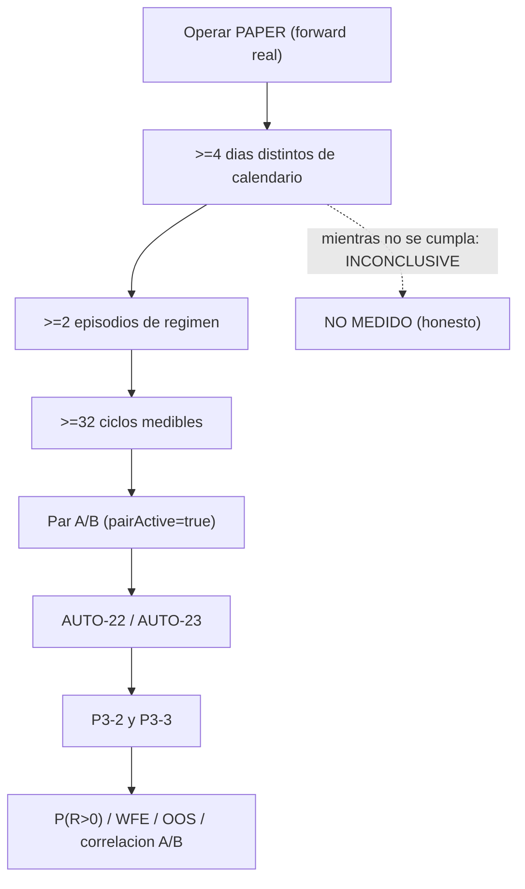

# Plan de fase — `v2.82` / `AUTO-MATERIAL-10`: OBSERVATION WINDOW (fase operativa)

> **AsOf:** 2026-09-27 · **Versión:** `2.06.0-beta → 2.07.0-beta` · **Tag:** `v2.82-beta` ·
> **Alembic head:** `046_fill_reference_mid` (**SIN migración**) · **Freeze:** `auto_simulation_worker.py`
> **intacto** · **Reparto:** `auto18-v1` / `auto15-v1` (`ALLOCATION = none`).

## 1. Contexto y origen

`v2.81-beta` (`2.06.0-beta`, `AUTO-MATERIAL-9`) queda **APROBADA con 0 bloqueantes** por la auditoría
externa: el **instrumento de observación** está construido y probado (funnel de operabilidad,
`unresolved_age`, informe HTML) y el motor congelado no se ha tocado. La propia auditoría deja el
siguiente paso **fuera del código**: la ventana **≥4 días de calendario** es **operación real de
mercado**, no otra capa de infraestructura.

La recomendación del auditor es explícitamente **conservadora**:

- **NO** cambiar `TOP_N`, el gobernador de régimen, los umbrales de riesgo, la allocation, los pesos de
  estrategia ni la lógica A/B.
- **SÍ** dejar funcionar PAPER y recoger `D1, D2, D3, D4, …` con el **funnel**, el **`unresolved_age`**,
  la **cobertura de motivos** y el **informe HTML** ya existentes.

Esta fase **formaliza ese paso operativo** como marcador de fase (`v2.82-beta`) y **no añade código** de
motor, instrumento ni reporting. Mientras no existan **≥4 días** reales, el veredicto honesto sigue siendo
**`INCONCLUSIVE` / `NO MEDIDO`**.

## 2. Alcance

Cambios en el repositorio (solo **documentación + bump**):

- `package.json` — `2.06.0-beta → 2.07.0-beta`.
- `docs/engineering/*-v2-82-*` — plan, audit-pack, arranque del auditor, arranque del agente y relevo.
- `docs/engineering/PROJECT_STATE.md`, `CHANGELOG.md`, `engineering-index-2026-08-03.md` (entrada 170).
- `docs/engineering/deuda-p3-post-auditoria-v2.70-2026-09-26.md` — nota `v2.82` (`P3-2`/`P3-3`
  **ABIERTAS**; `H-4` **ABIERTO**; `P3-5`/`OBS-5` declaradas).
- `docs/engineering/runbook-ventana-forward-v2.78-2026-09-27.md` — escalera de éxito `v2.82` y lectura
  `D1..Dn` + funnel (`None ≠ 0`).
- `docs/engineering/evidencia-ci-tag-v2.82-2026-09-27.txt` — CI del tag (declarativa; docs-only).

**No se toca:** `auto_simulation_worker.py` (congelado), `portfolio_decision_engine.py`,
`opportunity_ranker.py`, `market_regime_gate.py`, `aggregate_trial_regime`, `paper_material_readiness.py`,
`auto_reason_codes.py`, `market_operability.py`, `operability_window.py`,
`v2_80_market_window.py`, `TOP_N` ni umbrales.

## 3. La operación (cadencia diaria, runbook existente)

Reutiliza **sin cambios** la cadencia de §3 del
[runbook de la ventana](./runbook-ventana-forward-v2.78-2026-09-27.md):

```bash
# 1) Preflight (read-only; exit 2 = vetado por régimen)
uv run --no-sync python apps/api-python/scripts/v2_76_forward_market_material.py \
    --preflight-only --watch-size 20

# 2) Forward del día (reloj REAL; los cubos salen de created_at = now)
uv run --no-sync python apps/api-python/scripts/v2_76_forward_market_material.py \
    --account-id "$ACCOUNT" --version-a "$VERSION_A" \
    --interval-seconds 60 --max-ticks 400 --stop-when-ready --level evidence \
    --json --out "operability_runs/forward-market-$(date +%Y%m%d).json"

# 3) Journal de operabilidad del día
uv run --no-sync python apps/api-python/scripts/v2_77_market_operability.py \
    --forward "operability_runs/forward-market-$(date +%Y%m%d).json" --render

# 4) Ventana: serie diaria + funnel + informe (read-only sobre el journal durable)
$env:BROKER_VENUE="paper"
uv run --no-sync python apps/api-python/scripts/v2_80_market_window.py \
    --account-id "$ACCOUNT" --strategy-version "$VERSION_A" --days 4 --render \
    --forward 'operability_runs/forward-market-*.json' \
    --out operability_runs/operability-window.json \
    --html operability_runs/operability-window.html
```

**Brechas de entorno a resolver ANTES de D1** (heredadas del runbook §2, siguen abiertas): estrategia B
**ACTIVE** con `EdgeReport` (`pairActive=true`), `--account-id` **fijo** desde D2 (si no, cada corrida
siembra una cuenta nueva y el journal no acumula), scheduler de barras vivo
(`SyncInstrumentDailyBars` / `auto_sync_worker`) y el glob `forward-market-*` para no mezclar con fixtures.

**Restricción real declarada:** los días de calendario **no se fabrican** (salen de
`created_at = datetime.now(UTC)`); el agente entrega el instrumento y la declaración honesta, la evidencia
la produce el **forward real** del propietario.

## 4. Escalera de éxito (no se salta ningún peldaño)



Lectura por día (`D1..Dn`) con `--render`/`--html`, **sin mezclar `0` real con `n/d` (None)**:

- **Funnel** (`universe → marketData → regimeAllowed → signals → topN → risk → reservation → orders →
  fills → cycles`): localiza el **escalón** donde se pierde la oportunidad. Caso A (generación), B
  (`TOP_N`), C (riesgo/reserva), D (ejecución).
- **`unresolved_age`** (`lt1m`/`1to5m`/`5to20m`/`gt20m`): delata problemas de **integración** que el
  contador simple no distingue.
- **`reasonCatalogCoverage`** + `ALERTA CONTRATO: other>0`: vigilan el contrato de razones (`H-4`).

## 5. Decisiones de deuda en V2.82

- **`H-4` (LOW):** **no** se cierra por anticipado (recomendación del auditor, §21). Queda **visible** vía
  funnel/cobertura. Si `otherCount == 0` durante **toda** la ventana, queda como deuda **preventiva**; si
  `otherCount > 0`, se catalogan los `signal_*` **antes** de considerar cerrada la fase estadística.
- **`resolutionJoined=false`:** **no** se implementa el join durable propuesta→fill (auditor §22: no antes
  de tener datos que justifiquen el coste); `unresolved_age` evoluciona a latencia de resolución **después**.
- **Fila TOTAL acumulada del informe:** declarada como mejora futura de **reporting**, no se implementa en
  esta fase (cero cambios de código).
- **`P3-5`** y **`OBS-5`:** siguen declaradas, sin abordar.

## 6. Criterios de aceptación

- `ruff` limpio · import-linter `4 kept, 0 broken` · `mypy` `0 issues` (506 fuentes) · alembic head
  `046_fill_reference_mid`.
- Suite de aplicación **sin regresiones** (base `3004 passed / 37 skipped`) y **sin nuevos skips**.
- `git diff` del **código** de motor/instrumento **vacío**: el único cambio no-doc es `package.json`.
- Matriz adversarial sigue en **230/230** (no se añaden mutaciones: no hay código).
- Los docs de fase declaran explícitamente `P3-2`/`P3-3` **ABIERTAS** y el gate **`INCONCLUSIVE`**.

## 7. Reglas duras

- **No** se baja `min cycles` / `min R` / `folds` / `min_episodes` / `min_is` / `min_oos`.
- **No** se fuerza `AUTO_ENGINE_SIM_V2_REGIME`; **no** se backdatea `created_at`.
- **No** se sobrescribe `evidence_runs/` ni `evidence_validations/`; capturador **read-only**; artefactos
  solo en `operability_runs/` (no versionado).
- **Forward, no replay.** **No** se toca el freeze. **Sin migración.**
- Veredicto honesto: `INCONCLUSIVE` / `NO MEDIDO` mientras la ventana no acredite diversidad de mercado.

## 8. Fuera de alcance

- **Correr la ventana ≥4 días** y cerrar `P3-2`/`P3-3` (`AUTO-22`/`AUTO-23`): **operación del propietario**.
- **Cierre de `H-4`**, **fila TOTAL**, **`resolutionJoined`**: mejoras futuras, con datos que las justifiquen.
- `LIVE` AUTO, allocation dinámica, cambios de `TOP_N`, del gobernador o de umbrales: **congelados**.
