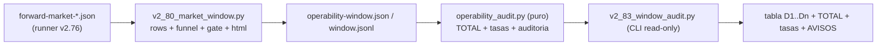

# Plan de fase — `v2.83` / `AUTO-MATERIAL-11`: AUDITORÍA READ-ONLY de la ventana PAPER (≥4 días)

> **Objeto:** `2.08.0-beta` · **Base:** `v2.82-beta` (`2.07.0-beta`) · **AsOf:** 2026-09-27 ·
> **Alembic head:** `046_fill_reference_mid` (**SIN migración**) · **Fase:** INSTRUMENTO **READ-ONLY**.

## 1. Contexto y origen

`v2.82` formalizó la **ventana ≥4 días** como fase **operativa** (docs-only) y la auditoría externa de
`v2.81-beta` fue explícita: **no** se toca el motor para fabricar evidencia. Faltaba, sin embargo, una
pieza **de lectura**: `operability_window.py` publica la **serie diaria**, el **funnel** por escalón, el
`unresolved_age` y el **informe HTML**, pero **no** existe la **fila `TOTAL` acumulada** ni las **tasas
de operabilidad** que convierten el funnel en un perfil («dónde se atasca el AUTO»). Sin ellas, un día
`fills=0`/`cycles=0` se lee como «el AUTO no funciona» cuando en realidad dice **en qué escalón** se paró.

Esta fase añade **código nuevo READ-ONLY** que **agrega** lo que el instrumento ya declara: un módulo
**puro** (sin I/O ni reloj) y un **CLI** que consume un `operability_runs/` ya producido. **No** toca el
motor, el gobernador, `TOP_N`, los umbrales, la allocation, los pesos A/B ni una migración, y **no**
fabrica evidencia: un hueco sigue siendo `None` (`n/d`), **jamás** un `0`.



## 2. Estado verificado (no se re-implementa)

- [`operability_window.py`](../../packages/py/application/src/bolsa_application/operability_window.py) ya aporta
  `build_window_row`, `build_operability_funnel`, `unresolved_age`, `window_gate`, `render_window_series`
  y `render_window_html`. **No** hay fila `TOTAL` ni tasas → eso es lo que se añade, **reutilizando** el
  funnel (`build_operability_funnel`) y el gate (`window_gate`) para no abrir un segundo camino.
- [`v2_80_market_window.py`](../../apps/api-python/scripts/v2_80_market_window.py) ya escribe
  `{"meta":…, "rows":[…]}` y `window.jsonl`. El auditor lo **consume**, no lo reescribe.
- `.gitignore:102` → `/operability_runs/`: el bundle hay que **conservarlo** aparte; el CLI es read-only.

## 3. Entregables

### 3.1 Módulo puro `packages/py/application/src/bolsa_application/operability_audit.py`

Sin I/O, sin reloj, sin decisiones. API pública:

- `window_totals(rows)` → fila `TOTAL` acumulada. Suma **sólo** los días con el campo medido y publica
  `daysTotal`/`daysMeasured` + `counts`/`coverage` (con `partial` por campo) + `rSum` + `stateCounts` +
  `regimes`/`instruments`/`versions` + el **funnel agregado** escalón a escalón. Un hueco **nunca** se
  suma como `0`; un `TOTAL` sobre días incompletos queda marcado `partial`.
- `window_rates(rows)` → tasas **derivadas del funnel** (una sola aritmética):

```python
# forma de cada tasa: nunca un 0 fabricado
{"numerator": int | None, "denominator": int | None,
 "rate": float | None, "coveredDays": int, "source": str}
```

  - `topNExclusionRate` = (signals − topN) / signals
  - `riskRejectionRate` = (topN − risk) / topN
  - `reservationFailureRate` = (risk − reservation) / risk
  - `fillRate` = fills / orders (requiere `--forward`; sin evidencia → `n/d`)
  - `cycleRate` = measurableCycles / fills
  - `unresolvedRate` = días en estado `unresolved` / días medidos

  Cada cociente se calcula **sólo** sobre los días en que sus dos escalones se midieron; sin días (o con
  denominador `0`) el `rate` es `None` **con la `source` declarada**, nunca `0.0`.
- `window_audit(rows)` → bloque determinista con `totals`, `rates`, `funnel`, `gate` (`window_gate`) y
  `warnings` (nunca ocultados): `reason_contract` (`other>0` → `H-4` visible), `price_missing`,
  `pair_not_active` (`pairActive=false`) y `pair_unmeasured` (sin `--forward`).
- `enrich_rows_with_evidence(rows, evidence_by_day)` → rellena **sólo** los huecos declarados de una fila
  con la evidencia del runner (`--forward`) y **reconstruye el funnel con la misma función** del
  instrumento; jamás sobrescribe lo medido.
- `render_window_audit(rows, meta)` → tabla `D1..Dn` + `TOTAL` + funnel agregado + tasas + `AVISOS`;
  `n/d` para `None`.

### 3.2 CLI `apps/api-python/scripts/v2_83_window_audit.py`

Read-only: **no** abre PostgreSQL, **no** toca el motor, **no** recalcula el gate ni los umbrales, **no**
escribe `evidence_runs/`/`evidence_validations/` ni el journal durable.

- Entradas: `--window operability_runs/operability-window.json` **o**
  `--journal operability_runs/window.jsonl`; `--forward 'operability_runs/forward-market-*.json'`
  (opcional, repetible, admite glob) sólo para enriquecer `orders`/`pairActive`.
- Salidas: `--render` (stdout), `--json`, `--out`.
- Códigos: `0` si se leyó ≥1 día · `2` si no hay material legible · `1` uso incorrecto.

### 3.3 Tests `packages/py/application/tests/test_operability_audit.py`

**16** puros: `TOTAL` que ignora huecos y marca `partial`; la convención `measured` del censo (ausente ⇒
medido) compartida con `operability_state`; tasas `None` sin días / sin denominador; numeradores desde los
buckets del funnel; `fillRate` `None` sin `orders` y `0.5` con evidencia; `cycleRate`/`unresolvedRate`;
`warnings` de contrato y de par A/B; `enrich_rows_with_evidence` (rellena huecos, no sobrescribe lo
medido); determinismo del render. Registrado **explícito** en
[`python-ci.yml`](../../.github/workflows/python-ci.yml) **y**
[`release-tag-ci.yml`](../../.github/workflows/release-tag-ci.yml).

### 3.4 Sello de fase y docs

- `package.json`: `2.07.0-beta → 2.08.0-beta` (**único** cambio no-doc fuera del instrumento nuevo).
- Docs de fase: este plan · `audit-pack-v2-83-…md` · `arranque-auditor-v2-83-…md` ·
  `arranque-agente-v2-83-…md` · `traspaso-relevo-post-v2-83-…md` · `evidencia-ci-tag-v2.83-2026-09-27.txt`.
- Actualizar `PROJECT_STATE.md`, `CHANGELOG.md`, `engineering-index-2026-08-03.md`, el
  [runbook de la ventana](./runbook-ventana-forward-v2.78-2026-09-27.md) y la
  [nota de deuda](./deuda-p3-post-auditoria-v2.70-2026-09-26.md).

### 3.5 Verificación operativa pre-D1 (brechas del runbook §2)

Se ejecuta **antes** de D1 y su resultado se **declara** (no se fuerza nada):

| Brecha | Comprobación | Resultado 2026-09-27 |
| --- | --- | --- |
| Régimen | `v2_76_forward_market_material.py --preflight-only --watch-size 20` | **exit 2** · `BEAR_TREND` · `{range:8, trend_down:9, trend_up:3}` ⇒ **LONG VETADAS** (`regime_invalid`) |
| Barras | barras servidas por el loader en el preflight | **20/20** ⇒ el scheduler de barras responde hoy |
| Par A/B (`pairActive=true`) | estrategia B **ACTIVE** + `EdgeReport` | **NO VERIFICABLE**: `PAPER_D_ACCOUNT_ID` está **comentado** en `.env` (`# PAPER_D_ACCOUNT_ID=…`) ⇒ no hay cuenta fija ⇒ brecha **ABIERTA** |
| Cuenta fija desde D2 | `$ACCOUNT`/`$VERSION_A` | **NO VERIFICABLE** (misma causa) ⇒ brecha **ABIERTA** |
| Glob sin fixtures | `operability_runs/forward-market-*.json` | aún **no** existe bundle real; el patrón del runbook excluye los fixtures |

## 4. Criterios de aceptación (medidos)

- `ruff` → `All checks passed!` · `lint-imports` → `4 kept, 0 broken` · `mypy` → `0 issues` (**507**
  fuentes: `506 → 507`) · `alembic heads` = `046_fill_reference_mid` (**sin migración**).
- Suite de aplicación **2071 → 2087 passed** (`+16`, sólo los tests nuevos de esta fase).
- Matriz adversarial **230/230** intacta (no se toca código de motor; **no** se añaden mutaciones),
  restauración **byte a byte** y árbol limpio.
- `git diff` **no** toca `auto_simulation_worker.py`, `portfolio_decision_engine.py`,
  `opportunity_ranker.py`, `market_regime_gate.py`, `paper_material_readiness.py`,
  `auto_reason_codes.py`; `TOP_N=5`, `32/3/8/4/2`, `auto18-v1`/`auto15-v1`, `ALLOCATION=none` intactos.

## 5. Reglas duras

- **Read-only**: el CLI no escribe en `evidence_runs/`/`evidence_validations/` ni en el journal durable.
- **No se inventa medición**: `n/d` (`None`) ≠ `0`; el veredicto sin ventana sigue siendo `INCONCLUSIVE`.
- **No** se baja ningún umbral, **no** se fuerza régimen, **no** se backdatea `created_at`.
- **No** se cierra `P3-2`/`P3-3`/`H-4`/`P3-5`/`OBS-5` por documentación: primero datos, después evidencia.

## 6. Fuera de alcance

- Correr la ventana real ≥4 días (operación del propietario) y cerrar `AUTO-22`/`AUTO-23`.
- Cualquier cambio de motor, `TOP_N`, gobernador, umbrales, allocation o pesos A/B; `LIVE`.
