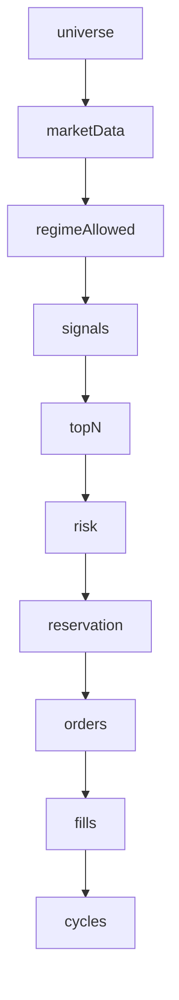

# Protocolo de auditoría de COMPORTAMIENTO del AUTO — 2026-09-28

> **AsOf:** 2026-09-28 · **Naturaleza:** documental (no toca código) · **Alembic head:**
> `046_fill_reference_mid` · **Instrumento:** `bolsa_application.operability_audit` (`v2.83`/`v2.84`) +
> CLI read-only `v2_83_window_audit.py`.

## 0. Por qué existe este documento (el cambio de estrategia)

Hasta `v2.84` la auditoría del AUTO ha sido **de código, de contratos, de instrumentación y de CI**:
demostrar que el instrumento no miente. Eso queda **cerrado** (`v2.83.1`, `v2.84`, ver la
[deuda P3](./deuda-p3-post-auditoria-v2.70-2026-09-26.md)).

La conclusión del auditor externo de `v2.84` es que **ya no hay justificación técnica para añadir más
capas de observabilidad antes de intentar la ventana PAPER real**:

> «El siguiente salto de calidad de esta aplicación debe venir de datos reales de AUTO, no de otra
> batería de documentación o infraestructura.»

Este protocolo ejecuta ese cambio: pasa de **auditar el instrumento** a **auditar el COMPORTAMIENTO**,
es decir, a responder **dónde se atasca el AUTO** sobre el material de una ventana real.

Deuda que este documento **no** cierra (sigue **ABIERTA**): `P3-2`/`P3-3` (ventana PAPER ≥4 días real),
`H-4` (LOW), `OBS-9` (doc-only), `P3-5`, `OBS-5`, `OBS-10` (registrada en la deuda P3).

## 1. La cadena del funnel: dónde se pierde cada oportunidad

Los diez escalones son `FUNNEL_STEPS` de `operability_window.py` y **no** son una lista inventada: cada
uno tiene un **dueño** declarado en el campo `source` del propio escalón.



| Escalón | `source` declarado (dueño del dato) | Grupo |
|---|---|---|
| `universe` | `evidence.watchSize` | **Evidencia del runner** (`--forward`) |
| `marketData` | `evidence.priceSources \| sample.pricesServed` | **Evidencia del runner** |
| `regimeAllowed` | `evidence.marketRegime (symbols_operable)` | **Evidencia del runner** |
| `signals` | `journal auto_entry_decision (decided)` | **Material durable** (censo de ENTRADA) |
| `topN` | `signals - veto top_n` | **Material durable** |
| `risk` | `topN - veto risk` | **Material durable** |
| `reservation` | `risk - veto de reserva` | **Material durable** |
| `orders` | `evidence.turnTotals.orders` | **Evidencia del runner** |
| `fills` | `material durable (fills)` | **Material durable** |
| `cycles` | `material durable (measurableCycles)` | **Material durable** |

Dos consecuencias operativas que hay que tener presentes **antes** de interpretar nada:

1. **Sin `--forward`, los cuatro escalones de evidencia** (`universe`, `marketData`, `regimeAllowed`,
   `orders`) quedan **`n/d`**, no `0`. Un día puede tener 0 órdenes en el funnel de evidencia y aun así
   tener `signals` medidos del journal: cada escalón tiene **su propia** procedencia.
2. **Los escalones durables son aritmética declarada**, no una re-medición: `signals` es `decided`, y
   `topN`/`risk`/`reservation` son `decided` **menos** lo que cada familia de veto quitó. Si un
   prerrequisito no se midió, los escalones que dependen de él quedan **`n/d`** — no se fabrica una
   caída a cero.

## 2. La tabla de patrones de atasco (el corazón del protocolo)

Se lee el **funnel agregado** de la ventana (`window_audit()["funnel"]`) y se localiza el **primer
escalón donde el caudal se rompe**. El escalón donde `count` pasa a `0` (o a `n/d` de forma
injustificada) **es** el diagnóstico.

| Patrón leído del funnel | Lectura | Naturaleza |
|---|---|---|
| `universe = n/d` | no hay evidencia del runner para esos días | **NO MEDIDO** — no es un fallo del AUTO |
| `universe > 0`, `marketData = 0` | el watch no tiene precio (live/close) | mercado / captura de precio |
| `marketData > 0`, `regimeAllowed = 0` | el régimen **veta todas** las LONG (p. ej. `BEAR_TREND`) | **mercado**, no un defecto: no se «arregla» el motor |
| `regimeAllowed > 0`, `signals = 0` | el motor no produjo decisiones de entrada | motor / señal |
| `signals > 0`, `topN = 0` | todo lo decidido cayó en el veto de **TOP_N** | selección (`topN`) |
| `topN > 0`, `risk = 0` | todo cayó en el veto de **riesgo** | riesgo |
| `risk > 0`, `reservation = 0` | todo cayó en el veto de **reserva** | reserva / cartera |
| `reservation > 0`, `orders = 0` | no se emitió orden pese a haber reserva | **emisión de orden** |
| `orders > 0`, `fills = 0` | se emitió orden y **no se ejecutó** | **ejecución / broker PAPER** |
| `fills > 0`, `cycles = 0` | se ejecutó y **no hay ciclo medible** (sin R) | **cierre / medición de R** |

Ramificar la lectura **con el mismo orden del funnel** es lo que evita el error clásico:

```text
100 signals -> 5 topN -> 5 risk -> 0 reservation   => el atasco está en RESERVA
100 signals -> 5 topN -> 5 risk -> 5 res -> 0 fills => el atasco está en EJECUCIÓN
100 signals -> 5 topN -> 5 risk -> 5 res -> 5 fills -> 0 cycles => el atasco está DESPUÉS de ejecutar
```

Tres cifras `cycles=0` con el mismo resultado y **tres diagnósticos distintos**. Ésa es exactamente la
razón de ser de este protocolo.

## 3. Qué pregunta responde cada bloque de la salida

`render_window_audit()` publica seis bloques. Cada uno responde una pregunta concreta:

| Bloque de la salida | Pregunta que responde | Campos |
|---|---|---|
| **Serie diaria** (`D1..Dn`) | ¿cada día se midió o no? | `day`, `regime`, `decided`, `vetoCounted`, `fills`, `measurableCycles`, `rMean`, `state` |
| **TOTAL acumulado** | ¿cuánto se acumula y sobre cuántos días? | `counts[field]` + `coverage[field].days/ofDays/partial` |
| **Funnel agregado** | **¿DÓNDE se atasca?** | `funnel[step].count/days/measured/partial` |
| **Tasas** | ¿qué proporción se pierde en cada salto? | `rates[name].rate/numerator/denominator/coveredDays/source` |
| **Gate de la ventana** | ¿acredita la ventana diversidad de mercado? | `gate.days/episodes/cycles` vs `minDays/minEpisodes/minCycles`, `verdict` |
| **AVISOS** | ¿hay algo que **no se debe ocultar**? | `warnings[].level/code/day/message` |

Campos del **TOTAL** (`AUDIT_TOTAL_FIELDS`): `decided`, `proposals`, `vetoes`, `vetoCounted`,
`otherCount`, `nonVetoCounted`, `positionEventCounted`, `fills`, `cycles`, `measurableCycles`, más
`rSum` con su propia cobertura.

## 4. Reglas de lectura (invariantes que NO se pueden violar al interpretar)

1. **`n/d` nunca es `0`.** Sin días medidos, o con denominador `0`, la tasa es `rate = None`. Un
   `0.0000` significa **«se midió y el resultado fue cero»**; `n/d` significa **«no existe medición
   válida»**. Confundirlos es el error más caro posible en este instrumento.
2. **Todo TOTAL se lee con su cobertura.** `coverage[field].partial = true` ⇒ ese campo se acumuló
   sobre **menos** días que `daysMeasured`. Una cifra `partial` **no** es una medida cerrada.
3. **Sólo se suman días medidos.** `counts`, `coverage`, `rSum` y `funnel` iteran `measured_rows`;
   los días no medidos se declaran aparte como `daysTotal - daysMeasured`.
4. **El funnel es acumulativo, no un cociente.** Se lee de arriba abajo buscando el **primer corte**.
5. **Las tasas son derivadas del funnel**, no del resultado final: `numerator`, `denominator`,
   `coveredDays` y `source` van **en el propio dato** para que no se publiquen fuera de contexto.
6. **`unresolvedRate` es una tasa de DÍAS**, no de propuestas: días en estado `unresolved` sobre días
   medidos (declarado en `_RATE_SOURCES`). No leerlo como «% de propuestas sin resolver».
7. **Un AVISO nunca se oculta.** El veredicto se emite **con** los avisos delante.

## 5. Los AVISOS y su significado

| `code` | Dispara cuando | Qué obliga a hacer |
|---|---|---|
| `reason_contract` | `contractViolation` (`other > 0`): hay motivos de veto **no catalogados** | **`H-4` visible**: catalogar el vocabulario **antes** de cerrar la fase estadística |
| `price_missing` | `priceSources.missing > 0` | declarar cuántos símbolos no tuvieron precio |
| `pair_not_active` | `pairActive = false` | el par A/B no está operativo ⇒ no hay atribución por estrategia |
| `pair_unmeasured` | sin `--forward` | el par A/B **no se midió**; no se puede leer como «no activo» |

## 6. Comandos (PowerShell, desde la raíz del repo)

```powershell
# Cuenta y versión FIJAS en toda la ventana (advertencia del auditor: sin cuenta fija la muestra se rompe)
$ACCOUNT   = "1484e253d2d54645945a6b1d7"
$VERSION_A = "v283-window-a"
$env:BROKER_VENUE = "paper"

# 1) Serie diaria de la ventana desde el journal DURABLE (+ funnel/HTML; --forward es read-only)
uv run --no-sync python apps/api-python/scripts/v2_80_market_window.py `
    --account-id "$ACCOUNT" --strategy-version "$VERSION_A" --days 4 --render `
    --forward 'operability_runs/forward-market-*.json' `
    --out "operability_runs/operability-window.json" `
    --html "operability_runs/operability-window.html"

# 2) AUDITORIA read-only: tabla D1..Dn + TOTAL + funnel + tasas + gate + avisos
uv run --no-sync python apps/api-python/scripts/v2_83_window_audit.py `
    --window "operability_runs/operability-window.json" `
    --forward 'operability_runs/forward-market-*.json' --render `
    --out "operability_runs/operability-audit.json"
```

Códigos de salida del auditor: `0` con ≥1 día; `2` sin material legible **o** uso incorrecto
(`argparse` sale con `2`; el mensaje de `stderr` sí distingue los dos casos).

> **Glob:** usar `operability_runs/forward-market-*.json` para las corridas **reales**, de modo que los
> **fixtures** deterministas del repo (`forward-20260926.json`, `…-operated-fixture.json`,
> `…-truncado.json`) **no** entren en el bundle real.

## 7. Cómo se emite el veredicto (honestidad)

El veredicto se decide contra el **gate declarado** (≥4 días de calendario, ≥2 episodios de régimen,
≥32 ciclos medibles) y **nunca** se redondea hacia arriba:

| Situación | Veredicto | Qué se escribe |
|---|---|---|
| No hay material legible | **NO MEDIDO** | qué falta, sin inferir comportamiento |
| Hay material pero el gate no se cumple | **INCONCLUSIVE** | qué falta (días / episodios / ciclos) y **por qué** |
| Gate cumplido | **READY** | el funnel localiza el atasco y las tasas lo cuantifican |

Reglas duras de lectura:

- Un `fills = 0` **no** se lee como «el AUTO no funciona»: se lee como **en qué escalón se paró**.
- Un `regimeAllowed = 0` por `BEAR_TREND` es **mercado**, no un defecto: sería una manipulación del
  proceso «arreglar el motor» para que entre en un mercado que el régimen prohíbe.
- **Ninguna deuda se cierra por documentación:** `P3-2`/`P3-3` sólo se cierran con la ventana real.

## 8. Anti-patrones (errores prohibidos)

- Comparar una tasa de un día `partial` con la de un día completo.
- Convertir un `n/d` en `0` «para poder sumar».
- Leer `unresolvedRate` como tasa de propuestas.
- Cerrar `P3-2`/`P3-3`/`H-4` porque el instrumento funcione.
- Mezclar los fixtures del repo con las corridas reales en el mismo glob.
- Tocar el motor (o sus umbrales) para «mejorar» un patrón de atasco: el diagnóstico **precede** a
  cualquier decisión, y la decisión **no** es de este protocolo.

## 9. Referencias

- [Runbook de la ventana forward](./runbook-ventana-forward-v2.78-2026-09-27.md) (comandos D1..D4 + cierre).
- [Arranque operativo de la ventana PAPER](./arranque-ventana-paper-operativa-2026-09-27.md).
- [Audit-pack `v2.84`](./audit-pack-v2-84-auto-material-12-instrument-funnel-contract-2026-09-27.md).
- [Deuda P3](./deuda-p3-post-auditoria-v2.70-2026-09-26.md) (`P3-2`, `P3-3`, `H-4`, `OBS-9`, `OBS-10`).
