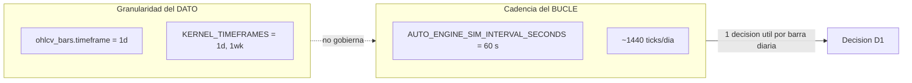
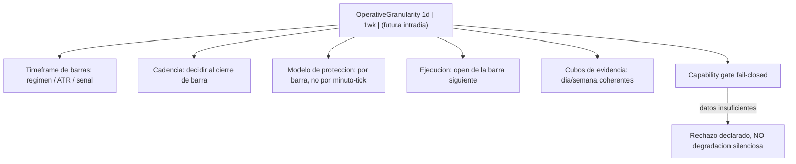

# Rethink de granularidad operativa del motor AUTO — diseño `config-driven`

> **AsOf:** 2026-09-30 · **Fase:** diseño / arquitectura (**design-only**).
> **Tipo de entrega:** documento de ingeniería (**docs-only**).
> **Bump:** `2.11.11-beta` → `2.11.12-beta`, tag `v2.88.12-beta` · **SIN migración** (Alembic head sigue en `046_fill_reference_mid`).
> **Padre:** [engineering-index-2026-08-03.md](./engineering-index-2026-08-03.md) · **Deuda:** [deuda-p3-post-auditoria-v2.70-2026-09-26.md](./deuda-p3-post-auditoria-v2.70-2026-09-26.md)
> **Relevo de esta fase:** ver §11.
>
> **[NOTA POSTERIOR — 2026-09-30.]** Este documento queda **[SUPERSEDED]** en lo **arquitectónico** por la
> revisión de diseño v2
> [`rethink-granularidad-operativa-auto-v2-2026-09-30.md`](./rethink-granularidad-operativa-auto-v2-2026-09-30.md)
> (`v2.88.13-beta`), que **conserva este diagnóstico** y sustituye el modelo de **una única**
> `OperativeGranularity` por **relojes separados** (decisión / protección / ejecución / evidencia, con el
> heartbeat de infraestructura fuera del VO), añade los **contratos explícitos** de protección OHLC y de
> *fill* (`signal D → OPEN(D+1)`, sin `seed = minute`), el **contrato de `record_tick`** y la separación
> **Fase A / Fase B**. El texto sellado se conserva **verbatim**.
>
> **[Naturaleza de este documento.]** **No toca código de producción, no enmienda ningún ADR y no
> mueve ninguna compuerta de evidencia.** Su único producto es una **propuesta de arquitectura** con
> el mapeo exacto del estado actual, para decidir *antes* de implementar. Cualquier fase del §7 que
> se apruebe será un incremento propio, con su sello y su CI.

---

## 0. Resumen ejecutivo

El sistema mezcla hoy **dos ejes que deberían estar desacoplados**: la **granularidad de los datos**
(barras **diarias** `1d`) y la **cadencia del bucle** (un tick cada **60 s**). Como consecuencia:

- El motor ejecuta **~1.440 ticks/día** (24 h × 60 s) para, en la práctica, tomar **~1 decisión real
  por barra diaria**. El resto es I/O y recálculo que **no aporta información sustancial**.
- La **protección** (stop/T1/trailing) se evalúa **cada 60 s sobre un precio que en el caso productivo
  es plano**, mientras la **decisión** se toma sobre barras D1: dos granularidades mezcladas.
- La **ejecución** (fill) usa un precio/señal de minuto (`seed = minute`), no el open de la barra
  siguiente, que es lo coherente con decidir en D1.

La propuesta es introducir **una única fuente de verdad de granularidad** (`OperativeGranularity`) de
la que se **deriven** régimen/ATR/señal, cadencia, modelo de protección, modelo de ejecución y cubos de
evidencia; y un **planificador por barra cerrada** que sustituya el *polling*. Alcance inmediato:
`1d`/`1wk`. El seam para intradía se deja **explícito y fail-closed**, pero **no** se habilita (requiere
enmendar el ADR 010).

---

## 1. Objetivo y alcance

**Objetivo.** Que toda la operativa (decisión → protección → ejecución → evidencia) quede gobernada por
**una sola palanca de granularidad**, adaptada a la resolución real de los datos, **sin recalcular miles
de veces lo que no cambia**.

**Alcance de este documento.** Diseño y plan por fases. **No** implementa, **no** reabre deuda, **no**
cambia umbrales (`TOP_N`/`REGIME`/`RISK`/`SIGNALS`/A-B) y **no** toca el motor.

**Alcance de granularidad.** `1d`/`1wk` hoy (lo que el kernel permite: ADR 010). El diseño deja
declarado el camino a intradía, pero queda **fuera de alcance inmediato** (§5).

---

## 2. Diagnóstico (estado actual, con citas)

### 2.1 Dos ejes desacoplados: dato diario, bucle de 60 s

- **Barras:** `ohlcv_bars.timeframe` es un enum con 9 valores cuyo default es `1d`
  ([tables.py:24](../../packages/py/infrastructure/src/bolsa_infrastructure/database/models/tables.py)
  y `:145`).
- **Kernel:** `KERNEL_TIMEFRAMES = {"1d", "1wk"}` — **el intradía está excluido de radar/auto** por
  decisión de producto ([platform_kernel.py:5](../../packages/py/domain/src/bolsa_domain/platform_kernel.py),
  [platform-kernel.ts:13](../../packages/shared/src/platform-kernel.ts),
  [ADR 010](../adr/010-platform-kernel-radar-execution.md) §decisiones de producto y §timeframes).
- **Cadencia:** `_sim_interval_seconds()` lee `AUTO_ENGINE_SIM_INTERVAL_SECONDS` (default **60 s**)
  ([auto_simulation_worker.py:6036](../../apps/api-python/src/bolsa_api/background/auto_simulation_worker.py)).
  El bucle `auto_sim_loop` duerme `interval_seconds` y llama `runtime.run_tick()`
  ([auto_simulation_worker.py:5691](../../apps/api-python/src/bolsa_api/background/auto_simulation_worker.py)),
  arrancado desde el proceso planificador
  ([scheduler_worker.py](../../apps/api-python/src/bolsa_api/workers/scheduler_worker.py), `start_auto_sim_worker`).

### 2.2 Superficies donde hoy entra la granularidad (y cómo se fija)

| Superficie | Dónde | Cómo se fija hoy | Coherente con D1? |
| --- | --- | --- | --- |
| Dedupe de señal | `auto_v2_entry.py:220` / `:439` | `AUTO_ENGINE_SIM_V2_TIMEFRAME` (default `1d`) | **Sí** |
| Ventana de barra | `auto_simulation_worker.py:3022` (`bar_window`) | deriva de `signal_timeframe` | **Sí** |
| Régimen / ATR / señal | `active_strategy_signal_evaluator.py:58` / `:74` | **hardwired** a `TimeFrame.D1` (el loader acepta TF, el worker no lo pasa) | **Sí, por accidente** |
| Nº de barras precargadas | `auto_simulation_worker.py:5587` | `AUTO_ENGINE_SIM_SIGNAL_BARS` (default 120) | Sí |
| Cadencia del turno | `auto_simulation_worker.py:6036` | `AUTO_ENGINE_SIM_INTERVAL_SECONDS` (default 60 s) | **No** |
| Protección / salida | `protection_compat.py:87` (`minute=`) | se evalúa **cada tick** | **No** |
| Precio del fill | `auto_simulation_worker.py:1324` (`seed=minute`) | precio por tick | **No** |

> La dedupe ya evita **re-decidir** la misma barra (bien resuelto en `signal_identity` / `bar_window`),
> pero **no evita el trabajo por tick** (protección, marcas, reservas, settlement, `record_tick`).

### 2.3 Trabajo que hoy se repite cada tick (independiente de la barra)

Inventario del turno: `AutoSimRuntime.run_tick` abre **una sesión de BD por tick** y compone los stores
([auto_simulation_worker.py:5794](../../apps/api-python/src/bolsa_api/background/auto_simulation_worker.py));
`real_turn` ejecuta los pasos de una sola vez por proceso y luego `auto_turn`
([auto_simulation_worker.py:5119](../../apps/api-python/src/bolsa_api/background/auto_simulation_worker.py)).
Dentro de `auto_turn`
([auto_simulation_worker.py:4614](../../apps/api-python/src/bolsa_api/background/auto_simulation_worker.py)):

- `_advance()` — avanza el contador de minuto ([auto_simulation_worker.py:1284](../../apps/api-python/src/bolsa_api/background/auto_simulation_worker.py)).
- Lectura de precio por símbolo + actualización de **high-watermark** (`:4655`).
- **Protección/salida** por símbolo (`:4673`, o `protection_exit_reason` legacy).
- **Settlement** del fill (`:4802`).
- Barrido de **reservas** (`expires_at`) al cierre de turno (`:5160`).
- **`record_tick`** durable (`:5168`).

Todos ellos corren **cada 60 s** aunque la barra D1 no cambie.

### 2.4 Hallazgo clave: en producción el motor corre sobre precio **plano**

`AutoSimRuntime` construye el worker **sin `price_script`**
([auto_simulation_worker.py:5768](../../apps/api-python/src/bolsa_api/background/auto_simulation_worker.py)),
de modo que se usa `flat_price_script` = constante **100.0**
([auto_simulation_worker.py:317](../../apps/api-python/src/bolsa_api/background/auto_simulation_worker.py),
default en `:616`). El **único** punto que usa cuotas reales es el script de material forward
`MarketPriceSnapshot` ([v2_76_forward_market_material.py:603](../../apps/api-python/scripts/v2_76_forward_market_material.py),
refresco en `:655`). Es decir: hoy hay **~1.440 iteraciones/día por decisión diaria**, y en el camino
productivo encima **sobre un precio que no se mueve**.

### 2.5 Incoherencia de granularidad en la ejecución

El **fill** simulado toma como base el precio del tick y un `seed` por minuto
([auto_simulation_worker.py:1324](../../apps/api-python/src/bolsa_api/background/auto_simulation_worker.py)),
mientras la **decisión** se toma sobre barras D1 cerradas. Dos granularidades mezcladas en el mismo
ciclo.

### 2.6 Ingesta: hoy es **solo diaria** (aunque el parser soporta intradía)

- El auto-sync ingiere **solo diario**: `fetch_daily_bars`
  ([sync_instrument.py:83](../../packages/py/application/src/bolsa_application/sync_instrument.py)).
  El loop late cada 15 s ([auto_sync_worker.py:20](../../apps/api-python/src/bolsa_api/background/auto_sync_worker.py))
  y la ventana post-mercado es **17:35 Europe/Madrid**
  ([sync_scheduler.py:26](../../packages/py/application/src/bolsa_application/sync_scheduler.py)).
- Yahoo **sí** puede dar intradía (`YAHOO_INTERVAL_BY_TIMEFRAME`
  [yahoo_chart.py:22](../../packages/py/market/src/bolsa_market/yahoo_chart.py)) y la tabla lo soporta,
  pero hoy **solo por demanda vía API** (no por sync programado).

### 2.7 La evidencia depende de **cubos de calendario real**

- Gate combinado `window_gate`: **≥4 días, ≥2 episodios, ≥32 ciclos** — `MARKET_WINDOW_MIN_DAYS = 4`,
  `MARKET_WINDOW_MIN_EPISODES = 2`, `MARKET_WINDOW_MIN_CYCLES = 32` en
  [operability_window.py:88-90](../../packages/py/application/src/bolsa_application/operability_window.py)
  y `window_gate` en `:495`.
- Ciclos: `DEFAULT_MIN_MEASURABLE_CYCLES_PER_STRATEGY = 32`
  ([paper_material_readiness.py:103](../../packages/py/application/src/bolsa_application/paper_material_readiness.py)).
- Episodios: `ADAPTIVE_INTERVAL_MIN_EPISODES_DEFAULT = 2`
  ([auto_adaptive_uncertainty.py:122](../../packages/py/analytics/src/bolsa_analytics/cognitive/auto_adaptive_uncertainty.py)).
- Cubos: `CORRELATION_BUCKET_DAY` (default) y `CORRELATION_MIN_BUCKETS_DEFAULT = 4`
  ([auto_adaptive_correlation.py:62](../../packages/py/analytics/src/bolsa_analytics/cognitive/auto_adaptive_correlation.py) y `:77`);
  `bucket_key(closed_at)` en `:96`; `sharedSingleCycleShare` y el sweep P3-3 en
  [auto_evidence_validation.py:418](../../packages/py/analytics/src/bolsa_analytics/cognitive/auto_evidence_validation.py)
  y `:221`.

**El replay OOS (`replay_oos.py`) ya es el modelo de referencia a generalizar**: un día por tick, `as_of`
= día anterior, ejecución al open siguiente, sin lookahead
([replay_oos.py:205](../../packages/py/application/src/bolsa_application/replay_oos.py),
`:260`, `:148`). Ver [replay-oos-viabilidad-auto-v2.86-2026-09-29.md](./replay-oos-viabilidad-auto-v2.86-2026-09-29.md) §2.1.

---

## 3. Modelo objetivo: una única fuente de verdad

`OperativeGranularity` (value object **puro**) es **la** palanca. Todo lo demás **se deriva** de ella y
**no** se configura por separado.

### 3.1 Matriz de capacidades por granularidad

| Capacidad | `1d` | `1wk` | Intradía (futuro) |
| --- | --- | --- | --- |
| Régimen / ATR / señal | barras `1d` cerradas | barras `1wk` | barras m/h |
| Cadencia de decisión | 1 por cierre diario | 1 por cierre semanal | 1 por barra |
| Protección | al cierre de barra | al cierre de barra | intra-barra (requiere feed intra-día) |
| Ejecución | open de la barra siguiente | open siguiente | open de la barra siguiente |
| Cubos de evidencia | `day` | `week` | cubo = barra |
| Requisito de datos | OHLCV D1 (hoy) | OHLCV semanal | barras intra-día (hoy **no** ingeridas) |

**Regla fail-closed:** pedir una capacidad sin los datos que la sostienen **rechaza** la configuración
(no cae a un default silencioso ni a una granularidad distinta de la pedida). Esto es la extensión
natural del principio ya usado en `signal_identity.bar_window` (timeframe ilegible ⇒ sin identidad ⇒ no
se re-emite).

---

## 4. Mecanismo anti-desperdicio (3 opciones)

**Objetivo medible:** pasar de **~1.440 decisiones-marco/día** a **1 por barra**, sin cambiar la
semántica (mismos fills, mismos ciclos, misma evidencia) en `1d`.

| Opción | Qué hace | Pro | Contra |
| --- | --- | --- | --- |
| **(A) Short-circuit por cambio de barra** | mantiene el loop de 60 s pero salta decisión/protección/marcas si `_v2_current_bar_start()` no cambió | cambio **mínimo**, reutiliza `bar_window`; mata ~99% del trabajo inútil | sigue siendo *polling* (latencia de hasta 60 s) |
| **(B) Intervalo derivado** | `interval_seconds = duración(granularidad)` (D1 → 86.400 s) | trivial | pierde el anclaje “al cierre”; sigue sondeando al azar |
| **(C) Planificador por barra cerrada** | dormir hasta el **próximo cierre esperado** de barra | cero *polling*; semántica exacta | requiere generalizar el cursor y reapuntar el *grace window* |

**Recomendación:** **(C) como objetivo y (A) como paso intermedio** verificable. Para D1, el “próximo
cierre esperado” puede apoyarse en el calendario ya existente (`is_post_market_window`, 17:35
Europe/Madrid, [sync_scheduler.py:23-31](../../packages/py/application/src/bolsa_application/sync_scheduler.py))
generalizándolo por granularidad. `ReplayCursor` es la base conceptual del cursor de *forward*: autoridad
única de **barra ⇄ `as_of` ⇄ precio**.

**Puntos que deben re-derivarse de la cadencia nueva (hoy atados a 60 s):**

- **Ventana de gracia de reservas:** hoy deriva de `_sim_interval_seconds()`
  ([auto_simulation_worker.py:455](../../apps/api-python/src/bolsa_api/background/auto_simulation_worker.py)
  y `:465`). Si la cadencia pasa a ser “por barra”, la gracia debe expresarse en **turnos/barra**, no en
  minutos.
- **Settlement:** el `seed`/`base_mid` por minuto (`:1324`) debe pasar a un anclaje por **barra**
  (open de la barra siguiente), coherente con `1d`.
- **`record_tick`** y las reconciliaciones de arranque: hoy asumen `n` turnos; deben seguir siendo
  idempotentes con `n = nº de barras`.

---

## 5. Contrato de configuración y encaje con ADR 010

- **Una sola variable** (p. ej. `AUTO_ENGINE_OPERATIVE_GRANULARITY`, default `1d`), validada contra
  `KERNEL_TIMEFRAMES`
  ([platform_kernel.py:5](../../packages/py/domain/src/bolsa_domain/platform_kernel.py)).
- `AUTO_ENGINE_SIM_V2_TIMEFRAME` y `AUTO_ENGINE_SIM_INTERVAL_SECONDS` pasan a **derivarse** de la
  anterior (o a marcarse como *override* de bajo nivel, explícitamente documentado).
- **`1d`/`1wk` no requieren ADR** (están dentro del kernel). **Habilitar intradía** exigirá
  **enmienda del ADR 010**
  ([010-platform-kernel-radar-execution.md](../adr/010-platform-kernel-radar-execution.md) §decisiones,
  `KERNEL_TIMEFRAMES`, §timeframes 1d/1wk) **y** ingesta intra-día (Yahoo on-demand → sync programado).
  Ambos quedan **fuera de alcance inmediato** y este documento **no** los enmienda.

---

## 6. Coherencia con `P3-2` / `P3-3`

- **El cubo de evidencia lo fija la granularidad.** Hoy el default es `CORRELATION_BUCKET_DAY`
  ([auto_adaptive_correlation.py:62](../../packages/py/analytics/src/bolsa_analytics/cognitive/auto_adaptive_correlation.py));
  el gate exige **≥4 cubos**
  ([operability_window.py:88](../../packages/py/application/src/bolsa_application/operability_window.py)).
  Migrar de `1d` a `1wk` **cambia el tamaño del cubo** y, por tanto, la lectura del gate: eso es una
  decisión explícita, no un efecto colateral, y debe sellarse cuando ocurra.
- **Forward (reloj de pared) vs replay (reloj simulado):** la distinción ya está documentada y **no se
  toca** — el forward construye cubos con `created_at`/`closed_at = datetime.now(UTC)`, así que **solo el
  forward** puede acreditar `P3-2`/`P3-3`
  ([replay-oos-viabilidad-auto-v2.86-2026-09-29.md](./replay-oos-viabilidad-auto-v2.86-2026-09-29.md) §1).
- **Este diseño NO cierra ni mueve `P3-2`/`P3-3`.** Solo asegura que, cuando se ejecute la ventana real,
  la cadencia del motor **no** fabrique turnos artificiales ni cambie el denominador de cubos.

---

## 7. Roadmap por fases (propuesta, no ejecutada)

> Cada fase es un incremento propio, con bump/tests/CI. Ninguna se implementa en este documento.

- **F1 — Cortar el desperdicio en D1 (sin cambio de comportamiento).** Short-circuit por cambio de barra
  (A) + `interval` derivado. Instrumentar **ticks y CPU antes/después**. Criterio de éxito: mismos fills
  y mismos ciclos que hoy, con una fracción del trabajo.
- **F2 — Fuente única de granularidad.** `OperativeGranularity` + *capability gate* fail-closed; cablear
  `make_bar_snapshot_loader(timeframe=...)`, `signal_timeframe` y el modelo de protección a la
  granularidad. `1d`/`1wk`.
- **F3 — Ejecutor por barra cerrada.** Planificador (C) + cursor de *forward* generalizado a partir de
  `ReplayCursor`; reapuntar *grace window* y settlement al anclaje por barra.
- **F4 — Seam intradía (futuro).** Enmienda ADR 010 + ingesta intra-día + modelo de protección/fill
  intra-barra. **Excluida de este ciclo.**

---

## 8. Entregable y registro

- **Este documento**: `docs/engineering/rethink-granularidad-operativa-auto-2026-09-30.md`.
- Registro en [PROJECT_STATE.md](./PROJECT_STATE.md) y
  [engineering-index-2026-08-03.md](./engineering-index-2026-08-03.md) como **diseño** (no release).
- Referencia (sin enmienda) en [ADR 010](../adr/010-platform-kernel-radar-execution.md).

---

## 9. No-objetivos

- **No** tocar código de producción en esta fase.
- **No** enmendar el ADR 010 ni habilitar intradía.
- **No** reabrir `P3-2`/`P3-3` ni cambiar umbrales de evidencia.
- **No** mover bump ni Alembic head.

---

## 10. Verificación de este documento

Docs-only: no hay artefacto ejecutable. La verificación consiste en que **todas las citas de §2
resuelven a fichero y línea reales** en el árbol sellado `v2.88.11-beta`, y en que este documento
**declara explícitamente** que no sustituye evidencia de operación (§6).

---

## 11. Relevo — estado tras esta fase

- **Hecho:** documento de diseño (diagnóstico con citas + modelo `OperativeGranularity` + 3 opciones de
  cadencia + contrato de config/ADR + coherencia `P3` + roadmap F1–F4).
- **Decisión pendiente del propietario:** aprobar F1 (corte del desperdicio en D1) como primer
  incremento; F2–F4 quedan como diseño.
- **Nada cerrado, nada movido:** `P3-2`, `P3-3`, `OBS-21` y el resto de la cola permanecen **intactas**.
  Este documento **no** cierra deuda.
