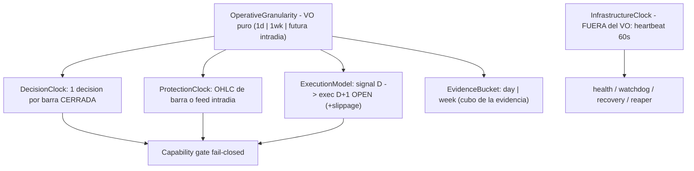

# Revisión de diseño v2 — granularidad operativa del motor AUTO: **clocks separados**, contratos temporales explícitos y **Fase A / Fase B**

> **AsOf:** 2026-09-30 · **Fase:** `GRANULARIDAD-OPERATIVA` (diseño **v2**, revisión arquitectónica).
> **Tipo de entrega:** documento de ingeniería (**docs-only**).
> **Bump:** `2.11.12-beta` → `2.11.13-beta`, tag propuesto `v2.88.13-beta` · **SIN migración** (Alembic head sigue en `046_fill_reference_mid`).
> **Padre:** [engineering-index-2026-08-03.md](./engineering-index-2026-08-03.md) · **Deuda:** [deuda-p3-post-auditoria-v2.70-2026-09-26.md](./deuda-p3-post-auditoria-v2.70-2026-09-26.md)
> **Revisa:** [rethink-granularidad-operativa-auto-2026-09-30.md](./rethink-granularidad-operativa-auto-2026-09-30.md) (`v2.88.12-beta`) — su **diagnóstico se conserva**; su **modelo de una única granularidad** queda **[SUPERSEDED]** por este documento en lo arquitectónico.
> **Relevo de esta fase:** ver §14.
>
> **[Naturaleza de este documento.]** **No toca código de producción, no enmienda ningún ADR y no mueve
> ninguna compuerta de evidencia.** Su producto es una **revisión del diseño** tras la auditoría externa:
> descompone el modelo temporal en **relojes independientes**, formaliza los **contratos de protección y de
> fill** y separa la **optimización semánticamente neutra** (Fase A) de la **corrección deliberada del modelo
> temporal** (Fase B). Cualquier fase que se apruebe será un incremento propio, con su sello y su CI.

---

## 0. Resumen ejecutivo

El diseño de `v2.88.12` **acertó en el diagnóstico**: el dato es **diario** (`ohlcv_bars.timeframe` default
`1d`, `KERNEL_TIMEFRAMES = {1d, 1wk}`) mientras el bucle late cada **60 s**
(`AUTO_ENGINE_SIM_INTERVAL_SECONDS`), y en producción el motor corre sobre **precio plano**
(`flat_price_script = 100.0`) con un *fill* anclado a `seed = minute`.

Esta revisión **conserva ese diagnóstico** y cambia el **modelo** que se deriva de él:

- **De una granularidad única a cinco piezas independientes.** `OperativeGranularity` no debe imponer la
  **misma** cadencia a decisión, protección y ejecución. Se declaran relojes separados, y el **heartbeat de
  infraestructura** queda **fuera** del modelo operativo.
- **La protección D1 no puede cerrarse solo al cierre** sin una semántica **OHLC** explícita (o un feed
  intradía). Se declaran los dos modelos y se exige elegir uno (fail-closed).
- **El *fill* necesita un contrato explícito**: `signal_bar = D` → `execution_bar = D+1` →
  `price = OPEN(D+1)`. El `seed = minute` **desaparece** del modelo D1. Replay OOS y PAPER live comparten el
  **mismo contrato temporal** con **distinto proveedor de precio**.
- **`record_tick` es un contrato**: antes de reducir su frecuencia hay que inventariar **quién** depende de
  él (auditoría, heartbeat, recovery, ventanas, diagnóstico).
- **Fase A ≠ Fase B**: la optimización (short-circuit) debe reproducir los resultados **exactos**; la
  corrección de modelo temporal (next-bar open) **puede** cambiarlos, y se compara contra un **golden nuevo**.
- **`1wk` queda declarada pero no habilitada** hasta tener sus pruebas temporales (gap del lunes).
- **`OBS-21` está CERRADA** en `v2.88.11-beta` (la auditoría la daba por pendiente).

**Veredicto de esta revisión (autor):** el diseño de `v2.88.12` es **viable como base**; se aprueba **con
los cambios de este documento**. No se implementa literalmente «1 tick por barra».

---

## 1. Lo que se conserva del diseño `v2.88.12` (diagnóstico, válido)

| Hallazgo del diseño | Estado en esta revisión |
| --- | --- |
| El **dato es D1** y el **bucle es de 60 s** (dos ejes desacoplados) | **Confirmado** (ver §2 citas) |
| **Precio plano** en el camino productivo (`flat_price_script = 100.0`) | **Confirmado** |
| *Fill* con **`seed = minute`** sobre una decisión D1 | **Confirmado** |
| **Fuente única de verdad** para la granularidad | **Concepto conservado**, modelo corregido (§3) |
| **Fail-closed** ante datos insuficientes (no degradación silenciosa) | **Confirmado** |
| **No tocar el motor** en la fase de diseño | **Confirmado** |
| Separar `1d`/`1wk` de intradía; intradía exige enmienda del ADR 010 | **Confirmado** |
| **Replay OOS** como modelo temporal de referencia | **Confirmado** (se generaliza, §5) |
| Las 3 opciones de cadencia **A/B/C** con **A como paso intermedio** | **Confirmado** (§8) |

---

## 2. Citas que sostienen el diagnóstico (verificadas)

Todas resuelven a fichero:línea real del árbol sellado (`v2.88.12-beta`); el motor es byte-idéntico al de
`v2.88.11-beta`.

| Afirmación | Cita |
| --- | --- |
| **Precio plano**: `AutoSimRuntime` construye el worker **sin `price_script`** | [auto_simulation_worker.py:5768](../../apps/api-python/src/bolsa_api/background/auto_simulation_worker.py) |
| `flat_price_script` = **100.0** constante (default del worker) | [auto_simulation_worker.py:317](../../apps/api-python/src/bolsa_api/background/auto_simulation_worker.py) · default en [:616](../../apps/api-python/src/bolsa_api/background/auto_simulation_worker.py) |
| **`seed = minute`** y `base_mid` por tick en el *fill* | [auto_simulation_worker.py:1324](../../apps/api-python/src/bolsa_api/background/auto_simulation_worker.py) |
| Cadencia del bucle: `AUTO_ENGINE_SIM_INTERVAL_SECONDS` (default 60 s) | [_sim_interval_seconds, auto_simulation_worker.py:6036](../../apps/api-python/src/bolsa_api/background/auto_simulation_worker.py) |
| El bucle duerme y llama `run_tick()` | [auto_sim_loop, auto_simulation_worker.py:5691](../../apps/api-python/src/bolsa_api/background/auto_simulation_worker.py) |
| `record_tick` durable **por turno** | [auto_simulation_worker.py:5168](../../apps/api-python/src/bolsa_api/background/auto_simulation_worker.py) · semántica `seq` monotónico/idempotente en [auto_engine_state_store.py:19](../../packages/py/application/src/bolsa_application/auto_engine_state_store.py) |
| Ventana de gracia de reservas **derivada de la cadencia** | [reservation_grace_window, auto_simulation_worker.py:455](../../apps/api-python/src/bolsa_api/background/auto_simulation_worker.py) |
| Protección legacy evaluada **cada tick** (`minute=self._minute`) | [protection_compat.py:86](../../packages/py/application/src/bolsa_application/protection_compat.py) · [:4683](../../apps/api-python/src/bolsa_api/background/auto_simulation_worker.py) |
| Modelo temporal de referencia (**open del día siguiente**) | [replay_oos.py](../../packages/py/application/src/bolsa_application/replay_oos.py) |
| Compuertas de evidencia ≥4 días / ≥2 episodios / ≥32 ciclos | [operability_window.py:88-90](../../packages/py/application/src/bolsa_application/operability_window.py) |
| Kernel de timeframes permitidos | [platform_kernel.py:5](../../packages/py/domain/src/bolsa_domain/platform_kernel.py) |

> **Nota de honestidad.** Las cifras «~1.440 ticks/día» y «~99 % del trabajo inútil» son **cotas
> superiores / estimaciones** (asumen 24 h continuas); su medición real es un **criterio de la Fase A**
> (§8), no un hecho que este documento afirme. La pre-auditoría interna de `v2.88.12` ya las marca
> `NO MEDIDO`.

---

## 3. Modelo objetivo: **relojes separados** (no un *god object* temporal)

El diseño de `v2.88.12` derivaba **de una sola** `OperativeGranularity` la decisión, la protección, la
ejecución y los cubos de evidencia. Eso puede **arreglar un problema y crear otro**: forzar la misma
cadencia en subsistemas que necesitan resoluciones distintas. El modelo v2 los separa:



### 3.1 Reglas del modelo

1. **Cada subsistema trabaja a la resolución temporal que necesita**; la granularidad es la **fuente de
   capacidades**, no la imposición de una cadencia única.
2. **El heartbeat de infraestructura NO pertenece** a `OperativeGranularity`: health, watchdog y recovery
   siguen su propio reloj (60 s hoy) con independencia de la granularidad del dato.
3. **Fail-closed:** una configuración que pida una capacidad que los datos disponibles **no** sostienen
   **se rechaza** (`REJECT`), nunca se degrada en silencio a otra granularidad.
4. **Hogar del value object:** en **dominio/kernel**, junto a `KERNEL_TIMEFRAMES`
   ([platform_kernel.py:5](../../packages/py/domain/src/bolsa_domain/platform_kernel.py)); la *policy* que lo
   consume vive en **aplicación**. (Resuelve la duda (b) de la entrega a auditoría: un tercer sitio de
   verdad debe evitarse.)

### 3.2 Taxonomía de eventos (cada uno con su frecuencia)

| Evento | Cadencia | Naturaleza |
| --- | --- | --- |
| `DecisionEvent` (`bar_event` / `market_clock_event`) | 1 × barra cerrada | Operativa |
| `ProtectionEvent` | según el modelo de protección (§4) | Operativa |
| `ExecutionEvent` | cuando corresponde (order/fill) | Operativa |
| `SettlementEvent` | cuando corresponde (fill liquidado) | Operativa |
| `EvidenceEvent` | por cubo de evidencia (`day`/`week`) | Operativa |
| `HeartbeatEvent` | 60 s (infraestructura) | Infraestructura |

> **Nomenclatura:** el evento de decisión se llama **`bar_event`**, no `tick`. La palabra **`tick`** se
> reserva para el **heartbeat** de infraestructura. Esto evita la confusión «1 tick por barra» que mezcla
> dos conceptos distintos.

---

## 4. Contrato de **protección** D1 (el punto más delicado)

El diseño de `v2.88.12` proponía para D1 «protección = al cierre de barra». **No se aprueba tal cual**: una
protección evaluada **solo al cierre** no puede representar el recorrido intra-barra.

Ejemplo (barra D1): `Open 100 · High 110 · Low 80 · Close 105` con un stop en `95`. Solo con el cierre
(`105`) el stop **no** se detecta; el **Low = 80** sí lo tocaría. Sin semántica OHLC explícita, «protección
al cierre» **no** equivale a protección real.

### 4.1 Dos modelos declarados (se elige **uno**)

- **Modelo A — protección basada en OHLC de barra:** `Low(D) <= stop` ⇒ stop tocado. Requiere declarar:
  - **precedencia** dentro de la barra (¿open antes que low/high? ¿qué hace un gap de apertura?),
  - qué ocurre cuando **solo hay `Close`** (barra incompleta) — fail-closed: si no hay OHLC completo, **no**
    se afirma un cruce,
  - el **precio de ejecución** de un stop tocado (no puede ser «el cierre» por defecto).
- **Modelo B — protección basada en feed intradía:** tick/minuto; necesita barras intra-día (hoy **no**
  ingeridas, [sync_instrument.py](../../packages/py/application/src/bolsa_application/sync_instrument.py)).

### 4.2 Regla fail-closed

`D1 + precio plano + protección al cierre` **no** es una protección real. Si la configuración pide el
**Modelo B** sin datos intra-día, o el **Modelo A** sin OHLC completo, la configuración se **rechaza**; no se
sustituye por un cierre silencioso.

---

## 5. Contrato de **ejecución / fill** D1

Hoy el *fill* mezcla dos granularidades: decisión D1 + anclaje por minuto
([auto_simulation_worker.py:1324](../../apps/api-python/src/bolsa_api/background/auto_simulation_worker.py)).
Se formaliza el contrato:

```
signal_bar            = D          (barra cerrada)
as_of                 = cierre de D
execution_bar         = D + 1
execution_price_model = OPEN(D+1) [+ slippage_model opcional]
```

- **El `seed = minute` desaparece del modelo D1**: una estrategia diaria **no** tiene anclaje por minuto.
- **Un solo contrato temporal, dos proveedores de precio:**
  - **replay OOS** ([replay_oos.py](../../packages/py/application/src/bolsa_application/replay_oos.py)): *fill*
    sintético al **open de la barra siguiente** (ya es su semántica);
  - **PAPER live**: precio real disponible en la sesión siguiente.
  Ambos deben implementar la **misma semántica temporal** con un `PriceScript` inyectable; lo que cambia es
  el **proveedor**, no el **contrato**.
- **El sistema de protección es temporal**
  ([protection_compat.py:86](../../packages/py/application/src/bolsa_application/protection_compat.py)), así que
  el *fill* al open siguiente también cambia **cuándo** protege.

> **Consecuencia de diseño (importante).** Cambiar de «*fill* = `seed` de minuto» a «*fill* = open de la
> barra siguiente» **puede cambiar los resultados legítimamente**. Por eso se separa en **Fase B** (§8),
> con su **nuevo golden**, y **no** se mezcla con la optimización neutra de Fase A.

---

## 6. Contrato de `record_tick` y separación de eventos

`record_tick` corre hoy cada turno
([auto_simulation_worker.py:5168](../../apps/api-python/src/bolsa_api/background/auto_simulation_worker.py)) y
alimenta el estado durable del motor ([auto_engine_state_store.py](../../packages/py/application/src/bolsa_application/auto_engine_state_store.py)).
**No se puede reducir su frecuencia sin demostrar qué consumidores dependen de él.**

- **Inventario obligatorio (Fase de modelado):** auditoría, heartbeat, protección, settlement, recovery,
  ventanas, diagnóstico y tests — todos los lectores de `auto_engine_ticks` / `AutoEngineSnapshot`.
- **Separación de responsabilidades:** el **heartbeat** de infraestructura sigue a 60 s; el
  `DecisionEvent` / `ProtectionEvent` / `SettlementEvent` van a **cadencia de barra**. Una reducción de
  frecuencia **no** elimina 1.439 registros/día sin declarar su contrato y sus dependencias.
- **Invariante de idempotencia:** `seq` monotónico y re-registro no-doble deben seguir cumpliéndose con
  `n = nº de barras` ([auto_engine_state_store.py:19](../../packages/py/application/src/bolsa_application/auto_engine_state_store.py)).

---

## 7. `1wk`: capability **declarada**, **no habilitada**

El diseño de `v2.88.12` permite `1d` y `1wk`. **`1wk` no se habilita todavía**: hay que especificar

- semana **cerrada** ⇒ decisión ⇒ **open de la semana siguiente**, y
- sobre todo el **gap del lunes**: la ejecución no puede tratarse como un precio sintético trivial.

`1wk` queda como capability **futura** hasta tener sus **pruebas temporales** propias.

---

## 8. Optimización vs corrección: **Fase A** y **Fase B**

### 8.1 Fase A — optimización **semánticamente neutra** (short-circuit)

Se conserva la recomendación del diseño (`A` primero): mantener el bucle, **saltar** decisión/protección/
marcas si la barra no cambió. Es un cambio **mínimo** y verificable.

**Condición para aprobarla (obligatoria):** un **golden de equivalencia** sobre una ventana controlada con
**mismo input / seed / cuenta / barras / configuración**, comparando `OLD (60 s)` contra `NEW (short-circuit)`:

```
Δ fills         = 0
Δ cycles        = 0
Δ reservations  = 0
Δ settlements   = 0
Δ PnL           = 0
Δ evidence      = 0
```

Si alguna delta ≠ 0, **no** puede afirmarse que A sea «solo una optimización». El arnés ya existe: el día
dorado 2.0 ([plan-v2-45-auto-5-golden-day-2-0-2026-09-20.md](./plan-v2-45-auto-5-golden-day-2-0-2026-09-20.md),
`test_golden_day_v2_process_pg.py`) es la base.

**Nota de alcance:** la optimización **no** es el objetivo global del nuevo modelo; es una condición de
seguridad para tocar la cadencia sin cambiar semántica.

### 8.2 Fase B — corrección **deliberada** del modelo temporal (next-bar open)

Cambiar el *fill* a `OPEN(D+1)` (y eliminar `seed = minute`) **puede** producir resultados distintos, y eso
es **intencionado**. Se compara contra un **nuevo golden** (no contra el `old`), y se sella aparte.

---

## 9. Corrección de estado: `OBS-21` está **CERRADA**

La auditoría externa da `OBS-21` (el `RETRY` que trata como reintentable un rechazo **permanente**) por
**pendiente**. **No lo está**: se cerró en **`v2.88.11-beta`** por ruta de código — nueva
`PermanentRejectionError(ValueError)`, los **6** rechazos deterministas de `portfolio_repository.execute_trade`
pasan al tipo permanente, los appliers **re-lanzan** y el terminal mapea a `FAILED`; con tests y mutaciones
`M268`/`M269` que **muerden**. Ver
[deuda-p3-post-auditoria-v2.70-2026-09-26.md](./deuda-p3-post-auditoria-v2.70-2026-09-26.md) (§`OBS-21`). El
diseño v2 lo deja escrito para no propagar la lectura errónea.

> **OBS-23** (el test PG de `OBS-21` es **flaky** por construir un `instrument_id` aleatorio) es una deuda
> **distinta** y **ABIERTA**; no reabre `OBS-21`.

---

## 10. Objetivo global (el que no debe perderse): PAPER longitudinal

La revisión temporal es un **medio**, no el fin. El gran objetivo sigue siendo una **ejecución PAPER
longitudinal** con **precios no planos** y el **funnel completo** observable:

```
SIGNAL → TOP_N → RISK → RESERVATION → ORDER → FILL → CYCLE
```

con las compuertas vigentes de evidencia: **≥4 días / ≥2 episodios / ≥32 ciclos**
([operability_window.py:88-90](../../packages/py/application/src/bolsa_application/operability_window.py)).
Solo ahí se sabrá si el AUTO endurecido durante toda la serie funciona como **sistema de trading**, no solo
como software correctamente testeado. **Este documento no acredita esa ventana** (reloj simulado ≠ reloj de
pared).

---

## 11. Roadmap de incrementos (propuesto, **no ejecutado**)

> Un incremento por versión, con su bump, tests y CI. Ninguno se implementa aquí.

| Incremento | Contenido | Naturaleza |
| --- | --- | --- |
| `v2.88.13` | **este documento** (revisión de diseño v2) | docs-only |
| siguiente | **modelo puro** `OperativeGranularity` + seam de relojes, **inerte** (sin cambio de comportamiento) | código + tests |
| después | **short-circuit** (Fase A) + **golden de equivalencia** | código + tests |
| después | **ejecución temporal corregida** (Fase B: `OPEN(D+1)`) + **nuevo golden** | código + tests |
| final | modelado de `record_tick` (§6) y `1wk` (§7) con sus pruebas | código + tests |

---

## 12. No-objetivos

- **No** toca código de producción, `packages/` ni `apps/*/src`.
- **No** corrige todavía el precio plano ni el `seed = minute` (eso es Fase B, con su golden).
- **No** habilita `1wk` ni intradía; **no** enmienda el ADR 010.
- **No** reabre `OBS-21` ni cierra `OBS-23`.
- **No** mueve `P3-2`/`P3-3` ni ninguna deuda (`OBS-14.b`, `OBS-15`, `OBS-16`, `OBS-22`, `OBS-19`, ...).
- **No** cambia umbrales (`TOP_N`/`REGIME`/`RISK`/`SIGNALS`/A-B) ni backdatea.

---

## 13. Verificación de este documento

Docs-only: no hay artefacto ejecutable. La verificación consiste en que **todas las citas de §2 resuelven a
fichero y línea reales** del árbol sellado, y en que este documento **declara explícitamente** que no
sustituye evidencia de operación (§10). Comprobación de que el motor no cambió:

```
git diff --name-only v2.88.12-beta v2.88.13-beta -- packages/py apps/api-python/src   # debe salir VACÍO
git diff --name-status v2.88.12-beta v2.88.13-beta                                    # solo docs + CHANGELOG + package.json
```

---

## 14. Relevo — estado tras esta fase

- **Hecho:** revisión de diseño v2 (clocks separados + taxonomía de eventos; contrato de protección D1 con
  Modelo A/B fail-closed; contrato de *fill* `signal D → exec D+1 OPEN` sin `seed = minute`; contrato de
  `record_tick`; separación Fase A/B con goldens; `1wk` diferida; corrección del estado de `OBS-21`).
- **Decisión pendiente del propietario:** aprobar el orden de §11 (modelo puro → Fase A → Fase B).
- **Nada cerrado, nada movido:** `P3-2`, `P3-3`, `OBS-23` y el resto de la cola siguen **intactas**.
- **Este documento no cierra deuda.** Es la base de la siguiente fase de modelado.
