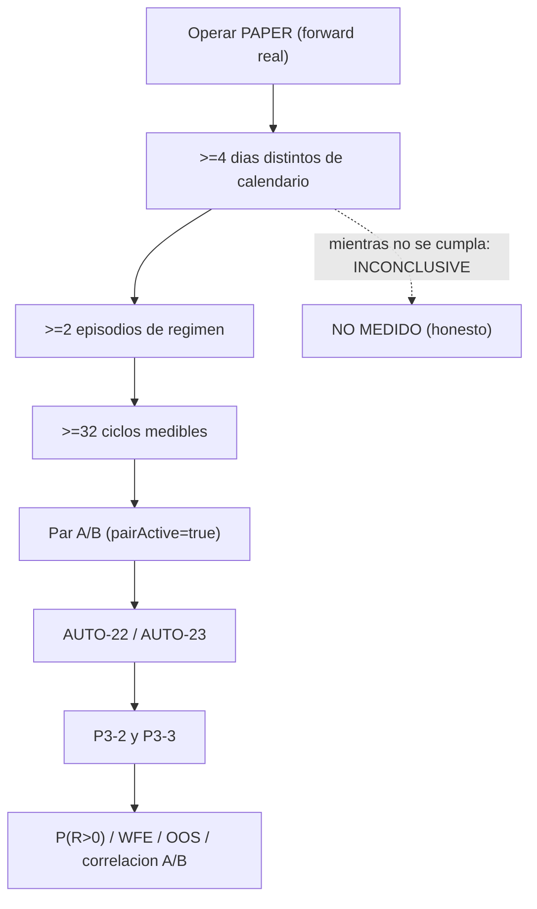

# Runbook — ventana forward `≥4 días` (operación del propietario)

> **AsOf:** 2026-09-27 · **Objeto:** obtener el primer dataset PAPER **forward** con **diversidad de
> mercado** (≥4 cubos de calendario compartidos y ≥2 episodios de régimen) para cerrar `P3-2`/`P3-3`.
> **Herramienta:** `v2_76_forward_market_material.py` (AUTO-MATERIAL-4) + journal de operabilidad
> `v2_77_market_operability.py` (AUTO-MATERIAL-5) + **capturador de la ventana**
> `v2_80_market_window.py` (AUTO-MATERIAL-8, read-only sobre el journal **durable**; ampliado en
> AUTO-MATERIAL-9/**v2.81** con `--forward` y `--html` y el **funnel de operabilidad**) + la
> **auditoría read-only** `v2_83_window_audit.py` (AUTO-MATERIAL-11/**v2.83**: fila `TOTAL` agregada y
> **tasas** de operabilidad, §9). En
> `v2.82` (`AUTO-MATERIAL-10`) esta ventana se formaliza como **fase OPERATIVA** (docs-only: ver §8).
> **Regla dura:** esto es **operación**, no una fase de código. **No** se bajan umbrales, **no** se
> fuerza el régimen, **no** se backdatea nada.

## 0. Re-anclaje al árbol congelado `v2.88.29-beta` (2026-10-02)

El pin de la ventana se **re-ancla** al sello vigente (head `048_journal_entry_dedupe_key`; ver
[arranque operativo §0](./arranque-ventana-paper-operativa-2026-09-27.md)). Identidad fija y
configuración **sin cambios** de motor:

| Dato | Valor |
|---|---|
| Árbol de **código** congelado | `apps` = `25afb7282e11240c19c63f85f82273ea3b1440f4` · `packages` = `ce0a38b7e6f5a9f102490e5774f859d7f83aac4a` (commit `2b67a2fa`, tag `v2.88.29-beta`) |
| `$ACCOUNT` / `$VERSION_A` / `$VERSION_B` | `1484e253d2d54645945a6b1d7` / `v283-window-a` / `v283-window-b` |
| Watch | **20** símbolos (derivación determinista por `id`, ≥60 barras D1) |
| Variables de operación | `AUTO_ENGINE_SIM_REAL_PRICE=1` y `AUTO_OPERATIONAL_AUDIT=1` en el entorno del forward |

Los comandos de §3/§3.1 se ejecutan con esas variables en el entorno del proceso. **Ningún** cambio
de motor, `TOP_N`, gobernador, umbrales ni pesos A/B.

> **Estado del bloqueante (2026-10-02, ver arranque §0.1/§0.2).** El `watch` (20), la versión B, la
> promoción y los `EdgeReport` **verifican**, y la **fila de cuenta** `1484e253d2d54645945a6b1d7`
> fue **re-sembrada** con el mismo id (operación autorizada) ⇒ identidad **completa**. Lo que queda
> es **mercado**: hoy el preflight da `BEAR_TREND` (LONG vetadas) ⇒ día **no computable**; la ventana
> exige **≥4 días reales distintos** con material, así que avanza solo en días futuros sin veto.

## 1. Preflight real de hoy (2026-09-27) — hecho y declarado

```bash
uv run --no-sync python apps/api-python/scripts/v2_76_forward_market_material.py --preflight-only --watch-size 20
# exit 2  ·  {'range': 8, 'trend_down': 9, 'trend_up': 3}  ⇒  agregado trend_down  ⇒  BEAR_TREND
#           ⇒  entriesAllowedLong=False  ⇒  todas las entradas LONG vetadas por regime_invalid
```

**Lectura honesta.** El mercado de **hoy** veta todo el universo LONG con el **agregado más
conservador** (un solo `trend_down` empuja el eje a `BEAR_TREND`). **No** se fuerza
`AUTO_ENGINE_SIM_V2_REGIME`: eso convertiría el material en guionizado y repetiría el defecto que
`v2.76` vino a cerrar. La ventana se corre **cuando el mercado lo permita**, y su veredicto correcto
mientras no lo permita es **`INCONCLUSIVE` / `NO MEDIDO`**.

## 2. Brechas de entorno a resolver ANTES del día 1

| # | Brecha | Por qué importa | Cómo se resuelve |
|---|---|---|---|
| 1 | **No hay estrategia ACTIVE** sobre la cuenta de la ventana (`versionB=""`, `pairActive=false`) | sin B, el par A/B no opera y el material no gana diversidad por estrategia | promover una estrategia **ACTIVE** + su `EdgeReport` sobre la cuenta; verificar `pairActive=true` |
| 2 | **`--account-id` no fijado** | sin fijarlo, **cada corrida siembra una cuenta nueva** y el journal no acumula (el dedupe del journal es por `(day, account)`) | fijar `--account-id <uuid>` **desde el día 2** (y reusar `--version-a` del día 1) |

> **Resuelto (2026-09-27) — `AUTO-MATERIAL-12` (operación).** Las brechas 1 y 2 quedan **cerradas por
> semilla operativa** antes de D1: cuenta **dedicada y fija** `1484e253d2d54645945a6b1d7`,
> `$VERSION_A = v283-window-a`, y estrategia B **ACTIVE sembrada** (`v283-window-b`) para
> `pairActive=true`. **Declaración:** la B es una **semilla operativa NO gate-certificada**
> (`shadow_validated=false`, `reasons=["semilla_operativa_ventana_no_gate_certificada"]`): habilita el
> par y su medición, **no** certifica gates ni cierra `P3-3`. Detalle, verificación y reglas duras en
> [arranque operativo de la ventana PAPER](./arranque-ventana-paper-operativa-2026-09-27.md). Las
> brechas **3** (scheduler de barras) y **4** (glob distinguible) siguen vigentes tal cual.
| 3 | **Scheduler de barras** | el régimen y el ATR salen de `ohlcv_bars` **reales**; sin barras frescas el preflight cae en `UNKNOWN` | mantener vivo `SyncInstrumentDailyBars` / `auto_sync_worker` (corren dentro del proceso API) |
| 4 | **Glob de corridas reales distinguible** | en `operability_runs/` ya hay **fixtures**; no hay que borrarlos ni mezclarlos | usar el glob `operability_runs/forward-market-*.json` para las corridas **reales** |

### 2.1 Cuenta PAPER fija (deuda operativa; resolverla ANTES de D1)

> **Resuelto (2026-09-27):** el `.env` local ya fija la cuenta dedicada de la ventana
> (`PAPER_D_ACCOUNT_ID=1484e253d2d54645945a6b1d7`, ver
> [arranque operativo](./arranque-ventana-paper-operativa-2026-09-27.md)). Lo que sigue es el
> procedimiento general, conservado como referencia.

`PAPER_D_ACCOUNT_ID` está **comentado** en `.env` (línea `# PAPER_D_ACCOUNT_ID=`), así que hoy **no** hay
cuenta fija: cada corrida puede sembrar una cuenta nueva y el journal no acumula (el dedupe es por
`(day, account)`). Sin cuenta fija, `pairActive` y la **continuidad** de la ventana **no son verificables**,
y el material de D1..D4 **no** sería comparable. **El valor del UUID es operación del propietario: no se
inventa.**

Procedimiento (operación del propietario, una sola vez antes de D1):

1. Elegir la **cuenta DEMO** de la ventana (UUID real existente en el entorno DEMO).
2. Descomentar y fijar en `.env`: `PAPER_D_ACCOUNT_ID=<uuid-cuenta-demo>` (gate fail-closed **A5** de
   [`paper_d_propose.py`](../../packages/py/application/src/bolsa_application/paper_d_propose.py): si está
   set, `execute=true` solo se permite sobre **esa** cuenta).
3. Reiniciar el API (`node scripts/dev-api-python.mjs`) para que el proceso relea el `.env`.
4. Verificar que **el mismo** UUID se usa como `--account-id` en el forward (`v2_76_…`), en el capturador
   (`v2_80_market_window.py`) y en la auditoría (`v2_83_window_audit.py`, vía `--window`).

**Regla dura:** `$ACCOUNT` **constante** en D1..D4. Un cambio de cuenta intermedio (D1 = cuenta A,
D2 = cuenta B) rompe la comparabilidad e **invalida** la ventana; se declara, no se «arregla» sumando.

**Par A/B (`pairActive=true`):** exige una estrategia B **ACTIVE** con su `EdgeReport` sobre la **misma**
cuenta. Sin eso, el símbolo `Par` queda `CAPAZ` sin `ACTIVO` y la auditoría emite `pair_not_active`/`n/d`:
no se certifica A/B en la ventana real.

### 2.2 Pin de cuenta y versión (D1..D4)

| Día | `$ACCOUNT` | `$VERSION_A` | Resultado esperado en el journal |
|---|---|---|---|
| D1 | `fijo` (mismo UUID) | **se captura** en D1 | primera fila `(day, account, versionA)` |
| D2 | **reusar** el de D1 | **reusar** el de D1 | acumula sin sembrar cuenta nueva |
| D3 | **reusar** el de D1 | **reusar** el de D1 | acumula |
| D4 | **reusar** el de D1 | **reusar** el de D1 | ventana leíble (`window_gate`) |

## 3. Cadencia diaria (una vez por día de mercado)

```bash
# 0) Barras: deja que el scheduler del API corra (o sincroniza) — el régimen sale de barras reales.

# 1) Preflight (read-only, no escribe):
uv run --no-sync python apps/api-python/scripts/v2_76_forward_market_material.py \
    --preflight-only --watch-size 20
#    exit 0 ⇒ el universo admite LONG hoy; exit 2 ⇒ veta (BEAR_TREND/UNKNOWN). Si veta, DECLARA y no fuerces.

# 2) Forward del día (reloj REAL; los cubos salen de created_at = now):
uv run --no-sync python apps/api-python/scripts/v2_76_forward_market_material.py \
    --account-id "$ACCOUNT" --version-a "$VERSION_A" \
    --interval-seconds 60 --max-ticks 400 --stop-when-ready --level evidence \
    --json --out "operability_runs/forward-market-$(date +%Y%m%d).json"

# 3) Journal de operabilidad (publica la tabla diaria + el desglose por familia):
uv run --no-sync python apps/api-python/scripts/v2_77_market_operability.py \
    --forward "operability_runs/forward-market-$(date +%Y%m%d).json" --render

# 4) Serie diaria de la VENTANA desde el journal DURABLE (read-only, AUTO-MATERIAL-8).
#    Reutiliza el mismo censo (entrada vs posicion) y el mismo R que el informe; declara
#    los huecos (None/UNKNOWN) y el gate honesto (>=4 dias / >=2 episodios / >=32 ciclos).
#    `--forward` (OPCIONAL, read-only) enriquece el FUNNEL con universo/dato/regimen/ordenes
#    y el par A/B; `--html` escribe el artefacto `operability-window.html` (v2.81):
$env:BROKER_VENUE="paper"
uv run --no-sync python apps/api-python/scripts/v2_80_market_window.py \
    --account-id "$ACCOUNT" --strategy-version "$VERSION_A" --days 4 --render \
    --forward 'operability_runs/forward-market-*.json' \
    --out "operability_runs/operability-window.json" \
    --html "operability_runs/operability-window.html"

# 5) AUDITORIA de la ventana (read-only, AUTO-MATERIAL-11/v2.83): fila TOTAL acumulada + tasas
#    de operabilidad (topN/riesgo/reserva/fill/ciclo/unresolved) + AVISOS. No abre el motor ni
#    PostgreSQL y NO escribe en el journal durable ni en evidence_runs/evidence_validations:
uv run --no-sync python apps/api-python/scripts/v2_83_window_audit.py \
    --window "operability_runs/operability-window.json" \
    --forward 'operability_runs/forward-market-*.json' --render \
    --out "operability_runs/operability-audit.json"
```

Repite 1–4 **cada día de mercado**. El journal de la sonda del runner
(`operability_runs/journal.jsonl`) y el de la **ventana** (`operability_runs/window.jsonl`, ambos **no
versionados**) acumulan filas; el capturador **siempre** relee el journal **durable** (`--days`/`--since`,
sin `--forward`) y anexa a `window.jsonl` las filas nuevas por `día+cuenta+versiones` (sin duplicar), así
que `--render --days 4` re-imprime la serie completa de la ventana. La cabecera del
capturador declara `exit 0` con ≥1 día y `exit 2` sin material legible; avisa por `stderr`
(`# ALERTA CONTRATO …`) si algún día tiene `other>0`.

### 3.1 Variante PowerShell (Windows)

El shell de este entorno es **PowerShell**: `$(date +%Y%m%d)` (bash) **no** existe. Usa la fecha nativa y
fija las variables una sola vez (reusadas D1..D4):

```powershell
$env:BROKER_VENUE = "paper"
$ACCOUNT   = "<uuid-cuenta-demo>"      # FIJO D1..D4 (misma cuenta; ver 2.1)
$VERSION_A = "<version-a-de-D1>"       # capturada en D1 y REUSADA D2..D4
$DIA       = Get-Date -Format "yyyyMMdd"

# 1) Preflight (read-only)
uv run --no-sync python apps/api-python/scripts/v2_76_forward_market_material.py --preflight-only --watch-size 20

# 2) Forward del dia
uv run --no-sync python apps/api-python/scripts/v2_76_forward_market_material.py `
    --account-id "$ACCOUNT" --version-a "$VERSION_A" `
    --interval-seconds 60 --max-ticks 400 --stop-when-ready --level evidence `
    --json --out "operability_runs/forward-market-$DIA.json"

# 4) Ventana (serie + funnel + HTML) y 5) AUDITORIA (TOTAL + tasas + avisos)
uv run --no-sync python apps/api-python/scripts/v2_80_market_window.py `
    --account-id "$ACCOUNT" --strategy-version "$VERSION_A" --days 4 --render `
    --forward 'operability_runs/forward-market-*.json' `
    --out "operability_runs/operability-window.json" `
    --html "operability_runs/operability-window.html"
uv run --no-sync python apps/api-python/scripts/v2_83_window_audit.py `
    --window "operability_runs/operability-window.json" `
    --forward 'operability_runs/forward-market-*.json' --render `
    --out "operability_runs/operability-audit.json"
```

### 3.2 Checklist D1..D4 y cierre

| Día | [ ] Preflight | [ ] Forward (`--account-id` **fijo**) | [ ] Ventana `--days 4` | [ ] Auditoría `v2_83` | Nota del día |
|---|---|---|---|---|---|
| D1 | `exit 0/2` declarado | `$VERSION_A` **capturada** | serie D1 | `TOTAL`/tasas | primera fila `(day, account, versionA)` |
| D2 | idem | **reusa** cuenta y versión | serie D1..D2 | idem | régimen puede seguir `BEAR_TREND` |
| D3 | idem | idem | serie D1..D3 | idem | vigilar `otherCount` (H-4 visible) |
| D4 | idem | idem | serie D1..D4 | `window_gate` | `READY` solo con ≥4 días / ≥2 episodios / ≥32 ciclos |

### 3.3 Automatización opcional (`window-forward-runner.mjs`)

Wrapper Node que encadena el pipeline de §3 con **artefactos por día**, ledger acumulado y freeze
del árbol de código. **Ops-only**: no cambia motor, gobernador, `TOP_N`, umbrales, allocation,
pesos A/B ni migraciones.

```powershell
pnpm window:preflight                   # solo sonda read-only (v2_76 --preflight-only)
pnpm window:run-day                     # día completo: preflight -> forward -> v2_77 -> v2_80 -> v2_83
pnpm window:run-day -- --force          # re-ejecuta un día ya terminal
pnpm window:status                      # días registrados + gate (>=4 días / >=2 episodios / >=32 ciclos)
pnpm window:unlock                      # elimina el lock del día (si quedó huérfano)
pnpm window:test                        # regresiones puras del runner (lock/config/provenance)
pnpm window:task:install -- --at 18:00  # registra la tarea diaria de Windows (opcional, schtasks)
pnpm window:task:remove
```

- **Lock diario (2.11.31).** `run-day` crea `operability_runs/window-runs/<DIA>/.run.lock/` con `mkdir`
  (operación indivisible) **antes** de la idempotencia y del freeze, y lo libera en un `try/finally`. Un
  segundo run del mismo día aborta con `RUN_ALREADY_IN_PROGRESS` (exit `1`). Un `--force` **no** salta un
  lock vivo: sólo reclama un lock huérfano con PID muerto en este host (automático) o de otro host/TTL
  superado (12 h, con `--force`). Si un lock quedara huérfano sin PID verificable: `pnpm window:unlock`.
- **Veto de régimen**: si el preflight vetea LONG (`BEAR_TREND`), el día se registra como
  `NO_MEDIDO_REGIMEN` y **no** se lanza el forward (regla dura §1/§5). Un `exit 2` **sin** payload
  de preflight se trata como fallo duro, nunca como veto.
- **Freeze**: el runner aborta con `TREE_MOVED` si `git rev-parse "HEAD:apps" "HEAD:packages"` no
  coincide con los hashes pinneados (§0): la ventana no mezcla dos árboles de código. La config es
  **inmutable por defecto**: `WINDOW_APPS_HASH`/`WINDOW_PACKAGES_HASH`/`WINDOW_ACCOUNT`/`WINDOW_VERSION_A`/
  `WINDOW_VERSION_B`/`WINDOW_WATCH_SIZE` **se ignoran** salvo `--unsafe-override-window-config` (que sella
  `CONFIG_OVERRIDE = UNSAFE` y **invalida** el gate de esos días).
- **Gate con provenance (2.11.31).** `window:status` **no** pinta el `operability-window.json` canónico:
  deriva el gate del `window.json` del run y lo liga al ledger (día/cuenta/versión + freeze + `sha256` +
  cabecera). Si no liga, imprime `STALE` (hubo días medidos pero sin provenance válida) o `NO_MEDIDO`
  (sin días medidos), **nunca** un `4/2/32` heredado de otra ejecución.
- **Artefactos** (gitignored): `operability_runs/window-runs/<YYYYMMDD>/` (manifest + logs +
  preflight/forward/window/audit + `.run.lock/` mientras corre + `windowProvenance`) y
  `operability_runs/window-runs/ledger.jsonl`.
- **Higiene de entorno**: `AUTO_ENGINE_SIM_REAL_PRICE=1`, `AUTO_OPERATIONAL_AUDIT=1` y
  `BROKER_VENUE=paper` se inyectan **solo** en el `env` del proceso hijo; el shell del operador no
  se contamina (evita el falso rojo de las suites PG del §5).
- **Intérprete**: usa `uv run --no-sync python`; si `uv` no puede lanzar `python` (bloqueo de
  Application Control), cae a `python` directo con un aviso. Override explícito: `WINDOW_PY=python`.

**Lectura honesta al cerrar.** Si el preflight sigue en `BEAR_TREND` (LONG vetadas), la ventana puede dar
**0 oportunidades por veto de régimen legítimo**: se **declara** (`regime_invalid`), **no** se fuerza el
gobernador ni se elige otro watch. El veredicto correcto sin material suficiente sigue siendo
**`INCONCLUSIVE` / `NO MEDIDO`**, y `P3-2`/`P3-3`/`H-4` **no** se cierran por documentación.

## 4. Cuándo se puede leer el material (gate de evidencia)

Solo cuando el forward haya producido:

- **≥4 cubos de calendario compartidos** (`sharedSingleCycleShare` < 1) **y** **≥2 episodios** de
  régimen (`min_episodes`), con `min_cycles ≥ 32` ciclos medibles.

```bash
uv run --no-sync python apps/api-python/scripts/auto_evidence_run.py            # genera la evidencia
uv run --no-sync python apps/api-python/scripts/auto_evidence_validate.py       # valida correlación por cubos y P(R>0) vs N
```

**No** se corren con material degenerado (un solo cubo o un solo episodio): darían `INCONCLUSIVE`
fabricado. Mientras no se cumpla el gate, el veredicto honesto es **`NO MEDIDO`**.

## 5. Reglas duras (no negociables)

- **No** bajar `min cycles` / `min R` / `folds` / `min_is` / `min_oos` / `min_episodes`.
- **No** forzar `AUTO_ENGINE_SIM_V2_REGIME`.
- **No** backdatear `created_at` (los cubos salen del instante **durable** del fill).
- **No** sobrescribir `evidence_runs/` ni `evidence_validations/`.
- **Forward, no replay.**
- **No** borrar los fixtures de `operability_runs/`.
- Veredicto honesto: `INCONCLUSIVE` / `NO MEDIDO` si el material sigue degenerado.
- **Higiene de entorno (2026-10-02).** Los flags de **operación** (`AUTO_ENGINE_SIM_REAL_PRICE=1`,
  `AUTO_OPERATIONAL_AUDIT=1`, `BROKER_VENUE=paper`) **no** deben quedar exportados en el mismo shell
  con el que luego se corren las suites PG de proceso
  (`test_golden_day_v2_process_pg.py`, `test_crash_recovery_day_process_pg.py`,
  `test_concurrent_auto_pg.py`). El proceso hijodal los **hereda** (`os.environ.copy()`), y con
  `AUTO_ENGINE_SIM_REAL_PRICE=1` los días que **no** siembran barras caen en *precio AUSENTE* ⇒
  `HOLD fail-closed` ⇒ el test falla por «no abrir posición» (falso rojo). Los tests ya fijan lo que
  necesitan; el shell debe aportar sólo `PYTHONPATH` y los gates `*_PG_REQUIRED=1`. Al terminar una
  tanda de operación, **`Remove-Item Env:AUTO_ENGINE_SIM_REAL_PRICE, Env:AUTO_OPERATIONAL_AUDIT, Env:BROKER_VENUE`**.

## 6. Qué mirar cada día en la tabla de operabilidad

| Columna / clave | Lectura |
|---|---|
| `Regimen` / `Long` | hecho de mercado: si `BEAR_TREND` y `Long=NO`, el bloqueo es de régimen |
| `SimbOper` (`k/N`) | cuántos símbolos admitirían LONG **por sí mismos** (la tensión del gobernador conservador) |
| `Veto` vs `vetoCounted` | deben **cuadrar**; `vetoCounted` suma familias (incl. `other`) |
| `Vetos por familia` | reparto `regime`/`governor`/`liquidity`/`risk`/`top_n`/`data`/`other` |
| `aprobaciones/salidas` | atribuciones **no** vetos (`approved`, `risk_exit`, …) |
| `eventos/posicion` | motivos de **gestión de posición** (`protect_requested`, `atr_geometry`, …): **no** son vetos |
| `otherCount` / `ALERTA CONTRATO` | `other>0` ⇒ **violación de contrato** (**AVISO**, no fallo): un motivo sin familia declarada; revisar alta de reason code |
| `Cobertura` (`declared/observed/unknown`) | prueba que `other==0` **no** es accidental; `unknown>0` nombra el hueco (hoy `H-4`: los `signal_*` pre-ranqueo) |
| `Par` (`CAPAZ`/`ACTIVO`) | `CAPAZ` sin `ACTIVO` ⇒ falta la estrategia B (brecha 1) |
| `Funnel` (v2.81) | `universe → marketData → regimeAllowed → signals → topN → risk → reservation → orders → fills → cycles`: localiza el ESCALÓN donde se pierde la oportunidad; `n/d` = **no medido** (sin `--forward` los superiores no se pueden afirmar), nunca `0` |
| `unresolved_age` (v2.81) | permanencia de las propuestas (`lt1m`/`1to5m`/`5to20m`/`gt20m`): `gt20m` frecuente delata un problema de **integración**, no de mercado |
| `TOTAL` acumulado (v2.83) | suma **sólo** los días **medidos** y publica `coverage[*].partial`: un hueco **no** se suma como `0`; un `TOTAL` sobre días incompletos se ve como incompleto |
| `Tasas` (v2.83) | `topNExclusionRate` · `riskRejectionRate` · `reservationFailureRate` · `fillRate` · `cycleRate` · `unresolvedRate`: cada una con `numerator`/`denominator`/`coveredDays`/`source`; `n/d` (None) si no hay días medidos o el denominador es `0` — **nunca** `0.0` |

## 7. Entregable

Cuando se cumpla el gate de §4, el material y su lectura son la entrada para cerrar `P3-2`/`P3-3`
(ver [`deuda-p3-post-auditoria-v2.70-2026-09-26.md`](./deuda-p3-post-auditoria-v2.70-2026-09-26.md)).
Si la ventana no se puede correr, se **declara** y las dos deudas siguen **abiertas**: no se cierran
con un material degenerado.

## 8. Escalera de éxito de `v2.82` (`AUTO-MATERIAL-10`, fase operativa)

`v2.82` **formaliza esta ventana como fase operativa** (docs-only: no cambia motor, gobernador, `TOP_N`,
umbrales, allocation, pesos ni A/B). La escalera se recorre **en orden** y **no se salta ningún peldaño**:
si falta cualquiera de los tres primeros, el veredicto honesto es **`INCONCLUSIVE` / `NO MEDIDO`**.



### 8.1 Lectura por día (`D1..Dn`) — sin mezclar `0` real con `n/d`

- `D1, D2, D3, D4, …` se leen de la serie diaria (`--render`) y del informe (`--html`): cada día publica
  `ENTRY`, `VETOS`, `FILLS`, `CYCLES`, `R`, `Par`, `Precio` y su `Estado`.
- **Funnel por día:** `universe → marketData → regimeAllowed → signals → topN → risk → reservation →
  orders → fills → cycles`. Cada caída localiza el **escalón** del cuello de botella:
  - `universe` alto + `regimeAllowed` bajo ⇒ **mercado/gobernador** (no tocar `TOP_N`).
  - `signals` alto + `topN` bajo ⇒ tope de **evaluación** (`TOP_N`), no de mercado.
  - `signals`/`topN` altos + `risk` bajo ⇒ **riesgo/plan**.
  - `reservation`/`orders` altos + `fills` bajo ⇒ **ejecución/mercado**.
- **`unresolved_age`:** `gt20m` frecuente delata un problema de **integración**, no de mercado.
- **Huecos:** `n/d` = **no medido** (`None`), **nunca** `0`. Sin `--forward`, los escalones superiores se
  declaran `n/d` (correcto, no un defecto).
- **Después de los días:** el `TOTAL` se lee **sin** sumar huecos como ceros; sólo los días **medidos**
  cuentan para el gate (§4). Desde `v2.83` el `TOTAL` y las **tasas** los publica la herramienta
  `v2_83_window_audit.py` (§9) — no se calculan a mano.

### 8.2 Qué NO se hace durante la ventana

- **No** se cambia `TOP_N`, el gobernador, los umbrales, la allocation, los pesos ni la lógica A/B
  (recomendación de la auditoría de `v2.81`: medir, no alterar para producir más operaciones).
- **No** se cierra `H-4` por anticipado: `otherCount == 0` durante toda la ventana ⇒ deuda **preventiva**;
  `otherCount > 0` ⇒ catalogar los `signal_*` **antes** de cerrar la fase estadística.
- **No** se implementa `resolutionJoined` (mejora futura, con datos que la justifiquen). La fila `TOTAL`
  ya está implementada desde `v2.83`, pero **read-only** y **sin** decidir nada (§9).

## 9. Auditoría read-only de la ventana (`v2.83` / `AUTO-MATERIAL-11`)

`v2.83` añade el instrumento de **lectura acumulada** de la ventana: un módulo **puro**
(`bolsa_application/operability_audit.py`, sin I/O ni reloj) y un **CLI read-only**
(`apps/api-python/scripts/v2_83_window_audit.py`). **No** abre PostgreSQL, **no** toca el motor, **no**
recalcula el gate ni los umbrales y **no** escribe en el journal durable, `evidence_runs/` ni
`evidence_validations/`.

```bash
uv run --no-sync python apps/api-python/scripts/v2_83_window_audit.py \
    --window operability_runs/operability-window.json --render \
    --forward 'operability_runs/forward-market-*.json' \
    --out operability_runs/operability-audit.json
```

Publica la tabla `D1..Dn` + **`TOTAL`** + funnel agregado + **tasas** + `AVISOS` (`reason_contract`,
`price_missing`, `pair_not_active`, `pair_unmeasured`). Reglas:

- Las tasas se **derivan del funnel** (una sola aritmética) y llevan `numerator`/`denominator`/
  `coveredDays`/`source`; `rate=None` si no hay días medidos o el denominador es `0` (**nunca** `0.0`).
- `--forward` es **opcional** y **sólo** rellena los huecos **declarados** (`orders`/`pairActive`):
  **jamás** sobrescribe lo medido.
- Códigos: `0` con ≥1 día · `2` sin material legible · `1` uso incorrecto.
- **No sustituye** al gate: el veredicto de la ventana sigue siendo `READY`/`INCONCLUSIVE` por
  `window_gate` (≥4 días, ≥2 episodios, ≥32 ciclos).
