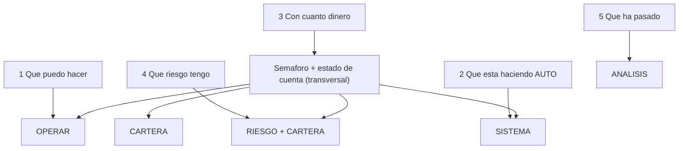

# Spec — AUTO COCKPIT para usuario básico (1.0)

> **AsOf:** 2026-10-05 · **Estado:** **DISEÑO CONGELADO** (no es código).
> **Padre:** [ADR-044](../adr/044-auto-workspace-information-architecture.md) · [AUTO UI SEMANTIC MODEL 1.0](./spec-auto-ui-semantic-model-1-2026-10-05.md) · [AUTO UI REFACTOR 2.0](./spec-auto-ui-refactor-2-0-2026-10-05.md) · [auditoría UI AUTO para usuario básico](./auditoria-ui-auto-cockpit-2026-10-05.md).
> **Naturaleza:** UI / producto. **`Δ AUTO decision/execution motor = 0`**, sin cambio de contrato HTTP en las fases UI-only, sin migración Alembic.
> **Regla de compatibilidad:** mientras el cockpit y el modelo semántico 1.0 discrepen, **manda el modelo**. El cockpit se ajusta al modelo, no al revés.

Este documento **congela el diseño del cockpit operativo de AUTO para un usuario sin conocimientos de trading**, tomando los hallazgos de la auditoría como entradas. **No** sustituye pantallas, **no** toca el motor y **no** re-mide nada.

---

## 0. Propósito y alcance

- **Congela:** el **modelo de realidad** (dinero virtual vs real) como principio visual de primer nivel; el mapa de las **5 preguntas del usuario básico** a las 5 secciones de AUTO; la **identidad de operación legible**; el **glosario** de traducción de jerga; y el **plan por fases** del cockpit.
- **NO congela (fuera de este slice):** la implementación; el contrato HTTP `cycleId` de la explicación DÍA-D (§7, requiere backend; **cerrado** por `v2.88.60`); `PortfolioDecision` durable; PIT histórico institucional; Execution Analysis.
- **Regla de oro:** «resumen operativo arriba, causalidad técnica bajo demanda» — el usuario avanzado/auditor conserva acceso al detalle, pero **no** tiene que atravesarlo para operar.

---

## 1. Principios duros (heredados, no negociables)

| # | Principio | Por qué |
| --- | --- | --- |
| **1** | **No re-derivar.** La UI copia hechos ya producidos; no recalcula PnL, riesgo, fills ni MAE/MFE. | Un segundo cálculo es una segunda verdad. |
| **2** | **`UNKNOWN ≠ 0`.** Un hueco se rotula `NO MEDIDO`/`PARCIAL`; nunca se rellena con `0`. | Evita afirmar lo que no se sabe. |
| **3** | **Una operación = una historia.** Un `cycleId`, una secuencia ordenada de etapas. | Se depura *un* ciclo. |
| **4** | **Hecho ≠ contexto.** Lo que la operación hizo y lo que la originó son bloques distintos. | «¿Por qué existe?» no se responde con un hueco. |
| **5** | **Read-only y puro.** El view-model no ejecuta, no escribe y es determinista. | Auditable y reproducible. |
| **6** | **Resumen operativo arriba, causalidad técnica bajo demanda.** | La superficie principal dice *qué pasó*; el detalle dice *por qué*. |

**Añadido de este cockpit (no contradice los anteriores):**

| # | Principio | Por qué |
| --- | --- | --- |
| **7** | **La realidad monetaria es de primer nivel.** Estado de cuenta y de dinero (virtual/real, broker) visibles en toda superficie de operativa, sin entrar en Sistema. | Para el usuario, «¿está jugando con dinero real?» se responde en 1 s. |
| **8** | **La jerga es deuda de diseño.** Todo término interno se traduce o se pliega; el vocabulario técnico solo aparece en el detalle experto. | Un no experto no debe aprender arquitectura para operar. |
| **9** | **Toda ausencia tiene estado propio.** Cargando, error, vacío y `NO MEDIDO` se distinguen entre sí. | Un fallo de red no se disfraza de «sin operaciones». |

---

## 2. Modelo de realidad (semáforo de primer nivel)

### 2.1 La regla

Toda superficie de operativa de AUTO muestra, en primer nivel, un **semáforo de realidad**:

```
VERDE  · DINERO VIRTUAL · AUTO DEMO
         Operativa automática con dinero simulado.
         No envía órdenes a XTB ni usa dinero real.
```

Y, si algún día existe LIVE:

```
ROJO   · DINERO REAL · XTB
```

**Hoy AUTO es siempre DEMO virtual** (ver [auditoría §2](./auditoria-ui-auto-cockpit-2026-10-05.md) e [invariante paper virtual](./invariante-paper-virtual-2026-09-25.md)); el semáforo ROJO es de diseño futuro y **no se implementa ahora**.

### 2.2 Modos y dinero

| Modo | Dinero | Broker | Para quién |
| --- | --- | --- | --- |
| MANUAL DEMO | Virtual | Ninguno | Aprender |
| SEMI DEMO | Virtual | Ninguno | Aprender + decidir |
| **AUTO DEMO** | **Virtual** | **Ninguno** | **Automatización (hoy)** |
| LIVE XTB | Real | XTB | Avanzado / futuro (**bloqueado**) |

Los dos mundos **no se mezclan visualmente**: DEMO con semáforo verde; LIVE (futuro) con semáforo rojo.

### 2.3 Fuente única

El semáforo **no re-deriva** realidad: la toma de las fuentes ya existentes — `paper-auto-posture` ([paper-auto-posture.ts](../../packages/shared/src/cognitive/paper-auto-posture.ts)) y el tipo/venue de la cuenta activa ([use-active-account.ts](../../apps/web/src/features/accounts/use-active-account.ts) L135-L136, [account-venue-preference.tsx](../../apps/web/src/features/accounts/account-venue-preference.tsx) L64-L69). Un dato ausente se declara (`NO MEDIDO`), nunca se asume.

### 2.4 Panel de estado básico

Bajo el semáforo, un bloque plano responde «con cuánto dinero» (pregunta 3):

```
CUENTA          Demo
DINERO REAL     No
BROKER          No opera con XTB
CAPITAL         20.000 €
OPERACIONES     4 / 10
AUTO            Activo / Inactivo
```

---

## 3. Las 5 preguntas → las 5 secciones



| Pregunta | Superficie primaria | Respuesta de primer nivel |
| --- | --- | --- |
| 1 ¿Qué puedo hacer? | OPERAR | Oportunidades + operaciones, con acción clara |
| 2 ¿Qué está haciendo AUTO? | SISTEMA | Activo/Inactivo + última/next decisión en lenguaje llano |
| 3 ¿Con cuánto dinero? | Semáforo + estado de cuenta | Virtual/real, broker, capital, posiciones |
| 4 ¿Qué riesgo tengo? | RIESGO / CARTERA | Riesgo abierto y límites en cifras legibles |
| 5 ¿Qué ha pasado? | ANÁLISIS | DÍA-D, evidencia, estrategias, investigación |

**Criterio de admisión:** toda superficie debe responder **una** de las cinco preguntas en su primer nivel; el detalle experto queda **debajo**.

---

## 4. Identidad de operación legible

**Problema (F-O1):** la lista de OPERAR muestra `instrumentId` y deja operaciones indistinguibles.

**Contrato de presentación (UI-only, no toca datos):** la identidad visible de una operación es un compuesto **legible**, mínimo:

```text
instrumento · día de entrada · dirección · estado
```

Ejemplos:

```
AAPL · 03 Oct · LONG · Abierta
AAPL · 04 Oct · LONG · Cerrada
AAPL · 05 Oct · EXIT · Cerrada
```

- El **`cycleId`** sigue siendo la clave de navegación (`href` canónico, ya correcto) y se conserva en el **detalle técnico** (`data-cycle-id`).
- El **día de entrada** se copia del sello temporal de la SEÑAL (ya disponible en la historia, `entryDay`).
- La **dirección** y el **estado** se toman de los campos ya expuestos (`direction`, `closed`/`closedMeasurement`).
- Un campo no medido se declara `NO MEDIDO`; **no** se inventa ni se rellena.

---

## 5. El cockpit OPERAR

**Hoy (F-O1, F-O2):** una lista de enlaces. **Objetivo:** dos bloques que responden «¿qué puedo hacer?».

```
OPERAR
├── OPORTUNIDADES   (contexto: qué propone el sistema y por qué)
│     AAPL   LONG   Lista    +2,1R   →
│     MSFT   LONG   Vigilar  +1,4R   →
│     NVDA   LONG   Bloqueado  —     →
│
└── OPERACIONES     (hechos: identidad legible + resultado)
      AAPL · 03 Oct · LONG · Abierta     +1,82R   OOS
      AAPL · 02 Oct · LONG · Cerrada     -0,40R   NO MEDIDO
```

Reglas no negociables:

- **No se duplica** ninguna superficie L1: Oportunidades **enlaza** a Mesa/Screeners (como hoy) y Operaciones **enlaza** a la operación canónica; el cockpit **compone**, no reimplementa.
- **Oportunidades es contexto** (modelo semántico §4.3): se pinta como bloque de contexto, **nunca** como etapa alcanzada.
- **Estados propios:** `Cargando…`, `No se pudo cargar (error)`, `Sin operaciones en la ventana` (vacío) y `NO MEDIDO` (hueco de dato) son **estados distintos** (principio 9). Corrige F-O3.
- El detalle de cada operación sigue siendo la historia de una sola operación (14 conceptos, con jerga solo en el detalle).

---

## 6. Glosario de traducción (jerga → usuario)

La jerga **no se borra**: se **traduce en el primer nivel** y se conserva en el detalle experto.

| Término interno | Primer nivel (usuario) | Dónde queda el término técnico |
| --- | --- | --- |
| `RESERVATION` / «Reserva» | «Capital apartado para esta operación» | Detalle técnico |
| `ORDER` / `FILL` | «Orden enviada» / «Operación ejecutada» | Detalle técnico |
| `SETTLEMENT` / «Liquidación» | «Resultado de la venta» | Detalle técnico |
| `TOP_N` / «Selección · TOP-N» | «Elegida entre las mejores» | Detalle técnico |
| `CYCLE_CLOSED` | «Operación cerrada» | Detalle técnico |
| `NO MEDIDO` | «Sin dato todavía» (con tono ámbar, honesto) | Se mantiene el rótulo técnico en detalle |
| `cycleId` | (oculto) | Solo en detalle técnico / URL |
| `venue` / `PAPER` | «Cuenta Demo · dinero virtual» | Sistema → Broker (experto) |
| `PAPER_D_EXECUTE` / `arm ≠ execute` | «AUTO puede abrir/cerrar; no usa dinero real» | Sistema → Broker (experto) |

**Regla:** ninguna superficie de primer nivel de AUTO muestra `cycleId`, `TOP_N`, `SETTLEMENT`, `venue`, `PAPER_D_EXECUTE`, `ExecutionRouter`, `OrderIntent`, `F3`/`F4` ni `PIT` sin traducir. Contraste con F-J1.

---

## 7. Contrato `cycleId` de la explicación DÍA-D (fase con backend)

> **CERRADA en `v2.88.60-beta` (fase F5).** Implementada por el commit funcional `71ab00df`: el artefacto `dia-d-feedback-v2` expone el índice `cycles[]` (`cycleId` → identidad del ciclo) y la ruta `/auto/dia-d-feedback` lo proyecta (`DiaDFeedbackCycleDto`); el panel resuelve con `resolveExplanationForCycle(...)` por `cycleId` (si el ciclo figura en el índice) o por instrumento (fallback declarado **PARCIAL**). El veredicto OOS **sigue agregado por instrumento** (`n >= 5`). Ver [evidencia `v2.88.60`](./evidence/v2.88.60/README.md).

**Problema (F-S1):** la explicación se resuelve por `symbol`; dos operaciones del mismo instrumento comparten explicación.

**Objetivo:** resolver por identidad, con la clave primaria `cycleId` y ejes de desambiguación:

```text
cycleId · instrument · strategy · strategyVersion · timeframe · entryDay · regime
```

- La identidad **ya existe** en el view-model (`AutoOperationStoryExplanationIdentity`, [auto-operation-story.ts](../../packages/shared/src/cognitive/auto-operation-story.ts) L120-L128); falta que la **resolución** la use.
- Requiere que el artefacto/proyección DÍA-D exponga clave por `cycleId` y, por tanto, **cambio de contrato HTTP** (`openapi.json`/`schema.d.ts`).
- **Compatibilidad:** mientras no exista la clave, se mantiene el fallback por instrumento y se declara la resolución como parcial (nunca se afirma que la explicación es de *esa* operación si solo se resolvió por símbolo).
- **Fuera de las fases UI-only** de §9: se planifica como fase backend separada.

---

## 8. Reutilización vs duplicación (invariante ADR-044)

- Cartera, Riesgo, Análisis y Sistema **componen** superficies existentes por enlace; el cockpit **no** reimplementa Mesa/Mercado/Consola/Laboratorio/Asesor.
- Se elimina la **duplicación interna** detectada (F-DUP1): la reconciliación se presenta **una vez** dentro de AUTO y las demás secciones **enlazan** a ella.
- AUTO **no** es una sexta puerta L1: sigue accesible desde la `AdminRail` y la command palette ([auto-nav.ts](../../apps/web/src/features/auto/auto-nav.ts), [admin-rail.tsx](../../apps/web/src/components/layout/admin-rail.tsx) L88-L96).
- Un solo `<main>` y un solo `<h1>` por ruta (contrato de ADR-044 §3, ya cumplido).

---

## 9. Plan por fases (aditivo)

| Fase | Contenido | Tipo | Fase de modelo |
| --- | --- | --- | --- |
| **F1** | **Semáforo de realidad** + panel de estado de cuenta (transversal a las 5 secciones); fuente única `paper-auto-posture` + cuenta activa. | UI-only | Cerrada por esta spec |
| **F2** | **Identidad de operación legible** (§4) en OPERAR y selector de la historia. | UI-only | Cerrada por esta spec |
| **F3** | **Cockpit OPERAR**: bloque Oportunidades + Operaciones + estados propios (cargando/error/vacío). | UI-only | Cerrada por esta spec |
| **F4** | **Glosario de primer nivel** (§6) + de-duplicación de reconciliación (F-DUP1) + accesibilidad del tablist DÍA-D (F-A1). | UI-only | Cerrada por esta spec |
| **F5** | **Contrato `cycleId`** de la explicación DÍA-D (§7). | Backend/contrato | **Cerrada** en `v2.88.60` (funcional `71ab00df`) |

Cada fase es **aditiva**: no se borra ninguna pantalla antes de que su sustituto esté verde, y ninguna mueve el motor.

---

## 10. Falsabilidad

| # | Afirmación | Cómo se rompe |
| --- | --- | --- |
| 1 | La realidad DEMO virtual es visible en el primer nivel de toda superficie de operativa de AUTO. | Que una sección de AUTO no muestre el semáforo o exija entrar en Sistema para saberlo. |
| 2 | La identidad visible de una operación distingue dos ciclos del mismo símbolo. | Que dos ciclos del mismo símbolo sigan con texto visible idéntico. |
| 3 | Error, vacío, carga y `NO MEDIDO` son estados distintos. | Que un error de red se pinte como «sin operaciones». |
| 4 | El primer nivel no muestra jerga interna. | Que `cycleId`/`TOP-N`/`SETTLEMENT`/`venue`/`PAPER_D_EXECUTE` aparezcan sin traducir en primer nivel. |
| 5 | El cockpit compone y no duplica superficies L1. | Que Oportunidades/Operaciones reimplemente Mesa/Mercado/Consola en vez de enlazar. |
| 6 | `Δ motor = 0` en F1–F4. | Que el diff toque motor/umbrales, o que `contract:check` no coincida. |
| 7 | La explicación declara resolución por `cycleId` **sólo si el artefacto trae la clave** (`cycles[]`); si no, declara **PARCIAL** por instrumento. | Que la UI afirme resolución por `cycleId` sin fila en el índice, o que se invente la clave en un ciclo sin `cycleId`. |

---

## 11. Límites declarados (NO resuelve esta spec)

- **`PortfolioDecision` durable (`UI52-02`):** abierta (spine/backend). El cockpit puede **declararla** `NO MEDIDO`; no la inventa.
- **Contrato `cycleId` DÍA-D:** **cerrado** en `v2.88.60` (§7, fase backend F5, funcional `71ab00df`).
- **PIT histórico institucional** y **Execution Analysis** (`23 orden_creada_sin_fill`): abiertas (P3).
- **`CONFIRMED` no se emite.**
- **Barrido `axe` real de `/auto/*`:** no ejecutado en la auditoría (F-A2); F4 corrige el tablist DÍA-D, pero la verificación en vivo es de un sello de UI.
- **No** se re-mide DÍA-D: las cifras OOS se heredan y citan.
- **LIVE/XTB:** fuera del cockpit actual; el semáforo ROJO es solo diseño futuro.
