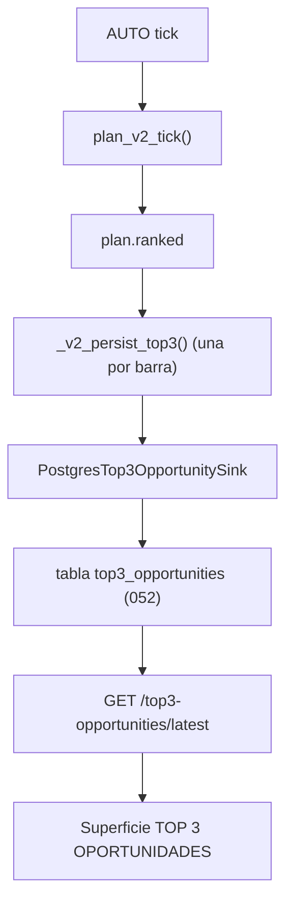
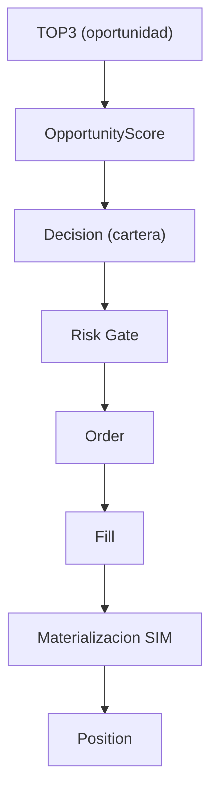

# Spec — AUTO UI definitiva: **TOP 3 OPORTUNIDADES** y la última milla de producto

> **AsOf:** 2026-10-07 · **Estado:** **DISEÑO CONGELADO** (no es código).
> **Padres:** [spec 3.0](./spec-auto-ui-refactor-3-0-2026-10-06.md) · [spec de operación para usuario básico](./spec-auto-operacion-usuario-basico-2026-10-06.md) · [modelo semántico 1.0](./spec-auto-ui-semantic-model-1-2026-10-05.md) · [HOME vacío vs hueco](./spec-auto-home-vacio-hueco-2026-10-06.md) · [ADR-044](./../adr/044-auto-workspace-information-architecture.md).
> **Evidencia de motor:** [`v2.88.84-beta`](./evidence/v2.88.84/README.md) (productor durable del TOP3) · [`v2.88.83-beta`](./evidence/v2.88.83/README.md) (gates `lab_validated`).
> **Auditoría hermana:** [modo MANUAL del libro DEMO](./auditoria-manual-modo-demo-2026-10-07.md).
> **Naturaleza:** UI / producto / semántica. **`Δ AUTO decision/execution motor = 0`**. Sin contrato HTTP nuevo **en este slice de diseño**; sin Alembic.

Este documento cierra la **definición de producto** que las auditorías dejaron abierta: qué es exactamente el TOP3, qué ve un usuario básico, por qué está ese activo ahí, por qué AUTO entra o no, y qué ocurre después de la recomendación. Es la fusión de la semántica ya congelada (spec 3.0, modelo 1.0, usuario básico) con la capacidad nueva del motor: el **TOP3 cross-asset ya tiene productor real** en el runtime AUTO.

---

## 0. Propósito y alcance

**Congela:**

- la **definición final de TOP3**: es **«TOP 3 OPORTUNIDADES»**, nunca «TOP 3 MEJORES ACCIONES»;
- la separación **TOP3 ≠ operación** (escalera explícita) y su traducción a la UI;
- la **anatomía de un slot** del TOP3 (qué campos ve cada nivel de lenguaje);
- los **estados honestos** de la superficie (carga / error / vacío / hueco / degradado);
- dónde vive la superficie dentro de `/auto` y cómo enlaza con la operación.

**NO congela (fuera de este slice):** el motor; el worker; el contrato HTTP; la implementación del consumidor web (fase posterior, §7); `PortfolioDecision` durable; la certificación `axe` (S4).

**Regla de compatibilidad:** mientras este documento y el modelo semántico discrepen sobre qué es un hecho, **manda el modelo**. Este documento manda en la presentación del TOP3.

---

## 1. Definición final de TOP3

> **TOP 3 OPORTUNIDADES** = las tres oportunidades que el motor de decisión **rankeó en ese tick** (`plan.ranked`), no las tres mejores acciones de todo el universo bursátil.

El TOP3 persistido se escribe desde el **ranking real del tick** por [`_v2_persist_top3`](../../apps/api-python/src/bolsa_api/background/auto_simulation_worker.py), una **foto por barra**, y se lee por [`GET /api/v1/top3-opportunities/latest`](../../apps/api-python/src/bolsa_api/api/v1/routes/top3_opportunities.py). Su universo es el **watch universe de AUTO**, no el mercado entero.

Consecuencia de honestidad (la que fija esta spec):

- Si el watch universe tiene 100 activos y en un tick sólo 7 producen candidatos operables, el TOP3 sale de **esos 7**.
- Por tanto la lectura correcta es **«las 3 mejores oportunidades operables ahora»**, no **«las 3 mejores acciones del mercado»**.
- La UI **nunca** rotula esta superficie como «mejores acciones». El título es **«TOP 3 OPORTUNIDADES»**.



---

## 2. TOP3 ≠ operación (escalera no negociable)

Estar #1 en el TOP3 **no significa que AUTO haya comprado**. La cadena completa, con su traducción a primer nivel:



| Peldaño | Qué es | Primer nivel | ¿Existe hoy? |
| --- | --- | --- | --- |
| TOP3 | Ranking de oportunidades del tick | «Oportunidad» / `Estado: propuesta` | **Sí** (endpoint + tabla 052) |
| `OpportunityScore` | Score explicable (7 componentes) | «Oportunidad N/100» | Sí |
| Decision (cartera) | Compromiso de cartera | «AUTO ha decidido entrar» | **Hueco** hasta `PortfolioDecision` durable |
| Risk Gate | Veto/permiso | «Riesgo aceptable / bloqueado» | Sí (motor) |
| Order | Registro de pedido | «Orden anotada» | Sí (`ORDER`) |
| Fill | Precio y cantidad aplicados | «Precio aplicado» / «Ejecución parcial» | Sí (`FILL`) |
| Materialización SIM | Apply a libro/caja | «Aplicado a la simulación» | **Hueco** declarado |
| Position | Posición de cuenta | «Posición en la cuenta simulada» | Copiado de cuenta |

Regla dura heredada ([spec de usuario básico](./spec-auto-operacion-usuario-basico-2026-10-06.md) §1): **un peldaño alcanzado no marca el siguiente.** El TOP3 es una **propuesta**, no una compra. La UI debe mantener esa distancia en todo momento.

---

## 3. Anatomía de un slot del TOP3

El DTO ([top3_opportunities.py](../../apps/api-python/src/bolsa_api/api/v1/routes/top3_opportunities.py)) trae por slot:

| Campo del DTO | Significado | Origen |
| --- | --- | --- |
| `runId` | Foto (run) a la que pertenece el slot | `top3-{account}-{bar}` |
| `rank` | Posición 1..3 | Selector |
| `assetId` | Activo **base** (símbolo; la clave `SÍMBOLO#versión` se colapsa) | [`select_top3_records`](../../packages/py/application/src/bolsa_application/top3_opportunities.py) |
| `score` | Oportunidad combinada (0..1 en motor; se presenta 0..100) | `combined` |
| `components` | Los 7 componentes explicables | [`opportunity_ranker.py`](../../packages/py/analytics/src/bolsa_analytics/cognitive/opportunity_ranker.py) |
| `regime` | Régimen vigente | Sink |
| `reasons` | Motivos declarados del slot | Producer |
| `createdAt` | Sello de la foto | Repositorio |

**Los 7 componentes** (`OPPORTUNITY_COMPONENTS`), con su peso (`OPPORTUNITY_WEIGHTS`): `edge` 30 %, `robustness` 20 %, `regime_fit` 15 %, `momentum` 10 %, `liquidity` 10 %, `risk_reward` 10 %, `execution_quality` 5 %. Un componente ausente vale 0 (fail-closed): el combinado baja, no se inventa.

**Vocabulario de `reasons`:**

| `reason` | Significado | Tratamiento en UI |
| --- | --- | --- |
| *(vacío)* | El score usó evidencia LAB del campeón ACTIVE | Sin aviso |
| `scoring_historico_sin_campeon` | El activo se puntuó **sin** campeón ACTIVE (scoring histórico `edge`+`liquidity`) | **Motivo visible**: «Puntuado sin evidencia completa» |

La constante vive en [`HISTORICAL_SCORING_NO_CHAMPION`](../../packages/py/application/src/bolsa_application/top3_opportunities.py). Un activo puntuado sin evidencia **no se oculta**: se declara. Esto es lo que hace que «un score no signifique automáticamente evidencia estratégica completa».

---

## 4. Lenguaje de tres niveles

Siguiendo el modelo de la [spec 3.0](./spec-auto-ui-refactor-3-0-2026-10-06.md) §1 y §4 (nivel 1 usuario, nivel 2 avanzado, nivel 3 auditor):

| Nivel | Qué ve en la superficie TOP3 |
| --- | --- |
| **1 · usuario básico** | «#1 Microsoft · Oportunidad 87/100 · Evidencia robusta · Riesgo aceptable · Estado: propuesta» |
| **2 · avanzado** | Añade: componentes nombrados, régimen, y el motivo «Puntuado sin evidencia completa» cuando aplica |
| **3 · auditor** | `runId`, `rank`, `assetId`, `score`, `components` crudos, `regime`, `reasons` literales, `createdAt` |

**Prohibido en primer nivel** (hereda §4 de la spec 3.0 y §2 de la de usuario básico): `TOP_N`, `cycleId`, `OpportunityScore`, `Fill`, `SETTLEMENT`, `venue`, `PAPER_D_EXECUTE`, `runId`, `reasons` sin traducir.

Presentación escalonada, derivada de §2:

```text
TOP 3 OPORTUNIDADES
1. Microsoft        Oportunidad 87/100   Evidencia robusta   Estado: propuesta
2. Inditex          Oportunidad 74/100   Puntuado sin evidencia completa
3. Iberdrola        Oportunidad 71/100   Evidencia robusta   Estado: propuesta
```

Sólo **si después existe el hecho** (no antes) se añaden las frases de avance: «AUTO ha decidido entrar» → «Orden anotada» → «Precio aplicado» → «Posición en la cuenta simulada». Un slot del TOP3 sin decisión se queda en **propuesta**; nunca se pinta como compra.

---

## 5. Estados honestos de la superficie

Cuatro estados, más uno nuevo (degradado), siguiendo [HOME vacío vs hueco](./spec-auto-home-vacio-hueco-2026-10-06.md):

| Estado | Situación | Rótulo de primer nivel |
| --- | --- | --- |
| Carga | La query no ha resuelto | «Cargando oportunidades…» |
| Error | La query falló | «No se pudieron cargar las oportunidades.» |
| **Vacío** | El endpoint responde `runId=""` / `items=[]` | «Sin TOP3 todavía» |
| **Hueco** | Hay foto pero un campo no está medido | «Sin dato todavía» en ese campo |
| **Degradado** | El slot existe con `scoring_historico_sin_campeon` | «Puntuado sin evidencia completa» (tono ámbar) |

Regla dura: **vacío ≠ hueco ≠ degradado**. «Sin TOP3 todavía» (no hay foto) nunca debe leerse como «Sin dato todavía» (hay foto, falta un campo), y el degradado **no** se oculta: es información que el usuario necesita para juzgar la propuesta.

---

## 6. Encaje en `/auto` y reconciliación con el estado actual

### 6.1 Dónde vive

- **HOME `/auto`** ([auto-home-page.tsx](../../apps/web/src/features/auto/auto-home-page.tsx)): el TOP3 entra como **encabezado de «¿Qué puedo hacer?»**, encima de la lista de operaciones en curso. Responde «aquí están tus mejores oportunidades ahora».
- **`/auto/operar`** ([auto-operar-page.tsx](../../apps/web/src/features/auto/auto-operar-page.tsx)): el bloque «Oportunidades» **deja de ser sólo un enlace a la Mesa** y pinta el TOP3 real; el enlace a la Mesa se mantiene como «ver el ranking completo». La sección hoy dice «aquí NO se recalcula»; con el endpoint, la sección **copia** el TOP3 ya producido (no lo recalcula), lo que es coherente con el principio 1 (no re-derivar).
- **Detalle técnico**: `runId`, `createdAt` y `components` crudos bajo «Detalle técnico», como el resto de superficies AUTO.

`/auto/operar` sigue siendo el punto natural: ya existe la sección «Oportunidades» y ya declara «Ranking ≠ orden». El TOP3 la sustituye por datos reales sin cambiar la semántica.

### 6.2 Reconciliación con spec 3.0 (S1–S4)

| Slice | Estado | Evidencia |
| --- | --- | --- |
| **S1 — HOME `/auto`** | **Hecho** | `AutoHomePage` monta la HOME; `/auto` no redirige a `/auto/operar` |
| **S2 — Operación 3.0** (grupo `EXPLANATION`, tres bloques, lenguaje humano) | **Hecho** | `packages/shared/src/cognitive/auto-operation-story.ts`, `auto-operation-story-panel.tsx` |
| **S3 — básico vs detalle técnico** | **Hecho** | `auto-technical-detail.tsx` en Riesgo y Sistema |
| **S4 — certificación axe / teclado / responsive** | **Abierta** | Sólo WAI-ARIA parcial en las pestañas de Análisis |
| **TOP3 cross-asset en UI** | **No existe** | Sin consumidor web hoy (§7) |

### 6.3 Límites que permanecen declarados

- **P4 «¿Qué ha decidido?»** sigue «Sin dato todavía» hasta que exista `PortfolioDecision` durable. El TOP3 **no** rellena ese hueco: es un peldaño distinto (§2).
- **Ranura «Simulación»** sigue «Sin dato todavía» hasta que exista traza de apply. El TOP3 no la sustituye.
- La superficie TOP3 **no** afirma operación: sólo propuesta hasta que exista el hecho.

---

## 7. Trabajo futuro que esta spec declara (fases aditivas)

El endpoint **ya produce datos**; el consumidor web **no existe**. La implementación se parte en slices aditivos, cada uno sin mover el motor:

| Fase | Contenido | Tipo |
| --- | --- | --- |
| **T0** | Esta spec + congela la semántica «TOP 3 OPORTUNIDADES». | Docs |
| **T1** | Regenerar `apps/web/src/api/schema.d.ts`/`openapi.json`; añadir `getLatestTop3Opportunities` en [apps/web/src/lib/api.ts](../../apps/web/src/lib/api.ts) (patrón `call<T>()`). | Contrato UI |
| **T2** | Hook tipo [use-auto-operational-monitor.ts](../../apps/web/src/features/auto-monitor/use-auto-operational-monitor.ts) (`useQuery` con key por cuenta, `retry:false`) + helper puro de view-model (score 0..100, traducción de `reasons`, estados). | UI/read-model |
| **T3** | Panel `Top3OpportunitiesPanel` en `/auto/operar` y encabezado en la HOME; estados carga/error/vacío/hueco/degradado; lenguaje de tres niveles. | UI |
| **T4** | Certificación (S4) del nuevo panel: axe, teclado, responsive, y test de contrato. | UI/tests |

Cada fase es **aditiva** y **no** borra la sección actual hasta que su sustituto esté verde. Ninguna toca el worker ni el contrato HTTP existente.

---

## 8. Falsabilidad

| # | Afirmación | Cómo se rompe |
| --- | --- | --- |
| 1 | El título es «TOP 3 OPORTUNIDADES», nunca «mejores acciones». | Que la UI rotule la superficie como «TOP 3 MEJORES ACCIONES». |
| 2 | Un slot sin hecho posterior se queda «Estado: propuesta». | Que la UI pinte «comprado» sin traza de decisión/orden/fill. |
| 3 | El TOP3 se copia del endpoint (no se re-deriva). | Que el panel reciba scores calculados en el frontend. |
| 4 | `scoring_historico_sin_campeon` se muestra como motivo visible. | Que un slot degradado se pinte igual que uno con evidencia. |
| 5 | Vacío, hueco y degradado tienen rótulos distintos. | Que «Sin TOP3 todavía» y «Sin dato todavía» compartan texto. |
| 6 | El primer nivel no muestra `TOP_N`, `runId`, `cycleId` ni `reason` crudos. | Que esas cadenas aparezcan fuera de «Detalle técnico». |
| 7 | `Δ motor = 0` y el contrato HTTP no cambia al implementar T1–T4. | Que el diff toque el worker, umbrales, Alembic o el motor. |

---

## 9. Límites declarados

- **`PortfolioDecision` durable:** abierta. La decisión de cartera sigue siendo un hueco hasta que el spine la exponga; esta spec no la crea.
- **Materialización SIM:** sin traza de apply en el DTO del monitor; la ranura sigue «Sin dato todavía».
- **Ejecución real / LIVE:** fuera de AUTO. El TOP3 es propuesta sobre dinero simulado.
- **`TOP_N_EXCLUDED`:** el selector anota las excluidas con ese motivo en memoria, pero el productor durable **no** persiste `top_n_excluded` en `reasons[]`. Esta spec documenta el comportamiento actual y **no** amplía el contrato.
- **Certificación axe (S4):** fase posterior; esta spec fija qué debe certificarse.
- **No** se re-mide DÍA-D.
