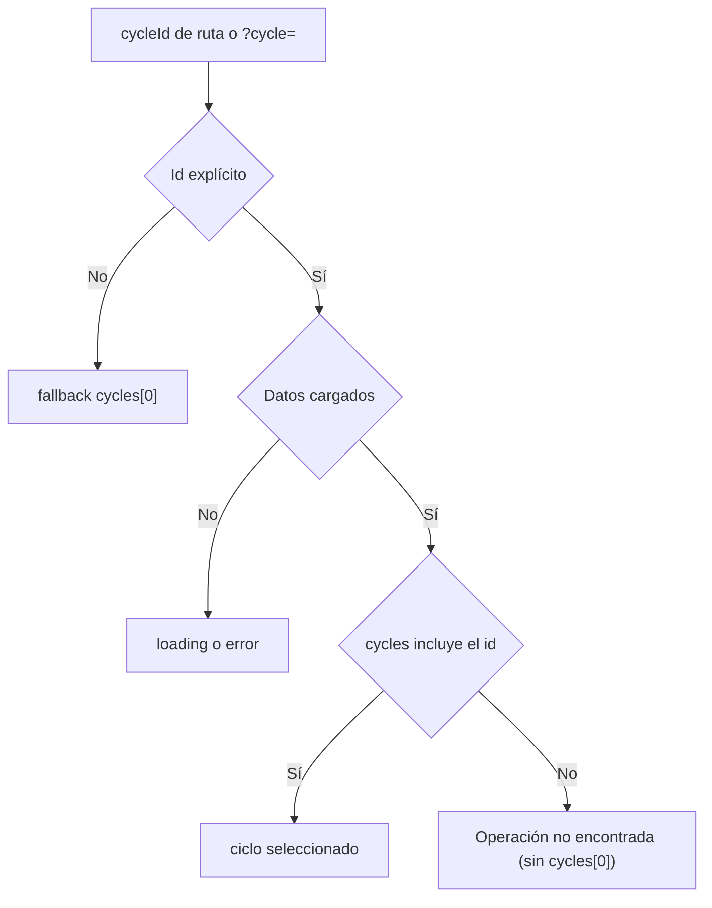

# Spec — AUTO UI REFACTOR 2.1.1 (integridad del deep-link de la operación)

> **AsOf:** 2026-10-05 · **Estado:** **IMPLEMENTADO** (sello `v2.88.57-beta`).
> **Padre:** [Spec AUTO UI REFACTOR 2.1](./spec-auto-ui-refactor-2-1-2026-10-05.md) · [ADR-044](../adr/044-auto-workspace-information-architecture.md) · [Auditoría `v2.88.56`](./entrega-auditoria-externa-mia-v2.88.56-2026-10-05.md).
> **Naturaleza:** UI / read-model. **`Δ AUTO decision/execution motor = 0`**, sin cambio de contrato HTTP, sin migración Alembic. **No** se re-mide DÍA-D.

Este addendum cierra el único defecto relevante de la auditoría externa de `v2.88.56`: **«Deep-link inválido» (P2 de integridad)**. No reabre el diseño de navegación congelado en 2.0/2.1; la corrección es **quirúrgica**.

---

## 1. Defecto corregido (P2 de integridad)

`/auto/operar/operacion/CICLO-INEXISTENTE` mostraba el encabezado con el id pedido pero, debajo, la historia del **primer ciclo real**. La selección caía sin condición a `cycles[0]`:

```ts
const selected =
  (cycleIdOverride
    ? cycles.find((cycle) => cycle.cycleId === cycleIdOverride)
    : undefined) ??
  cycles.find((cycle) => cycle.cycleId === cycleParam) ??
  cycles[0] ??
  null;
```

El mismo fallback existía para un `?cycle=` explícito e inexistente en `/auto-monitor?mode=operation`.

**Ahora** una selección **explícita** (ruta canónica o `?cycle=`) que NO existe en la ventana se declara `notFound`: el panel muestra «Operación no encontrada» y **no** pinta etapas ni contexto de otra operación. Sin selección explícita se conserva el fallback histórico a `cycles[0]`.



**Contrato:** la resolución vive en un helper **puro y testeable**, `resolveAutoOperationSelection` (`apps/web/src/features/auto-monitor/auto-operation-story-panel.tsx`):

- `requestedCycleId` = override de ruta (no vacío) o `?cycle=` (no vacío); `null` si no hay ninguno.
- `hasLoaded` = `!isLoading && !isError && view != null`.
- `notFound` = id explícito ∧ `hasLoaded` ∧ sin coincidencia.
- `selectedCycle` = `notFound ? null : (coincidencia ?? cycles[0] ?? null)`.

Durante la carga (`hasLoaded === false`) un id no resuelto **no** se declara `notFound`: evita un falso negativo en el primer render.

---

## 2. Alcance del render

- El `<ol data-testid="auto-operation-story">` y el bloque `auto-operation-story-context` solo se montan con un ciclo seleccionado válido.
- El botón `auto-operation-story-open-technical` se oculta cuando no hay ciclo (evita un deep-link `/auto-monitor?mode=current` sin `cycle`).
- El estado de ausencia se expone con `data-testid="auto-operation-story-not-found"` + `data-cycle-id`.
- El selector de ciclos permanece como **vía de recuperación** (ningún botón queda `aria-pressed`).

---

## 3. Falsabilidad

| # | Afirmación | Cómo se rompe |
| --- | --- | --- |
| 1 | Un `cycleId` de ruta inexistente **no** muestra otra operación. | Que vuelva a seleccionar `cycles[0]` o pinte etapas cuando no hay coincidencia. |
| 2 | Un `?cycle=` explícito inexistente se comporta igual. | Que el monitor caiga a `cycles[0]`. |
| 3 | La ruta válida sigue mostrando la operación seleccionada. | Que el `notFound` se dispare con un id válido o durante la carga. |
| 4 | `Δ motor = 0`. | Que el diff toque motor/umbrales o que `contract:check` no coincida. |

---

## 4. Verificación

- `apps/web` unit: `auto-operation-story-panel.test.tsx` (estado «no encontrada» por ruta y por `?cycle=`, + `resolveAutoOperationSelection`), `auto-pages.test.tsx` (h1 con el id pedido, sin inventar otro ciclo).
- E2E mock `gp-e2e-v28857-auto-operacion-invalida-mock.spec.ts`: ruta inválida, `?cycle=` inválido y ruta válida (regresión); un `<main>`/`h1` por ruta.
- `contract:check` OK; bump guard `meta.bump == package.json` (`2.11.57-beta`).

---

## 5. Límites declarados (NO se cierran aquí)

- **`PortfolioDecision` durable (`UI52-02`)**: sigue abierta (backend/spine).
- **Contrato de explicación DÍA-D verdaderamente `cycle_id`-resolutivo**: abierta (la resolución sigue siendo por `symbol`).
- **PIT histórico institucional** y **Execution Analysis** (`23 orden_creada_sin_fill`): P3 abiertas.
- **No** se toca motor ni se re-mide DÍA-D.
