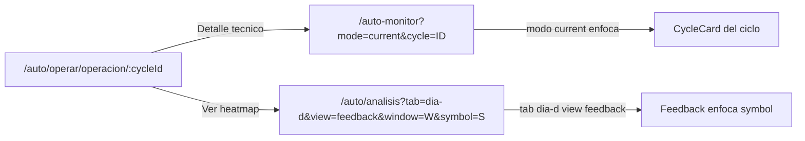

# Spec — AUTO UI REFACTOR 2.1 (navegación canónica y pulido UX)

> **AsOf:** 2026-10-05 · **Estado:** **IMPLEMENTADO** (sello `v2.88.56-beta`).
> **Padre:** [Spec AUTO UI REFACTOR 2.0](./spec-auto-ui-refactor-2-0-2026-10-05.md) · [ADR-044](../adr/044-auto-workspace-information-architecture.md) · [ADR-040](../adr/040-user-information-architecture.md) · [evidencia `v2.88.55`](./evidence/v2.88.55/README.md).
> **Naturaleza:** UI / read-model. **`Δ AUTO decision/execution motor = 0`**, sin cambio de contrato HTTP, sin migración Alembic. **No** se re-mide DÍA-D.

Este addendum **no** reabre el diseño congelado en 2.0. Cierra el defecto funcional de navegación **P2** encontrado en la auditoría externa de `v2.88.55` y el pulido **P3** asociado.

---

## 1. Defecto corregido (P2)

`AutoOperationStoryPanel` se reutiliza en `/auto-monitor` (donde `mode`/`view`/`window`/`symbol` **sí** se consumen) y en el espacio AUTO `/auto/operar` y `/auto/operar/operacion/:cycleId` (donde **no**). Sus dos botones escribían parámetros sobre la **ruta actual**:

| Botón | Antes (inerte desde `/auto/*`) | Ahora (destino canónico) |
| --- | --- | --- |
| «Detalle técnico (ventana actual)» | `?mode=current` sobre la ruta actual | `/auto-monitor?mode=current&cycle=<cycleId>` |
| «Ver heatmap de `<symbol>`» | `?mode=dia-d&view=feedback&window=…&symbol=…` sobre la ruta actual | `/auto/analisis?tab=dia-d&view=feedback&window=…&symbol=…` |

**Contrato:** existe **un destino por intención**, centralizado en `auto-nav.ts` (puro, sin React):

- `autoTechnicalDetailHref(cycleId?)` → `/auto-monitor?mode=current` (+ `&cycle=`).
- `autoDiaDHref({ window?, symbol? })` → `/auto/analisis?tab=dia-d&view=feedback` (+ `&window=`/`&symbol=`).

El parámetro `cycle` deja de ser inerte: `AutoMonitorPage` lo lee y `AutoCycleTimeline` **enfoca/desplaza** la tarjeta del ciclo (`data-cycle-focused="true"`).

---

## 2. Pulido UX (P3)

- **Una operación, una historia.** `AutoOperarPage` deja de duplicar la selección: la **lista** de operaciones (`/auto/operar/operacion/:cycleId`) es la única fuente visual; la historia vive en su ruta canónica (se retira el `AutoOperationStoryPanel` embebido).
- **Tabs WAI-ARIA completas** en ANÁLISIS: `id` + `aria-controls` en cada `role="tab"`, `role="tabpanel"` con `id`/`aria-labelledby`/`tabIndex`, roving `tabIndex` y teclado `ArrowLeft`/`ArrowRight`/`Home`/`End`.
- **CARTERA honesta.** Se retira el «Read-only» de la descripción: la superficie contiene acciones operativas (reducir / salir) que **encolan** Confirm; Confirm sigue siendo la única firma.

---

## 3. Falsabilidad

| # | Afirmación | Cómo se rompe |
| --- | --- | --- |
| 1 | Navegación canónica operativa. | Que «Detalle técnico»/«Ver heatmap» vuelvan a escribir parámetros sobre `/auto/operar[/operacion/:cycleId]`. |
| 2 | Un destino por intención. | Que los botones construyan URLs a mano en vez de usar `autoTechnicalDetailHref`/`autoDiaDHref`. |
| 3 | `cycle` no es inerte. | Que `/auto-monitor?mode=current&cycle=X` no enfoque la tarjeta de `X`. |
| 4 | Una sola fuente de selección en OPERAR. | Que vuelvan a convivir la lista y el selector interno del story panel. |
| 5 | Contrato ARIA de tabs. | Que un `role="tab"` no tenga `aria-controls`/`tabpanel` o no responda a flechas/Home/End. |
| 6 | `Δ motor = 0`. | Que el diff toque motor/umbrales o que `contract:check` no coincida. |

---

## 4. Verificación

- `apps/web` unit: `auto-nav.test.ts` (helpers), `auto-analisis-page.test.tsx` (ARIA/teclado), `auto-operation-story-panel.test.tsx` (destinos canónicos), `auto-pages.test.tsx` (una sola fuente).
- E2E mock `gp-e2e-v28856-auto-ui-navigation-mock.spec.ts`: `Operar → Operación → detalle técnico/DÍA-D` + un `<main>`/`h1` por ruta.
- `contract:check` OK; bump guard `meta.bump == package.json`.

---

## 5. Límites declarados (NO se cierran aquí)

- **`PortfolioDecision` durable (`UI52-02`)** y **contrato de explicación por `cycleId`**: abiertas (spine/backend).
- **PIT histórico institucional** y **Execution Analysis** (`23 orden_creada_sin_fill`): P3 abiertas.
- **No** se toca motor ni se re-mide DÍA-D.

---

## 6. Addendum `2.1.1` (sello `v2.88.57-beta`) — cierre del **deep-link inválido (P2)**

El hueco de integridad detectado en la auditoría externa de `v2.88.56` («Deep-link inválido») queda **CERRADO** en [spec 2.1.1](./spec-auto-ui-refactor-2-1-1-2026-10-05.md): un `cycleId` explícito (ruta o `?cycle=`) que no existe en la ventana **no** cae a `cycles[0]`; el `AutoOperationStoryPanel` declara «Operación no encontrada» sin pintar la historia de otra operación.
