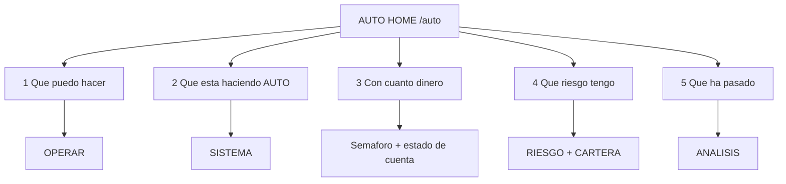

# Spec — AUTO UI REFACTOR 3.0 — USER-FIRST COCKPIT

> **AsOf:** 2026-10-06 · **Estado:** **DISEÑO CONGELADO** (no es código).
> **Padre:** [ADR-044](../adr/044-auto-workspace-information-architecture.md) · [spec AUTO COCKPIT 1.0](./spec-auto-cockpit-usuario-basico-2026-10-05.md) · [AUTO UI SEMANTIC MODEL 1.0](./spec-auto-ui-semantic-model-1-2026-10-05.md) · [AUTO UI REFACTOR 2.0](./spec-auto-ui-refactor-2-0-2026-10-05.md) · [AUTO UI REFACTOR 2.1.1](./spec-auto-ui-refactor-2-1-1-2026-10-05.md) · [auditoría UI AUTO para usuario básico](./auditoria-ui-auto-cockpit-2026-10-05.md).
> **Naturaleza:** UI / read-model / producto. **`Δ AUTO decision/execution motor = 0`**, sin cambio de contrato HTTP, sin migración Alembic. **No** se re-mide DÍA-D.

Este documento congela la última milla de producto del espacio AUTO: **dejar de parchear componentes y terminar de convertir AUTO en una interfaz realmente excelente para un usuario básico**. El motor, la durabilidad y la semántica ya están estabilizados ([`v2.88.61-beta`](./evidence/v2.88.61/README.md) declara `Δ AUTO decision/execution motor = 0`); lo que falta es **presentación, modelo mental, jerarquía, lenguaje, densidad y acciones**.

---
    10|
## 0. Propósito y alcance

- **Congela:** la **HOME del cockpit** (landing de `/auto`) y las cuatro preguntas que responde en 5 s; el **modelo de tres niveles de lenguaje** (usuario básico · avanzado · auditor); la **regla de dos niveles de densidad** (usuario 14–16 px · técnico 10–12 px); la **reagrupación de la historia de operación** en tres bloques (HISTORIA / CONTEXTO / ¿QUÉ APRENDEMOS?); y la inversión de jerarquía de SISTEMA, RIESGO, CARTERA y ANÁLISIS.
- **NO congela (fuera de este slice):** el motor; el backend; DÍA-D; reservas; ejecución; contratos HTTP; `PositionManager`; `RiskAllocator`; `PortfolioDecision` durable; PIT histórico institucional; Execution Analysis; la certificación axe final (se planifica como slice propio, §9).
- **Regla de oro (heredada):** «resumen operativo arriba, causalidad técnica bajo demanda».

---

## 1. Principios duros (heredados, no negociables)

| # | Principio | Por qué |
| --- | --- | --- |
| **1** | **No re-derivar.** La UI copia hechos ya producidos; no recalcula PnL, riesgo, fills ni MAE/MFE. | Un segundo cálculo es una segunda verdad. |
| **2** | **`UNKNOWN ≠ 0`.** Un hueco se rotula `NO MEDIDO`/`PARCIAL`; nunca se rellena con `0`. | Evita afirmar lo que no se sabe. |
| **3** | **Una operación = una historia.** Un `cycleId`, una secuencia ordenada de etapas. | Se depura *un* ciclo. |
| **4** | **Hecho ≠ contexto ≠ aprendizaje.** Lo que la operación hizo, lo que la originó y lo que se aprende son bloques distintos. | «¿Por qué existe?» no se responde con un hueco. |
| **5** | **Read-only y puro** (salvo CARTERA, que enlaza a la firma Confirm). El view-model no ejecuta, no escribe y es determinista. | Auditable y reproducible. |
| **6** | **Resumen operativo arriba, causalidad técnica bajo demanda.** | La superficie principal dice *qué pasó*; el detalle dice *por qué*. |

**Añadidos de 3.0 (no contradicen los anteriores):**

| # | Principio | Por qué |
| --- | --- | --- |
| **7** | **Tres niveles de lenguaje, sin mezcla.** Nivel 1 (usuario básico): operación, dinero, riesgo, resultado, estado, oportunidad, explicación. Nivel 2 (avanzado): señal, selección, decisión, reserva, orden, ejecución, protección, liquidación. Nivel 3 (auditor/ingeniero): `cycleId`, `TOP_N`, `PortfolioDecision`, `Reservation`, `ExecutionRouter`, `CYCLE_CLOSED`, `PAPER_D_EXECUTE`, `UNKNOWN`, `PARTIAL`, provenance. | Un no experto no debe aprender arquitectura para operar; un auditor no debe perder el vocabulario exacto. |
| **8** | **Dos niveles de densidad.** Primer nivel ≥ 14 px; detalle técnico 10–12 px, y siempre bajo un encabezado «Detalle técnico». | `text-[10px]`/`text-[11px]` es aceptable en un monitor técnico, no como interfaz principal. |
| **9** | **Lo no medido se declara en lenguaje humano.** En primer nivel, `NO MEDIDO` → «Sin dato todavía» (tono ámbar honesto); el rótulo técnico se conserva en el detalle. | `NO MEDIDO` es el lenguaje correcto de auditoría, no de usuario. |
| **10** | **Toda ausencia tiene estado propio.** Cargando, error, vacío y `NO MEDIDO` se distinguen entre sí. | Un fallo de red no se disfraza de «sin operaciones». |

---

## 2. Las cinco preguntas y la HOME

El usuario entra en AUTO y en **5 segundos** debe saber qué está haciendo AUTO, qué puede hacer, cuánto riesgo tiene y qué ha pasado. La HOME es la **landing de `/auto`**.



### 2.1 Wireframe congelado de la HOME

```text
AUTO · Resumen
[ 🟢 DINERO VIRTUAL · AUTO DEMO · No se mueve dinero real ]   (AutoRealityStrip, transversal)

┌ AUTO: Activo ┐ ┌ Operaciones: N abiertas ┐ ┌ Riesgo: <estado> ┐

¿QUÉ ESTÁ HACIENDO?
  <resumen> · Última actividad <hh:mm> · Próximo análisis: <sello>
  <estado legible>

¿QUÉ PUEDO HACER?
  <N oportunidades disponibles>            [Ver oportunidades]
  <instrumento> · <día> · <dirección> · <estado>   (operaciones abiertas)
  [Ver todas las operaciones]

¿QUÉ HA PASADO?
  DÍA-D · Evidencia · Investigación
```

Todas las cifras y estados se **copian** de las fuentes read-only ya existentes (monitor operativo, `useFinancialIntegrity`, postura de realidad). Un valor no materializado se declara «Sin dato todavía»; **nunca** se inventa ni se rellena con `0`.

### 2.2 Regla de entrada

- `/auto` **deja de redirigir** a `/auto/operar`: monta la HOME. (Addendum a ADR-044 §4.)
- `/auto/operar` se **mantiene** como la superficie de oportunidades/operaciones.
- La HOME **no** reimplementa ninguna superficie: **enlaza**.

---

## 3. Los tres bloques de la operación (Operación única 3.0)

La historia de una operación se reorganiza en **tres bloques explícitos**, coherentes con el modelo semántico y con los niveles de lenguaje de §1:

```text
HISTORIA DE ESTA OPERACIÓN
───────────────────────────
Señal
Selección
Decisión
Riesgo
Reserva
Orden
Ejecución
Posición
Protección
Salida / Liquidación   (EXIT plegado en SETTLEMENT)
Resultado

CONTEXTO
─────────
Instrumento
Estrategia
Dirección
Universo PIT
Régimen
Motivo de selección

¿QUÉ APRENDEMOS?
────────────────
DÍA-D
Evidencia OOS
Veredicto
```

### 3.1 Corrección de modelo: `EXPLANATION` sale de `OPERATION`

El modelo semántico ya declara que **Explicación es conocimiento cross-ciclo**, pero en el código `EXPLANATION` tenía `group = "OPERATION"`. 3.0 corrige la contradicción: `AutoOperationStoryGroup` pasa a `"OPERATION" | "CONTEXT" | "EXPLANATION"` y `EXPLANATION` deja de pintarse dentro de los hechos de la operación. Es un cambio **read-model puro** (`packages/shared`), no toca el motor.

### 3.2 Invariantes que NO se regresan

- `SELECTION` (TOP-N) ≠ `DECISION` (cartera, `NO MEDIDO`).
- `EXIT` plegado en `SETTLEMENT` (`foldedInto`); una sola fila `REACHED` por hecho.
- `OPPORTUNITY` es **contexto**, no etapa operativa.
- Toda cifra viaja con su **medición** (`MeasurementValue`).

---

## 4. Glosario de tres niveles

| Nivel 2 (avanzado) | Nivel 1 (usuario) | Nivel 3 (auditor) |
| --- | --- | --- |
| `SIGNAL` | «Aviso de entrada» | `SIGNAL` |
| `SELECTION` / TOP-N | «Elegida entre las mejores» | `TOP_N` |
| `DECISION` | «Decisión de cartera» | `PortfolioDecision` |
| `RESERVATION` | «Capital apartado» | `Reservation` |
| `ORDER` | «Orden enviada» | `ORDER` |
| `FILL` | «Operación ejecutada» | `FILL` |
| `SETTLEMENT` | «Resultado de la venta» | `SETTLEMENT` |
| `CYCLE_CLOSED` | «Operación cerrada» | `CYCLE_CLOSED` |
| `NO MEDIDO` | «Sin dato todavía» | `UNKNOWN` / `PARTIAL` |
| `cycleId` | (oculto) | `cycleId` |
| `venue` / `PAPER` | «Cuenta Demo · dinero virtual» | `PAPER` |
| `PAPER_D_EXECUTE` | «AUTO puede abrir/cerrar; no usa dinero real» | `PAPER_D_EXECUTE` |

**Regla:** ninguna superficie de primer nivel muestra `cycleId`, `TOP_N`, `Fill`, `SETTLEMENT`, `Reservation`, `CYCLE_CLOSED`, `venue`, `PAPER_D_EXECUTE`, `ExecutionRouter`, `OrderIntent`, `F3`/`F4` ni `PIT` sin traducir.

---

## 5. Secciones: inversión de jerarquía

| Sección | Primer nivel (usuario) | Detalle técnico (bajo demanda) |
| --- | --- | --- |
| **SISTEMA** | «AUTO está activo» · última actividad · ahora · próximo paso · estado | Monitor · reservas · concurrencia · reconciliación · auditoría |
| **RIESGO** | Riesgo abierto · máxima pérdida · posiciones con riesgo · límite diario · estado | Integridad financiera · reservas · reconciliación |
| **CARTERA** | Aviso «CARTERA DEMO» + posiciones/órdenes/acciones | Historial · cuentas |
| **ANÁLISIS** | Preguntas: ¿Qué ha pasado? · ¿Por qué? · ¿Está funcionando? · ¿Qué aprendemos? | Paneles DÍA-D/Evidencia/Estrategias/Investigación |

- **SISTEMA** responde *«¿qué está haciendo AUTO?»* antes que *«¿cómo funciona por dentro?»*.
- **RIESGO** responde *«¿cuánto puedo perder?»* con las fuentes read-only existentes; lo no medido se declara «Sin dato todavía».
- **CARTERA** declara DEMO de forma inequívoca **antes** de cualquier acción (reducir/salir encolan Confirm; Confirm es la única firma).
- **ANÁLISIS** no crea páginas nuevas: sólo cambia la semántica visual de las 4 pestañas, conservando su WAI-ARIA.

---

## 6. Modo básico vs detalle técnico

- **Nivel usuario:** `text-sm`/`text-base` (≥ 14 px); frases, no tablas densas.
- **Detalle técnico:** `text-[11px]`/`text-[10px]`, siempre dentro de un bloque rotulado «Detalle técnico», colapsado por defecto cuando aplique.
- Superficies de primer nivel afectadas: `AutoOperationStoryPanel`, `AutoCycleTimeline`, HOME, SISTEMA, RIESGO, CARTERA, ANÁLISIS.

---

## 7. Falsabilidad

| # | Afirmación | Cómo se rompe |
| --- | --- | --- |
| 1 | La HOME responde las 4 preguntas en 5 s sin entrar en Sistema. | Que una de las preguntas exija navegar a otra sección para responderse. |
| 2 | `/auto` monta la HOME (no redirige a Operar). | Que `/auto` siga redirigiendo a `/auto/operar`. |
| 3 | `EXPLANATION` no se pinta dentro de los hechos de la operación. | Que una etapa del grupo `OPERATION` sea `EXPLANATION`, o que «Qué aprendemos» viva en la lista de hechos. |
| 4 | El primer nivel no muestra jerga interna (§4). | Que `cycleId`/`TOP_N`/`Fill`/`SETTLEMENT`/`venue`/`PAPER_D_EXECUTE` aparezcan sin traducir. |
| 5 | El primer nivel usa ≥ 14 px. | Que una superficie de primer nivel use `text-[10px]`/`text-[11px]` fuera del bloque «Detalle técnico». |
| 6 | Lo no medido se declara en lenguaje humano en primer nivel. | Que el primer nivel muestre `NO MEDIDO` crudo. |
| 7 | CARTERA declara DEMO antes de las acciones. | Que `OperationsPanel` se monte sin el aviso DEMO por encima. |
| 8 | RIESGO no inventa cifras. | Que la cabecera de riesgo muestre un número sin medición o rellene un hueco con `0`. |
| 9 | `Δ motor = 0`. | Que el diff toque motor/umbrales o que `contract:check` no coincida. |

---

## 8. Límites declarados (NO se cierran aquí)

- **`PortfolioDecision` durable (`UI52-02`):** abierta (spine/backend). El cockpit puede **declararla** «Sin dato todavía»; no la inventa.
- **PIT histórico institucional** y **Execution Analysis** (`23 orden_creada_sin_fill`): P3 abiertas.
- **`CONFIRMED` NO se emite.**
- **Barrido `axe` real de `/auto/*`:** se planifica como **slice propio de certificación** (§9), no se cierra en los slices de UI.
- **No** se re-mide DÍA-D: las cifras OOS se heredan y citan.

---

## 9. Plan por fases (aditivo)

| Fase | Contenido | Tipo | Sello |
| --- | --- | --- | --- |
| **S0** | Esta spec + addendum ADR-044 (HOME como landing). | Docs | — |
| **S1** | **AUTO HOME** (`/auto`) + helper de resumen + entrada de navegación. | UI-only | `v2.88.62-beta` |
| **S2** | **Operación única 3.0**: grupo `EXPLANATION` propio + tres bloques + lenguaje humano. | UI/read-model | `v2.88.63-beta` |
| **S3** | **Modo básico vs detalle técnico**: SISTEMA, RIESGO, CARTERA, ANÁLISIS. | UI-only | `v2.88.64-beta` |
| **S4** | **Certificación**: barrido `axe` de `/auto/*` + teclado + responsive + estados (cierra `F-A2`). | UI/tests | `v2.88.65-beta` |

Cada fase es **aditiva**: no se borra ninguna pantalla antes de que su sustituto esté verde, y ninguna mueve el motor.
