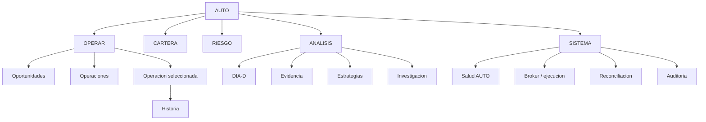

# Spec — AUTO UI SEMANTIC MODEL 1.0

> **AsOf:** 2026-10-05 · **Estado:** **DISEÑO CONGELADO** (no es código).  
> **Padre:** [`CURRENT_SYSTEM.md`](../CURRENT_SYSTEM.md) · [`evidence/v2.88.50/README.md`](./evidence/v2.88.50/README.md) · piloto `buildAutoOperationStory` (`packages/shared/src/cognitive/auto-operation-story.ts`).  
> **Tip certificado previo:** `v2.88.50-beta` → `f48975bb`. **Δ AUTO decision/execution motor = 0.**

Este documento **congela la semántica** de la interfaz AUTO *antes* de extender el piloto de `v2.88.50` a más pantallas. **No** sustituye ninguna pantalla, **no** toca el motor y **no** re-mide nada: es el contrato de significado que el piloto `OPPORTUNITY → … → EXPLANATION` todavía **no** respeta del todo (§4). Traduce la recomendación del auditor externo (MIA): *no empezar el gran refactor UI hasta fijar qué es cada cosa*.

---

## 0. Propósito y alcance

**Congela:** qué es una etapa, un hecho, una derivación, un contexto, una decisión, una explicación y un hueco (`NO MEDIDO`); y la navegación objetivo de AUTO.

**NO congela (fuera de este slice):** la implementación de las pantallas; el mapa etapa → endpoint de cada vista; el renombrado de conceptos internos (`ThesisExit`, `LossOrigin`, …) en el spine; PIT histórico institucional (§10).

**Regla de compatibilidad:** mientras el modelo y el piloto discrepen, **manda el modelo**. El piloto se ajusta en la migración (§9), no al revés.

---

## 1. Principios duros (heredados, no negociables)

| # | Principio | Por qué |
| --- | --- | --- |
| **1** | **No re-derivar.** La UI **copia** hechos ya producidos; no recalcula PnL, riesgo, fills, MAE ni MFE. | Un segundo cálculo es una segunda verdad. |
| **2** | **`UNKNOWN ≠ 0`.** Un hueco se rotula `NO MEDIDO`/`PARCIAL`; nunca se rellena con `0` ni con un valor silencioso. | Fue la raíz del bug del PnL de `v2.88.50` (§4.4). |
| **3** | **Una operación = una historia.** Un `cycleId`, una secuencia ordenada de etapas. | El usuario depura *un* ciclo, no un muro de ciclos. |
| **4** | **Hecho ≠ contexto.** Lo que la operación *hizo* y lo que la *originó* son bloques distintos. | «¿Por qué existe esta operación?» no se responde con un `NO MEDIDO`. |
| **5** | **Read-only y puro.** El view-model no ejecuta, no escribe y es determinista. | Auditable y reproducible. |

---

## 2. Las 14 etapas y su clasificación

| # | Etapa | Clase | Fuente canónica | Traza durable hoy |
| --- | --- | --- | --- | --- |
| 1 | **Oportunidad** | **Contexto** | watch PIT + estrategia + régimen | **No por ciclo** (universo de la ventana) |
| 2 | **Señal** | Hecho durable | paso `SIGNAL` | Sí (`auto_entry_decision`) |
| 3 | **Selección / TOP-N** | Hecho durable | paso `TOP_N` | Sí (`rank`, `opportunityScore`) |
| 4 | **Decisión** | Hecho durable **(a cerrar)** | decisión de **cartera** | **No** expuesta como paso propio hoy (§4.1) |
| 5 | **Riesgo** | Hecho durable | paso `RISK` | Sí |
| 6 | **Reserva** | Hecho durable | paso `RESERVATION` | Sí |
| 7 | **Orden** | Hecho durable | paso `ORDER` | Sí |
| 8 | **Fill** | Hecho durable | paso `FILL` | Sí |
| 9 | **Posición** | **Derivada** | pliegue de `FILL` | No hay paso propio (se declara) |
| 10 | **Protección** | Hecho durable | paso `PROTECTION` | Sí |
| 11 | **Salida** | **Derivada / intención** | `SETTLEMENT` (+ motivo de salida) | Se declara como **intención** (§4.2) |
| 12 | **Liquidación** | Hecho durable | paso `SETTLEMENT` | Sí (hecho financiero) |
| 13 | **Resultado** | Hecho durable | paso `CYCLE_CLOSED` | Sí (PnL, `closedAt`) |
| 14 | **Explicación** | **Explicación (cross-ciclo)** | DÍA-D / feedback OOS | Por instrumento + estrategia (§6) |

> Nota de orden: `Decisión` y `Riesgo` se listan en el orden que el auditor propuso. El **spine durable** actual expone `RISK` **antes** de cualquier traza de decisión de cartera; mientras `Decisión` no tenga traza propia, su posición es de **modelo**, no de dato (§4.1), y no se pinta como alcanzada.

---

## 3. Definiciones duras (criterio de admisión)

- **Hecho** — observación **producida por el spine** con identidad (`cycleId`) y sello temporal. Admisión: existe un paso durable del monitor que lo trae. Un hecho sin valor es un **hueco**, no un `0`.
- **Derivación** — valor **reconstruido por pliegue** de uno o más hechos (p. ej. `Posición` ← `FILL`). Admisión: la fórmula es pura y su origen se declara en `derivedNote`. **Nunca** se presenta como hecho independiente.
- **Contexto** — información que **explica el origen** de la operación y que **no se materializa por ciclo** (universo PIT, estrategia, régimen, ranking, motivo de selección). Admisión: vive en otra costura del sistema y se **cita**, no se re-deriva.
- **Decisión** — el **compromiso a nivel de cartera** (abrir / no abrir / tamaño). Admisión: sólo es `REACHED` si hay traza durable propia. **No** se admite `TOP_N` como decisión (§4.1).
- **Explicación** — conocimiento **cross-ciclo** sobre el instrumento/estrategia (DÍA-D/OOS). Admisión: se indexa por el contrato de §6; es contexto agregado, no un hecho de la operación.
- **Estado de etapa** — `REACHED` · `PENDING` · `ABSENT` · `NOT_MEASURED` (eje 1, §5).
- **Medición** — `COMPLETE` · `PARTIAL` · `UNKNOWN` (eje 2, §5). Rotulado como `MEDIDO` / `PARCIAL` / `NO MEDIDO`.
- **`NO MEDIDO`** — no hay evidencia. Nunca implica `0`, ni «abierto», ni «cerrado», ni «sin riesgo».

---

## 4. Correcciones conceptuales frente al piloto 1.0

### 4.1 `TOP-N ≠ DECISIÓN` (P2 conceptual / P3 funcional)

**Problema.** El piloto mapea la etapa `DECISION` al paso durable `TOP_N` (`STORY_STAGE_SPECS`). `TOP_N` significa «este instrumento fue seleccionado/rankeado»; **no** significa «la cartera decidió abrir». Presentarlos como lo mismo funde dos conceptos distintos justo en la UI que pretende simplificar.

**Corrección congelada.**
1. `SELECCIÓN / TOP-N` es una etapa **propia** (paso durable `TOP_N`).
2. `DECISIÓN` es la decisión de **cartera**; sin traza durable propia se declara `NOT_MEASURED`, **nunca** se iguala a `TOP_N`.
3. Visualmente pueden **agruparse** (`Oportunidad → Señal → Selección → Decisión`) sin perder la distinción semántica.

### 4.2 `SALIDA ≠ LIQUIDACIÓN` (P3)

**Problema.** Hoy `EXIT` y `SETTLEMENT` comparten `sourceStepId = SETTLEMENT` y ambas se pintan `ALCANZADO` con la **misma evidencia**: redundante en una UI simplificada.

**Corrección congelada.**
- `SALIDA` = **intención / motivo** de salir (por qué se cierra: stop, T1/T2, tiempo, invalidación).
- `LIQUIDACIÓN` = **hecho financiero** (qué se liquidó y a qué precio).
- Si **no** existe traza específica de `SALIDA`, **no** se presentan como dos eventos independientes: se muestra una sola fila con la intención como **nota derivada** (`derivedNote`), no como etapa alcanzada por duplicado.

### 4.3 `OPORTUNIDAD` debe ser **contexto**, no un `NO MEDIDO` suelto (P3 UX)

**Problema.** `OPPORTUNITY` se declara `NOT_MEASURED` porque la oportunidad PIT no se materializa por ciclo. Correcto en integridad, confuso en UX: el usuario quiere saber **de dónde salió** la operación, y la respuesta existe en otra parte (PIT universe, señal, ranking, estrategia).

**Corrección congelada.** Separar la vista en dos bloques:
- **Hechos de esta operación:** `SEÑAL → … → RESULTADO` (lo que el ciclo hizo).
- **Contexto que la originó:** `UNIVERSO PIT · ESTRATEGIA · RÉGIMEN · RANKING · MOTIVO DE SELECCIÓN`.

`OPORTUNIDAD` deja de ser una etapa `NO MEDIDO` dentro de la historia de hechos; pasa a encabezar el bloque de contexto.

### 4.4 El bug del PnL `PARTIAL` como caso de estudio del principio 2

En `v2.88.50` un cierre `PARTIAL` (por `side` no clasificable) seguía publicando una cifra de PnL, y el timeline la pintaba `COMPLETE` a fuego. Corregido en `v2.88.51` (backend: `result` se rige por `closed_measurement`; frontend: rotula `PARCIAL`). **Lección de modelo:** *toda* cifra debe viajar con su medición y **toda** vista debe rotularla con el **mismo** componente. Ese componente (`MeasurementValue`, §9.3) es una pieza del modelo, no un detalle de estilo.

---

## 5. Los dos ejes (no confundirlos)

**Eje 1 — Estado de la etapa** (`AutoOperationStoryState`): `REACHED` · `PENDING` · `ABSENT` · `NOT_MEASURED`.

**Eje 2 — Medición del hecho** (`AutoMonitorMeasurement`): `COMPLETE` → `MEDIDO` · `PARTIAL` → `PARCIAL` · `UNKNOWN` → `NO MEDIDO`.

Reglas de combinación:
- Una etapa `REACHED` puede llevar un hecho `PARTIAL` (el paso ocurrió, la evidencia está incompleta).
- Un ciclo **ausente** deja **todas** las etapas de traza en `NOT_MEASURED`; nunca `REACHED`/`0`.
- Una etapa contextual **no** usa el eje 1: es contexto, no un estado alcanzable.

---

## 6. Contrato de la explicación

El piloto busca la explicación por `symbol`. Es aceptable para el piloto (el feedback DÍA-D es por instrumento), pero el modelo definitivo indexa por:

```text
cycleId · instrument · strategy · strategyVersion · timeframe · entryDay · regime
```

Así la explicación responde **«¿por qué esta operación?»**, no sólo **«¿qué dice DÍA-D de este símbolo?»** — necesario cuando coexistan varias estrategias o versiones sobre el mismo instrumento. `cycleId` es la clave primaria; el resto, ejes de desambiguación.

---

## 7. Navegación objetivo

El usuario **no** navega por conceptos internos (`Signal`, `Risk`, `Reservation`, `Settlement`, `ThesisExit`, `LossOrigin`, …). Navega por tres intenciones de trabajo —**operar**, **entender**, **vigilar**— y los conceptos internos quedan **dentro** de la historia de una operación.



Principio rector (lo pide el auditor): **resumen operativo arriba, causalidad técnica bajo demanda.** La UI principal dice *«se generó la orden; no se ejecutó»* y permite abrir el detalle *«¿por qué no se ejecutó?»*, sin mezclar la causalidad de ejecución con la operación (§10).

---

## 8. Reglas de composición visual

- Se puede **agrupar** (una fila-resumen con sub-etapas), pero **no** se pierde ninguna etapa ni su clase.
- Todo valor numérico se pinta con su **medición** (§4.4): el número solo nunca es «medido».
- Una etapa derivada muestra su `derivedNote`; una contextual muestra su fuente.
- Un hueco se pinta `NO MEDIDO`/`PARCIAL` de forma **consistente** entre las tres vistas del monitor.

---

## 9. Plan de migración (post-1.0 — NO en el sello `v2.88.51`)

Orden acordado, derivado de la auditoría:

1. **`Operación` como modo por defecto** del monitor (`useState<AutoMonitorMode>("operation")`); `Ventana actual` queda como vista cruda/experta (todos los ciclos, para diagnóstico), el mismo rol que el detalle técnico de Decision Board dentro de Mesa.
2. **Enlace `EXPLICACIÓN → DÍA-D`**: «ver heatmap de `{symbol}`» que cambia de pestaña **y** preselecciona ventana/símbolo (hoy son tres saltos manuales).
3. **`MeasurementValue` / `MeasurementBadge` único** en `@bolsa/shared` (wrapper visual sobre `formatMeasurementLabel`/`formatMonitorFactValue`) usado **literalmente igual** por las tres vistas. Habría hecho **imposible por accidente** el bug del PnL (§4.4).
4. **Persistir selección en la URL** (`cycleId`, `day`, `window` como query params, no `useState` local): sobrevive el cambio de pestaña, y permite compartir «este ciclo, este día».
5. **Renombrar/plegar** los conceptos internos dentro de la historia; no exponerlos como destinos de navegación (§7).

Cada paso es **aditivo**: no se borra ninguna pantalla antes de que su sustituto esté verde.

---

## 10. Límites declarados (lo que este modelo NO resuelve)

- **PIT histórico institucional sigue abierto** (P3): sin reconstrucción completa de listings/delistings, sector histórico y cambios corporativos. El modelo **cita** el contexto PIT; no lo completa.
- **Los `23 orden_creada_sin_fill`** (caso C de A/C, `v2.88.50`) son una pista para una futura **Execution Analysis** (broker/venue/cola/parcial/latencia). **No** se mezclan con la UI principal de operación (§7).
- **`CONFIRMED` NO se emite.** REPLAY/OOS ≠ PAPER (`P3-2`/`P3-3` abiertas).
- **`TOP_N ≠ DECISIÓN`** queda **resuelto en el modelo**; su traza durable propia (una `Decisión` de cartera medible) es trabajo de spine **posterior**, no de esta spec.
- Este documento **no** mide nada ni certifica: es semántica.

---

## 11. Falsabilidad del modelo

| # | Afirmación | Cómo se rompe |
| --- | --- | --- |
| 1 | `TOP_N ≠ DECISIÓN` | Que exista una traza durable que demuestre que la cartera decidió abrir en un ciclo donde `TOP_N` no alcanzó (o viceversa). |
| 2 | `SALIDA` sin traza propia no se pinta como etapa independiente | Que el spine exponga una traza durable de **intención** de salida distinta de `SETTLEMENT`. |
| 3 | `OPORTUNIDAD` es contexto, no etapa | Que la oportunidad PIT pase a materializarse **por ciclo** (existiría entonces un hecho). |
| 4 | Toda cifra viaja con su medición | Que una vista pinte un número sin su `MeasurementValue` (fallo de §4.4). |
| 5 | El usuario no navega por conceptos internos | Que la navegación definitiva exponga `Signal`/`Risk`/`ThesisExit` como destinos L1/L2. |

---

## 12. Mapa etapa → traza actual (estado real, para la migración)

| Etapa modelo | Paso durable (`OPERATIONAL_STEPS`) | Estado en el piloto `v2.88.50` |
| --- | --- | --- |
| Oportunidad | — (contexto) | `NOT_MEASURED` (a mover a contexto) |
| Señal | `SIGNAL` | Correcto |
| Selección / TOP-N | `TOP_N` | Existe, pero mal etiquetado como `DECISION` |
| Decisión | — (falta) | Ausente |
| Riesgo | `RISK` | Correcto |
| Reserva | `RESERVATION` | Correcto |
| Orden | `ORDER` | Correcto |
| Fill | `FILL` | Correcto |
| Posición | — (derivada de `FILL`) | Correcto (declara `derivedNote`) |
| Protección | `PROTECTION` | Correcto |
| Salida | — (intención; hoy compartida con `SETTLEMENT`) | Duplicada (a plegar) |
| Liquidación | `SETTLEMENT` | Correcto |
| Resultado | `CYCLE_CLOSED` | Correcto |
| Explicación | — (DÍA-D/OOS) | Indexada por `symbol` (a evolucionar, §6) |
